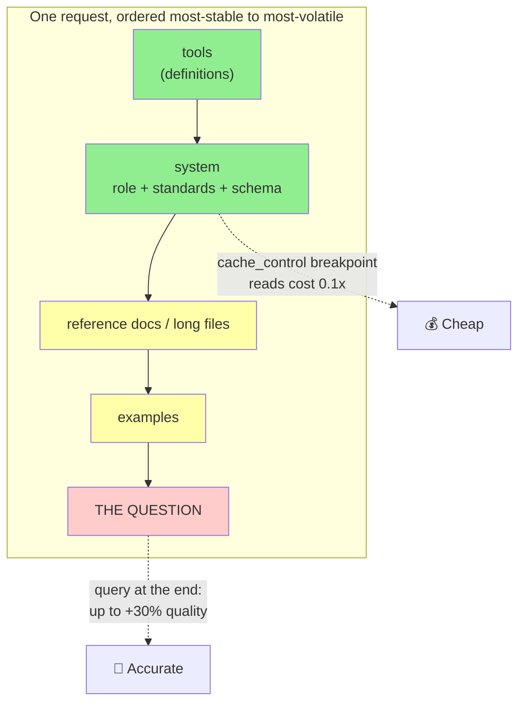
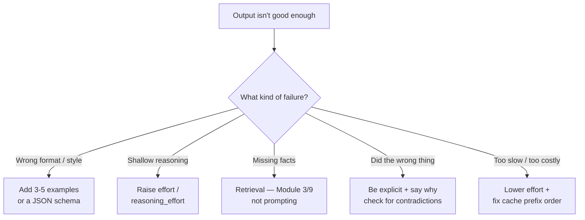

# Research Dossier — Module 8: Prompt Engineering (Intermediate)

**Repo:** github.com/lokumai/ai-minicourses · **Target file:** `mini-courses/2_intermediate/8_prompt_engineering.md`
**Research date:** 2026-08-25 · All links in this dossier were fetched and verified on 2026-08-25 (see §12 Link Verification Log)
**Audience:** professional software engineers, new to agent tooling, post-Fundamentals
**House style:** `mini-courses/1_fundamentals/6_agents.md` — friendly 2nd person, short sections, tables, mermaid, runnable snippets, Quick Check, prev/next links, ~150–280 lines

> ## ⚠️ READ THIS FIRST — the single biggest risk for this module
>
> Writing 2023–2024 prompt-engineering advice in 2026 would make this module actively wrong, not merely incomplete. Since mid-2025 the major vendors have **deleted, reversed, or hard-deprecated** large parts of the classic playbook:
>
> - **Anthropic deleted its per-technique docs pages.** `be-clear-and-direct`, `multishot-prompting`, `chain-of-thought`, `use-xml-tags`, `system-prompts`, `prefill-claudes-response`, `chain-prompts`, `long-context-tips`, `extended-thinking-tips`, `claude-4-best-practices`, `prompt-improver`, `prompt-templates-and-variables` are all now **redirects** into one consolidated page ([Prompting best practices](https://platform.claude.com/docs/en/build-with-claude/prompt-engineering/claude-prompting-best-practices)). Any course material citing `docs.anthropic.com/.../prompt-engineering/<technique>` is two redirects and one consolidation away from its content.
> - **Assistant prefill returns HTTP 400** on Claude 4.6 and later ([Prompting best practices → Migrating away from prefilled responses](https://platform.claude.com/docs/en/build-with-claude/prompt-engineering/claude-prompting-best-practices)).
> - **`thinking.budget_tokens` is deprecated** and returns 400 on Claude 4.7+ ([Extended thinking](https://platform.claude.com/docs/en/build-with-claude/extended-thinking)).
> - **Non-default `temperature` / `top_p` / `top_k` return 400** on the newest Claude models ([Thinking](https://platform.claude.com/docs/en/build-with-claude/thinking)).
> - **XML tags are officially demoted** — "less necessary with models like Claude" ([Prompt engineering best practices for 2026, 2025-11-10](https://claude.com/blog/best-practices-for-prompt-engineering)).
> - **"Think step by step" is no longer recommended by any of the three major vendors.** OpenAI says outright: *"Avoid chain-of-thought prompts"* ([Reasoning best practices](https://developers.openai.com/api/docs/guides/reasoning-best-practices)).
> - **Docs hosts moved.** Anthropic: `docs.anthropic.com` → `docs.claude.com` → **`platform.claude.com`**; Claude Code/Agent SDK → **`code.claude.com`**. OpenAI: `platform.openai.com/docs` and `cookbook.openai.com` → **`developers.openai.com`**.
>
> Also note the model landscape has moved well past what most public tutorials assume. Anthropic's live prompting reference covers **Claude Fable 5, Mythos 5, Opus 5, Opus 4.8/4.7/4.6, Sonnet 5, Sonnet 4.6, Haiku 4.5** ([Prompting best practices](https://platform.claude.com/docs/en/build-with-claude/prompt-engineering/claude-prompting-best-practices)); OpenAI's flagship is **GPT-5.6** with `gpt-5.6-sol` / `-terra` / `-luna` variants ([Using GPT-5.6](https://developers.openai.com/api/docs/guides/prompt-guidance)); Google's thinking docs list **Gemini 3.7 Flash / 3.6 Flash / 3.5 Flash-Lite / 3.1 Pro / 3 Pro / 2.5 Pro** ([Gemini thinking](https://ai.google.dev/gemini-api/docs/thinking)).
>
> **Recommendation for the module: write technique-first, not model-first.** Name models only where the behaviour difference is the lesson. Otherwise this module needs rewriting every quarter.

---

## 1. Executive summary — 10 things the module author must not get wrong

1. **Prompt engineering is now a *subset* of context engineering.** Anthropic defines context engineering as *"the set of strategies for curating and maintaining the optimal set of tokens (information) during LLM inference"* ([Effective context engineering for AI agents, 2025-09-29](https://www.anthropic.com/engineering/effective-context-engineering-for-ai-agents)). **Module 8 owns the instruction text; Module 9 owns what gets into the window.** State that boundary explicitly in the intro so the two modules don't collide.

2. **Explicit Chain-of-Thought has been demoted to a fallback, not deleted.** Anthropic: *"Manual chain-of-thought (CoT) prompting as a fallback. When thinking is off, you can still encourage step-by-step reasoning…"* and *"Prefer general instructions over prescriptive steps. A prompt like 'think thoroughly' often produces better reasoning than a hand-written step-by-step plan. Claude's reasoning frequently exceeds what a human would prescribe."* ([Prompting best practices](https://platform.claude.com/docs/en/build-with-claude/prompt-engineering/claude-prompting-best-practices)). The literal string "think step by step" no longer appears as a recommendation anywhere in Anthropic's docs.

3. **The replacement for CoT prompting is a *parameter*, and all three vendors converged on the same shape.** Anthropic `output_config.effort` = `low|medium|high|xhigh|max` ([Effort](https://platform.claude.com/docs/en/build-with-claude/effort)); OpenAI `reasoning.effort` = `none|minimal|low|medium|high|xhigh|max` ([Reasoning](https://developers.openai.com/api/docs/guides/reasoning)); Google `thinking_level` = `minimal|low|medium|high` ([Gemini thinking](https://ai.google.dev/gemini-api/docs/thinking)). Teaching students to type "let's think step by step" instead of setting these is the module's biggest possible failure.

4. **Assistant prefill is REMOVED, and the docs contain a documented contradiction about it.** *"Starting with Claude 4.6 models and Claude Mythos Preview, prefilled responses … on the last assistant turn are no longer supported. Requests with prefilled assistant messages to these models return a 400 error."* ([Prompting best practices](https://platform.claude.com/docs/en/build-with-claude/prompt-engineering/claude-prompting-best-practices)). Also *"You can't pre-fill the assistant response while thinking is on."* ([Thinking](https://platform.claude.com/docs/en/build-with-claude/thinking)). But the [Messages API reference](https://platform.claude.com/docs/en/api/messages) still documents the mechanic. See §11.

5. **Anthropic and OpenAI now default in OPPOSITE directions on reasoning and on prompt length.** Thinking is **on by default** on Claude Opus 5 / Sonnet 5 / Fable 5 / Mythos 5, always-on and unswitchable on Fable 5 / Mythos 5 ([Thinking](https://platform.claude.com/docs/en/build-with-claude/thinking)). Meanwhile OpenAI's current guidance is *"Favor leaner prompts"* with a measured claim that *"configurations with leaner system prompts improved evaluation scores by roughly 10–15% while reducing total tokens by 41–66% and cost by 33–67%"* ([Prompting guidance for GPT-5.6 Sol](https://developers.openai.com/api/docs/guides/prompt-guidance-gpt-5p6)). Anthropic leans explicit-and-detailed; OpenAI leans subtractive. This is the vendor contrast the module should teach (§5).

6. **Structured output is an API feature now — stop teaching "please reply with JSON."** Anthropic ships constrained decoding via `output_config.format` plus `strict: true` tools ([Structured outputs](https://platform.claude.com/docs/en/build-with-claude/structured-outputs)). OpenAI: *"We recommend always using Structured Outputs instead of JSON mode when possible"* ([Structured Outputs](https://developers.openai.com/api/docs/guides/structured-outputs)). Prompting for JSON is the *fallback*.

7. **Prompt caching changes prompt *architecture*, not just cost.** Caching is prefix-based with strict ordering `tools → system → messages`, and the rule is *"Place `cache_control` on the last block that stays identical across requests, not on the varying block"* ([Prompt caching](https://platform.claude.com/docs/en/build-with-claude/prompt-caching)). OpenAI says the same: *"Put stable developer instructions and shared reference material first"* ([Prompt caching](https://developers.openai.com/api/docs/guides/prompt-caching)).

8. **The caching rule and the long-context rule are the SAME rule — teach them as one.** Anthropic: *"Put longform data at the top … above your query, instructions, and examples"* and *"Queries at the end can improve response quality by up to 30 percent in tests"* ([Prompting best practices](https://platform.claude.com/docs/en/build-with-claude/prompt-engineering/claude-prompting-best-practices)). Google agrees for large contexts: *"Supply all the context first. Place your specific instructions or questions at the very end of the prompt"* ([Gemini prompting strategies](https://ai.google.dev/gemini-api/docs/prompting-strategies)). **Stable + long content first, question last: better answers AND cheaper.** This is the module's single best takeaway.

9. **Over-prompting is now the dominant failure mode.** Anthropic: *"Where you might have said 'CRITICAL: You MUST use this tool when…', you can use more normal prompting like 'Use this tool when…'"* and *"Tune anti-laziness prompting: If your prompts previously encouraged the model to be more thorough … dial back that guidance"* ([Prompting best practices](https://platform.claude.com/docs/en/build-with-claude/prompt-engineering/claude-prompting-best-practices)). OpenAI: *"Avoid unnecessary absolute rules. Use ALWAYS, NEVER, must, and only for true invariants… For judgment calls … prefer decision rules"* ([GPT-5.6 Sol guidance](https://developers.openai.com/api/docs/guides/prompt-guidance-gpt-5p6)). The 2024 "be emphatic" advice actively hurts in 2026.

10. **Prompts are versioned artifacts, and evals are the point.** Anthropic's prompt-engineering *overview* now assumes you already have success criteria and a way to test empirically before you start ([Prompt engineering overview](https://platform.claude.com/docs/en/build-with-claude/prompt-engineering/overview)). And the same instruction can *help* one model and *hurt* the next: on Claude Opus 5, verification instructions cause over-verification and should be **removed**, not rewritten ([Prompting best practices](https://platform.claude.com/docs/en/build-with-claude/prompt-engineering/claude-prompting-best-practices)). A prompt without an eval is a regression waiting for a model upgrade.

---

## 2. Canonical definitions & commonly confused terms

| Term | Definition to use | Commonly confused with |
|---|---|---|
| **Prompt engineering** | Designing the *text* sent to a model — instructions, examples, structure, output contract — to improve results without changing weights. | Context engineering (superset); fine-tuning (changes weights → Module 2). |
| **Context engineering** | *"Curating and maintaining the optimal set of tokens (information) during LLM inference"* ([Anthropic, 2025-09-29](https://www.anthropic.com/engineering/effective-context-engineering-for-ai-agents)). Retrieval, compaction, memory, tool results, subagents. | Prompt engineering. → Module 9. |
| **Zero-shot** | Instruction only, no worked examples. | "No system prompt." Zero-shot ≠ no prompt. |
| **Few-shot / multishot / in-context learning (ICL)** | Worked input→output examples *in the prompt*. Anthropic: *"Include 3–5 examples for best results"* ([best practices](https://platform.claude.com/docs/en/build-with-claude/prompt-engineering/claude-prompting-best-practices)). | "Training the model." Nothing persists. |
| **Many-shot ICL** | Hundreds-to-thousands of examples, enabled by long context ([Many-Shot In-Context Learning, arXiv 2404.11018, 2024-04-17](https://arxiv.org/abs/2404.11018)). | Few-shot — different regime, different failure modes. |
| **Chain-of-Thought (CoT)** | Eliciting intermediate reasoning *in the visible output* before the answer ([arXiv 2201.11903, 2022-01-28](https://arxiv.org/abs/2201.11903)). | **Thinking**, which is a model capability with its own token accounting and a separate `thinking` content block. Not the same thing. |
| **Zero-shot CoT** | The literal trick "Let's think step by step" ([Large Language Models are Zero-Shot Reasoners, arXiv 2205.11916, 2022-05-24](https://arxiv.org/abs/2205.11916)). | CoT with exemplars. |
| **Extended thinking** (Anthropic, legacy) | `thinking: {type: "enabled", budget_tokens: N}`. **Deprecated**; 400 on Claude 4.7+ ([Extended thinking](https://platform.claude.com/docs/en/build-with-claude/extended-thinking)). | Adaptive thinking. |
| **Adaptive thinking** (Anthropic, current) | `thinking: {type: "adaptive"}` — the model decides *whether* and *how much* to think; depth steered by `effort` ([Thinking](https://platform.claude.com/docs/en/build-with-claude/thinking)). | Extended thinking. Also: *"Don't pass `adaptive` as an `effort` value"* ([Effort](https://platform.claude.com/docs/en/build-with-claude/effort)). |
| **Effort / reasoning_effort / thinking_level** | A parameter trading thoroughness against tokens and latency. Anthropic: *"Effort is a behavioral signal, not a strict token budget"* ([Effort](https://platform.claude.com/docs/en/build-with-claude/effort)). | Temperature. Unrelated. |
| **Self-consistency** | Sample N reasoning paths, majority-vote the answer ([arXiv 2203.11171, 2022-03-21](https://arxiv.org/abs/2203.11171)). | Reflection. Also: the classic temperature-sampling form is **unavailable** on the newest Claude models — non-default `temperature`/`top_p`/`top_k` return 400 ([Thinking](https://platform.claude.com/docs/en/build-with-claude/thinking)). |
| **Reflection / self-critique** | The model reviews and revises its own output. Works best with an *external* signal; intrinsic self-correction on reasoning is unreliable ([arXiv 2310.01798, 2023-10-03](https://arxiv.org/abs/2310.01798)). | Self-consistency. |
| **ReAct** | Interleaved Reason → Act(tool) → Observe loop ([arXiv 2210.03629, 2022-10-06](https://arxiv.org/abs/2210.03629)). In 2026 the *harness* implements this, not your prompt. | The Module 6 agent loop — it IS this loop's original name. |
| **Assistant prefill** | Seeding the start of the assistant reply to constrain format. **Removed on Claude 4.6+** ([best practices](https://platform.claude.com/docs/en/build-with-claude/prompt-engineering/claude-prompting-best-practices)). | Structured outputs (the documented replacement). |
| **system / user / developer** | Anthropic: a top-level `system` **parameter** plus `user`/`assistant` — *"there is no `\"system\"` role for input messages"* ([Messages API](https://platform.claude.com/docs/en/api/messages)), and **no `developer` role at all**. OpenAI: `developer` supersedes `system` for reasoning models ([Reasoning best practices](https://developers.openai.com/api/docs/guides/reasoning-best-practices)). | Each other. A genuine cross-vendor difference. |
| **Prompt caching** | Reusing the KV-cache for an identical prompt *prefix* across requests. | Semantic / response caching. Different thing. |
| **Meta-prompting** | Using a model to write, critique or repair a prompt ([OpenAI cookbook](https://developers.openai.com/cookbook/examples/gpt-5/prompt-optimization-cookbook)). | "The metaprompt" as a synonym for system prompt. |
| **Prompt injection** | Untrusted content in the context being treated as instructions. LLM01 in [OWASP Top 10 for LLM Applications](https://owasp.org/www-project-top-10-for-large-language-model-applications/). | Jailbreaking. Both → Module 12. |

### Terminology warnings

- **"Ponytail" prompting does not exist.** Module 20's stub lists it. Repeated searches surface no primary or credible secondary source. Flag it to the repo owner rather than inventing a definition. `[UNVERIFIED — no source found]`
- **"Caveman prompting" is real but informal** — instructing the model to answer in terse, article-free, filler-free telegraphic style to cut output tokens. No vendor documents it; viral claims of ~75% token savings are not supported by careful measurement. Keep it in Module 20 and label it folklore-with-a-real-effect. `[UNVERIFIED — no primary source; secondary sources only]`
- **"LLM Council"** is a real, named, popular pattern from [karpathy/llm-council](https://github.com/karpathy/llm-council) (Nov 2025): fan a query to several models, have them anonymously rank each other, then a "chairman" model synthesises. Karpathy labels it an unsupported weekend hack. → Module 20.

---

## 3. Deep dive per required topic

The stub's required scope is: **Chain-of-Thought (CoT)**, **In-Context Learning (few-shot examples)**, **Other core prompting techniques**. All three are covered; "other core techniques" is where the rest legitimately lands. §3.17 lists what I would ADD and why.

### 3.1 Chain-of-Thought and its modern status

**The canon.** CoT prompting = supply exemplars containing intermediate reasoning steps ([Chain-of-Thought Prompting Elicits Reasoning in Large Language Models, arXiv 2201.11903, 2022-01-28](https://arxiv.org/abs/2201.11903)). Zero-shot CoT = append "Let's think step by step" ([arXiv 2205.11916, 2022-05-24](https://arxiv.org/abs/2205.11916)).

**The 2024 result that predicted everything that followed.** A meta-analysis over 100+ papers plus 20 datasets across 14 models found *"CoT gives strong performance benefits primarily on tasks involving math or logic, with much smaller gains on other types of tasks"*, that on MMLU *"directly generating the answer without CoT leads to almost identical accuracy as CoT unless the question or model's response contains an equals sign"*, and concluded there is *"a need to move beyond prompt-based CoT to new paradigms that better leverage intermediate computation"* ([To CoT or not to CoT?, arXiv 2409.12183, 2024-09-18](https://arxiv.org/abs/2409.12183)). That "new paradigm" is exactly what shipped: reasoning baked into the model, exposed as a parameter.

**What the vendors say now.**

- **Anthropic** — CoT's dedicated docs page is gone; its content lives under a *thinking* heading ([Prompting best practices](https://platform.claude.com/docs/en/build-with-claude/prompt-engineering/claude-prompting-best-practices)). Verbatim guidance from that page:
  - *"Prefer general instructions over prescriptive steps. A prompt like 'think thoroughly' often produces better reasoning than a hand-written step-by-step plan. Claude's reasoning frequently exceeds what a human would prescribe."*
  - *"Multishot examples work with thinking. Use `<thinking>` tags inside your few-shot examples to show Claude the reasoning pattern. It will generalize that style to its own extended thinking blocks."*
  - *"Manual chain-of-thought (CoT) prompting as a fallback. When thinking is off, you can still encourage step-by-step reasoning by asking Claude to think through the problem. Use structured tags like `<thinking>` and `<answer>` to cleanly separate reasoning from the final output."*
  - *"Ask Claude to self-check. Append something like 'Before you finish, verify your answer against [test criteria].' This catches errors reliably, especially for coding and math."* — with a model-specific exception: on Claude Opus 5 you should **remove** verification instructions, because they cause over-verification.
  - The gotcha that will delight your readers: *"When extended thinking is disabled, Claude Opus 4.5 is particularly sensitive to the word 'think' and its variants. Consider using alternatives like 'consider,' 'evaluate,' or 'reason through.'"* The cargo-culted word "think" is now itself a bug source.
- **OpenAI** — blunter. *"Avoid chain-of-thought prompts: Since these models perform reasoning internally, prompting them to 'think step by step' or 'explain your reasoning' is unnecessary,"* and *"Some prompt engineering techniques, like instructing the model to 'think step by step,' may not enhance performance (and can sometimes hinder it)"* ([Reasoning best practices](https://developers.openai.com/api/docs/guides/reasoning-best-practices)). Current guidance: *"Reasoning-capable GPT-5 models usually work best when you give them a clear goal, strong constraints, and an explicit output contract without prescribing every intermediate step"* ([Reasoning](https://developers.openai.com/api/docs/guides/reasoning)). And for pro mode: *"You do not need to ask the model to 'use pro mode,' 'think harder,' or generate several candidate answers"* ([GPT-5.6 Sol guidance](https://developers.openai.com/api/docs/guides/prompt-guidance-gpt-5p6)).
- **Google** — the [thinking docs](https://ai.google.dev/gemini-api/docs/thinking) do not address whether explicit CoT prompting is still needed; they document `thinking_level` and thought summaries instead. `[UNVERIFIED: Google has no explicit published position on manual CoT with thinking models.]`

**So — do reasoning models make explicit CoT obsolete? Give students this three-part answer:**

1. **When thinking/reasoning is ON: yes, mostly.** Don't prescribe steps. Steer *depth* with `effort`, and *shape* with one short instruction (e.g. reflect after tool results).
2. **When thinking is OFF — cheap/fast/high-volume calls, non-reasoning models, local models: no, CoT still earns its keep.** This is the documented Anthropic fallback.
3. **CoT's benefit was always uneven** — concentrated on math/symbolic/logic ([arXiv 2409.12183](https://arxiv.org/abs/2409.12183)) — which is *why* moving it into a trainable, parameterised capability was the right call.

**Thinking budgets — the 2026 API reality (Anthropic).** All from [Thinking](https://platform.claude.com/docs/en/build-with-claude/thinking), [Extended thinking](https://platform.claude.com/docs/en/build-with-claude/extended-thinking) and [Effort](https://platform.claude.com/docs/en/build-with-claude/effort):

| Fact | Detail |
|---|---|
| Current mode | `thinking: {type: "adaptive"}`. *"In internal evaluations, adaptive thinking reliably drives better performance than extended thinking."* |
| Legacy mode | `thinking: {type: "enabled", budget_tokens: N}` — deprecated on 4.6; **400 error on Claude 4.7 and later**. |
| Defaults | Thinking **on by default** on Opus 5, Sonnet 5; **always on, only mode** on Fable 5 / Mythos 5; **off until set** on Opus 4.8/4.7/4.6 and Sonnet 4.6. |
| Visibility | `display: "summarized" \| "omitted"`. `omitted` is the default on the newest models — you still pay for the tokens, the `thinking` field is just empty. *"No `display` setting returns the raw chain of thought."* |
| Hard limits | On Opus 5, thinking **cannot be disabled** at `xhigh` or `max` effort (400). |
| Sampling | Non-default `temperature` / `top_p` / `top_k` return **400** on Fable 5, Mythos 5, Opus 5, Opus 4.8, Opus 4.7, Sonnet 5 — regardless of thinking. |
| Interleaved thinking | Automatic with adaptive thinking, **no beta header**. Haiku 4.5 does not support it. |
| Round-tripping | Thinking blocks must be passed back **complete and unmodified** in a tool-use turn, or 400. |
| Prefill | *"You can't pre-fill the assistant response while thinking is on."* |

**Effort levels** ([Effort](https://platform.claude.com/docs/en/build-with-claude/effort)):

| Level | Documented use |
|---|---|
| `max` | *"Absolute maximum capability with no constraints on token spending."* |
| `xhigh` | *"Long-running agentic and coding tasks (over 30 minutes) with token budgets in the millions."* |
| `high` | Default. *"Equivalent to not setting the parameter."* |
| `medium` | *"Balanced approach with moderate token savings."* |
| `low` | *"Most efficient… such as subagents."* |

Two non-obvious things worth teaching from that page: effort *"affects **all** tokens in the response, including … tool calls"* — so **low effort means fewer tool calls**, not just shorter prose. And *"Hold effort constant within cached conversations"*, because changing it invalidates prompt caching.

### 3.2 In-context learning / few-shot — when it helps vs hurts

**Anthropic's current, quotable guidance** ([Prompting best practices](https://platform.claude.com/docs/en/build-with-claude/prompt-engineering/claude-prompting-best-practices)):
- *"Examples are one of the most reliable ways to steer Claude's output format, tone, and structure."*
- Three criteria: **Relevant** — *"Mirror your actual use case closely."* **Diverse** — *"Cover edge cases and vary enough that Claude doesn't pick up unintended patterns."* **Structured** — *"Wrap examples in `<example>` tags (multiple examples in `<examples>` tags) so Claude can distinguish them from instructions."*
- *"Include 3–5 examples for best results."*
- A meta-move worth teaching: *"You can also ask Claude to evaluate your examples for relevance and diversity, or to generate additional ones based on your initial set."*

**The three vendors genuinely disagree here — this is a great teaching moment.**

| Vendor | Stance on examples |
|---|---|
| **Google** | Maximally pro. *"We recommend to always include few-shot examples in your prompts,"* and *"Prompts without few-shot examples are likely to be less effective."* Also: *"Make sure that the structure and formatting of few-shot examples are the same to avoid responses with undesired formats."* ([Gemini prompting strategies](https://ai.google.dev/gemini-api/docs/prompting-strategies)) |
| **Anthropic** | Pro, with quality gates. 3–5 examples, relevant/diverse/structured. ([best practices](https://platform.claude.com/docs/en/build-with-claude/prompt-engineering/claude-prompting-best-practices)) |
| **OpenAI** | Subtractive. *"Try zero shot first, then few shot if needed: Reasoning models often don't need few-shot examples to produce good results, so try to write prompts without examples first"* ([Reasoning best practices](https://developers.openai.com/api/docs/guides/reasoning-best-practices)), and current guidance explicitly lists *"examples that do not change behavior"* on the **trim** list ([GPT-5.6 Sol guidance](https://developers.openai.com/api/docs/guides/prompt-guidance-gpt-5p6)). |

**When few-shot HELPS:**
- Output *format* and *style* that is hard to describe but easy to show — a commit-message convention, a review-comment shape, a test-naming scheme, a docstring dialect.
- Classification with a project-specific label set.
- **The software-engineering superpower: your repo is your few-shot corpus.** Real merged PRs, real review comments, real tests. Nothing you invent will be as on-distribution as three examples pulled from `git log`.

**When few-shot HURTS:**
- With reasoning models, examples can *constrain* the model below its own capability (OpenAI's zero-shot-first advice, above).
- **Pattern lock-in from non-diverse examples** — the model copies an incidental property (all three examples were one-line fixes → it only produces one-line fixes). This is precisely what Anthropic's "Diverse" criterion guards against.
- Examples consume cacheable-prefix budget and context window.
- Examples that *contradict* the instructions are a named failure mode: OpenAI's Prompt Optimizer targets exactly three defects, one of which is *"inconsistency between the prompt and its few-shot examples"* ([Prompt optimization cookbook](https://developers.openai.com/cookbook/examples/gpt-5/prompt-optimization-cookbook)).
- Classic ICL brittleness: what the demonstrations *teach* is less about correct labels than most people assume ([Rethinking the Role of Demonstrations, arXiv 2202.12837, 2022-02-25](https://arxiv.org/abs/2202.12837)).

**Many-shot ICL.** With 200k–1M-token windows, "few-shot" can become hundreds of examples. The primary result: *"Going from few-shot to many-shot, we observe significant performance gains across a wide variety of generative and discriminative tasks,"* many-shot *"is effective at overriding pretraining biases"* and *"performs comparably to fine-tuning"* — but *"inference cost increases linearly in the many-shot regime"* ([arXiv 2404.11018, 2024-04-17](https://arxiv.org/abs/2404.11018)). Caveat for engineers: it interacts badly with context degradation (§4). **Practical rule: 3–5 curated examples beat 50 scraped ones; if you genuinely want 500, you want fine-tuning or an optimizer (§3.14), not a bigger prompt.**

### 3.3 Zero-shot vs few-shot — the decision rule

Give students one line:

> Start zero-shot with a *precise* instruction. Add examples when the failure is **format or style**. Raise `effort` when the failure is **reasoning**. Add retrieval when the failure is **knowledge** — that's Module 3/9, not prompting.

### 3.4 Self-consistency

Classic: sample N chains at temperature > 0 and majority-vote ([arXiv 2203.11171, 2022-03-21](https://arxiv.org/abs/2203.11171)).

**Status in 2026 — needs an honest caveat.** On the newest Claude models you cannot set a non-default `temperature`/`top_p`/`top_k` at all; the API returns 400 ([Thinking](https://platform.claude.com/docs/en/build-with-claude/thinking)). So textbook self-consistency-via-temperature is not directly available there. What survives:

- **N independent calls, then adjudicate.** Same prompt, N samples, then majority-vote a discrete answer or have a judge pick. This is the "voting" flavour of the parallelization workflow ([Building effective agents, 2024-12-19](https://www.anthropic.com/engineering/building-effective-agents)).
- **Ensemble across *models* rather than temperatures** — the LLM Council pattern ([karpathy/llm-council](https://github.com/karpathy/llm-council)). → Module 20.
- **For SDLC work, deterministic adjudication beats voting.** Generate N candidate patches, then let the *test suite* vote. Cheaper and more truthful than majority-voting prose. Anthropic makes the same point about agents generally: *"Have Claude show evidence rather than asserting success"* ([Claude Code best practices](https://code.claude.com/docs/en/best-practices)).

**Recommendation:** one short paragraph, state the temperature restriction, hand the deep version to Module 20.

### 3.5 ReAct-style prompting

ReAct = interleave Thought → Action → Observation ([arXiv 2210.03629, 2022-10-06](https://arxiv.org/abs/2210.03629)). In 2023 you hand-wrote this scaffold. In 2026 the harness implements it: tool use is a native API feature (Module 4), the loop is the agent loop (Module 6), and thinking between tool calls is *interleaved thinking*, automatic with adaptive thinking and requiring no beta header ([Thinking](https://platform.claude.com/docs/en/build-with-claude/thinking)).

What's left for *you* to prompt, and belongs in this module (all verbatim from [Prompting best practices](https://platform.claude.com/docs/en/build-with-claude/prompt-engineering/claude-prompting-best-practices) unless noted):

- **Reflect-after-tools:** *"After receiving tool results, carefully reflect on their quality and determine optimal next steps before proceeding. Use your thinking to plan and iterate based on this new information, and then take the best next action."*
- **Parallelism:** the `<use_parallel_tool_calls>` block — *"If you intend to call multiple tools and there are no dependencies between the tool calls, make all of the independent tool calls in parallel… when reading 3 files, run 3 tool calls in parallel… Never use placeholders or guess missing parameters in tool calls."* Anthropic claims prompting lifts the parallel-call rate to *"~100%"*, and reported that parallel tool calling *"cut research time by up to 90%"* ([Multi-agent research system, 2025-06-13](https://www.anthropic.com/engineering/multi-agent-research-system)).
- **Action vs advice framing** — genuinely useful and non-obvious for engineers: *"If you say 'can you suggest some changes,' Claude will sometimes provide suggestions rather than implementing them."* Fix: *"Change this function to improve its performance."* Two prompts, two completely different workflows.
- The two opposite dials are given verbatim as `<default_to_action>` and `<do_not_act_before_instructions>` system-prompt blocks.
- **Tool preambles are a live, moving target on OpenAI.** GPT-5 wanted rich narration (*"Always begin by rephrasing the user's goal…"*, [GPT-5 prompting guide](https://developers.openai.com/cookbook/examples/gpt-5/gpt-5_prompting_guide)); current guidance says *"Do not ask the model to narrate routine tool calls"* ([GPT-5.6 Sol guidance](https://developers.openai.com/api/docs/guides/prompt-guidance-gpt-5p6)). Good illustration that agent-prompting advice has a short half-life.

### 3.6 Reflection / self-critique

Three distinct things, routinely muddled. Separate them.

1. **Self-check inside one call.** *"Before you finish, verify your answer against [test criteria]."* Anthropic says this *"catches errors reliably, especially for coding and math"* — **except on Claude Opus 5, where you should remove such instructions** because it self-verifies already and the instruction causes over-verification, *"adding tokens and latency"* ([Prompting best practices](https://platform.claude.com/docs/en/build-with-claude/prompt-engineering/claude-prompting-best-practices)). Perfect illustration of "prompts are versioned against models."
2. **Prompt chaining / evaluator-optimizer.** Draft → review against explicit criteria → refine, as *separate* API calls so you can log and branch. Anthropic: *"With adaptive thinking and subagent orchestration, Claude handles most multistep reasoning internally. Explicit prompt chaining … is still useful when you need to inspect intermediate outputs or enforce a specific pipeline structure,"* and *"The most common chaining pattern is self-correction."* The taxonomy of such workflows (prompt chaining, routing, parallelization, orchestrator-workers, evaluator-optimizer) is in [Building effective agents, 2024-12-19](https://www.anthropic.com/engineering/building-effective-agents).
3. **Reflection with an EXTERNAL verifier** — the version that actually works for software. The feedback signal is a test run, a type checker, a linter, a build. The literature is explicit that the *intrinsic* version is unreliable: *"LLMs struggle to self-correct their responses without external feedback, and at times, their performance even degrades after self-correction"* ([Large Language Models Cannot Self-Correct Reasoning Yet, arXiv 2310.01798, 2023-10-03](https://arxiv.org/abs/2310.01798)).

**The rule for engineers:** *never ask the model "is this correct?" when you can ask the test runner.*

And the single best anti-pattern quote for an SDLC audience, on adversarial review prompts: *"A reviewer prompted to find gaps will usually report some, even when the work is sound."* ([Claude Code best practices](https://code.claude.com/docs/en/best-practices))

### 3.7 Structured output

Three generations — teach all three so students can read old code.

| Generation | How | Status 2026 |
|---|---|---|
| Prompt-and-pray | "Reply with JSON only." | Works, no guarantee. Fallback only. |
| Prefill / tool-call-as-output | Prefill `{`; or define one tool whose schema *is* your output and force `tool_choice`. | Prefill **removed** on Claude 4.6+. Tool-call-as-output still valid and still officially recommended for classification. |
| **Constrained decoding** | Anthropic `output_config.format`; OpenAI `strict: true`. | **Current best practice.** |

**Anthropic** ([Structured outputs](https://platform.claude.com/docs/en/build-with-claude/structured-outputs)):
- Two independent features: **JSON outputs** via `output_config: {format: {type: "json_schema", schema: {...}}}`, and **strict tool use** via `"strict": true` on a tool definition (requires `additionalProperties: false`).
- Guarantees: *"Always valid JSON — No `JSON.parse()` errors"*, type-safe, *"No retries needed for schema violations."*
- Python helper: `client.messages.parse(..., output_format=MyPydanticModel)` → `response.parsed_output`. TypeScript: `zodOutputFormat()` / `jsonSchemaOutputFormat()`.
- **Schema limits worth stating:** supports basic types, `enum`, `const`, `anyOf`, `allOf`, `$ref`/`$defs`, string formats (`date`, `email`, `uuid`, …). Does **not** support recursive schemas, or numeric/string constraints (`minimum`, `maximum`, `minLength`, `maxLength`).
- Costs: grammar compiled on first request (latency), then cached 24h; the feature injects a system prompt so input tokens rise slightly; **changing `output_config.format` invalidates the prompt cache.**
- Legacy trap: the older top-level `output_format` param is accepted "for a transition period," but the **Python SDK v1.0+ raises `TypeError`** if you pass it.

**OpenAI** ([Structured Outputs](https://developers.openai.com/api/docs/guides/structured-outputs)):
- *"Structured Outputs is the evolution of JSON mode. While both ensure valid JSON is produced, only Structured Outputs ensure schema adherence."* → *"We recommend always using Structured Outputs instead of JSON mode when possible."*
- Hard rules that bite in practice: the root must be an object and **must not** be `anyOf` (this breaks Zod discriminated unions at the root); *all* fields must be marked required — emulate optionality with a `["string","null"]` union; `additionalProperties: false` is mandatory.
- Published limits: up to **5000 object properties**, **10 levels of nesting**, **1000 enum values** across all enum properties.
- **Refusals surface in a distinct `refusal` field** rather than as schema-shaped output — programmatically detectable. Nice detail for engineers building pipelines.

**Rule of thumb for the module:** if the output feeds another *program*, use a schema. If it feeds a *human*, use prose and prompt for length.

### 3.8 XML tags & Anthropic-specific conventions

- **Current status.** Useful specifically when a prompt *mixes* instruction, context, examples and variable input. Suggested tags `<instructions>`, `<context>`, `<input>`; *"Use consistent, descriptive tag names across your prompts"*; nest where there's real hierarchy (`<documents>` → `<document index="n">` → `<source>` + `<document_content>`) ([Prompting best practices](https://platform.claude.com/docs/en/build-with-claude/prompt-engineering/claude-prompting-best-practices)).
- **Officially demoted.** XML tags are *"less necessary with models like Claude"*; clear headings work as well ([Prompt engineering best practices for 2026, 2025-11-10](https://claude.com/blog/best-practices-for-prompt-engineering)).
- **There is no reserved tag vocabulary.** Any tag name works; consistency matters more than the name. Do not teach a "canonical tag list" — there isn't one.
- **XML tags as *output* format indicators** is a distinct, still-current trick: *"Write the prose sections of your response in `<smoothly_flowing_prose_paragraphs>` tags."*
- **Tell it what TO do, not what NOT to do:** instead of *"Do not use markdown in your response"* → *"Your response should be composed of smoothly flowing prose paragraphs."* Tiny, universal, high-yield.
- **The style-mirroring effect** — surprising and teachable: *"The formatting style used in your prompt may influence Claude's response style… removing markdown from your prompt can reduce the volume of markdown in the output."*
- **XML vs Markdown is a genuine vendor split.** OpenAI's GPT-4.1 guide ranks Markdown first (*"We recommend starting here"*), XML second, and found JSON performed *"particularly poorly"* in long context ([GPT-4.1 prompting guide](https://developers.openai.com/cookbook/examples/gpt4-1_prompting_guide)) — while its GPT-5 guide reports Cursor got better instruction adherence from XML-ish `<..._spec>` blocks ([GPT-5 prompting guide](https://developers.openai.com/cookbook/examples/gpt-5/gpt-5_prompting_guide)). So even within one vendor this isn't settled. Teach the *principle* (unambiguous delimiters around mixed content), not the syntax.
- Current Claude models default to **LaTeX** for maths; there's a documented plain-text override ([Prompting best practices](https://platform.claude.com/docs/en/build-with-claude/prompt-engineering/claude-prompting-best-practices)).

### 3.9 Assistant prefill — REMOVED (handle with care)

This is the topic most likely to date the module. State it plainly, from [Prompting best practices → Migrating away from prefilled responses](https://platform.claude.com/docs/en/build-with-claude/prompt-engineering/claude-prompting-best-practices):

- *"Starting with Claude 4.6 models and Claude Mythos Preview, prefilled responses (providing a partial assistant message for Claude to continue from) on the last assistant turn are no longer supported. Requests with prefilled assistant messages to these models return a 400 error."*
- Rationale given: *"Model intelligence and instruction following have advanced such that most use cases of prefill no longer require it."*
- Assistant messages **elsewhere** in the conversation are unaffected; earlier models still support prefill.
- Independently: *"You can't pre-fill the assistant response while thinking is on"* ([Thinking](https://platform.claude.com/docs/en/build-with-claude/thinking)).
- **The four documented migrations are themselves good teaching material:**
  - Force a format → **Structured Outputs**, or *"tools with an enum field containing your valid labels"* for classification.
  - Kill the preamble → *"Respond directly without preamble. Do not start with phrases like 'Here is...', 'Based on...', etc."*
  - Dodge over-refusals → no longer needed; clear prompting in the `user` message suffices.
  - Continuations → move to the user turn: *"Your previous response was interrupted and ended with `[previous_response]`. Continue from where you left off."*

**⚠ Documented contradiction — flag, don't over-claim.** The [Messages API reference](https://platform.claude.com/docs/en/api/messages) still documents the mechanic (*"If the final message uses the `assistant` role, the response content will continue immediately from the content in that message"*), and the [2025-11-10 blog post](https://claude.com/blog/best-practices-for-prompt-engineering) still lists prefill as a best practice. The prompting doc is newer and more specific. **Say "removed on Claude 4.6 and later," not "prefill is dead."**

### 3.10 System vs user vs developer roles

| | Anthropic | OpenAI |
|---|---|---|
| Roles | Top-level `system` **parameter** + `user`/`assistant` messages ([Messages API](https://platform.claude.com/docs/en/api/messages)) | `developer`, `system`, `user`, `assistant`, `tool` ([Prompt engineering](https://developers.openai.com/api/docs/guides/prompt-engineering)) |
| `developer` role? | **No** | Yes — *"Developer messages are the new system messages"* ([Reasoning best practices](https://developers.openai.com/api/docs/guides/reasoning-best-practices)) |
| Is `system` a message role? | Docs say no: *"there is no `\"system\"` role for input messages in the Messages API"* — but the API reference schema enumerates `"system"` as a role value. **Genuine doc inconsistency; treat as ambiguous.** See §11. | n/a |
| Hierarchy | `system` is instruction-privileged over `user` | Six tiers: **root > system > developer > user > guideline > no authority** ([Model Spec, 2025-10-27](https://model-spec.openai.com/2025-10-27.html)) |

**What to teach an engineer.** The system prompt is the *durable contract* — role, constraints, output rules, tool policy, coding standards. The user message is the *task*. Two practical consequences: (a) put anything reusable in `system` so it caches (§3.11); (b) whatever you put in the user turn is by design lower-privilege than the system prompt — the seed of the injection story (§3.13).

**The best single line to quote for the injection bridge** comes from OpenAI's Model Spec, which assigns **"no authority"** to *"quoted or untrusted text and multimodal data inside messages"* ([Model Spec, 2025-10-27](https://model-spec.openai.com/2025-10-27.html)). That is the whole defence, and the whole problem, in one clause.

Also worth one line: in agent harnesses you rarely write the system prompt directly — you write `CLAUDE.md` / `AGENTS.md` / `.github/copilot-instructions.md`, and the harness assembles the system prompt (§3.18). That's the bridge to Modules 10/11.

### 3.11 Prompt caching, and how prompt STRUCTURE must change

**This is the section that most justifies the module for working engineers, because it's where prompt *writing* becomes prompt *architecture*.**

**Anthropic mechanics** ([Prompt caching](https://platform.claude.com/docs/en/build-with-claude/prompt-caching)):

| Aspect | Detail |
|---|---|
| Two modes | Top-level `cache_control: {"type": "ephemeral"}` (automatic — moves the breakpoint forward for you across turns) and per-block explicit breakpoints. |
| Breakpoints | **Max 4 explicit** per request; automatic caching consumes one slot. |
| Ordering | **`tools` → `system` → `messages`**, strictly. Tool changes invalidate all three; system changes invalidate system+messages; message changes invalidate only messages. |
| Minimum cacheable tokens | **512** (Opus 5, Fable 5, Mythos 5) · **1,024** (Opus 4.8, Sonnet 5, Sonnet 4.6, Sonnet 4.5) · **2,048** (Opus 4.7, Mythos Preview, Haiku 3.5) · **4,096** (Opus 4.6, Opus 4.5, Haiku 4.5). Below the minimum, caching is silently skipped — **no error**. |
| TTL | 5 minutes default; `"ttl": "1h"` optional. *"TTL is measured from request start, not response end."* |
| Price multipliers | 5-min write **1.25x** · 1-hour write **2.0x** · read **0.1x**. |
| Invalidators to warn about | Tool definitions; toggling web search or citations; adding/removing images; **any change to the `thinking` config**; **any change to `effort`**; changing `output_config.format`. |
| Lookback | 20 blocks. |
| Pre-warming | `max_tokens: 0`. |

**OpenAI mechanics** ([Prompt caching](https://developers.openai.com/api/docs/guides/prompt-caching)): enabled by default; minimum cacheable prefix **1,024 tokens for GPT-5.6+**, 2,048 for older; discount *"up to 90%"*; and note the economics changed — on GPT-5.6 *"cache writes cost 1.25× the standard, uncached input-token rate… subsequent reads cost only 0.1× that rate."* Explicit breakpoints (`prompt_cache_options.mode: "explicit"`) are new. The guidance sentence to quote: *"Put stable developer instructions and shared reference material first."*

**The structural rule, stated for engineers:**

```
[ tools ]                                              ← most stable
[ system: role + standards + schema + reference docs ]  ← cache breakpoint here
[ examples ]
[ the big file / diff / spec you're working on ]
[ THE ACTUAL QUESTION ]                                 ← most volatile, ALWAYS last
```

The named anti-pattern, straight from the docs: putting the breakpoint after a **timestamp** or other per-request data means the hash never matches and you pay full price on every single request. Real bug, common, expensive.

**Why this is the same rule as long-context placement.** Anthropic: *"Put longform data at the top… above your query, instructions, and examples. This improves performance across all models"* and *"Queries at the end can improve response quality by up to 30 percent in tests, especially with complex, multidocument inputs"* ([Prompting best practices](https://platform.claude.com/docs/en/build-with-claude/prompt-engineering/claude-prompting-best-practices)). Google: *"Supply all the context first. Place your specific instructions or questions at the very end of the prompt"* ([Gemini prompting strategies](https://ai.google.dev/gemini-api/docs/prompting-strategies)). **One rule, two payoffs: better answers and cheaper answers.**

**One dissenting voice, worth a footnote.** OpenAI's GPT-4.1 guide recommended instructions *"at both the beginning and end of the provided context"* ([GPT-4.1 prompting guide](https://developers.openai.com/cookbook/examples/gpt4-1_prompting_guide)) — but its own current guidance treats repetition as a defect to trim ([GPT-5.6 Sol guidance](https://developers.openai.com/api/docs/guides/prompt-guidance-gpt-5p6)). Note the reversal; don't teach the duplication trick as timeless.

### 3.12 Vendor guidance that partly contradicts → see §5

### 3.13 Prompt injection (brief — defer to Module 12)

Keep to ~4 sentences plus a pointer.

- Prompt injection is **LLM01**, the top entry in [OWASP's Top 10 for LLM Applications](https://owasp.org/www-project-top-10-for-large-language-model-applications/). *Direct* injection = the user types it. **Indirect** injection = the model reads it from a web page, an issue, a PR description, a dependency README, a code comment — which is the case that matters for coding agents.
- **Why this belongs in a prompting module at all:** the root cause is structural — *instructions and data share one channel*. Everything in §3.8 (delimit untrusted content) and §3.10 (privilege hierarchy) is partial mitigation, not a fix. OpenAI's Model Spec makes the intent explicit by giving quoted/untrusted content **"no authority"** ([Model Spec, 2025-10-27](https://model-spec.openai.com/2025-10-27.html)) — an intent, not a guarantee.
- One-liner for engineers: **never let a model's reading of untrusted text decide whether to run a destructive command.** Anthropic's own reversibility guidance says the same in prompt form — ask before *"deleting files or branches, dropping database tables, rm -rf"*, `git push --force`, `git reset --hard` ([Prompting best practices](https://platform.claude.com/docs/en/build-with-claude/prompt-engineering/claude-prompting-best-practices)).
- Then → Module 12.

### 3.14 DSPy / programmatic & auto-optimised prompts

**The idea to land:** stop hand-tuning strings; declare the input/output contract and let an optimizer write the prompt against a metric. DSPy's framing is *"Program, don't prompt, your LLMs"* ([dspy.ai](https://dspy.ai/)).

- **Shape:** a **Signature** (typed I/O + docstring), composed into **Modules** (`Predict`, `ChainOfThought`, `ReAct`), a **metric** function, and an **optimizer** that searches over instructions and few-shot demonstrations ([DSPy, arXiv 2310.03714, 2023-10-05](https://arxiv.org/abs/2310.03714)).
- **Optimizer selection guidance** worth quoting: *"Demo-tuning tends to overfit; instruction-tuning tends to generalize"* ([Choosing an optimizer](https://dspy.ai/diving-deeper/choosing-an-optimizer/)). Start with `BootstrapFewShot`; reach for `MIPROv2` ([docs](https://dspy.ai/api/optimizers/MIPROv2/), [arXiv 2406.11695, 2024-06-17](https://arxiv.org/abs/2406.11695)) or `GEPA` ([docs](https://dspy.ai/api/optimizers/GEPA/overview/)) when both instructions and demonstrations need work.
- **GEPA** is the notable 2025–2026 development: a *reflective* optimizer that evolves prompt text using natural-language feedback over execution traces and keeps a **Pareto frontier** of candidates. Reported: *"+6% average over GRPO (up to +20%) with up to 35x fewer rollouts"* and *">10% over MIPROv2"* ([GEPA: Reflective Prompt Evolution Can Outperform Reinforcement Learning, arXiv 2507.19457, 2025-07-25](https://arxiv.org/abs/2507.19457)).
- **The honest framing for this audience:** DSPy is what you graduate to when you have (a) a repeatable task, (b) a labelled or checkable dataset, and (c) a metric. Most day-job prompting has none of the three — which is exactly why hand-written prompts still dominate. **Mention it, show ~10 lines, defer depth to Module 20.**

### 3.15 Evals-driven prompt iteration

**Make this prominent, not an afterthought — it's what makes the module SDLC-shaped.**

The official position is that you should not be prompt-engineering *at all* until you can measure. Anthropic's prompt-engineering overview lists as prerequisites *"1. A clear definition of the success criteria for your use case / 2. Some ways to empirically test against those criteria / 3. A first draft prompt you want to improve,"* and adds: *"Not every success criteria or failing eval is best solved by prompt engineering. For example, you can sometimes improve latency and cost more easily by selecting a different model."* ([Prompt engineering overview](https://platform.claude.com/docs/en/build-with-claude/prompt-engineering/overview))

**Golden-set sizing — sources disagree usefully, and the disagreement is the lesson:**

| Source | Guidance |
|---|---|
| [Anthropic, Demystifying evals for AI agents, 2026-01-09](https://www.anthropic.com/engineering/demystifying-evals-for-ai-agents) | *"20-50 simple tasks drawn from real failures is a great start."* |
| [Anthropic, Define success and build evaluations](https://platform.claude.com/docs/en/test-and-evaluate/develop-tests) | *"Prioritize volume over quality: More automated test cases are better than fewer hand-graded ones."* Documented volumes run to 1,000 cases once grading is automated. |
| [LangSmith evaluation concepts](https://docs.langchain.com/langsmith/prompt-engineering-concepts) | Start with a small curated set covering common scenarios and edge cases. |

Reconcile it for students: **start with 20–50 real failures; automate the grader; then grow the set.**

**The loop to teach:**
1. Write down success criteria. Anthropic's example of good vs bad is worth reproducing: bad = *"The model should classify sentiments well"*; good = a specific F1 target on a specified held-out set ([develop-tests](https://platform.claude.com/docs/en/test-and-evaluate/develop-tests)).
2. Build a small golden set from **real failures**, not invented cases.
3. Automate the check. Prefer deterministic checks (schema validates, tests pass) over LLM-as-judge; use a judge only for fuzzy dimensions. Two官 guardrails: *"give the LLM a way out, like providing an instruction to return 'Unknown' when it doesn't have enough information"* and use isolated judges per dimension ([Demystifying evals, 2026-01-09](https://www.anthropic.com/engineering/demystifying-evals-for-ai-agents)); and *"use a different model to evaluate than the model used to generate"* ([develop-tests](https://platform.claude.com/docs/en/test-and-evaluate/develop-tests)).
4. **Grade the result, not the path** — *"It's often better to grade what the agent produced, not the path it took,"* which *"prevent[s] unnecessarily brittle evaluations"* ([Demystifying evals, 2026-01-09](https://www.anthropic.com/engineering/demystifying-evals-for-ai-agents)).
5. Change **one** thing. OpenAI's migration workflow is the crispest statement of this discipline: switch the model, preserve effort, **run evals before changing the prompt**, remove obsolete scaffolding, *"Add only the smallest targeted instruction that fixes a measured regression,"* re-run evals after each change — and *"Do not rewrite a working prompt stack all at once"* ([GPT-5.6 Sol guidance](https://developers.openai.com/api/docs/guides/prompt-guidance-gpt-5p6)).
6. **Version the prompt in git next to the code, and run the eval in CI** so a prompt change is a reviewable diff with a test result. The most concrete official pattern: promptfoo's GitHub Action, which *"On every pull request that modifies a prompt … will automatically run a full comparison"* and posts results as a PR comment ([promptfoo GitHub Action](https://www.promptfoo.dev/docs/integrations/github-action/)).

**And the engineering note that ties back to §3.6:** models change under you. On Claude Opus 5, verification instructions tuned for earlier models cause over-verification and should be removed; anti-laziness prompting now overtriggers ([Prompting best practices](https://platform.claude.com/docs/en/build-with-claude/prompt-engineering/claude-prompting-best-practices)). OpenAI's equivalent: brevity instructions like *"Be concise"* *"may be unnecessary for some tasks and can sometimes make responses too brief"* on the current flagship ([GPT-5.6 Sol guidance](https://developers.openai.com/api/docs/guides/prompt-guidance-gpt-5p6)).

### 3.16 Meta-prompting

- **Definition:** use a model to write, critique or repair your prompt.
- **Anthropic status — important currency flag.** The Console *prompt generator* and *prompt improver* documentation pages have been **deleted** (they redirect to the consolidated best-practices page). The surviving official artefacts are the **metaprompt Colab notebook** linked from [the overview page](https://platform.claude.com/docs/en/build-with-claude/prompt-engineering/overview), and the 2024 launch blog post ([Prompt improver, 2024-10-14](https://claude.com/blog/prompt-improver)) which documents what it did: add chain-of-thought reasoning, standardise examples into XML, enrich examples with reasoning, rewrite for clarity, and add prefill — reporting *"+30% accuracy on a multilabel classification test."* **Note two of those five techniques (XML-heavy examples, prefill) are now the things Anthropic's own current docs demote or forbid.** That's a great, honest illustration of how fast this field moves — but do not present the improver as a current documented API. `[UNVERIFIED whether the Console prompt improver still exists as a product in 2026 — only the 2024 blog post survives.]`
- **OpenAI's is live and its failure taxonomy is the most useful thing about it.** The Playground **Optimize** button targets exactly three defects: *(1) contradictions in instructions, (2) missing or unclear format specifications, (3) inconsistencies between the prompt and its few-shot examples* ([Prompt optimization cookbook](https://developers.openai.com/cookbook/examples/gpt-5/prompt-optimization-cookbook)). **Teach that triple as a manual checklist** — it's a better deliverable than the tool. ⚠️ The dataset-backed optimizer and the hosted Evals product are both scheduled for shutdown (read-only 2026-10-31, shutdown 2026-11-30) ([Evals guide](https://developers.openai.com/api/docs/guides/evals)) — so cite the *technique*, not the product.
- **The cheap in-line version that always works**, and the one to put in the module: paste your prompt plus a bad output and ask for a **minimal-diff** rewrite. OpenAI's own template captures the spirit: *"When asked to optimize prompts, give answers from your own perspective - explain what specific phrases could be added to, or deleted from, this prompt"* ([GPT-5 prompting guide](https://developers.openai.com/cookbook/examples/gpt-5/gpt-5_prompting_guide)), and its 5.1 guidance formalises it as diagnose-contradictions-then-*"surgical revision"* rather than a rewrite ([GPT-5.1 prompting guide](https://developers.openai.com/cookbook/examples/gpt-5/gpt-5-1_prompting_guide)). Minimal-diff framing avoids the classic meta-prompting failure: the model rewriting your specific prompt into generic slop.
- **Underused and official:** meta-prompt your *examples*, not just your instructions — *"ask Claude to evaluate your examples for relevance and diversity, or to generate additional ones based on your initial set"* ([Prompting best practices](https://platform.claude.com/docs/en/build-with-claude/prompt-engineering/claude-prompting-best-practices)).

### 3.17 What I would ADD to the stub's topic list, and why

| Addition | Why it must be in Module 8 |
|---|---|
| **`effort` / `reasoning_effort` / `thinking_level` as a first-class prompting control** | It is the 2026 replacement for half of CoT prompting, and all three vendors have converged on it. Omitting it makes the module *wrong*, not just incomplete. |
| **Prompt caching → prompt structure** | Turns prompting from a writing skill into an engineering skill; large measurable cost impact; makes "stable prefix first" non-negotiable. |
| **Structured output as an API feature (not a prompt)** | Engineers ship prompts whose output is parsed by code. Constrained decoding is the correct answer and it isn't prompting at all. |
| **Prompts as versioned artifacts + evals in CI** | *The* SDLC framing, and the honest answer to "is prompt engineering dead?": the craft moved from wording to measurement. |
| **"Tell it what TO do, not what NOT to do"** | Tiny, universal, high-yield, quotable verbatim. |
| **"Give the motivation, not just the rule"** | The TTS/ellipses example is the most memorable item in Anthropic's docs and generalises perfectly. |
| **Action vs advice framing** | "Suggest changes" vs "change this" changes an engineer's daily workflow immediately. |
| **Over-prompting as the modern default failure** | 2024 advice actively hurts 2026 models. Must be stated, or students will copy stale blog posts. |
| **Model-version pinning of prompts** | Documented and surprising: the same instruction helps Opus 4.x and hurts Opus 5. Justifies evals better than any argument. |
| **CLAUDE.md / AGENTS.md as "the prompt you actually maintain"** | Where a working engineer's prompting effort really goes (§3.18). Brief here; full treatment in Modules 10/11. |

**What I would deliberately NOT add here → Module 20:** Tree of Thoughts ([arXiv 2305.10601, 2023-05-17](https://arxiv.org/abs/2305.10601)), Reflexion-as-architecture ([arXiv 2303.11366, 2023-03-20](https://arxiv.org/abs/2303.11366)), LLM Council / multi-model ensembles, DSPy optimizer internals (MIPROv2/GEPA), Caveman-style token compression, step-back prompting, least-to-most.

### 3.18 The prompt you actually maintain: project instruction files

Brief in Module 8 (one short section + table), full treatment in Modules 10/11 — but it deserves a mention here because it is where a working engineer's prompting effort actually goes.

- **`AGENTS.md` is now a real cross-tool convention**, not a single vendor's idea ([agents.md](https://agents.md/)). GitHub Copilot documents *"Agent instructions"* as a supported instruction type using **`AGENTS.md`, `CLAUDE.md` or `GEMINI.md`** files, alongside repository-wide `.github/copilot-instructions.md` and path-specific `.github/instructions/**/*.instructions.md` ([Support for different types of custom instructions](https://docs.github.com/en/copilot/reference/custom-instructions-support)).
- **The universal lesson is a size limit, and it's the same everywhere.** GitHub: *"Shorter instruction files are more likely to be fully processed… Limit any single instruction file to a maximum of about 1,000 lines. Beyond this, the quality of responses may deteriorate."* ([custom-instructions-support](https://docs.github.com/en/copilot/reference/custom-instructions-support)). Anthropic is blunter: *"For each line, ask: 'Would removing this cause Claude to make mistakes?' If not, cut it. Bloated CLAUDE.md files cause Claude to ignore your actual instructions!"* and *"If Claude keeps skipping one instruction, add emphasis such as 'IMPORTANT' to that line alone. If you emphasize many lines, none of them stands out."* ([Claude Code best practices](https://code.claude.com/docs/en/best-practices))
- **Agent Skills** are the more structured form: a `SKILL.md` with YAML frontmatter, loaded by **progressive disclosure** — name+description always in context (~100 tokens), body loaded on trigger (target under 5k tokens), bundled files loaded on demand ([Agent Skills overview](https://platform.claude.com/docs/en/agents-and-tools/agent-skills/overview); design rationale in [Equipping agents for the real world with Agent Skills, 2025-10-16](https://www.anthropic.com/engineering/equipping-agents-for-the-real-world-with-agent-skills)). The `description` field is what the model matches against, so *"must include both what the Skill does and when Claude should use it."*
- **Where the SDK puts it matters:** the Claude Agent SDK injects `CLAUDE.md` content **as project context, not into the system prompt**, so it composes with whatever system prompt you configure ([Modifying system prompts](https://code.claude.com/docs/en/agent-sdk/modifying-system-prompts)).

---

## 4. State of the art 2025–2026 — what changed, what is now obsolete advice

### 4.1 Obsolete or reversed advice — a table the module can adapt directly

| Advice you'll still find in blog posts | Status in 2026 | Source |
|---|---|---|
| "Add *let's think step by step*" | Obsolete. Not recommended by Anthropic, OpenAI, or Google. OpenAI: *"Avoid chain-of-thought prompts."* | [OpenAI reasoning best practices](https://developers.openai.com/api/docs/guides/reasoning-best-practices); [Anthropic best practices](https://platform.claude.com/docs/en/build-with-claude/prompt-engineering/claude-prompting-best-practices) |
| "Hand-write the reasoning steps" | Reversed. *"Prefer general instructions over prescriptive steps… Claude's reasoning frequently exceeds what a human would prescribe."* | [Anthropic best practices](https://platform.claude.com/docs/en/build-with-claude/prompt-engineering/claude-prompting-best-practices) |
| "Prefill the assistant turn to force format" | **Returns 400** on Claude 4.6+. Use structured outputs. | [Anthropic best practices](https://platform.claude.com/docs/en/build-with-claude/prompt-engineering/claude-prompting-best-practices) |
| "Set `budget_tokens` for extended thinking" | Deprecated; **400 on Claude 4.7+**. Use `thinking: {type:"adaptive"}` + `effort`. | [Extended thinking](https://platform.claude.com/docs/en/build-with-claude/extended-thinking) |
| "Wrap everything in XML tags" | Demoted — *"less necessary with models like Claude."* Use for *mixed-content* delimiting only. | [Anthropic blog, 2025-11-10](https://claude.com/blog/best-practices-for-prompt-engineering) |
| "Raise temperature for diverse/creative output" | **400 error** on newest Claude models. Prompt for variety instead. | [Thinking](https://platform.claude.com/docs/en/build-with-claude/thinking) |
| "Say CRITICAL / YOU MUST / ALWAYS for reliability" | Now causes overtriggering. *"you can use more normal prompting like 'Use this tool when…'"* / *"Avoid unnecessary absolute rules."* | [Anthropic best practices](https://platform.claude.com/docs/en/build-with-claude/prompt-engineering/claude-prompting-best-practices); [GPT-5.6 Sol guidance](https://developers.openai.com/api/docs/guides/prompt-guidance-gpt-5p6) |
| "Add 'be thorough', 'don't be lazy'" | *"Tune anti-laziness prompting… dial back that guidance."* | [Anthropic best practices](https://platform.claude.com/docs/en/build-with-claude/prompt-engineering/claude-prompting-best-practices) |
| "Longer, more detailed prompts are safer" | Contested. *"Favor leaner prompts"* — 10–15% better scores on 41–66% fewer tokens. | [GPT-5.6 Sol guidance](https://developers.openai.com/api/docs/guides/prompt-guidance-gpt-5p6) |
| "Repeat key instructions at top and bottom" | OpenAI reversed itself: GPT-4.1 recommended it; current guidance lists repetition on the **trim** list. | [GPT-4.1 guide](https://developers.openai.com/cookbook/examples/gpt4-1_prompting_guide) vs [GPT-5.6 Sol guidance](https://developers.openai.com/api/docs/guides/prompt-guidance-gpt-5p6) |
| "Add 'verify your answer' to every prompt" | Model-dependent. On Claude Opus 5, **remove** it — it causes over-verification. | [Anthropic best practices](https://platform.claude.com/docs/en/build-with-claude/prompt-engineering/claude-prompting-best-practices) |
| "Ask the model to narrate every tool call" | Reversed. *"Do not ask the model to narrate routine tool calls."* | [GPT-5.6 Sol guidance](https://developers.openai.com/api/docs/guides/prompt-guidance-gpt-5p6) |
| "Just ask nicely for JSON" | Superseded by constrained decoding. *"We recommend always using Structured Outputs instead of JSON mode when possible."* | [OpenAI structured outputs](https://developers.openai.com/api/docs/guides/structured-outputs) |
| "Prompt engineering is dead" | False, but the *skill* moved: from clever phrasings to measurement, structure, parameters and instruction-file hygiene. Anthropic's own overview page tells you to establish success criteria and empirical tests *before* prompt engineering. | [Prompt engineering overview](https://platform.claude.com/docs/en/build-with-claude/prompt-engineering/overview) |

### 4.2 What genuinely changed, mechanically

1. **Reasoning became a parameter, and the vendors converged.** Anthropic `effort` (`low`→`max`) + adaptive thinking; OpenAI `reasoning.effort` (`none`→`max`) + `pro` mode; Google `thinking_level` (`minimal`→`high`). Three years ago this was prompt text; now it's an API field. ([Effort](https://platform.claude.com/docs/en/build-with-claude/effort), [OpenAI reasoning](https://developers.openai.com/api/docs/guides/reasoning), [Gemini thinking](https://ai.google.dev/gemini-api/docs/thinking))
2. **Raw chains of thought became private.** Anthropic returns a *summary* or nothing: *"No `display` setting returns the raw chain of thought"* ([Thinking](https://platform.claude.com/docs/en/build-with-claude/thinking)). OpenAI returns opt-in reasoning summaries and, in stateless mode, `encrypted_content` ([Reasoning](https://developers.openai.com/api/docs/guides/reasoning)). Google uses thought summaries and thought signatures ([Gemini thinking](https://ai.google.dev/gemini-api/docs/thinking)). **Consequence for the module:** you can no longer treat "read the CoT to debug the prompt" as a general technique.
3. **Reasoning state is now something you carry across calls.** OpenAI reports reusing reasoning context via `previous_response_id` moved Tau-Bench Retail from **73.9% → 78.2%** ([GPT-5 prompting guide](https://developers.openai.com/cookbook/examples/gpt-5/gpt-5_prompting_guide)), and current models persist reasoning by default with the caveat that *"stale reasoning can add tokens, increase latency, and anchor the model to an outdated approach"* ([GPT-5.6 Sol guidance](https://developers.openai.com/api/docs/guides/prompt-guidance-gpt-5p6)). Anthropic requires thinking blocks to be round-tripped unmodified within a tool-use turn ([Thinking](https://platform.claude.com/docs/en/build-with-claude/thinking)).
4. **Instruction-following got more literal, which broke prompts.** Anthropic's models are trained for *"precise instruction following"* and now do exactly what you ask ([Prompting best practices](https://platform.claude.com/docs/en/build-with-claude/prompt-engineering/claude-prompting-best-practices)). OpenAI documents the same trend from GPT-4.1 onward: *"GPT-4.1 is trained to follow instructions more closely and more literally than its predecessors"* ([GPT-4.1 guide](https://developers.openai.com/cookbook/examples/gpt4-1_prompting_guide)). Vagueness that used to be silently repaired is now silently obeyed.
5. **Contradictions in prompts became a named, tooled failure class.** *"poorly-constructed prompts containing contradictory or vague instructions can be more damaging to GPT-5 than to other models"* ([GPT-5 prompting guide](https://developers.openai.com/cookbook/examples/gpt-5/gpt-5_prompting_guide)); current wording: *"GPT-5-class models follow prompt contracts closely, so conflicting rules can create more instability than missing detail"* ([GPT-5.6 Sol guidance](https://developers.openai.com/api/docs/guides/prompt-guidance-gpt-5p6)).
6. **More context is not monotonically better.** *"Model performance varies significantly as input length changes"* across 18 models including GPT-4.1, Claude 4, Gemini 2.5 and Qwen3; distractors hurt; and — counter-intuitively — models did *better* on shuffled haystacks than on logically structured ones ([Context Rot, Chroma, 2025-07-14](https://www.trychroma.com/research/context-rot)). Anthropic adopted the term: *"as the number of tokens in the context window increases, the model's ability to accurately recall information from that context decreases"* ([Effective context engineering, 2025-09-29](https://www.anthropic.com/engineering/effective-context-engineering-for-ai-agents)). The older framing is [Lost in the Middle, arXiv 2307.03172, 2023-07-06](https://arxiv.org/abs/2307.03172). **This is Module 9's headline, but Module 8 must not teach "just paste more."**
7. **Auto-optimised prompts got competitive with RL.** GEPA reportedly beats GRPO by ~6% on average *"with up to 35x fewer rollouts"* ([arXiv 2507.19457, 2025-07-25](https://arxiv.org/abs/2507.19457)).
8. **Prompts became project files with their own conventions.** `AGENTS.md` / `CLAUDE.md` / `GEMINI.md` / `copilot-instructions.md`, with documented size limits ([agents.md](https://agents.md/), [GitHub custom instructions support](https://docs.github.com/en/copilot/reference/custom-instructions-support)).
9. **Spec-driven development is the emerging SDLC wrapper.** GitHub's Spec Kit packages a Specify → Plan → Tasks → Implement workflow plus a project `constitution.md`, and works across Claude Code, Copilot, Gemini and Cursor ([github/spec-kit](https://github.com/github/spec-kit), [Spec Kit docs](https://github.github.io/spec-kit/)). Worth one sentence in Module 8 and real coverage in Module 10.

---

## 5. Vendor contrasts — Anthropic vs OpenAI vs Google

This is a genuine module asset: a short table of *where the official guidance disagrees* teaches "read your vendor's docs" better than any lecture. Every row below is quoted from a page I verified.

| # | Question | Anthropic | OpenAI | Google |
|---|---|---|---|---|
| 1 | **"Think step by step"?** | Fallback only, for when thinking is off. Prefer *"think thoroughly"* over prescribed steps. | **No.** *"Avoid chain-of-thought prompts… unnecessary"* and *"can sometimes hinder"* performance. | No published position found. `[UNVERIFIED]` |
| 2 | **Few-shot examples?** | Yes, 3–5, relevant/diverse/structured. *"one of the most reliable ways to steer Claude's output."* | **Zero-shot first.** *"try to write prompts without examples first"*; trim *"examples that do not change behavior."* | **Always.** *"We recommend to always include few-shot examples in your prompts."* |
| 3 | **Prompt length** | Be explicit; give context and motivation; long structured system prompts are normal. | **Lean.** *"Favor leaner prompts"* / *"State each instruction once."* 10–15% better scores, 41–66% fewer tokens. | Not framed either way. |
| 4 | **XML vs Markdown** | XML tags are the house convention, now demoted to "less necessary." | Markdown first (*"We recommend starting here"*), XML second, JSON *"particularly poorly"* in long context — but its own GPT-5 guide praises XML-ish specs. | Uses plain prefixes and section labels; no XML preference. |
| 5 | **Absolute language (ALWAYS/NEVER)** | Dial it back: *"you can use more normal prompting like 'Use this tool when…'"* | *"Avoid unnecessary absolute rules. Use ALWAYS, NEVER, must, and only for true invariants."* | Not addressed. |
| 6 | **Reasoning default** | **On by default** on Opus 5 / Sonnet 5; always-on and unswitchable on Fable 5 / Mythos 5. | `medium` default on the current flagship; a `none` level exists below the floor. | Per-model defaults (`medium` for 3.7/3.6 Flash, `high` for Pro previews, `minimal` for Flash-Lite). |
| 7 | **Assistant prefill** | **Removed** on 4.6+ (400). | Not a mechanism; `instructions` param outranks `input`. | Documents *partial input completion* — supplying a partial response for the model to complete — as a live technique. |
| 8 | **Sampling params** | Non-default `temperature`/`top_p`/`top_k` → **400** on newest models. | Not flagged as removed on any page I fetched. `[UNVERIFIED for GPT-5.6]` | Standard sampling params documented. |
| 9 | **Instruction hierarchy** | `system` parameter is privileged over `user`; no `developer` role. | Six tiers: **root > system > developer > user > guideline > no authority**; untrusted/quoted content has *"no inherent authority."* | System instruction + user prompt; no formal published tier list found. |
| 10 | **Structured output** | `output_config.format` + `strict: true` tools; no recursive schemas, no numeric constraints. | `strict: true`; published limits (5000 props / 10 levels / 1000 enums); root must not be `anyOf`; **`refusal` field**. | `responseSchema` / structured output docs. |
| 11 | **Long-context placement** | Long data **at top**, query at end (*"up to 30 percent"* quality gain). | GPT-4.1: instructions at **top and bottom**; current guidance treats repetition as a defect. | *"Supply all the context first. Place your specific instructions or questions at the very end."* |
| 12 | **Prompt caching** | Explicit `cache_control` breakpoints (max 4), 512–4096-token minimums by model, 5m/1h TTL, 1.25x/2x writes, 0.1x reads. | **Automatic by default**, 1,024-token min on the flagship, 1.25x writes / 0.1x reads, 30-min TTL, explicit breakpoints newly optional. | Context caching (not covered in the pages I verified). `[UNVERIFIED]` |
| 13 | **Markdown in output** | Formats markdown freely; guidance is about *suppressing* it. | Reasoning models **suppress markdown by default**; re-enable with the literal string `Formatting re-enabled` on line 1 of the developer message. | Not addressed. |
| 14 | **Contradictions in prompts** | Warns about ambiguity; not a named failure class. | **Named, escalated, and tooled** — the Optimizer's #1 job. | Not addressed. |

**Two meta-lessons to draw for students, which matter more than any individual row:**

- **Rows 2, 3 and 11 are direct disagreements between vendors on headline advice.** Therefore: *there is no vendor-neutral prompt-engineering best practice list.* Read your vendor's current page. That is the module's real thesis.
- **Rows 5, 11 and the tool-preamble story are OpenAI disagreeing with OpenAI across model generations.** Therefore: *version-tag your prompting advice, and re-run your evals on model upgrade.*

---

## 6. Concrete code / prompt snippets (verified against the cited docs)

> SDK/version notes: Anthropic Python SDK **v1.x** (`output_config`, `messages.parse`); DSPy **3.x**; snippets below match the shapes shown on the cited pages. Model ids are as printed in those docs — swap for whatever is current when you write the module.

### 6.1 Reasoning depth is a parameter, not a phrase — Anthropic
Source: [Effort](https://platform.claude.com/docs/en/build-with-claude/effort), [Thinking](https://platform.claude.com/docs/en/build-with-claude/thinking)

```python
import anthropic
client = anthropic.Anthropic()

resp = client.messages.create(
    model="claude-opus-5",
    max_tokens=16000,
    thinking={"type": "adaptive"},          # model decides when/how much to think
    output_config={"effort": "high"},       # low | medium | high | xhigh | max
    messages=[{"role": "user", "content": "Why does this test flake?"}],
)
```

Migration to show side by side (the "before" is what old tutorials teach):

```python
# BEFORE — deprecated; returns 400 on Claude 4.7+
thinking={"type": "enabled", "budget_tokens": 10000}

# AFTER
thinking={"type": "adaptive"}
output_config={"effort": "high"}
```

### 6.2 Guaranteed structured output — Anthropic
Source: [Structured outputs](https://platform.claude.com/docs/en/build-with-claude/structured-outputs)

```python
from pydantic import BaseModel
from anthropic import Anthropic

class ReviewFinding(BaseModel):
    file: str
    line: int
    severity: str          # use an Enum in real code
    issue: str
    suggested_fix: str

client = Anthropic()
resp = client.messages.parse(
    model="claude-opus-5",
    max_tokens=2048,
    messages=[{"role": "user", "content": "<diff>...</diff>\nReport every issue you find."}],
    output_format=ReviewFinding,
)
print(resp.parsed_output)   # a ReviewFinding instance, guaranteed schema-valid
```

Raw API shape (no SDK helper):

```python
output_config={"format": {"type": "json_schema", "schema": {
    "type": "object",
    "properties": {"file": {"type": "string"}, "line": {"type": "integer"}},
    "required": ["file", "line"],
    "additionalProperties": False,
}}}
```

### 6.3 Cache-aware prompt layout — the shape that matters
Source: [Prompt caching](https://platform.claude.com/docs/en/build-with-claude/prompt-caching)

```python
resp = client.messages.create(
    model="claude-opus-5",
    max_tokens=4096,
    system=[
        {"type": "text",
         "text": TEAM_CODING_STANDARDS + REVIEW_RUBRIC,   # stable across every request
         "cache_control": {"type": "ephemeral"}},          # ← breakpoint on the STABLE block
    ],
    messages=[{"role": "user", "content": f"<diff>\n{diff}\n</diff>\n\nReview this diff."}],
)
print(resp.usage.cache_read_input_tokens, resp.usage.cache_creation_input_tokens)
```

The bug to show right after it:

```python
# ANTI-PATTERN: breakpoint after per-request data → the prefix hash never matches,
# so you pay full price on every single request and see 0 cache reads.
system=[{"type": "text",
         "text": f"Current time: {now}\n" + TEAM_CODING_STANDARDS,
         "cache_control": {"type": "ephemeral"}}]
```

### 6.4 Structured output — OpenAI strict mode
Source: [Structured Outputs](https://developers.openai.com/api/docs/guides/structured-outputs)

```python
text={"format": {
    "type": "json_schema",
    "name": "review_finding",
    "strict": True,
    "schema": {
        "type": "object",
        "properties": {"file": {"type": "string"},
                       "severity": {"type": "string", "enum": ["low", "medium", "high"]}},
        "required": ["file", "severity"],       # ALL fields must be required
        "additionalProperties": False,          # mandatory
    },
}}
```

### 6.5 DSPy — declare the contract, let the optimizer write the prompt
Source: [dspy.ai](https://dspy.ai/), [MIPROv2](https://dspy.ai/api/optimizers/MIPROv2/)

```python
import dspy

dspy.configure(lm=dspy.LM("openai/gpt-5-nano"))

class TriageBug(dspy.Signature):
    """Classify a bug report and name the likely subsystem."""
    report: str      = dspy.InputField()
    severity: str    = dspy.OutputField(desc="one of: low, medium, high")
    subsystem: str   = dspy.OutputField()

triage = dspy.ChainOfThought(TriageBug)

def metric(example, pred, trace=None) -> float:
    return float(pred.severity == example.severity and pred.subsystem == example.subsystem)

optimized = dspy.MIPROv2(metric=metric, auto="light").compile(triage, trainset=train)
print(dspy.Evaluate(devset=dev, metric=metric)(optimized))
```

### 6.6 Copy-pasteable prompt patterns for the day job

**(a) Code review — ask for coverage, filter later.** Anthropic explicitly warns that a review prompt saying "only report high-severity issues" will be obeyed literally and under-report ([Prompting best practices](https://platform.claude.com/docs/en/build-with-claude/prompt-engineering/claude-prompting-best-practices)):

```
<diff>
{{DIFF}}
</diff>

<standards>
{{TEAM_CODING_STANDARDS}}
</standards>

Review the diff above against the standards.
Report every issue you find, including ones you are uncertain about or consider
low-severity. Do not filter for importance or confidence at this stage; your goal
here is coverage.
For each issue output: file, line, severity, the problem, and a concrete fix.
```

**(b) Don't let it speculate about code it hasn't read** — verbatim from the docs:

```
<investigate_before_answering>
Never speculate about code you have not opened. If the user references a specific
file, you MUST read the file before answering. Make sure to investigate and read
relevant files BEFORE answering questions about the codebase. Never make any claims
about code before investigating unless you are certain of the correct answer - give
grounded and hallucination-free answers.
</investigate_before_answering>
```

**(c) Stop it over-engineering your bug fix** — abridged from the docs' anti-overengineering block:

```
Avoid over-engineering. Only make changes that are directly requested or clearly
necessary.
- Scope: Don't add features, refactor code, or make "improvements" beyond what was
  asked. A bug fix doesn't need surrounding code cleaned up.
- Defensive coding: Don't add error handling or validation for scenarios that can't
  happen. Only validate at system boundaries.
- Abstractions: Don't create helpers for one-time operations. The right amount of
  complexity is the minimum needed for the current task.
```

**(d) Stop it gaming the tests** — verbatim, and the most valuable prompt in this dossier for a TDD shop:

```
Please write a high-quality, general-purpose solution using the standard tools
available. Implement a solution that works correctly for all valid inputs, not just
the test cases. Do not hard-code values or create solutions that only work for
specific test inputs.
Tests are there to verify correctness, not to define the solution.
If the task is unreasonable or infeasible, or if any of the tests are incorrect,
please inform me rather than working around them.
```

**(e) Confirm before destructive actions** — abridged from the docs:

```
Consider the reversibility and potential impact of your actions. You are encouraged
to take local, reversible actions like editing files or running tests, but for
actions that are hard to reverse, affect shared systems, or could be destructive,
ask the user before proceeding.
Warrants confirmation: deleting files or branches, dropping database tables, rm -rf,
git push --force, git reset --hard, amending published commits, pushing code,
commenting on PRs, modifying shared infrastructure.
When encountering obstacles, do not use destructive actions as a shortcut. For
example, don't bypass safety checks (e.g. --no-verify).
```

**(f) Give the motivation, not just the rule** — the pattern generalises to every team convention:

```
✗  Never use `print` for logging.
✓  Never use `print` for logging — our log shipper only ingests structured JSON from
   the `logging` module, so `print` output is silently dropped in production.
```

**(g) Meta-prompt with a minimal-diff constraint:**

```
Here is my prompt:
<prompt>{{PROMPT}}</prompt>

Here is an output I did not want, and why:
<bad_output>{{OUTPUT}}</bad_output>
<why>{{WHY}}</why>

First, list any instructions in the prompt that contradict each other, are vague, or
disagree with the examples. Then rewrite the prompt. Change as little as possible and
explain each change in one line.
```

**(h) Grounded long-context question** — the quote-first pattern from the docs:

```
<documents>
  <document index="1">
    <source>{{PATH}}</source>
    <document_content>{{FILE}}</document_content>
  </document>
</documents>

Find quotes from the documents relevant to the question and place them in <quotes>
tags. Then, based only on those quotes, answer the question in <answer> tags.

Question: {{QUESTION}}
```

---

## 7. SDLC application table

The module's spine. Each row is a technique the reader just learned, applied to a job they already do.

| SDLC phase | Prompting technique | Concrete example / prompt shape |
|---|---|---|
| **Requirements / spec** | Interview-then-write, structured output | Ask the model to interview *you*, then emit a `SPEC.md`. Anthropic documents this "Let Claude interview you" → SPEC.md pattern ([Claude Code best practices](https://code.claude.com/docs/en/best-practices)). For a full workflow, Spec Kit's Specify → Plan → Tasks → Implement ([github/spec-kit](https://github.com/github/spec-kit)). |
| **Requirements** | Structured output + schema | Emit acceptance criteria as JSON (`{id, given, when, then}`) so a script can turn them into test stubs. Use `output_config.format`, not "reply with JSON." |
| **Design / ADR** | Role + motivation + anti-markdown block | *"You are reviewing an architecture decision for a team that deploys weekly and has no dedicated SRE"* + the `<avoid_excessive_markdown_and_bullet_points>` block so you get prose an ADR can actually contain. |
| **Design** | Explicit alternatives instead of temperature | Since `temperature` is unavailable on the newest Claude models, use the documented substitute: *"Before building, propose 4 distinct visual directions… Ask the user to pick one."* Generalise to architecture: ask for N labelled options with trade-offs, then choose. |
| **Implementation** | Action-vs-advice framing | *"Change this function to improve its performance"* (edits) vs *"Can you suggest some changes"* (advice only). Pick deliberately. |
| **Implementation** | Few-shot from your own repo | Paste 3 existing modules as `<example>`s so new code matches house style. Your `git log` is the corpus. |
| **Implementation** | Over-engineering damper | Snippet 6.6(c). Cuts the "bug fix arrives with a new abstraction layer" problem. |
| **Test generation** | Anti-test-gaming prompt + external verifier | Snippet 6.6(d), then **run the tests**. Never accept "the tests pass" without evidence — *"Have Claude show evidence rather than asserting success"* ([Claude Code best practices](https://code.claude.com/docs/en/best-practices)). |
| **Test generation** | Structured state file | Have the model keep `tests.json` with per-test status, plus the instruction *"It is unacceptable to remove or edit tests because this could lead to missing or buggy functionality"* ([Prompting best practices](https://platform.claude.com/docs/en/build-with-claude/prompt-engineering/claude-prompting-best-practices)). |
| **Code review** | Coverage-first prompt + cached rubric | Snippet 6.6(a). Put the rubric and standards in the cached `system` prefix, the diff in the user turn. Filter severity in a *second* pass. |
| **Code review** | Cache-aware structure | Reviewing 30 PRs against the same rubric: rubric cached once at 1.25x, then read 30x at 0.1x ([Prompt caching](https://platform.claude.com/docs/en/build-with-claude/prompt-caching)). |
| **Debugging** | Grounded, no-speculation prompt | Snippet 6.6(b) + paste the stack trace and the failing test, not a paraphrase. Then the quote-first pattern 6.6(h) for large logs. |
| **Refactor / migration plan** | Prompt chaining (draft → critique → revise) | Three calls, not one: plan → *"review this plan against these criteria"* → revise. Inspectable intermediates are the whole point ([Prompting best practices](https://platform.claude.com/docs/en/build-with-claude/prompt-engineering/claude-prompting-best-practices)). |
| **Commit messages / PR descriptions** | Few-shot + structured output | 3 real commits from `git log` as examples beats any description of Conventional Commits. Emit `{type, scope, subject, body, breaking}` as a schema if a bot consumes it. |
| **Documentation** | Format-control block | The anti-markdown block plus an explicit length contract (OpenAI's style: *"3–6 sentences or ≤5 bullets"*, [GPT-5.2 guide](https://developers.openai.com/cookbook/examples/gpt-5/gpt-5-2_prompting_guide)). |
| **CI / release** | Evals on prompt change | promptfoo's action runs a full before/after comparison on any PR touching a prompt file ([promptfoo GitHub Action](https://www.promptfoo.dev/docs/integrations/github-action/)). Treat prompts like code: reviewed diff + test result. |
| **Operate / on-call** | Structured output + low effort | Log triage and classification: `effort: "low"` plus a strict enum schema. *"Use low effort … such as simple classification tasks, quick lookups, or high-volume use cases"* ([Effort](https://platform.claude.com/docs/en/build-with-claude/effort)). |
| **Cross-cutting** | Project instruction file | Move anything you retype into `CLAUDE.md` / `AGENTS.md`, and keep it under ~1,000 lines ([GitHub custom instructions support](https://docs.github.com/en/copilot/reference/custom-instructions-support)); *"Bloated CLAUDE.md files cause Claude to ignore your actual instructions!"* ([Claude Code best practices](https://code.claude.com/docs/en/best-practices)). |
| **Cross-cutting** | Safety rail | Snippet 6.6(e) before you let anything touch git remotes or infrastructure. |

---

## 8. Pitfalls & anti-patterns

### 8.1 The modern top ten

1. **The "think step by step" cargo cult.** No vendor recommends it. Worse: with thinking disabled, Claude Opus 4.5 is *"particularly sensitive to the word 'think' and its variants"* — the incantation is now a live failure mode ([Prompting best practices](https://platform.claude.com/docs/en/build-with-claude/prompt-engineering/claude-prompting-best-practices)).
2. **Over-long prompts.** *"Favor leaner prompts"* — 10–15% better eval scores with 41–66% fewer tokens ([GPT-5.6 Sol guidance](https://developers.openai.com/api/docs/guides/prompt-guidance-gpt-5p6)). And on the file side: *"Bloated CLAUDE.md files cause Claude to ignore your actual instructions!"* ([Claude Code best practices](https://code.claude.com/docs/en/best-practices)).
3. **Contradictory instructions.** *"conflicting rules can create more instability than missing detail"* ([GPT-5.6 Sol guidance](https://developers.openai.com/api/parameters)) — the model burns reasoning trying to reconcile them rather than silently picking one ([GPT-5 prompting guide](https://developers.openai.com/cookbook/examples/gpt-5/gpt-5_prompting_guide)). Includes the sneaky case: instructions that contradict your own few-shot examples ([Prompt optimizer](https://developers.openai.com/cookbook/examples/gpt-5/prompt-optimization-cookbook)).
4. **Emphasis inflation.** *"If you emphasize many lines, none of them stands out"* ([Claude Code best practices](https://code.claude.com/docs/en/best-practices)); *"Avoid unnecessary absolute rules"* ([GPT-5.6 Sol guidance](https://developers.openai.com/api/docs/guides/prompt-guidance-gpt-5p6)); and CAPS-lock tool instructions now cause **over**triggering ([Prompting best practices](https://platform.claude.com/docs/en/build-with-claude/prompt-engineering/claude-prompting-best-practices)).
5. **Carrying old prompts to new models unmeasured.** Verification instructions that helped Opus 4.x cause over-verification on Opus 5 and should be *removed*; skills written for earlier models are *"often too prescriptive"* for the newest and *"can degrade output quality"* ([Prompting best practices](https://platform.claude.com/docs/en/build-with-claude/prompt-engineering/claude-prompting-best-practices)).
6. **Cache-hostile prompt order.** Anything volatile — a timestamp, a request id, the user's question — placed *before* the stable content destroys the prefix and you pay full price forever ([Prompt caching](https://platform.claude.com/docs/en/build-with-claude/prompt-caching)). Also: changing `effort` or the `thinking` config mid-conversation invalidates the cache ([Effort](https://platform.claude.com/docs/en/build-with-claude/effort)).
7. **Trusting self-assessment instead of a verifier.** *"LLMs struggle to self-correct their responses without external feedback, and at times, their performance even degrades after self-correction"* ([arXiv 2310.01798](https://arxiv.org/abs/2310.01798)). And its mirror image: *"A reviewer prompted to find gaps will usually report some, even when the work is sound"* ([Claude Code best practices](https://code.claude.com/docs/en/best-practices)).
8. **Filtering at the wrong stage in review prompts.** "Only report high-severity issues" gets obeyed literally and you lose recall. Ask for everything, filter in a second pass ([Prompting best practices](https://platform.claude.com/docs/en/build-with-claude/prompt-engineering/claude-prompting-best-practices)).
9. **"Just paste more context."** Every one of 18 frontier models degraded as input grew, distractors actively misled, and — counter-intuitively — shuffled haystacks beat coherent ones ([Context Rot, 2025-07-14](https://www.trychroma.com/research/context-rot)).
10. **Prompting your way around a capability gap.** *"Not every success criteria or failing eval is best solved by prompt engineering"* ([Prompt engineering overview](https://platform.claude.com/docs/en/build-with-claude/prompt-engineering/overview)); and *"If you observe shallow reasoning on complex problems … raise effort rather than prompting around it"* ([Effort](https://platform.claude.com/docs/en/build-with-claude/effort)).

### 8.2 Politeness, bribery and tipping folklore — what the evidence actually says

Worth a short, honest box, because engineers ask about it and the internet is full of confident nonsense.

- One cross-lingual study found *"impolite prompts often result in poor performance, but overly polite language does not guarantee better outcomes,"* and that the best politeness level **differs by language** ([Should We Respect LLMs?, arXiv 2402.14531, 2024-02-22](https://arxiv.org/abs/2402.14531)).
- A later short paper found the **opposite direction**: on 250 prompts (50 questions × 5 tone variants) against one model, accuracy rose from **80.8% (Very Polite) to 84.8% (Very Rude)** — while noting *"These findings differ from earlier studies"* ([Mind Your Tone, arXiv 2510.04950, 2025-10-06](https://arxiv.org/abs/2510.04950)).
- **The correct takeaway is not "be rude."** It is that these are small, single-model, easily-confounded studies pointing in opposite directions, and tone is a rounding error next to the things that demonstrably move the number: clear success criteria, correct structure, the right `effort`, and a schema. **No vendor's official guidance mentions politeness, tipping, or threats anywhere.** Teach students to spend their attention on the measured levers.
- Same verdict for "I'll tip you $200" and "my career depends on this": `[UNVERIFIED — no primary study found that survives replication; treat as folklore.]`

### 8.3 Smaller traps worth one line each

- **Silent cache misses.** Below the per-model token minimum, caching is skipped with **no error** ([Prompt caching](https://platform.claude.com/docs/en/build-with-claude/prompt-caching)).
- **Schema constraints that don't constrain.** Anthropic's structured outputs do not enforce `minimum`/`maxLength` ([Structured outputs](https://platform.claude.com/docs/en/build-with-claude/structured-outputs)); OpenAI's require *every* field to be `required` and forbid a root `anyOf` ([Structured Outputs](https://developers.openai.com/api/docs/guides/structured-outputs)). Validate after parsing anyway.
- **Missing markdown on OpenAI reasoning models** — they suppress it by default; you need `Formatting re-enabled` on line 1 of the developer message ([Reasoning best practices](https://developers.openai.com/api/docs/guides/reasoning-best-practices)).
- **Broken thinking round-trips.** Filtering on `block.type == "thinking"` silently drops `redacted_thinking` blocks and breaks the multi-turn protocol ([Thinking](https://platform.claude.com/docs/en/build-with-claude/thinking)).
- **Low effort quietly reduces tool calls**, not just prose length ([Effort](https://platform.claude.com/docs/en/build-with-claude/effort)) — a subtle way to make an agent worse while thinking you only made it cheaper.
- **Citing dead docs.** Every `docs.anthropic.com/.../prompt-engineering/<technique>` link is now a redirect into a consolidated page. Link to the consolidated page.

---

## 9. PROPOSED MODULE OUTLINE

Target ~230–270 lines, matching `6_agents.md` in tone: second person, short sections, tables, one or two diagrams, runnable snippets, a Quick Check, prev/next links.

### 9.1 Section headings

```
# Module 8: Prompt Engineering: Getting More From the Model Without Touching the Weights

I.   Why this still matters in 2026
     A. What changed: reasoning moved into the model, and into a parameter
     B. Prompt engineering vs context engineering (and why Module 9 exists)
II.  The five things that reliably move the needle
     A. Be explicit — and say WHY (the ellipses/TTS example)
     B. Tell it what TO do, not what NOT to do
     C. Show, don't describe: few-shot done right (3-5, relevant/diverse/structured)
     D. Structure: delimiters for mixed content (XML tags, honestly rated)
     E. Ask for action vs ask for advice
III. Chain-of-Thought: what happened to "think step by step"
     A. The original idea, and the 2024 result that limited it
     B. Thinking as a capability: adaptive thinking + effort
     C. When manual CoT still earns its keep
     D. Reflection that works: external verifiers, not self-assessment
IV.  Making the output machine-readable
     A. Three generations: prompt-and-pray -> prefill (RIP) -> constrained decoding
     B. Structured outputs in ~10 lines
V.   Prompt STRUCTURE: the one layout rule
     A. Stable first, question last
     B. Why: prompt caching (with the timestamp anti-pattern)
     C. Why also: long-context quality (+ up to 30%)
     D. One diagram, two payoffs
VI.  System vs user (vs developer): where instructions live
     A. The durable contract vs the task
     B. A 4-line note on prompt injection -> Module 12
VII. Prompting in your day job: the SDLC table
     (review / tests / spec / commits / refactor / debug / docs)
VIII. From prompts to a practice
     A. Prompts are code: version them, review them, test them
     B. Evals-driven iteration: 20-50 real failures, one change at a time
     C. Meta-prompting: the contradiction / format / example-mismatch checklist
     D. Where this goes next: DSPy and auto-optimized prompts (one peek)
     E. The file you actually maintain: CLAUDE.md / AGENTS.md
IX.  Anti-patterns (the "stop doing this" table)
X.   Vendor reality check: they disagree, so read your vendor's page
     Summary + Quick Check + References & Further Reading + prev/next
```

### 9.2 Mermaid diagram ideas

**Primary — the prompt layout / cache-and-quality diagram.** This is the module's signature visual and carries the single best takeaway. It shows one prompt as a stack, annotated with both payoffs.



**Secondary — the "which knob?" decision diagram**, which encodes §3.3's decision rule and the death of "think step by step":



Plus the standard repo **Tutorial Progress** graph, with `A[8: Prompt Engineering]` highlighted (copy from the existing stub verbatim).

### 9.3 Three "Quick Check" questions

The house style in `6_agents.md` uses a single short question. Three, in ascending difficulty, so the author can pick:

1. **You add "let's think step by step" to a prompt for a model that has thinking enabled. What have you actually accomplished, and what should you have changed instead?**
   *(Answer: little to nothing — the reasoning already happens internally. Change `effort` / `reasoning_effort` instead. Bonus: with thinking disabled, the word "think" itself can misfire on some models.)*
2. **You put the current timestamp at the top of your system prompt and set a cache breakpoint after it. Your bill doesn't go down. Why?**
   *(Answer: caching matches an exact prefix. The timestamp changes every request, so the hash never matches and you pay full uncached price every time — and the write premium on top. Stable content first, volatile content last.)*
3. **Your agent says "all tests pass." What is the one thing you must do before believing it, and which prompting technique does NOT solve this?**
   *(Answer: run the tests / demand evidence. Self-critique does not solve it — intrinsic self-correction is unreliable, and a reviewer told to find problems will invent them.)*

### 9.4 Intermediate (Module 8) vs Advanced (Module 20)

**Keep in Module 8:**

| Topic | Why here |
|---|---|
| Be explicit + give motivation | Highest yield per word; universal |
| Tell it what TO do | One-liner, universal |
| Few-shot: 3–5, relevant/diverse/structured; when it hurts | Required by the stub |
| Zero-shot vs few-shot decision rule | Required by the stub |
| CoT: history, the 2024 limitation, and its demotion | Required by the stub; the headline update |
| Thinking + `effort` / `reasoning_effort` / `thinking_level` | The 2026 replacement for CoT prompting; non-negotiable |
| Structured output / constrained decoding | Engineers parse model output with code |
| Prompt structure + caching + long-context placement | The module's signature engineering insight |
| XML/delimiters, honestly rated | Required, but must be de-mythologised |
| System vs user vs developer roles | Needed to reason about anything else |
| Prefill — as history + migration only | Prevents students learning a 400 error |
| Reflection with external verifiers; prompt chaining basics | Directly useful, low complexity |
| Self-consistency — one paragraph + the temperature caveat | Name it, don't build it |
| Meta-prompting — the 3-defect checklist | Cheap, immediately useful |
| Evals-driven iteration; prompts in git; CI gate | The SDLC spine |
| DSPy — 10 lines and a pointer | Awareness, not depth |
| Prompt injection — 4 sentences | Scope-limited by design |
| Anti-patterns table | Corrects the internet |

**Defer to Module 20 (Advanced Prompting):**

| Topic | Why deferred |
|---|---|
| Tree of Thoughts, Graph of Thoughts | Search-over-reasoning; needs orchestration first |
| Reflexion as an architecture (memory + retry across episodes) | Overlaps Modules 5/13 |
| LLM Council / multi-model ensembles + judges | Multi-model plumbing; cost model matters |
| Full self-consistency machinery, pass@k vs pass^k | Belongs with the evals depth |
| DSPy optimizer internals: MIPROv2, GEPA, BootstrapFinetune, Pareto selection | Needs a dataset + metric discipline first |
| Automatic prompt optimization theory (APE/OPRO/TextGrad lineage) | Research-flavoured |
| Caveman / token-compression prompting | Folklore-with-an-effect; niche |
| "Ponytail" | **Does not exist — resolve with the repo owner before writing** |
| Step-back prompting, least-to-most, analogical prompting | Long tail of named techniques |
| Prompt-level jailbreak/injection craft | Module 12 owns the security angle |

### 9.5 Notes to the module author on style and durability

- **Do not open with a model-lineup list.** It will be wrong within a quarter. Open with the *shape* of the change: "reasoning moved inside the model, and became a parameter."
- **Every vendor-specific claim needs a version qualifier in prose** ("on Claude 4.6 and later…", "on OpenAI reasoning models…"). The §5 contrast table does the rest of the work.
- **Reuse the docs' verbatim prompt blocks.** They are better than anything we'd write, and quoting them with a link is more durable and more honest than paraphrase.
- **The Turkish translation** (`8_prompt_engineering_tr.md`) will need the same treatment; keep quoted English prompt blocks *untranslated* — they are code, not prose.
- **One image slot** would help, matching the repo's use of meme/diagram images in `1_fundamentals/images/`. Suggested: the layout diagram rendered, or a "before/after" of a cache-hostile vs cache-friendly prompt.

---

## 10. References for the module (reader-facing "References & Further Reading")

Curated to 13. Every link verified working on 2026-08-25 (§12).

1. **[Prompting best practices](https://platform.claude.com/docs/en/build-with-claude/prompt-engineering/claude-prompting-best-practices)** — Anthropic, Claude Platform Docs (undated, living reference). The single most important page for this module: clarity, examples, XML, thinking, tool use, agentic systems, and migration — including the verbatim system-prompt blocks worth stealing.
2. **[Prompt engineering best practices for 2026](https://claude.com/blog/best-practices-for-prompt-engineering)** — Anthropic blog, 2025-11-10. The readable narrative version, and the place where XML tags and heavy role-prompting are explicitly called "less necessary."
3. **[Prompting guidance for GPT-5.6 Sol](https://developers.openai.com/api/docs/guides/prompt-guidance-gpt-5p6)** — OpenAI (undated). "Favor leaner prompts," with measured numbers; the trim/keep lists; the current recommended prompt skeleton; and the evals-first migration workflow.
4. **[Reasoning best practices](https://developers.openai.com/api/docs/guides/reasoning-best-practices)** — OpenAI (undated). Where "avoid chain-of-thought prompts" and "try zero shot first, then few shot if needed" are stated outright — the clearest contrast with Anthropic's advice.
5. **[Effort](https://platform.claude.com/docs/en/build-with-claude/effort)** — Anthropic (undated). The parameter that replaced half of CoT prompting: levels, per-model defaults, and why it also changes how many tool calls you get.
6. **[Prompt caching](https://platform.claude.com/docs/en/build-with-claude/prompt-caching)** — Anthropic (undated). Why "stable prefix first" is an engineering rule and not a style preference: ordering, token minimums, TTLs, price multipliers, and the timestamp anti-pattern.
7. **[Structured outputs](https://platform.claude.com/docs/en/build-with-claude/structured-outputs)** — Anthropic (undated). Constrained decoding in ten lines, plus the schema features that are *not* supported.
8. **[Structured Outputs](https://developers.openai.com/api/docs/guides/structured-outputs)** — OpenAI (undated). The strict-mode equivalent, with published schema limits and the useful `refusal` field.
9. **[Prompt design strategies](https://ai.google.dev/gemini-api/docs/prompting-strategies)** — Google, Gemini API docs (undated). Read it for the third opinion: Google says *always* include few-shot examples, and agrees that for long context the question goes last.
10. **[To CoT or not to CoT? Chain-of-thought helps mainly on math and symbolic reasoning](https://arxiv.org/abs/2409.12183)** — Sprague et al., arXiv 2409.12183, 2024-09-18. The meta-analysis (100+ papers, 20 datasets, 14 models) that explains why CoT prompting got absorbed into the model.
11. **[Large Language Models Cannot Self-Correct Reasoning Yet](https://arxiv.org/abs/2310.01798)** — Huang et al., arXiv 2310.01798, 2023-10-03. The reason "ask the model to check itself" is not a substitute for running the tests.
12. **[Context Rot: How Increasing Input Tokens Impacts LLM Performance](https://www.trychroma.com/research/context-rot)** — Hong, Troynikov & Huber, Chroma, 2025-07-14. Eighteen frontier models, all degrading as input grows — the empirical answer to "just paste more context."
13. **[Claude Code best practices](https://code.claude.com/docs/en/best-practices)** — Anthropic (undated). The most SDLC-shaped page of the lot: verification over assertion, explore→plan→implement→commit, CLAUDE.md hygiene, and five named failure patterns.

*Optional 14th if the author wants a hands-on exercise:* **[anthropics/prompt-eng-interactive-tutorial](https://github.com/anthropics/prompt-eng-interactive-tutorial)** — Anthropic's own graded notebook course. Note it is built on older models, so treat its prefill and CoT chapters as history.

---

## 11. Open questions / [UNVERIFIED] claims

**Documented contradictions in vendor docs (report these as contradictions, don't pick a side silently):**

1. **Prefill.** [Prompting best practices](https://platform.claude.com/docs/en/build-with-claude/prompt-engineering/claude-prompting-best-practices) says prefill on the last assistant turn returns 400 on Claude 4.6+. The [Messages API reference](https://platform.claude.com/docs/en/api/messages) still documents the mechanic, and the [2025-11-10 blog post](https://claude.com/blog/best-practices-for-prompt-engineering) still lists prefill as a best practice. **Module wording: "removed on Claude 4.6 and later" + a note that older models and the API reference still describe it.**
2. **Is `system` a message role on Anthropic?** The [Messages API reference](https://platform.claude.com/docs/en/api/messages) prose says *"there is no `\"system\"` role for input messages in the Messages API"*, while the same page's `role` enum lists `"system"`. `[UNVERIFIED — unresolvable from docs alone; would need an API call. Module should say "system is a top-level parameter" and not mention a system role.]`
3. **OpenAI reasoning-effort defaults across generations.** The [GPT-5.2 guide](https://developers.openai.com/cookbook/examples/gpt-5/gpt-5-2_prompting_guide) states the default is `none` for GPT-5.1/5.2, while the [current flagship guidance](https://developers.openai.com/api/docs/guides/prompt-guidance-gpt-5p6) documents `medium`. `[Both verified as written; no page reconciles them. Module should not state a single cross-version default.]`
4. **OpenAI's own reversals** on instruction repetition (GPT-4.1 "top and bottom" vs current "trim repetition") and tool-call narration (GPT-5 "always rephrase the goal" vs current "do not narrate"). Both verified; present as *version-dependent*, which is itself the lesson.

**Things I could not verify:**

5. **No `platform.claude.com` docs page exposes a publication or last-updated date.** Every Anthropic docs citation in this dossier is therefore dated only by *when I fetched it* (2026-08-25). Same for every OpenAI `developers.openai.com` guide and cookbook page — none carries a visible date; the widely-cited "Aug 2025" for the GPT-5 guide and "Apr 2025" for GPT-4.1 are **not on the pages** (GPT-4.1 is datable only via the `gpt-4.1-2025-04-14` snapshot id). Only [OpenAI's Model Spec](https://model-spec.openai.com/2025-10-27.html) (2025-10-27) and the blog/engineering posts are dated. **Recommendation: in the module's reference list, cite Anthropic/OpenAI docs pages as "living reference, accessed 2026-08-25" rather than inventing dates.**
6. **"Ponytail" prompting** — no source of any kind. `[UNVERIFIED — recommend the repo owner confirm or drop it from Module 20's stub.]`
7. **"Caveman" prompting** — real as informal practice; the viral ~75% token-savings figure has no primary source and careful write-ups report far smaller effects. `[UNVERIFIED — secondary sources only.]`
8. **Tipping / bribery / threat prompts** — no primary study found that survives scrutiny. Politeness has two mutually contradicting studies (§8.2). `[UNVERIFIED — folklore.]`
9. **Whether Anthropic's Console prompt improver / generator still exist as products.** The docs pages are deleted; only the [2024-10-14 launch blog post](https://claude.com/blog/prompt-improver) survives. `[UNVERIFIED — do not present as a current documented API.]`
10. **Whether OpenAI restricts `temperature`/`top_p`** on its current flagship the way Anthropic does. Not stated on any page I fetched. `[UNVERIFIED.]`
11. **Google's position on manual CoT prompting with thinking models.** The [Gemini thinking docs](https://ai.google.dev/gemini-api/docs/thinking) do not address it. `[UNVERIFIED.]`
12. **Google context caching specifics** (minimum tokens, discount) — not verified for this dossier; the row in §5 is marked `[UNVERIFIED]`.
13. **Model names and behaviour claims beyond my training data** (Claude Fable 5 / Mythos 5 / Opus 5 / Sonnet 5; GPT-5.6 sol/terra/luna; Gemini 3.7) are reported **as the live vendor pages state them**. I verified the pages resolve and contain the text; I cannot independently corroborate the models' behaviour. Treat all such specifics as citations, not as facts I'm vouching for.
14. **Decisions the human must make** — see the summary handed back with this dossier: (a) how much of the "everything changed" framing to put in an *Intermediate* module; (b) whether to name specific models at all; (c) whether prompt caching belongs in Module 8 or Module 9; (d) resolving "Ponytail" in Module 20's stub.

---

## 12. Link Verification Log

All checks performed **2026-08-25**. Method: `curl -sIL` for HTTP status on every URL (all followed redirects to a final 200), plus a full content fetch of the pages marked ✅**content** to confirm the specific claim appears. arXiv entries additionally verified against `citation_title` / `citation_date` / `citation_abstract` metadata on the abs page.

| URL | Result | Checked | Claim it supports |
|---|---|---|---|
| https://platform.claude.com/docs/en/build-with-claude/prompt-engineering/claude-prompting-best-practices | 200 ✅**content** | 2026-08-25 | CoT demoted to fallback; "think thoroughly"; 3–5 examples; XML guidance; prefill 400 on 4.6+; long-context "+30%"; parallel tool calls; anti-overengineering / anti-test-gaming / investigate-before-answering blocks; "Use this tool when…" de-emphasis; Opus 5 verification removal; "think" word sensitivity |
| https://platform.claude.com/docs/en/build-with-claude/prompt-engineering/overview | 200 | 2026-08-25 | Prerequisites (success criteria + empirical tests before prompting); "not every failing eval is best solved by prompt engineering"; metaprompt notebook |
| https://platform.claude.com/docs/en/build-with-claude/prompt-engineering/prompting-claude-opus-5 | 200 | 2026-08-25 | Opus 5 verbosity, over-verification, code-review filtering caveat |
| https://platform.claude.com/docs/en/build-with-claude/prompt-engineering/prompting-claude-sonnet-5 | 200 | 2026-08-25 | Sonnet 5 effort defaults; temperature 400; "propose 4 distinct directions"; coverage-first review prompt |
| https://platform.claude.com/docs/en/build-with-claude/prompt-engineering/prompting-claude-fable-5 | 200 | 2026-08-25 | Skills "too prescriptive" for newest models; ground-progress-claims prompt |
| https://platform.claude.com/docs/en/build-with-claude/prompt-caching | 200 ✅**content** | 2026-08-25 | tools→system→messages ordering; 512/1024/2048/4096 minimums; 5m/1h TTL; 1.25x/2x/0.1x multipliers; 4 breakpoints; 20-block lookback; timestamp anti-pattern; "place cached content at prompt's beginning" |
| https://platform.claude.com/docs/en/build-with-claude/structured-outputs | 200 ✅**content** | 2026-08-25 | `output_config.format`; `strict: true` tools; `messages.parse`; unsupported schema features; grammar cache; cache invalidation |
| https://platform.claude.com/docs/en/build-with-claude/thinking | 200 ✅**content** | 2026-08-25 | adaptive thinking; per-model defaults; `display` omitted/summarized; no raw CoT; interleaved thinking without beta header; temperature/top_p/top_k 400; no prefill with thinking; redacted_thinking round-trip; cache invalidation |
| https://platform.claude.com/docs/en/build-with-claude/extended-thinking | 200 | 2026-08-25 | `budget_tokens` deprecated; 400 on Claude 4.7+ |
| https://platform.claude.com/docs/en/build-with-claude/effort | 200 ✅**content** | 2026-08-25 | effort ladder + descriptions; "behavioral signal, not a strict token budget"; affects all tokens incl. tool calls; hold effort constant for caching; raise effort rather than prompting around shallow reasoning |
| https://platform.claude.com/docs/en/api/messages | 200 | 2026-08-25 | "there is no `system` role for input messages"; no `developer` role; prefill mechanic still documented (contradiction §11) |
| https://platform.claude.com/docs/en/test-and-evaluate/develop-tests | 200 | 2026-08-25 | SMART success criteria; "prioritize volume over quality"; use a different model to grade |
| https://platform.claude.com/docs/en/agents-and-tools/agent-skills/overview | 200 | 2026-08-25 | SKILL.md progressive disclosure; description must say what + when |
| https://claude.com/blog/best-practices-for-prompt-engineering | 200 ✅**content** | 2026-08-25 | Dated 2025-11-10; XML tags "less necessary"; role prompting demoted; extended thinking preferable to manual CoT; still lists prefill (contradiction §11) |
| https://claude.com/blog/prompt-improver | 200 | 2026-08-25 | Dated 2024-10-14; the five improver techniques; +30% classification accuracy |
| https://code.claude.com/docs/en/best-practices | 200 | 2026-08-25 | "Bloated CLAUDE.md files cause Claude to ignore your actual instructions"; "if you emphasize many lines, none of them stands out"; adversarial-reviewer caveat; show evidence not assertions; interview→SPEC.md |
| https://code.claude.com/docs/en/agent-sdk/modifying-system-prompts | 200 | 2026-08-25 | CLAUDE.md injected as project context, not system prompt |
| https://www.anthropic.com/engineering/building-effective-agents | 200 | 2026-08-25 | Dated 2024-12-19; five workflow patterns incl. parallelization/voting and evaluator-optimizer |
| https://www.anthropic.com/engineering/effective-context-engineering-for-ai-agents | 200 | 2026-08-25 | Dated 2025-09-29; definition of context engineering; context rot; right altitude |
| https://www.anthropic.com/engineering/multi-agent-research-system | 200 | 2026-08-25 | Dated 2025-06-13; parallel tool calling cut research time up to 90% |
| https://www.anthropic.com/engineering/demystifying-evals-for-ai-agents | 200 ✅**content** | 2026-08-25 | Dated 2026-01-09; "20-50 simple tasks drawn from real failures"; give the judge an "Unknown" escape; grade the result not the path |
| https://www.anthropic.com/engineering/equipping-agents-for-the-real-world-with-agent-skills | 200 | 2026-08-25 | Dated 2025-10-16; progressive disclosure rationale |
| https://www.anthropic.com/engineering/writing-tools-for-agents | 200 | 2026-08-25 | Dated 2025-09-11; prompt-engineer your tool descriptions |
| https://www.anthropic.com/engineering/advanced-tool-use | 200 | 2026-08-25 | Dated 2025-11-24; Tool Search / Programmatic Tool Calling / Tool Use Examples numbers |
| https://github.com/anthropics/prompt-eng-interactive-tutorial | 200 | 2026-08-25 | Anthropic's hands-on tutorial repo exists |
| https://developers.openai.com/api/docs/guides/prompt-guidance | 200 | 2026-08-25 | GPT-5.6 alias / sol / terra / luna naming |
| https://developers.openai.com/api/docs/guides/prompt-guidance-gpt-5p6 | 200 ✅**content** | 2026-08-25 | "Favor leaner prompts" + 10–15% / 41–66% / 33–67%; trim & keep lists; Role/Personality/Goal/… skeleton; "Avoid unnecessary absolute rules"; migration workflow; "Do not ask the model to narrate routine tool calls"; brevity-instruction caveat |
| https://developers.openai.com/api/docs/guides/reasoning | 200 | 2026-08-25 | Effort ladder incl. `none`/`minimal`/`max`; "clear goal, strong constraints, explicit output contract without prescribing every intermediate step"; reasoning summaries; encrypted_content |
| https://developers.openai.com/api/docs/guides/reasoning-best-practices | 200 ✅**content** | 2026-08-25 | "Avoid chain-of-thought prompts"; "Try zero shot first, then few shot if needed"; "Developer messages are the new system messages"; delimiters; `Formatting re-enabled` |
| https://developers.openai.com/api/docs/guides/structured-outputs | 200 | 2026-08-25 | "evolution of JSON mode"; always prefer Structured Outputs; 5000 props / 10 levels / 1000 enums; root must not be anyOf; all fields required; `refusal` field |
| https://developers.openai.com/api/docs/guides/prompt-caching | 200 | 2026-08-25 | Enabled by default; 1,024-token min on 5.6; 1.25x writes / 0.1x reads; 30m TTL; "Put stable developer instructions and shared reference material first" |
| https://developers.openai.com/api/docs/guides/prompt-engineering | 200 | 2026-08-25 | developer > user role priority; Identity→Instructions→Examples→Context |
| https://developers.openai.com/api/docs/guides/evals | 200 | 2026-08-25 | Eval loop; deprecation dates 2026-10-31 read-only / 2026-11-30 shutdown |
| https://developers.openai.com/cookbook/examples/gpt-5/gpt-5_prompting_guide | 200 | 2026-08-25 | Contradiction sensitivity quote; tool preambles; `previous_response_id` 73.9%→78.2%; metaprompting template; Cursor XML specs |
| https://developers.openai.com/cookbook/examples/gpt-5/gpt-5-1_prompting_guide | 200 | 2026-08-25 | `none` reasoning mode; diagnose-then-"surgical revision" metaprompting |
| https://developers.openai.com/cookbook/examples/gpt-5/gpt-5-2_prompting_guide | 200 ✅**content** | 2026-08-25 | "3–6 sentences or ≤5 bullets"; scope discipline; stated `none` default for 5.1/5.2 (contradiction §11) |
| https://developers.openai.com/cookbook/examples/gpt4-1_prompting_guide | 200 | 2026-08-25 | Literal instruction following; persistence/tool-calling/planning reminders; instructions at top AND bottom; Markdown > XML > JSON ranking; "always" instructions can induce hallucinated tool inputs |
| https://developers.openai.com/cookbook/examples/gpt-5/gpt-5_troubleshooting_guide | 200 | 2026-08-25 | Symptom→fix table; metaprompt to find contradictions |
| https://developers.openai.com/cookbook/examples/gpt-5/prompt-optimization-cookbook | 200 | 2026-08-25 | Prompt Optimizer's three-defect taxonomy |
| https://model-spec.openai.com/2025-10-27.html | 200 | 2026-08-25 | Dated 2025-10-27; six-tier chain of command; untrusted/quoted content has "no inherent authority" |
| https://ai.google.dev/gemini-api/docs/prompting-strategies | 200 ✅**content** | 2026-08-25 | "We recommend to always include few-shot examples"; consistent example formatting; "Supply all the context first… instructions at the very end"; partial input completion |
| https://ai.google.dev/gemini-api/docs/thinking | 200 ✅**content** | 2026-08-25 | `thinking_level` minimal/low/medium/high; per-model defaults; thought summaries & signatures; no stated position on manual CoT |
| https://ai.google.dev/gemini-api/docs/structured-output | 200 | 2026-08-25 | Gemini structured output exists (§5 row 10) |
| https://arxiv.org/abs/2201.11903 | 200 ✅**metadata** | 2026-08-25 | "Chain-of-Thought Prompting Elicits Reasoning in Large Language Models", 2022-01-28 |
| https://arxiv.org/abs/2205.11916 | 200 ✅**metadata** | 2026-08-25 | "Large Language Models are Zero-Shot Reasoners", 2022-05-24 — zero-shot CoT |
| https://arxiv.org/abs/2203.11171 | 200 ✅**metadata** | 2026-08-25 | "Self-Consistency Improves Chain of Thought Reasoning in Language Models", 2022-03-21 |
| https://arxiv.org/abs/2210.03629 | 200 ✅**metadata** | 2026-08-25 | "ReAct: Synergizing Reasoning and Acting in Language Models", 2022-10-06 |
| https://arxiv.org/abs/2409.12183 | 200 ✅**abstract** | 2026-08-25 | "To CoT or not to CoT?", 2024-09-18 — 100+ papers, 20 datasets, 14 models; CoT gains mainly math/logic; MMLU equals-sign finding |
| https://arxiv.org/abs/2404.11018 | 200 ✅**abstract** | 2026-08-25 | "Many-Shot In-Context Learning", 2024-04-17 — many-shot gains, overrides pretraining bias, comparable to fine-tuning, linear cost |
| https://arxiv.org/abs/2310.01798 | 200 ✅**abstract** | 2026-08-25 | "Large Language Models Cannot Self-Correct Reasoning Yet", 2023-10-03 — intrinsic self-correction can degrade performance |
| https://arxiv.org/abs/2202.12837 | 200 ✅**metadata** | 2026-08-25 | "Rethinking the Role of Demonstrations", 2022-02-25 — ICL brittleness |
| https://arxiv.org/abs/2406.06608 | 200 ✅**metadata** | 2026-08-25 | "The Prompt Report: A Systematic Survey of Prompt Engineering Techniques", 2024-06-06 |
| https://arxiv.org/abs/2310.03714 | 200 ✅**metadata** | 2026-08-25 | "DSPy: Compiling Declarative Language Model Calls into Self-Improving Pipelines", 2023-10-05 |
| https://arxiv.org/abs/2406.11695 | 200 ✅**metadata** | 2026-08-25 | "Optimizing Instructions and Demonstrations for Multi-Stage Language Model Programs", 2024-06-17 — MIPROv2 |
| https://arxiv.org/abs/2507.19457 | 200 ✅**metadata** | 2026-08-25 | "GEPA: Reflective Prompt Evolution Can Outperform Reinforcement Learning", 2025-07-25 |
| https://arxiv.org/abs/2305.10601 | 200 ✅**metadata** | 2026-08-25 | "Tree of Thoughts", 2023-05-17 — deferred to Module 20 |
| https://arxiv.org/abs/2303.11366 | 200 ✅**metadata** | 2026-08-25 | "Reflexion: Language Agents with Verbal Reinforcement Learning", 2023-03-20 — deferred to Module 20 |
| https://arxiv.org/abs/2307.03172 | 200 ✅**metadata** | 2026-08-25 | "Lost in the Middle: How Language Models Use Long Contexts", 2023-07-06 |
| https://arxiv.org/abs/2402.14531 | 200 ✅**abstract** | 2026-08-25 | "Should We Respect LLMs? A Cross-Lingual Study on the Influence of Prompt Politeness on LLM Performance", 2024-02-22 — impolite hurts, over-polite doesn't help, best level varies by language |
| https://arxiv.org/abs/2510.04950 | 200 ✅**abstract** | 2026-08-25 | "Mind Your Tone", 2025-10-06 — 250 prompts, 80.8% Very Polite → 84.8% Very Rude, contradicts earlier studies |
| https://www.trychroma.com/research/context-rot | 200 ✅**content** | 2026-08-25 | Dated 2025-07-14 (Hong, Troynikov, Huber); 18 models; distractor and shuffled-haystack findings |
| https://owasp.org/www-project-top-10-for-large-language-model-applications/ | 200 | 2026-08-25 | Prompt injection is LLM01 in the OWASP Top 10 for LLM Applications |
| https://dspy.ai/ | 200 | 2026-08-25 | "Program, don't prompt, your LLMs" |
| https://dspy.ai/diving-deeper/choosing-an-optimizer/ | 200 | 2026-08-25 | "Demo-tuning tends to overfit; instruction-tuning tends to generalize" |
| https://dspy.ai/api/optimizers/MIPROv2/ | 200 | 2026-08-25 | MIPROv2 API surface used in snippet 6.5 |
| https://dspy.ai/api/optimizers/GEPA/overview/ | 200 | 2026-08-25 | GEPA in DSPy: reflective, Pareto-frontier optimizer |
| https://www.promptfoo.dev/docs/integrations/github-action/ | 200 | 2026-08-25 | "On every pull request that modifies a prompt… run a full comparison" — CI gate pattern |
| https://docs.langchain.com/langsmith/prompt-engineering-concepts | 200 | 2026-08-25 | Prompt commits/tags versioning; golden-set sizing guidance |
| https://pydantic.dev/docs/ai/core-concepts/output/ | 200 | 2026-08-25 | Typed output / ToolOutput vs NativeOutput vs PromptedOutput (framework-level structured output) |
| https://openai.github.io/openai-agents-python/agents/ | 200 | 2026-08-25 | `instructions`, dynamic instructions, `output_type` |
| https://github.com/karpathy/llm-council | 200 | 2026-08-25 | LLM Council pattern exists as a named public repo (Module 20) |
| https://github.com/github/spec-kit | 200 | 2026-08-25 | Spec-driven development toolkit: Specify→Plan→Tasks→Implement |
| https://github.github.io/spec-kit/ | 200 | 2026-08-25 | Spec Kit documentation |
| https://agents.md/ | 200 | 2026-08-25 | AGENTS.md as a cross-tool convention |
| https://docs.github.com/en/copilot/reference/custom-instructions-support | 200 ✅**content** | 2026-08-25 | Instruction types incl. AGENTS.md / CLAUDE.md / GEMINI.md; ~1,000-line limit guidance |
| https://docs.github.com/en/copilot/how-tos/copilot-on-github/customize-copilot/add-custom-instructions/add-repository-instructions | 200 | 2026-08-25 | Repository custom instructions how-to |
| https://docs.github.com/en/copilot/tutorials/customize-code-review | 200 | 2026-08-25 | Custom instructions for Copilot code review (SDLC review row) |
| https://docs.github.com/en/copilot/concepts/prompt-engineering-for-copilot-chat | 200 | 2026-08-25 | GitHub's own prompt-engineering guidance for Copilot Chat |
| https://learn.microsoft.com/en-us/azure/ai-foundry/openai/concepts/prompt-engineering | 200 | 2026-08-25 | Microsoft/Azure prompt-engineering techniques (fourth-vendor cross-check) |

**Dead / rejected links, recorded so nobody re-adds them:**

| URL | Result | Note |
|---|---|---|
| `docs.anthropic.com/en/docs/build-with-claude/prompt-engineering/<technique>` (be-clear-and-direct, multishot-prompting, chain-of-thought, use-xml-tags, system-prompts, prefill-claudes-response, chain-prompts, long-context-tips, extended-thinking-tips, claude-4-best-practices, prompt-improver, prompt-templates-and-variables) | 302/307/308 → consolidated page | **Do not cite.** All redirect into `claude-prompting-best-practices` (prefill redirects to `overview`). Cite the consolidated page + anchor instead. |
| `cookbook.openai.com/*`, `platform.openai.com/docs/guides/*` | 301/308 → `developers.openai.com/*` | Use the `developers.openai.com` form. |
| `https://docs.github.com/en/copilot/how-tos/configure-custom-instructions/add-repository-custom-instructions` | **404** | Wrong path; superseded by the `copilot-on-github/customize-copilot/...` path above. |
| `platform.claude.com/docs/en/api/prompt-tools-improve` | 404 | Prompt-tools API appears removed; do not cite. |
