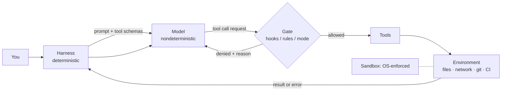
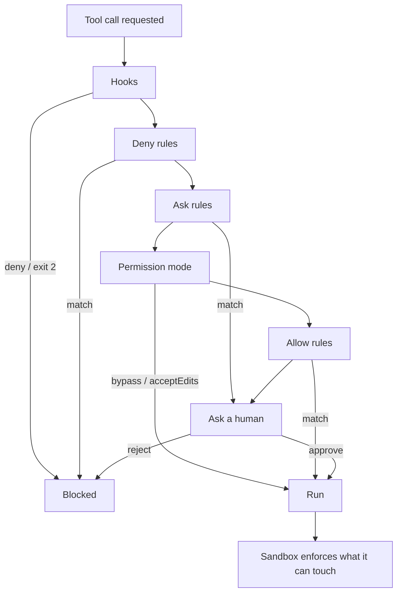

# Research Dossier — Module 11: Harness Engineering

**Researched:** 2026-08-25. **Target:** `mini-courses/2_intermediate/11_harness_engineering.md`
**Audience:** professional developers, INTERMEDIATE, post-Fundamentals.
**House style reference:** `mini-courses/1_fundamentals/6_agents.md` (friendly 2nd person, short sections, comparison tables, mermaid, short runnable snippets, Quick Check, prev/next links, ~150–280 lines).

> **Currency warning for the module author.** Almost every config surface cited here changed within the last 12 months. Anthropic's Claude Code docs **moved from `docs.claude.com/en/docs/claude-code/*` to `code.claude.com/docs/en/*`** (301, verified today). OpenAI's Codex docs **moved from `developers.openai.com/codex/*` to `learn.chatgpt.com/docs/*`** (308, verified today). Meta's model cards moved from `llama.com/docs` to `developer.meta.com/ai/docs`. Do not reuse old URLs, and do not write config field names from memory.

---

## 1. Executive summary — 10 things the module author must not get wrong

1. **The harness is the deterministic program around a nondeterministic model.** Microsoft now ships this exact definition as product documentation: *"An agent harness is the runtime scaffolding that turns a language model into an agent that can perform work. It drives model and tool calls, manages conversation state and context, applies approval policies, and can keep the agent progressing through a multi-step task."* ([Agent harness — Microsoft Agent Framework, ms.date 2026-07-29](https://learn.microsoft.com/en-us/agent-framework/concepts/harness)). Use this as the module's spine — it is a citable, vendor-neutral definition, not the author's opinion.
2. **Reliability wins are harness wins.** Anthropic's own SWE-bench work: *"we actually spent more time optimizing our tools than the overall prompt"* ([Building effective agents, 2024-12-19](https://www.anthropic.com/engineering/building-effective-agents)). SWE-agent made the same argument academically — *"SWE-agent's custom agent-computer interface (ACI) significantly enhances an agent's ability to create and edit code files, navigate entire repositories, and execute tests"* ([arXiv:2405.15793, 2024-05-06](https://arxiv.org/abs/2405.15793)).
3. **Tools are the contract between the deterministic and the nondeterministic half.** Anthropic frames tools as *"contracts between deterministic systems and non-deterministic agents"* ([Writing effective tools for agents, 2025-09-11](https://www.anthropic.com/engineering/writing-tools-for-agents)). That sentence is the whole module in one line.
4. **Permissions and sandboxes are different layers and must both exist.** Anthropic states it plainly: permission rules are *"evaluated before a command runs"* from the command string, while *"the operating system enforces the sandbox boundary on the running process, so it holds regardless of what the model chose to run and even if an allowed command does more than its name suggests"* ([Sandboxing, code.claude.com](https://code.claude.com/docs/en/sandboxing)). Do not let the module conflate them.
5. **The sandbox↔approval tradeoff is measurable, not philosophical.** Anthropic: *"in our internal usage, we've found that sandboxing safely reduces permission prompts by 84%"* ([Claude Code sandboxing, 2025-10-20](https://www.anthropic.com/engineering/claude-code-sandboxing)). And the reason it matters: constant approvals create *"approval fatigue, where users might not pay close attention to what they're approving."*
6. **Autonomy must be coupled to isolation.** Gemini CLI enforces this in code: *"Sandbox is enabled when using `--yolo` or `--approval-mode=yolo` by default"* ([Gemini CLI configuration reference](https://github.com/google-gemini/gemini-cli/blob/main/docs/reference/configuration.md)). Anthropic requires it in docs: *"Always run `--dangerously-skip-permissions` sessions inside a container, a VM, or the sandbox runtime"* ([Sandbox environments](https://code.claude.com/docs/en/sandbox-environments)). "No approvals AND no sandbox" is the one combination that is never acceptable.
7. **The cheapest, most reliable guardrails a coding agent has are the compiler, the type checker, the linter, and the test suite.** Anthropic's best-practices page leads with it: *"Give Claude a check it can run: tests, a build, a screenshot to compare. It's the difference between a session you watch and one you walk away from."* ([Best practices, code.claude.com](https://code.claude.com/docs/en/best-practices)). Deterministic verifiers are not "nice to have"; they are what makes unattended runs possible.
8. **Error messages are prompts.** Anthropic's tool-writing guidance says tool errors should *"clearly communicate specific and actionable improvements"* to steer the agent ([Writing effective tools for agents, 2025-09-11](https://www.anthropic.com/engineering/writing-tools-for-agents)). Claude Code's sandbox does this concretely: *"Claude Code appends the violation details to the failed command's output, so Claude sees which file path or network host the sandbox blocked"* ([Sandboxing](https://code.claude.com/docs/en/sandboxing)).
9. **Fail-open vs fail-closed is the sharpest teachable contrast in the whole topic, and real products differ.** Gemini CLI hooks: *"If `stdout` contains non-JSON text, parsing will fail. The CLI will default to 'Allow'"* ([Gemini CLI hooks](https://github.com/google-gemini/gemini-cli/blob/main/docs/hooks/index.md)). Microsoft Agent Hooks: *"Fail closed: A deny blocks the guarded action. Invalid contexts, invalid verdicts, interceptor failures, and enforcement failures don't silently bypass controls."* ([Agent Hooks, ms.date 2026-08-07](https://learn.microsoft.com/en-us/agent-framework/agents/agent-hooks)). Same architectural slot, opposite defaults.
10. **A domain allowlist is not exfiltration-proof.** Anthropic's own limitation: *"Allowing broad domains such as `github.com` can create paths for data exfiltration. Because the proxy makes its allow decision from the client-supplied hostname without inspecting TLS, code running inside the sandbox can potentially use domain fronting or similar techniques to reach hosts outside the allowlist."* ([Sandboxing → Security limitations](https://code.claude.com/docs/en/sandboxing)). Teach the honest version.

---

## 2. Canonical definitions & terminology (pin these down)

These words are used loosely in blog posts. Here is a defensible set, each anchored to a primary source.

| Term | Definition to teach | Primary anchor |
|---|---|---|
| **Model** | The neural network. Text in, text (and tool-call requests) out. Stateless; nondeterministic. | Module 6 already establishes this ("LLM = brain"). |
| **Harness** | The deterministic program that drives the loop: it calls the model, executes the tool calls, manages state/context, applies approval policy, and decides when to stop. | *"the runtime scaffolding that turns a language model into an agent"* — [Agent harness, Microsoft, 2026-07-29](https://learn.microsoft.com/en-us/agent-framework/concepts/harness) |
| **Scaffold / ACI (agent-computer interface)** | Research-community synonym for the harness's *tool surface*: the specific commands, editors, and viewers the agent is given. | [arXiv:2405.15793](https://arxiv.org/abs/2405.15793) — *"LM agents are a new category of end user... interface design affects the performance of language model agents"* |
| **Runtime** | The process/OS environment the harness executes in. Distinct from the harness: you can run the same harness in three runtimes (host, container, microVM). | [Sandbox environments](https://code.claude.com/docs/en/sandbox-environments) distinguishes "the whole Claude Code process" boundary from "Bash commands" boundary |
| **Guardrail** | A check placed at a specific seam in the loop that returns a **verdict** (allow / deny / transform / escalate) — not a log line. | *"Agent Hooks is a control plane, not a telemetry plane. Every interceptor returns a verdict."* ([Agent Hooks](https://learn.microsoft.com/en-us/agent-framework/agents/agent-hooks)) |
| **Hook** | A harness-provided callback slot at a named lifecycle event, whose return value the harness obeys. Hooks are the *mechanism*; guardrails are the *policy* you put in them. | [Claude Code hooks](https://code.claude.com/docs/en/hooks); [Gemini CLI hooks](https://github.com/google-gemini/gemini-cli/blob/main/docs/hooks/index.md) |
| **Permission rule / allow-deny list** | A declarative, pre-execution match on a tool call (name + specifier). Evaluated *before* the tool runs, from the request string. | *"Rules are evaluated in order: deny, then ask, then allow"* ([Permissions](https://code.claude.com/docs/en/permissions)) |
| **Permission mode** | A session-wide default that says which categories run without asking. Orthogonal to sandboxing. | *"`/sandbox` is not a permission mode. Permission modes decide whether a tool call runs and whether you are prompted first, while the sandbox restricts what a Bash command can access once it runs."* ([Sandboxing](https://code.claude.com/docs/en/sandboxing)) |
| **Sandbox** | An OS-or-hypervisor-enforced boundary on what a *running* process can touch (filesystem + network). Enforced after the decision to run. | [Sandboxing](https://code.claude.com/docs/en/sandboxing); mechanisms: Seatbelt (macOS), bubblewrap (Linux/WSL2) |
| **Blast radius** | What a wrong action can damage before you notice. Reduce it with worktrees, ephemeral filesystems, read-only mounts, and reversibility (checkpoints, git). | [Best practices](https://code.claude.com/docs/en/best-practices) (worktrees, `/rewind` checkpoints) |

**Terminology trap to call out explicitly:** "guardrails" appears in Module 11 *and* Module 12. See §9 for the split. Also: Claude Code's **sandbox "auto-allow mode"** and its **"auto" permission mode** are different things — *"auto-allow approves Bash commands because the sandbox boundary contains them, while auto mode uses a classifier to review actions. The two work independently and can be combined."* ([Sandboxing](https://code.claude.com/docs/en/sandboxing)).

### The boundary diagram to draw

```
YOU ──▶ HARNESS (deterministic code you control)
             │  builds prompt, exposes tool schemas
             ├──▶ MODEL  (nondeterministic; returns text + tool-call requests)
             │  ◀── tool-call request
             ├──▶ GATE   (hooks → deny rules → ask rules → mode → allow rules → human)
             ├──▶ TOOLS  (your functions / shell / MCP servers)
             └──▶ ENVIRONMENT (filesystem, network, git, CI) ── enforced by SANDBOX
```
The gate ordering above is not invented — it is Anthropic's documented six-step evaluation order: hooks → deny rules → ask rules → permission mode → allow rules → `canUseTool` callback ([Agent SDK permissions](https://code.claude.com/docs/en/agent-sdk/permissions)).

---

## 3. Deep dive per required topic

### 3.1 What "the harness" IS, and why harness > prompt

- The stub's framing ("the program that wraps the agent loop") is correct and matches Microsoft's definition verbatim in spirit ([Agent harness](https://learn.microsoft.com/en-us/agent-framework/concepts/harness)).
- Microsoft's five-layer decomposition is a ready-made teaching structure: (1) chat client, (2) chat pipeline, (3) agent and context providers, (4) **middleware and decorators — "add approval handling, observability, and optional bounded looping"**, (5) application UX ([same page](https://learn.microsoft.com/en-us/agent-framework/concepts/harness)).
- The "harness beats prompt" claim has two good citations: Anthropic's *"we actually spent more time optimizing our tools than the overall prompt"* ([Building effective agents, 2024-12-19](https://www.anthropic.com/engineering/building-effective-agents)) and SWE-agent's ACI thesis ([arXiv:2405.15793](https://arxiv.org/abs/2405.15793)).
- **Honest caveat for the author:** I did **not** find a clean, quantified "same model, harness A vs harness B → N points of SWE-bench" ablation in a primary source I could fetch today. SWE-agent's abstract reports 12.5% pass@1 as SOTA-at-the-time and says the paper provides *"insights into how the design of the ACI can impact agents' behavior and performance"*, but the abstract does not isolate a delta ([arXiv:2405.15793](https://arxiv.org/abs/2405.15793)). Write the claim qualitatively; do not invent a number.
- Anthropic's design advice worth quoting: *"You should consider adding complexity only when it demonstrably improves outcomes"*, and the poka-yoke line on tool schemas — *"Change the arguments so that it is harder to make mistakes"* ([Building effective agents, 2024-12-19](https://www.anthropic.com/engineering/building-effective-agents)).

### 3.2 Harness responsibilities checklist

Every item below has a primary citation, so the module's checklist is not hand-waving.

| Responsibility | Concrete mechanism (cited) |
|---|---|
| Tool exposure & schemas | Token-efficient tools with *"pagination, range selection, filtering, and/or truncation with sensible default parameter values"*; Claude Code caps tool responses at a **25,000-token limit** by default ([Writing effective tools, 2025-09-11](https://www.anthropic.com/engineering/writing-tools-for-agents)) |
| Removing tools entirely | A bare deny rule *"removes the tool from Claude's context entirely, so Claude never sees it"* ([Permissions](https://code.claude.com/docs/en/permissions)). Gemini CLI: globally denied tools are *"completely excluded from the model's memory... which is more secure and saves context window space"* ([policy engine](https://github.com/google-gemini/gemini-cli/blob/main/docs/reference/policy-engine.md)) |
| Approval gates | Six-step evaluation order + `canUseTool` ([Agent SDK permissions](https://code.claude.com/docs/en/agent-sdk/permissions)); Codex `--ask-for-approval` ([Agent approvals & security](https://learn.chatgpt.com/docs/agent-approvals-security)); MS `@tool(approval_mode="always_require")` ([Tool approval, ms.date 2026-07-01](https://learn.microsoft.com/en-us/agent-framework/agents/tools/tool-approval)) |
| Allow/deny lists | `permissions.allow` / `ask` / `deny` with `Tool(specifier)` syntax ([Permissions](https://code.claude.com/docs/en/permissions)) |
| Sandboxing & FS scoping | `sandbox.filesystem.allowWrite/denyRead/...` ([Settings reference](https://code.claude.com/docs/en/settings-reference)) |
| Timeouts | Hook `timeout` (600 s for command/http/mcp_tool, 30 s for prompt, 60 s for agent handlers) ([Hooks](https://code.claude.com/docs/en/hooks)); AutoGen executors default `timeout=60` ([DockerCommandLineCodeExecutor](https://microsoft.github.io/autogen/stable/reference/python/autogen_ext.code_executors.docker.html)); ACA dynamic sessions cap code execution at **220 seconds** ([sessions-code-interpreter, ms.date 2026-01-30](https://learn.microsoft.com/en-us/azure/container-apps/sessions-code-interpreter)) |
| Step budgets | LangGraph `recursion_limit`; OpenAI Agents SDK `max_turns`; AutoGen `max_turns` / `MaxMessageTermination` ([human-in-the-loop](https://microsoft.github.io/autogen/stable/user-guide/agentchat-user-guide/tutorial/human-in-the-loop.html)); MS Harness `MaxContextWindowTokens` / `MaxOutputTokens` ([Agent harness](https://learn.microsoft.com/en-us/agent-framework/concepts/harness)) |
| Cost/token budgets | Context window is the scarce resource: *"Claude's context window fills up fast, and performance degrades as it fills"* ([Best practices](https://code.claude.com/docs/en/best-practices)) |
| Retries & escalation | Claude Code's `dangerouslyDisableSandbox` retry path, disableable with `"allowUnsandboxedCommands": false` ([Sandboxing](https://code.claude.com/docs/en/sandboxing)) |
| Error surfacing | Sandbox violations appended to failed command output ([Sandboxing](https://code.claude.com/docs/en/sandboxing)); `permissionDecisionReason` *"tells the model why, so it avoids retrying"* ([Agent SDK hooks](https://code.claude.com/docs/en/agent-sdk/hooks)) |
| Observability/tracing | `PostToolUse` / `record_sink` of payload-free `InterceptionRecord`s ([Agent Hooks](https://learn.microsoft.com/en-us/agent-framework/agents/agent-hooks)); OpenTelemetry export ([Security → Team security](https://code.claude.com/docs/en/security)) |
| State & checkpointing | LangGraph checkpointer + `thread_id` ([LangGraph interrupts](https://docs.langchain.com/oss/python/langgraph/interrupts)); Claude Code `/rewind` — but note the honest limit: *"Checkpoints only track changes made through Claude's file editing tools. Changes made through Bash commands or external processes are not captured."* ([Best practices](https://code.claude.com/docs/en/best-practices)) |
| Human-in-the-loop interrupts | `interrupt()` + `Command(resume=...)` ([LangGraph interrupts](https://docs.langchain.com/oss/python/langgraph/interrupts)); `PreToolUse` `permissionDecision: "defer"` ([Agent SDK hooks](https://code.claude.com/docs/en/agent-sdk/hooks)) |
| Kill switches | `Stop` hook exit 2 blocks the turn from ending; `disableAllHooks` ([Hooks](https://code.claude.com/docs/en/hooks)); `security.disableYoloMode` ([Gemini CLI configuration](https://github.com/google-gemini/gemini-cli/blob/main/docs/reference/configuration.md)); `permissions.disableBypassPermissionsMode` ([Settings reference](https://code.claude.com/docs/en/settings-reference)) |

### 3.3 GUARDRAILS as engineering

**Where guardrails sit.** Three vendors converged on the same seam list at different granularities:
- NeMo Guardrails' five rails: **input rails, retrieval rails, dialog rails, execution rails, output rails** ([NeMo Guardrails, `nemoguardrails` 0.23.0, 2026-07-01](https://docs.nvidia.com/nemo/guardrails/)). Newer `rails.tool_input` / `rails.tool_output` are the agentic seam.
- Microsoft Agent Hooks' eight interception points: `agent_startup`, `input`, `pre_model_call`, `post_model_call`, `pre_tool_call`, `post_tool_call`, `output`, `agent_shutdown` ([Agent Hooks](https://learn.microsoft.com/en-us/agent-framework/agents/agent-hooks)).
- OpenAI Agents SDK: `@input_guardrail`, `@output_guardrail`, `@tool_input_guardrail`, `@tool_output_guardrail`, where *"Input guardrails run only for the first agent in the chain"* and *"Output guardrails run only for the agent that produces the final output"* ([Guardrails, openai-agents-python](https://openai.github.io/openai-agents-python/guardrails/)).

**Deterministic vs model-based.**

| | Deterministic | Model-based |
|---|---|---|
| Examples | compiler, type checker, linter, test suite, AST parse, regex, JSON-schema validation | classifier (Llama Guard, Prompt Guard), LLM-as-judge, Claude Code's auto-mode classifier |
| Verdict stability | same input → same verdict | probabilistic; no guarantee |
| Cost/latency | ~free, milliseconds–seconds | extra model call per check |
| Good for | correctness, syntax, contracts, policy on *structure* | intent, tone, "is this risky", semantics |
| Citation | *"hooks are deterministic and guarantee the action happens"* vs CLAUDE.md rules which *"are advisory"* ([Best practices](https://code.claude.com/docs/en/best-practices)) | *"a second model, the classifier, reviews actions instead of you"* — and it is explicitly *"a per-action control, not an isolation boundary"* ([Sandbox environments](https://code.claude.com/docs/en/sandbox-environments)) |

**The underrated point (make it a highlighted callout).** For a coding agent, the compiler/type-checker/linter/test-suite quartet is the highest-value guardrail set, because it is deterministic, already in the repo, and closes the loop without you: *"Give Claude something that produces a pass or fail, and the loop closes on its own. Claude does the work, runs the check, reads the result, and iterates until the check passes."* ([Best practices](https://code.claude.com/docs/en/best-practices)).

**Fail-open vs fail-closed — real, cited defaults.**
- Fail-open: Gemini CLI hooks — non-JSON stdout ⇒ *"The CLI will default to 'Allow'"* ([Gemini CLI hooks](https://github.com/google-gemini/gemini-cli/blob/main/docs/hooks/index.md)).
- Fail-closed: MS Agent Hooks — *"Invalid contexts, invalid verdicts, interceptor failures, and enforcement failures don't silently bypass controls"* ([Agent Hooks](https://learn.microsoft.com/en-us/agent-framework/agents/agent-hooks)).
- Fail-closed by omission: Semantic Kernel filters — *"calling the `next` delegate is essential... Without calling `next`, the operation will not be executed"* ([SK filters, ms.date 2026-04-29](https://learn.microsoft.com/en-us/semantic-kernel/concepts/enterprise-readiness/filters)).
- Claude Code: *"Fail-closed matching: In Manual mode, unmatched commands require approval by default"* ([Security](https://code.claude.com/docs/en/security)). And a hook `exit 2` is final: *"Cannot be overridden by a valid `permissionDecision: 'allow'` if `exit 2` is used"* ([Hooks](https://code.claude.com/docs/en/hooks)).

**Latency/cost budget for guardrails** — vendors now document this, so the module can too:
- NeMo supports `parallel: True` for independent input/output rails, with an explicit race warning: *"Input rail mutations can lead to erroneous results during parallel execution because of race conditions."* Its **speculative generation** runs the input rail and the main generation concurrently, hiding rail latency at the cost of tokens spent on requests that turn out to be unsafe ([NeMo Guardrails docs](https://docs.nvidia.com/nemo/guardrails/)).
- MS Agent Hooks buffers streaming — *"No response update reaches the caller until the complete model response and final output pass their interception points"* — explicitly *"trades token-by-token latency for fail-closed output enforcement"* ([Agent Hooks](https://learn.microsoft.com/en-us/agent-framework/agents/agent-hooks)).
- Prompt Guard 2 has a **512-token context window**, *"requiring longer prompts to be split into segments for scanning"* ([Prompt Guard model card](https://developer.meta.com/ai/docs/model-cards-and-prompt-formats/prompt-guard/)) — a concrete engineering constraint students can feel.

**Model-based guardrails are not deterministic — say so with a citation.** Simon Willison, on vendor guardrail products: guardrails that block "95% of attacks" are *a failing grade in security contexts*, and he is *"deeply suspicious"* of them ([The lethal trifecta, 2025-06-16](https://simonwillison.net/2025/Jun/16/the-lethal-trifecta/)).

### 3.4 HOOKS as the deterministic control plane

**Claude Code — the exact contract (all verified today on [Hooks](https://code.claude.com/docs/en/hooks)).**
- Hook events are far more numerous than most blog posts claim. Blockable, harness-relevant ones: `UserPromptSubmit`, `UserPromptExpansion`, `PreToolUse`, `PostToolBatch`, `Stop`, `SubagentStop`, `PreCompact`, `ConfigChange`, `WorktreeCreate`, `TaskCreated`, `TaskCompleted`, `TeammateIdle`, `Elicitation`, `ElicitationResult`. Non-blocking: `SessionStart`, `SessionEnd`, `PermissionRequest`*, `PermissionDenied`, `PostToolUse`, `PostToolUseFailure`, `SubagentStart`, `FileChanged`, `CwdChanged`, `Notification`, `MessageDisplay`, `InstructionsLoaded`, `StopFailure`, `PostCompact`, `DirectoryAdded`, `WorktreeRemove`. (*`PermissionRequest` cannot use exit 2; it decides via JSON only.)
- **Exit-code contract:** `0` = success (stdout parsed as JSON, or plain text added as context); `2` = **blocking** on blockable events; `1` and `>2` = non-blocking error, the action proceeds; timeout = no decision, proceeds. Note the un-Unix-like part worth calling out: exit `1` does **not** block.
- **`PreToolUse` JSON output shape:**
  ```json
  {
    "hookSpecificOutput": {
      "hookEventName": "PreToolUse",
      "permissionDecision": "allow",
      "permissionDecisionReason": "string",
      "additionalContext": "string",
      "updatedInput": { }
    },
    "systemMessage": "string"
  }
  ```
- **Matcher semantics:** `"*"`/`""`/omitted matches all. A matcher containing only letters, digits, `_`, `-`, spaces, `,`, `|` is an exact string or `|`/`,` list (`Bash`, `Edit|Write`). Anything else is an **unanchored JavaScript regex**. MCP tools are `mcp__<server>__<tool>` and matching a whole server needs the `.*`: `mcp__memory__.*`.
- **Hook handler types:** `command`, `http`, `mcp_tool`, `prompt`, `agent` — i.e. a hook can itself be an LLM call or a subagent, which is exactly the "model-based guardrail in a deterministic slot" pattern.
- **Hooks are not a permission override.** *"Hook decisions don't bypass permission rules... a matching deny rule blocks the call, and a matching ask rule still prompts even when the hook returned `"allow"`"* ([Permissions](https://code.claude.com/docs/en/permissions)).
- **The load-bearing sentence for the module:** hooks are how you get "must happen every time." *"Unlike CLAUDE.md instructions which are advisory, hooks are deterministic and guarantee the action happens."* ([Best practices](https://code.claude.com/docs/en/best-practices)).

**Gemini CLI hooks** — 11 events: `SessionStart`, `SessionEnd`, `BeforeAgent`, `AfterAgent`, `BeforeModel`, `AfterModel`, `BeforeToolSelection`, `BeforeTool`, `AfterTool`, `PreCompress`, `Notification`. Exit `0` with JSON is the *preferred* way to block (`{"decision":"deny"}`); exit `2` is a "System Block" using stderr as the reason ([Gemini CLI hooks](https://github.com/google-gemini/gemini-cli/blob/main/docs/hooks/index.md)). Fun detail for a "the ecosystem is converging" aside: Gemini CLI also exports `CLAUDE_PROJECT_DIR` as an alias *"Provided for compatibility."*

**OpenAI Agents SDK** — guardrails + lifecycle. Guardrail decorators and `GuardrailFunctionOutput(output_info=..., tripwire_triggered=...)`, raising `InputGuardrailTripwireTriggered` / `OutputGuardrailTripwireTriggered` / `ToolInputGuardrailTripwireTriggered` / `ToolOutputGuardrailTripwireTriggered`. Tool guardrails also offer `ToolGuardrailFunctionOutput.allow()` and `.reject_content(message)` ([Guardrails](https://openai.github.io/openai-agents-python/guardrails/)).

**Microsoft** — two generations worth showing side by side: Semantic Kernel **filters** (`IFunctionInvocationFilter`, `IPromptRenderFilter`, `IAutoFunctionInvocationFilter`; `context.Terminate = true` stops the tool loop) ([SK filters](https://learn.microsoft.com/en-us/semantic-kernel/concepts/enterprise-readiness/filters)) and Agent Framework **Agent Hooks** implementing the vendor-neutral **AGENT-HOOKS-0.1** spec ([spec on GitHub](https://github.com/responsibleai/agent-hooks/blob/main/spec/AGENT-HOOKS-0.1.md)).

**LangGraph interrupts** — the checkpoint-based HITL model: `interrupt(value)` pauses, `Command(resume=...)` resumes, a **checkpointer is required**, and the thread is addressed by `config={"configurable": {"thread_id": "..."}}`. Static breakpoints via `builder.compile(interrupt_before=[...], interrupt_after=[...], checkpointer=...)`. The gotcha worth teaching: *"The node restarts from the beginning"* on resume, so code before `interrupt()` re-executes — which is exactly why tool calls need to be idempotent ([LangGraph interrupts](https://docs.langchain.com/oss/python/langgraph/interrupts)).

### 3.5 SANDBOXES

**The failure/threat model to state up front** (four items, each citable):
1. **Destructive commands.** Claude Code special-cases this: `rm`/`rmdir` against a **critical path** is never auto-approved *"in any mode, including `bypassPermissions`"*, and no allow rule or `PreToolUse` hook `"allow"` clears it ([Permission modes](https://code.claude.com/docs/en/permission-modes)).
2. **Secret exfiltration.** *"Without network isolation, a compromised agent could exfiltrate sensitive files like SSH keys"* ([Sandboxing](https://code.claude.com/docs/en/sandboxing)). Note the default read policy *"still allows reading credential files such as `~/.aws/credentials` and `~/.ssh/`"* unless you configure `sandbox.credentials` or `denyRead`.
3. **Prompt-injected tool calls.** *"if a repository's README contains unusual instructions, Claude Code might incorporate those into its actions in ways the operator didn't anticipate"* ([Secure deployment](https://code.claude.com/docs/en/agent-sdk/secure-deployment)).
4. **Self-escalation / persistence.** The sandbox denies writes to the config files that would let a command widen its own future access — `.claude` settings, `.claude/hooks`, `.mcp.json`, `.git/hooks`, `.git/config`, shell startup files: *"A command that could edit those files could grant itself permissions, or add a hook or MCP server that Claude Code runs outside the sandbox."* ([Sandboxing → Protected paths](https://code.claude.com/docs/en/sandboxing)). This is a genuinely non-obvious harness insight and belongs in the module.
5. **Runaway cost** — bounded by step/token budgets (§3.2), not by a sandbox.

**The isolation ladder** (§5 has the full table). Same-process → subprocess with restricted env → OS sandbox (Seatbelt/bubblewrap/Landlock) → container → gVisor → microVM/VM → separate machine/cloud sandbox.

**How the three major CLIs actually do it (all verified today):**

| | Claude Code | Codex CLI | Gemini CLI |
|---|---|---|---|
| macOS mechanism | **Seatbelt** ([Sandboxing](https://code.claude.com/docs/en/sandboxing)) | **Seatbelt** — *"sandboxing works out of the box using the built-in Seatbelt framework"* ([Sandbox](https://learn.chatgpt.com/docs/sandboxing)) | **Seatbelt via `sandbox-exec`**, profile chosen by `SEATBELT_PROFILE` ([sandbox.md](https://github.com/google-gemini/gemini-cli/blob/main/docs/cli/sandbox.md)) |
| Linux mechanism | **bubblewrap** ([Sandboxing](https://code.claude.com/docs/en/sandboxing)) | **bubblewrap** — *"On Linux and WSL2, install `bubblewrap` with your package manager first"*; falls back to a bundled helper needing unprivileged user namespaces ([Sandbox](https://learn.chatgpt.com/docs/sandboxing)) | Docker / Podman / **`runsc` (gVisor)** / LXC; `GEMINI_SANDBOX=true\|docker\|podman\|sandbox-exec\|runsc\|lxc` ([sandbox.md](https://github.com/google-gemini/gemini-cli/blob/main/docs/cli/sandbox.md)) |
| Network default | *"Claude Code pre-allows no domains by default"*; enforced by an out-of-sandbox proxy ([Sandboxing](https://code.claude.com/docs/en/sandboxing)) | *"By default, the agent runs with network access turned off"*; `[sandbox_workspace_write] network_access = true` to enable ([Agent approvals & security](https://learn.chatgpt.com/docs/agent-approvals-security)) | `tools.sandboxNetworkAccess` default **`false`**; `*-proxied` Seatbelt profiles route via proxy ([configuration reference](https://github.com/google-gemini/gemini-cli/blob/main/docs/reference/configuration.md)) |
| Domain allowlist | `sandbox.network.allowedDomains`, `deniedDomains`, `strictAllowlist`, `allowManagedDomainsOnly` ([Settings reference](https://code.claude.com/docs/en/settings-reference)) | `[features.network_proxy] enabled = true; domains = { "api.openai.com" = "allow", "example.com" = "deny" }` — allowlist-first, `deny` always wins, `*.x` ≠ apex, `**.x` = apex+subs ([Agent approvals & security](https://learn.chatgpt.com/docs/agent-approvals-security)) | proxy profiles; `SANDBOX_MOUNTS`, `SANDBOX_FLAGS` ([sandbox.md](https://github.com/google-gemini/gemini-cli/blob/main/docs/cli/sandbox.md)) |
| Write scope default | cwd + session temp dir ([Sandboxing](https://code.claude.com/docs/en/sandboxing)) | workspace (cwd + temp dirs like `/tmp`); `.git`, `.agents`, `.codex` protected read-only inside writable roots ([Agent approvals & security](https://learn.chatgpt.com/docs/agent-approvals-security)) | cwd mounted *"at the exact same absolute path as it is on your host machine"* ([sandbox.md](https://github.com/google-gemini/gemini-cli/blob/main/docs/cli/sandbox.md)) |
| Autonomy↔isolation coupling | `--dangerously-skip-permissions` *requires* container/VM/sandbox-runtime; blocked as root ([Sandbox environments](https://code.claude.com/docs/en/sandbox-environments)) | `--yolo` = `--dangerously-bypass-approvals-and-sandbox`: *"No sandbox; no approvals (not recommended)"* ([Agent approvals & security](https://learn.chatgpt.com/docs/agent-approvals-security)) | *"Sandbox is enabled when using `--yolo` or `--approval-mode=yolo` by default"* ([configuration reference](https://github.com/google-gemini/gemini-cli/blob/main/docs/reference/configuration.md)) |

> **Correction to widely-repeated 2025 lore.** Many write-ups say Codex CLI sandboxes Linux with **Landlock + seccomp**. As of today, OpenAI's own docs say Linux/WSL2 uses **bubblewrap** (`bwrap`), with a bundled helper fallback requiring unprivileged user namespaces, plus AppArmor `bwrap-userns-restrict` notes for Ubuntu ([Sandbox](https://learn.chatgpt.com/docs/sandboxing)). If the module mentions Landlock at all, mention it as a *primitive*, not as "what Codex uses today." Windows now uses a native Windows sandbox in PowerShell, or the Linux path under WSL2.

**Git worktrees as a cheap blast-radius limiter.** Each linked worktree is a separate working directory sharing one object store, with its own `HEAD` and `index` ([git-worktree docs](https://git-scm.com/docs/git-worktree)). Claude Code special-cases them in the sandbox: *"when the working directory is a linked git worktree, the sandbox also allows writes to the main repository's shared `.git` directory so commands such as `git commit` can update refs and the index. Writes to `hooks/` and `config` inside that directory remain denied."* ([Sandboxing](https://code.claude.com/docs/en/sandboxing)). Anthropic recommends worktrees for parallel sessions *"so edits don't collide"* ([Best practices](https://code.claude.com/docs/en/best-practices)).

**Devcontainers.** The reference container pairs a non-root `remoteUser`, an `init-firewall.sh` default-deny egress firewall (needing `NET_ADMIN` and `NET_RAW` via `runArgs`), and persistent volumes; *"Because the container runs Claude Code as a non-root user and confines command execution to the container, you can pass `--dangerously-skip-permissions` for unattended operation."* But quote the caveat too: *"dev containers do not prevent a malicious project from exfiltrating anything accessible inside the container, including the Claude Code credentials stored in `~/.claude`"* ([Devcontainer](https://code.claude.com/docs/en/devcontainer)).

**"Sandbox + no approvals" vs "no sandbox + approve everything."** The tradeoff, with numbers on one side: sandboxing cut prompts by **84%** internally ([Claude Code sandboxing, 2025-10-20](https://www.anthropic.com/engineering/claude-code-sandboxing)), and the failure mode of the other choice is *"approval fatigue, where users might not pay close attention to what they're approving"* (same post). Codex says the same thing in its own words: *"The sandbox reduces approval fatigue"* ([Sandbox](https://learn.chatgpt.com/docs/sandboxing)).

### 3.6 Reliability engineering for agents

- **Make the environment tell the truth.** The `/goal`-condition, `Stop`-hook, and adversarial-subagent escalation ladder in [Best practices](https://code.claude.com/docs/en/best-practices) is the best primary source I found: a `Stop` hook *"runs your check as a script and blocks the turn from ending until it passes"*, and — a detail worth quoting because it shows the harness protecting itself from a hook — *"Claude Code overrides the hook and ends the turn after 8 consecutive blocks."*
- **Don't let the author grade its own homework.** *"a verification subagent... has a fresh model try to refute the result, so the agent doing the work isn't the one grading it."* Balance it with the same page's warning: *"A reviewer prompted to find gaps will usually report some, even when the work is sound... Chasing every finding leads to over-engineering."* ([Best practices](https://code.claude.com/docs/en/best-practices)).
- **Show evidence, not assertions.** *"Have Claude show evidence rather than asserting success: the test output, the command it ran and what it returned, or a screenshot"* ([Best practices](https://code.claude.com/docs/en/best-practices)). This is the antidote to the named failure pattern *"the trust-then-verify gap."*
- **Idempotency.** LangGraph's resume semantics force it: *"The node restarts from the beginning"* on resume ([LangGraph interrupts](https://docs.langchain.com/oss/python/langgraph/interrupts)). MS warns that terminating a tool loop mid-flight *"might result in your chat history being left in an inconsistent state"* ([Middleware, ms.date 2026-08-07](https://learn.microsoft.com/en-us/agent-framework/concepts/agents/middleware/)).
- **Cheap and reversible failure.** Checkpoints + `/rewind` + worktrees + ephemeral `tmpfs` workspaces (`--tmpfs /workspace:rw,noexec,size=500m`) ([Secure deployment](https://code.claude.com/docs/en/agent-sdk/secure-deployment)). Anthropic's framing: *"Instead of carefully planning every move, you can tell Claude to try something risky. If it doesn't work, rewind and try a different approach."* ([Best practices](https://code.claude.com/docs/en/best-practices)).
- **Determinism where possible.** Structured outputs / schema validation as a guardrail (Guardrails AI's second stated function is *"generat[ing] structured data from LLMs"* — [Guardrails AI README](https://github.com/guardrails-ai/guardrails/blob/main/README.md)).

### 3.7 What I would ADD to the stub, and why

The stub lists exactly three topics: Guardrails, Hooks, Sandboxes. Keep all three; add these four, each earning its place:

1. **"The harness" as an explicit concept + the model/harness/tools/environment boundary.** Without it, the three stub topics are a bag of tools rather than one idea. Microsoft's definition makes it citable.
2. **Permissions & approval gates (allow/ask/deny + permission modes).** This is the mechanism the stub's "Guardrails" bullet actually means for a coding agent, and it is the thing readers will configure on Monday. It is also documented as *distinct* from sandboxing, so omitting it invites the exact confusion the module should prevent.
3. **The autonomy ladder** (§4). This is the SDLC payload the brief demands and the single most actionable artifact the module can ship.
4. **Verification loops / "let the environment tell the truth."** The strongest, best-cited reliability lever, and it distinguishes Module 11 (mechanism) from Module 13 (loop/eval design) if scoped to *deterministic gates inside the wrapper*.

Optional if space allows: **budgets & kill switches** as a short table; **observability** as two lines pointing at OpenTelemetry.

**Nothing in the stub's topic list is obscure, renamed, or nonexistent.** All three terms are current and well-documented. One naming note: what the stub calls "the harness" is called *harness* by Microsoft, *scaffold/ACI* in the research literature, and is unnamed but clearly present in Anthropic's and OpenAI's docs (they describe the parts — permissions, sandbox, hooks — without a collective noun).

---

## 4. The autonomy ladder

**Precondition gate — what must be true before you turn on any autonomy above rung 1:**
- Work is in **git**, on a **branch or worktree**, with a clean tree. (Checkpoints are not a git substitute: *"Checkpoints only track changes made through Claude's file editing tools"* — [Best practices](https://code.claude.com/docs/en/best-practices).)
- A **check the agent can run** exists and passes on `main`: build, typecheck, lint, tests ([Best practices](https://code.claude.com/docs/en/best-practices)).
- **Secrets are not reachable**: `.env`, `~/.aws`, `~/.ssh`, `~/.kube`, `.npmrc` denied or absent ([Secure deployment](https://code.claude.com/docs/en/agent-sdk/secure-deployment) has the full risk table).
- **Egress is allowlisted**, not open ([Sandboxing](https://code.claude.com/docs/en/sandboxing)).
- Someone can **see what happened**: transcript, `PostToolUse` log, or OTel.

| Rung | Name | What the agent may do | Claude Code config (verified) | Codex CLI config (verified) | Isolation required |
|---|---|---|---|---|---|
| 0 | **Chat only** | Read nothing, execute nothing | — | — | none |
| 1 | **Read-only / explore** | Read, grep, plan; no writes | `claude --permission-mode plan`; or `--permission-mode dontAsk --allowedTools "Read" "Glob" "Grep"` ([Permission modes](https://code.claude.com/docs/en/permission-modes), [Agent SDK permissions](https://code.claude.com/docs/en/agent-sdk/permissions)) | `--sandbox read-only --ask-for-approval on-request` ([Agent approvals & security](https://learn.chatgpt.com/docs/agent-approvals-security)) | none |
| 2 | **Edit with approval** | Propose edits/commands, you approve each | `claude --permission-mode default` (Manual mode) | `--sandbox workspace-write --ask-for-approval untrusted` — *"can read and edit files but asks for approval before running untrusted commands"* | none |
| 3 | **Sandboxed auto-edit** | Edit + run project commands freely **inside a boundary**; asks only to leave it | Manual mode + `/sandbox` auto-allow, or `"sandbox": {"enabled": true}` with `filesystem.allowWrite` and `network.allowedDomains` ([Sandboxing](https://code.claude.com/docs/en/sandboxing)) | The `Auto` preset: `--sandbox workspace-write --ask-for-approval on-request` (network still off) | OS sandbox (Seatbelt / bubblewrap) |
| 4 | **Classifier-reviewed autonomy** | Everything, with a model reviewing each action | `claude --permission-mode auto -p "fix all lint errors"` ([Best practices](https://code.claude.com/docs/en/best-practices)) | `--ask-for-approval on-request -c approvals_reviewer=auto_review` ([Agent approvals & security](https://learn.chatgpt.com/docs/agent-approvals-security)) | recommended: sandbox/container as defense in depth — the classifier *"is a per-action control, not an isolation boundary"* ([Sandbox environments](https://code.claude.com/docs/en/sandbox-environments)) |
| 5 | **CI-gated fan-out / auto-PR** | Unattended batch work, output gated by CI | `claude -p "Migrate $file..." --allowedTools "Edit,Bash(git commit *)"` in a loop ([Best practices](https://code.claude.com/docs/en/best-practices)); CI variant `-p --permission-mode dontAsk --allowedTools "Bash(npm test)" "Read"` | `codex exec --sandbox workspace-write` (note: `codex exec --full-auto` is a *deprecated* compatibility path that prints a warning) | CI runner boundary + branch-scoped push |
| 6 | **Fully unattended, no approvals** | Everything, no gate | `claude -p "<prompt>" --dangerously-skip-permissions` — **required**: container, VM, or sandbox runtime, as a **non-root user** ([Permission modes](https://code.claude.com/docs/en/permission-modes)) | `--dangerously-bypass-approvals-and-sandbox` / `--yolo` — *"No sandbox; no approvals (not recommended)"* | container / microVM / dedicated VM, mandatory |

**Teaching point:** rungs 3 and 6 differ not in what the agent may *attempt* but in **who or what is holding the boundary**. At rung 3 the OS holds it; at rung 6 the hypervisor or nothing does.

**Organizational lock-in for a chosen rung:** deliver `sandbox` keys via managed settings with `failIfUnavailable: true` and `allowUnsandboxedCommands: false`, and prevent widening with `allowManagedReadPathsOnly` / `allowManagedDomainsOnly`; ban rung 6 with `permissions.disableBypassPermissionsMode` ([Sandboxing → Configure the sandbox for your organization](https://code.claude.com/docs/en/sandboxing), [Settings reference](https://code.claude.com/docs/en/settings-reference)). Honest caveat from the same page: `excludedCommands` *"has no equivalent managed-only lockdown, so a developer can always append entries."* Gemini's equivalent kill switch is `security.disableYoloMode` ([configuration reference](https://github.com/google-gemini/gemini-cli/blob/main/docs/reference/configuration.md)).

---

## 5. Isolation-technology comparison

| Mechanism | Boundary it enforces | Isolation strength (honest) | Setup cost | Perf overhead | Network egress control | Good for / bad for |
|---|---|---|---|---|---|---|
| **Same process, allow/deny rules** | Tool-call strings, pre-execution | None at OS level. Anthropic: *"This is a permission gate, not a sandbox"* ([Secure deployment](https://code.claude.com/docs/en/agent-sdk/secure-deployment)) | Minutes | ~0 | via tool-level rules only (`WebFetch(domain:...)`) | Good: shaping intent, removing tools from context. Bad: anything a subprocess does — *"They don't apply to arbitrary subprocesses that read or write files indirectly, like a Python or Node script"* ([Permissions](https://code.claude.com/docs/en/permissions)) |
| **seccomp-bpf** | Syscall numbers/args | Narrow: no path awareness. Docker's default profile *"blocks ~44"* syscalls ([Secure deployment](https://code.claude.com/docs/en/agent-sdk/secure-deployment)) | Medium (write a profile) | very low | none | Good: shrinking kernel attack surface. Bad: as a standalone FS/network policy |
| **Landlock (Linux LSM)** | Filesystem paths + TCP bind/connect | Real but partial; unprivileged. Since **Linux 5.13**; ABI 4 adds `LANDLOCK_ACCESS_NET_BIND_TCP` / `LANDLOCK_ACCESS_NET_CONNECT_TCP`; ABI 6 adds `LANDLOCK_SCOPE_ABSTRACT_UNIX_SOCKET` / `LANDLOCK_SCOPE_SIGNAL`; **cannot** restrict `chdir`, `stat`, `chmod`, `chown`, `setxattr`, mounts, or pre-existing fds ([kernel Landlock docs](https://docs.kernel.org/userspace-api/landlock.html)) | Medium | very low | TCP only (ABI ≥ 4) | Good: self-restricting a process with no root. Bad: UDP-era assumptions, believing it's "a sandbox" |
| **bubblewrap** (Linux) + **Seatbelt** (macOS) | Whole-process FS + network namespace | *"Good (secure defaults)"*, *"Very low"* overhead, *"Low"* complexity ([Secure deployment](https://code.claude.com/docs/en/agent-sdk/secure-deployment)). Shared kernel: *"A kernel vulnerability could theoretically enable escape"* | Low (a package install) | Anthropic: *"minimal, but some filesystem operations may be slightly slower"* ([Sandboxing](https://code.claude.com/docs/en/sandboxing)) | Yes — via an out-of-sandbox proxy over a unix socket | **This is what Claude Code, Codex CLI (Linux) actually use.** Good: dev laptops. Bad: multi-tenant untrusted code |
| **Docker / OCI container** | Namespaces + cgroups | *"Setup dependent"* ([Secure deployment](https://code.claude.com/docs/en/agent-sdk/secure-deployment)). Docker's own warning: *"the default set of capabilities and mounts given to a container may provide incomplete isolation, either independently, or when used in combination with kernel vulnerabilities"* ([Docker security](https://docs.docker.com/engine/security/)) | Medium | Low | `--network none` + host proxy over a mounted unix socket | Good: reproducible team standard, CI. Bad: treating it as a hard boundary against kernel exploits |
| **gVisor (`runsc`)** | Userspace kernel; syscalls intercepted before the host kernel | *"Excellent (with correct setup)"* ([Secure deployment](https://code.claude.com/docs/en/agent-sdk/secure-deployment)) | Medium (`/etc/docker/daemon.json` runtime + `--runtime=runsc`) | Anthropic's table: CPU-bound **~0%**, simple syscalls **~2× slower**, file-I/O-intensive **up to 10–200× slower**. gVisor's own docs attribute FS cost to VFS *"serialization points"* and recommend the **systrap** platform ([gVisor performance](https://gvisor.dev/docs/architecture_guide/performance/)) | inherits container networking | Good: untrusted code, multi-tenant. Bad: build/test-heavy repos (that 10–200× is `npm install`) |
| **Firecracker microVM** | Hardware virtualization (KVM), own kernel | Excellent. Boots in *"as little as 125 ms"*, *"reduced memory overhead of less than 5 MiB"*, 5 emulated devices, plus a `jailer` as *"a second line of defense"* ([Firecracker](https://firecracker-microvm.github.io/)) | Medium/High | *"High"* per Anthropic's table | via `vsock` to a host proxy | Good: strong separation at container-ish density. Bad: casual local dev |
| **Full VM / dedicated host** | Hypervisor + separate OS | Strongest practical. *"VMs aren't automatically 'more secure' than alternatives like gVisor. VM security depends heavily on the hypervisor and device emulation code"* ([Secure deployment](https://code.claude.com/docs/en/agent-sdk/secure-deployment)) | High | High | cloud firewall / private subnet + proxy | Good: evaluating untrusted repos, compliance. Bad: fast iteration |
| **Managed cloud sandbox** | Vendor-operated VM/container | Varies. Claude Code on the web: *"each session runs in an isolated, Anthropic-managed VM"* with a proxy enforcing a default allowlist and a GitHub-token proxy outside the sandbox ([Sandbox environments](https://code.claude.com/docs/en/sandbox-environments), [Security](https://code.claude.com/docs/en/security)). Azure Container Apps dynamic sessions: *"Each code interpreter session is fully isolated by a Hyper-V boundary and is designed to run untrusted code"* ([sessions-code-interpreter, ms.date 2026-01-30](https://learn.microsoft.com/en-us/azure/container-apps/sessions-code-interpreter)). Modal Sandboxes: default *"can make outbound connections to any public IP address"*, restricted with `block_network=True`, `outbound_cidr_allowlist`, `outbound_domain_allowlist` ([Modal sandbox networking](https://modal.com/docs/guide/sandbox-networking)). Docker Sandboxes: *"a microVM with its own Docker daemon and workspace sync"* ([Sandbox environments](https://code.claude.com/docs/en/sandbox-environments)) | None–Low | Varies | usually first-class | Good: fan-out, zero local setup. Bad: when code can't leave your network |
| **WASM / WASI** | Capability-based; no ambient authority | Strong for pure compute | Medium | Low for compute | n/a (no ambient sockets) | Good: untrusted *plugins*. Bad: running a real native toolchain (`gcc`, `node`, `pytest`) |
| **V8 isolates / Deno permissions** | Language-runtime capabilities | Process-level, not OS-level. Deno: *"a program run with Deno has no access to sensitive APIs"*; `--deny-*` overrides `--allow-*` (`--allow-read --deny-read=/etc`); `-A` *"grants everything and turns the sandbox off entirely"* ([Deno security](https://docs.deno.com/runtime/fundamentals/security/)) | Low | Low | `--allow-net=example.com` | Good: JS/TS tool sandboxing, a clean teaching example of capability flags. Bad: polyglot repos |
| **git worktree** (not isolation — blast radius) | Working-directory separation, shared object store | Zero security isolation | Seconds | ~0 | none | Good: parallel agents, easy discard. Bad: mistaking it for a sandbox |

**Two numbers worth memorizing for the module:** gVisor's file-I/O penalty (**up to 10–200×**) is why a "just use gVisor" answer fails a build-heavy repo; Firecracker's **125 ms / <5 MiB** is why microVMs are viable per-task.

---

## 6. Concrete code/config snippets (verified)

All snippets below are transcribed from pages fetched 2026-08-25. Version notes included.

### 6.1 A permission-rules baseline — `.claude/settings.json`
Verified against [Permissions](https://code.claude.com/docs/en/permissions) (rule syntax, precedence) and [Settings reference](https://code.claude.com/docs/en/settings-reference) (key names).
```json
{
  "permissions": {
    "defaultMode": "default",
    "allow": ["Bash(npm run *)", "Bash(git commit *)", "Bash(* --version)"],
    "ask":   ["Bash(git push *)"],
    "deny":  ["Bash(rm -rf *)", "Read(./.env)", "Read(~/.ssh/**)", "Edit(//etc/**)"]
  }
}
```
Facts to state alongside it: order is **deny → ask → allow**, first match wins, and *"rule specificity doesn't change the order"*; `Bash(ls *)` (with a space) enforces a word boundary and matches `ls -la` but **not** `lsof`, while `Bash(ls*)` matches both; `//path` is filesystem-absolute while a single leading `/path` anchors at the settings source.

### 6.2 A `PreToolUse` hook that blocks a path — shell form
Verified against [Hooks](https://code.claude.com/docs/en/hooks).
```json
{
  "hooks": {
    "PreToolUse": [{
      "matcher": "Edit|Write",
      "hooks": [{
        "type": "command",
        "command": "${CLAUDE_PROJECT_DIR}/.claude/hooks/protect-migrations.sh",
        "timeout": 30
      }]
    }]
  }
}
```
```bash
#!/usr/bin/env bash
# stdin: {"tool_name":"Edit","tool_input":{"file_path":"..."} , ...}
path=$(jq -r '.tool_input.file_path // ""')
case "$path" in
  */migrations/*)
    jq -n '{hookSpecificOutput:{hookEventName:"PreToolUse",
            permissionDecision:"deny",
            permissionDecisionReason:"migrations/ is human-only; open a PR instead."}}'
    exit 0 ;;
esac
exit 0
```
Teach both exits: **exit 0 + JSON `deny`** gives the model a *reason* (better: it stops retrying); **exit 2 + stderr** is the unconditional hard block that *"blocks the tool call regardless of JSON output."*

### 6.3 The same gate in the Agent SDK (TypeScript)
Verbatim shape from [Agent SDK hooks](https://code.claude.com/docs/en/agent-sdk/hooks); package `@anthropic-ai/claude-agent-sdk`.
```typescript
import { query, HookCallback, PreToolUseHookInput } from "@anthropic-ai/claude-agent-sdk";

const protectEnvFiles: HookCallback = async (input, toolUseID, { signal }) => {
  const preInput = input as PreToolUseHookInput;
  const toolInput = preInput.tool_input as Record<string, unknown>;
  const fileName = (toolInput?.file_path as string)?.split("/").pop();
  if (fileName === ".env") {
    return {
      hookSpecificOutput: {
        hookEventName: preInput.hook_event_name,
        permissionDecision: "deny",
        permissionDecisionReason: "Cannot modify .env files"
      }
    };
  }
  return {};
};

for await (const message of query({
  prompt: "Create a .env file with the standard local development database configuration",
  options: { hooks: { PreToolUse: [{ matcher: "Write|Edit", hooks: [protectEnvFiles] }] } }
})) { /* ... */ }
```
Note for the module: `permissionDecision` accepts `"allow" | "deny" | "ask" | "defer"` in the SDK, and `"defer"` ends the query so you can resume later. Also flag the documented footgun: *"Auto-approved tools never reach `canUseTool`"* — so put checks that must always run in a `PreToolUse` hook, not in `canUseTool` ([Agent SDK permissions](https://code.claude.com/docs/en/agent-sdk/permissions)).

### 6.4 A locked-down headless agent (TypeScript, verbatim from docs)
```typescript
const options = {
  allowedTools: ["Read", "Glob", "Grep"],
  permissionMode: "dontAsk"
};
```
Pair it with the documented warning: *"`allowed_tools` does not constrain `bypassPermissions`... Setting `allowed_tools=["Read"]` alongside `permission_mode="bypassPermissions"` still approves every tool"* ([Agent SDK permissions](https://code.claude.com/docs/en/agent-sdk/permissions)).

### 6.5 Sandbox config — filesystem + network
Verified against [Sandboxing](https://code.claude.com/docs/en/sandboxing).
```json
{
  "sandbox": {
    "enabled": true,
    "filesystem": { "denyRead": ["~/"], "allowRead": ["."], "allowWrite": ["/tmp/build"] },
    "network": { "allowedDomains": ["github.com", "*.npmjs.org"], "strictAllowlist": true }
  }
}
```
Two must-say details: sandbox paths use **standard** conventions (`/tmp/build` is absolute) — *"This syntax differs from Read and Edit permission rules, which use `//path` for absolute"*; and `.` resolves to the **project root only in project settings** (in `~/.claude/settings.json` it resolves to `~/.claude`).

Managed/organizational form:
```json
{ "sandbox": { "enabled": true, "failIfUnavailable": true, "allowUnsandboxedCommands": false } }
```

### 6.6 Codex CLI — sandbox + approvals + egress allowlist
Verified against [Agent approvals & security](https://learn.chatgpt.com/docs/agent-approvals-security).
```toml
approval_policy = "untrusted"
sandbox_mode    = "read-only"

[sandbox_workspace_write]
network_access = true

[features.network_proxy]
enabled = true
domains = { "api.openai.com" = "allow", "example.com" = "deny" }
```
Key semantics to teach: `network_proxy` *"changes how enabled network access is enforced; it does not grant network access by itself"*; `*.example.com` matches subdomains but **not** the apex, `**.example.com` matches both, `deny` always wins, and a global `*` is only valid as an allow rule.

### 6.7 Gemini CLI — hooks + policy engine
Verified against [Gemini CLI hooks](https://github.com/google-gemini/gemini-cli/blob/main/docs/hooks/index.md) and [policy engine](https://github.com/google-gemini/gemini-cli/blob/main/docs/reference/policy-engine.md).
```json
{ "hooks": { "BeforeTool": [ { "matcher": "write_file|replace",
  "hooks": [ { "name": "security-check", "type": "command",
    "command": "$GEMINI_PROJECT_DIR/.gemini/hooks/security.sh", "timeout": 5000 } ] } ] } }
```
```toml
# ~/.gemini/policies/*.toml
[[rule]]
toolName = "run_shell_command"
commandPrefix = "rm -rf"
decision = "deny"
priority = 100
```
Note `decision` ∈ `allow | deny | ask_user`, and *"In non-interactive mode, [`ask_user`] is treated as `deny`"* — a nice fail-closed example. Known bug to warn about: *"The Workspace tier (project-level policies) is currently non-functional... Use User or Admin policies instead."*

### 6.8 OpenAI Agents SDK input guardrail (Python)
Shape verified against [Guardrails](https://openai.github.io/openai-agents-python/guardrails/).
```python
from agents import Agent, GuardrailFunctionOutput, InputGuardrailTripwireTriggered, RunContextWrapper, Runner

@input_guardrail
async def relevance_guardrail(ctx: RunContextWrapper, agent: Agent, input: str) -> GuardrailFunctionOutput:
    result = await Runner.run(cheap_classifier_agent, input, context=ctx.context)
    return GuardrailFunctionOutput(
        output_info=result.final_output,
        tripwire_triggered=result.final_output.is_off_topic,
    )

agent = Agent(name="Support", input_guardrails=[relevance_guardrail])
```
`[UNVERIFIED — import path]` The doc summary I retrieved rendered the decorator import as `from agents.decorators import input_guardrail`; I could not confirm that against the API reference. Before publishing, check `https://openai.github.io/openai-agents-python/ref/guardrail/` and prefer whatever the quickstart shows (most examples import from the top-level `agents` package).

### 6.9 Hardened container (verbatim from Anthropic)
From [Secure deployment](https://code.claude.com/docs/en/agent-sdk/secure-deployment).
```bash
docker run \
  --cap-drop ALL \
  --security-opt no-new-privileges \
  --security-opt seccomp=/path/to/seccomp-profile.json \
  --read-only \
  --tmpfs /tmp:rw,noexec,nosuid,size=100m \
  --network none \
  --memory 2g --cpus 2 --pids-limit 100 \
  --user 1000:1000 \
  -v /path/to/code:/workspace:ro \
  -v /var/run/proxy.sock:/var/run/proxy.sock:ro \
  agent-image
```
The point of `--network none` + a mounted unix socket: *"Even if the agent is compromised via prompt injection, it cannot exfiltrate data to arbitrary servers. It can only communicate through the proxy."*

### 6.10 Sandbox runtime (whole-process, no Docker)
```bash
npx @anthropic-ai/sandbox-runtime claude
```
Config in `~/.srt-settings.json`. Facts worth stating: it *"blocks network access and confines writes to built-in runtime paths"* by default, so *"Don't take a clean start as proof your settings loaded"*; `denyWrite` takes precedence over `allowWrite`; and on Linux it *"builds the deny list once at launch"*, so anything the session later `git init`s is not covered ([Sandbox environments](https://code.claude.com/docs/en/sandbox-environments)). It is a **beta research preview** whose config format may change.

### 6.11 LangGraph human-in-the-loop
Shape verified against [LangGraph interrupts](https://docs.langchain.com/oss/python/langgraph/interrupts).
```python
from langgraph.types import interrupt, Command
from langgraph.checkpoint.memory import InMemorySaver

def approval_node(state):
    decision = interrupt("Approve this migration?")   # pauses here
    return {"approved": decision}

graph = builder.compile(checkpointer=InMemorySaver())
config = {"configurable": {"thread_id": "thread-1"}}
# ... run, observe the interrupt, then:
graph.invoke(Command(resume=True), config=config)
```
Static breakpoints: `builder.compile(interrupt_before=["node_a"], interrupt_after=["node_b"], checkpointer=checkpointer)`. Verify the exact streaming API (`stream_events(..., version="v3")`, `stream.interrupted`) against the page at publish time — that surface is version-sensitive.

### 6.12 Git worktree as blast-radius limiter
```bash
git worktree add -b agent/oauth ../wt-oauth main
# point the agent at ../wt-oauth ; review, then:
git worktree remove ../wt-oauth
```
Verified against [git-worktree](https://git-scm.com/docs/git-worktree).

---

## 7. SDLC application table

| SDLC phase | Harness mechanism | Concrete example (cited) |
|---|---|---|
| **Requirements** | Read-only rung + structured elicitation; block writes entirely | `claude --permission-mode plan`; have the agent interview you and write `SPEC.md` before any edit ([Best practices](https://code.claude.com/docs/en/best-practices)) |
| **Design** | Plan mode as a hard gate: *"File edits are never auto-approved in plan mode, even when an allow rule matches"* | `--permission-mode plan`, then approve the plan ([Agent SDK permissions](https://code.claude.com/docs/en/agent-sdk/permissions)) |
| **Implement** | Sandboxed auto-edit + worktree; deny the paths humans own | `sandbox.enabled` + `filesystem.allowWrite`; `git worktree add`; `deny: ["Edit(/migrations/**)"]` |
| **Test** | The test suite *is* the guardrail; a `Stop` hook makes it non-optional | Stop hook *"blocks the turn from ending until it passes"* (with the 8-consecutive-block override) ([Best practices](https://code.claude.com/docs/en/best-practices)) |
| **Review** | Adversarial fresh-context reviewer; `PostToolUse` lint/format hooks | *"a fresh model try to refute the result, so the agent doing the work isn't the one grading it"*; `/code-review` ([Best practices](https://code.claude.com/docs/en/best-practices)) |
| **Deploy** | Ask/deny on the irreversible verbs; egress allowlist | `"ask": ["Bash(git push *)"]` — content-scoped ask rules *"still force a prompt even for sandboxed commands"* ([Sandboxing](https://code.claude.com/docs/en/sandboxing)); Claude Code on the web restricts push to the current branch ([Security](https://code.claude.com/docs/en/security)) |
| **Operate** | Observability + kill switch + budgets | OTel export and `ConfigChange` hooks to *"audit or block settings changes during sessions"* ([Security](https://code.claude.com/docs/en/security)); `max_turns` / `recursion_limit` / `MaxOutputTokens` |
| **Team/org rollout** | Managed settings as the policy plane | `failIfUnavailable`, `allowUnsandboxedCommands: false`, `allowManagedDomainsOnly`, `disableBypassPermissionsMode` ([Sandboxing](https://code.claude.com/docs/en/sandboxing), [Settings reference](https://code.claude.com/docs/en/settings-reference)) |

---

## 8. Pitfalls & anti-patterns

1. **Guardrail theater.** A model-based filter with a 95% catch rate reads as good; in security it is *a failing grade*, and Willison is *"deeply suspicious"* of vendor guardrail products ([The lethal trifecta, 2025-06-16](https://simonwillison.net/2025/Jun/16/the-lethal-trifecta/)). Corollary: don't call an `evaluate_only` deployment governance — MS says it outright: *"Don't describe an `evaluate_only` deployment as enforced governance"* ([Agent Hooks](https://learn.microsoft.com/en-us/agent-framework/agents/agent-hooks)).
2. **Fail-open defaults.** A hook whose script crashes, times out, or prints non-JSON must not become an allow. Claude Code: a hook **timeout** yields *"No decision; proceeds normally"*, and exit `1` is non-blocking ([Hooks](https://code.claude.com/docs/en/hooks)). Gemini CLI defaults to Allow on unparseable output ([Gemini CLI hooks](https://github.com/google-gemini/gemini-cli/blob/main/docs/hooks/index.md)). Design for the crash.
3. **Prompt-based "please don't" as a control.** CLAUDE.md rules *"are advisory"*; hooks *"are deterministic and guarantee the action happens"* ([Best practices](https://code.claude.com/docs/en/best-practices)). And an over-long instruction file makes it worse: *"If your CLAUDE.md is too long, Claude ignores half of it."*
4. **Sandbox that breaks the toolchain.** Real, documented breakages: *"`docker` is incompatible with the sandbox. Add `docker *` to `excludedCommands`"*; `git merge`/`git checkout` failing with *"unable to unlink old"* when they must replace a protected path; bubblewrap failing inside an unprivileged container without `enableWeakerNestedSandbox` ([Sandboxing → Troubleshooting](https://code.claude.com/docs/en/sandboxing)). And the perf cliff: gVisor is *"up to 10-200× slower for heavy open/close patterns"* ([Secure deployment](https://code.claude.com/docs/en/agent-sdk/secure-deployment)) — that's your `node_modules` install.
5. **Denylist-as-security.** AutoGen's `LocalCommandLineCodeExecutor` mitigates only via *"a regular expression match against a list of dangerous commands"*, and its own docs say *"Danger: This will execute code on the local machine"* ([LocalCommandLineCodeExecutor](https://microsoft.github.io/autogen/stable/reference/python/autogen_ext.code_executors.local.html)). Anthropic likewise: the AST-based command parser *"is a permission gate, not a sandbox"* ([Secure deployment](https://code.claude.com/docs/en/agent-sdk/secure-deployment)).
6. **Escalation you forgot you allowed.** Widening writes into `$PATH` dirs, shell rc files, or `.claude/settings.json` lets one run grant itself more access on the next; hence the sandbox's non-exemptable protected-paths list ([Sandboxing → Protected paths](https://code.claude.com/docs/en/sandboxing)). Same class of bug: `allowUnixSockets` on `/var/run/docker.sock` *"effectively grants access to the host system."*
7. **Believing a domain allowlist stops exfiltration.** Domain fronting; no TLS inspection by default ([Sandboxing → Security limitations](https://code.claude.com/docs/en/sandboxing)). And a broad allow of `github.com` is itself an exfil channel.
8. **Read-only mounts still leak secrets.** Anthropic's list of files to exclude before mounting even read-only: `.env`, `~/.git-credentials`, `~/.aws/credentials`, `~/.kube/config`, `.npmrc`, `*.pem` ([Secure deployment](https://code.claude.com/docs/en/agent-sdk/secure-deployment)).
9. **Auto-approved tools skipping your check.** *"Auto-approved tools never reach `canUseTool`"* — bare-name allow entries silently bypass runtime checks ([Agent SDK permissions](https://code.claude.com/docs/en/agent-sdk/permissions)).
10. **Hooks that fight the model.** A `Stop` hook that never lets the turn end is a livelock; Claude Code hard-stops it after 8 consecutive blocks ([Best practices](https://code.claude.com/docs/en/best-practices)). A `PostToolUse` formatter that rewrites the file the model just wrote makes the model's next read disagree with its own edit. Prefer `additionalContext`/`updatedInput` over silent mutation.
11. **Subagents inheriting more than you meant.** *"Subagents inherit the parent session's permission mode"*, and `bypassPermissions`/`acceptEdits`/`auto` *"apply to every subagent and can't be overridden per subagent"* ([Agent SDK permissions](https://code.claude.com/docs/en/agent-sdk/permissions)).
12. **Citing stale APIs.** Names in this space rot fast: Gemini CLI's `coreTools`/`excludeTools`/`autoAccept` are legacy (now `tools.core`, `tools.allowed`, `tools.confirmationRequired`, and `tools.exclude` is deprecated in favor of policy rules); Guardrails AI discontinued hosted remote inferencing and the `guardrails hub install` flow with a *"Planned cutoff: August 6, 2026"* ([Guardrails AI README](https://github.com/guardrails-ai/guardrails/blob/main/README.md)); AutoGen and Semantic Kernel are both superseded — *"Agent Framework is the next generation of both Semantic Kernel and AutoGen"* ([Agent Framework overview, ms.date 2026-07-29](https://learn.microsoft.com/en-us/agent-framework/overview/agent-framework-overview)); Invariant Labs was acquired by Snyk (2025-06-24) and its repos have been dormant since Jan 2026.

---

## 9. BOUNDARY PROPOSAL — what stays in 11 vs 12 vs 13 vs 22

**The one-line rule:** **Module 11 = mechanism. Module 12 = adversary. Module 13 = orchestration. Module 22 = scale.**

### Stays in **11 (Harness Engineering)** — the wrapper as engineering
- The harness concept and the model/harness/tools/environment boundary.
- Tool exposure & schema design as harness design.
- Permission rules, permission modes, the six-step evaluation order.
- Hooks: events, exit-code/JSON contract, deterministic-vs-advisory.
- **Guardrails as mechanism**: input/output/tool seams; deterministic vs model-based; fail-open vs fail-closed; latency/cost budget; *where* each check sits.
- Sandboxes: isolation ladder, filesystem/network scoping, worktrees, devcontainers, the sandbox↔approval tradeoff, and the **honest limitations** of each boundary.
- Budgets, timeouts, retries, idempotency, checkpointing, interrupts, kill switches, observability.
- The autonomy ladder.

### Moves to **12 (Security)** — the adversary and the testing of controls
- Jailbreaking and prompt-injection **attack** technique (the stub's own topics).
- Threat modeling: the **lethal trifecta** — private data + untrusted content + external communication ([Willison, 2025-06-16](https://simonwillison.net/2025/Jun/16/the-lethal-trifecta/)).
- **Architectural defenses against injection**: the **Dual LLM pattern** ([Willison, 2023-04-25](https://simonwillison.net/2023/Apr/25/dual-llm-pattern/)); **CaMeL** — *"solv[ed] 77% of tasks with provable security"* on AgentDojo vs 84% undefended ([arXiv:2503.18813, 2025-03-24](https://arxiv.org/abs/2503.18813)); and the six patterns from [arXiv:2506.08837 (2025-06-10)](https://arxiv.org/abs/2506.08837): **Action-Selector, Plan-Then-Execute, LLM Map-Reduce, Dual LLM, Code-Then-Execute, Context-Minimization**, under the principle *"Once an LLM agent has ingested untrusted input, it must be constrained so that it is impossible for that input to trigger any consequential actions."*
- **White-box / black-box testing** of guardrails: **AgentDojo** (97 tasks, 629 security test cases — [arXiv:2406.13352, 2024-06-19](https://arxiv.org/abs/2406.13352)), red-teaming, classifier evaluation, Llama Guard / Prompt Guard as *classifiers under test*.
- Credential architecture: the proxy pattern, TLS-terminating proxies, secret exfiltration paths.
- **Explicit cross-reference to write in both modules:** Module 11 says *"here is how to install a guardrail and what its failure mode is."* Module 12 says *"here is who attacks it, how, and how you prove it works."* One sentence in each module pointing at the other prevents the reader from feeling the repetition.

### Moves to **13 (Loop Engineering)** — the stub's own topics: agent teams, dynamic workflows, rubric evals
- Multi-agent topology, delegation, handoffs, shared task state.
- Rubric evals and LLM-as-judge *as an evaluation methodology* (Module 11 only needs "a model-based check is nondeterministic").
- Writer/Reviewer as an **orchestration pattern** (Module 11 keeps it only as a *verification gate*).
- Termination/convergence design for multi-agent runs (Module 11 keeps single-loop step budgets).

### Moves to **22 (Advanced Harness Engineering)**
- Building a harness from scratch: your own loop, tool router, and permission engine.
- Custom sandbox construction: seccomp profile authoring, Landlock ABI programming, gVisor/Firecracker deployment, TLS-terminating egress proxies with credential injection (Envoy `credential_injector`).
- Fleet/multi-tenant harnesses: per-tenant isolation, quota, scheduling, cost attribution.
- Formal information-flow control (CaMeL-style capabilities, FIDES-style labels) as an implementation project.
- Vendor-neutral control-plane specs (AGENT-HOOKS-0.1) and writing your own interceptor bundle.

---

## 10. PROPOSED MODULE OUTLINE

Target ~230 lines. Headings, in order:

```
# Module 11: Harness Engineering

Intro (2 short paras): the model is nondeterministic; the harness is not.
  Hook line: your reliability problem is probably a harness problem, not a prompt problem.

## I. What Is a Harness?
### A. Model vs Harness vs Tools vs Environment   [mermaid diagram #1]
### B. Why harness beats prompt  (Anthropic: "more time optimizing our tools than the prompt"; SWE-agent ACI)
### C. Analogy: the harness is the test harness, the CI runner, and the seatbelt

## II. The Harness Responsibility Checklist   [table: 13 rows, mechanism per row]

## III. Guardrails as Engineering
### A. Where a guardrail sits  (input / pre-model / pre-tool / post-tool / output)  [mermaid diagram #2]
### B. Deterministic vs model-based   [comparison table]
### C. The best guardrails you already own: compiler, types, linter, tests   [callout]
### D. Fail-open vs fail-closed   (Gemini "defaults to Allow" vs MS "fail closed")
### E. The latency and cost budget of a rail

## IV. Hooks: the Deterministic Control Plane
### A. The contract: events, exit codes, JSON     [table of exit codes]
### B. Minimal example: block edits to migrations/   [bash + settings.json snippet]
### C. Same gate in the Agent SDK                   [TypeScript snippet]
### D. Advisory vs guaranteed: CLAUDE.md vs hooks
### E. Other harnesses: OpenAI Agents SDK guardrails, LangGraph interrupt(), MS Agent Hooks

## V. Sandboxes
### A. The failure model: destruction, exfiltration, injected tool calls, self-escalation, runaway cost
### B. The isolation ladder                          [big comparison table]
### C. How the three CLIs actually do it            [Claude / Codex / Gemini table]
### D. Cheap wins: git worktrees, devcontainers, tmpfs, read-only mounts
### E. The real tradeoff: sandbox + no approvals vs no sandbox + approve everything (the 84% number)
### F. What a sandbox does NOT protect you from     [callout: domain fronting, shared kernel]

## VI. Turning On Autonomy: the Autonomy Ladder     [rungs 0-6 table + preconditions]

## VII. Making Failure Cheap: Verification and Reversibility
  Stop hooks, /goal conditions, adversarial reviewer, checkpoints, worktrees, idempotency

## VIII. Pitfalls          [short bullet list, 8 items]

## Mermaid Diagram: the gate               [diagram #3]
## Tutorial Progress                       [existing mermaid, unchanged]
## Summary
**Quick Check**: 3 questions
## References & Further Reading            [see §12 below]
**Previous Module:** ... **Next Module:** ...
```

### Mermaid diagram ideas

**Diagram 1 — the boundary (recommended as the headline visual):**


**Diagram 2 — the six-step gate** (this is Anthropic's documented order, so it teaches something real):


**Diagram 3 — the autonomy ladder** as a simple left-to-right `graph LR` with the required isolation annotated on each edge.

### Three "Quick Check" questions

1. Your `PreToolUse` hook script has a syntax error and exits with code 1. Does the tool call run? What would you change so a broken guardrail can never become an allow?
   *(Answer: yes, it runs — exit 1 is a non-blocking error, and a timeout also proceeds. Only exit 2 or a JSON `permissionDecision: "deny"` blocks. Fix: make the wrapper `set -euo pipefail`, trap errors and emit an explicit deny, and add a deny **rule** as a second layer, since deny rules are evaluated regardless of hook output.)*
2. You give an agent `permissions.allow: ["Bash(*)"]` and turn on the OS sandbox with a `github.com`-only egress allowlist. Name two things it can still do that you may not want.
   *(Answer: e.g. read `~/.ssh` and `~/.aws/credentials`, because the default sandbox read policy allows reading the whole machine unless you set `credentials` or `denyRead`; and exfiltrate through the allowed domain itself — a broad `github.com` allow is a documented exfiltration path, and the proxy does not inspect TLS by default.)*
3. A teammate wants to run the agent unattended overnight on the main repo with all approvals off. What is the minimum you insist on before saying yes?
   *(Answer: rung 6 requires an isolation boundary — container/VM/sandbox runtime — running as a non-root user, plus: a branch or worktree not `main`, secrets unreachable, an allowlisted egress, a deterministic check the agent must pass (Stop hook or CI gate), a step/token budget, and a transcript you can read in the morning.)*

---

## 11. Source list — every URL, with date and why it matters

**Anthropic — Claude Code & Agent SDK docs** (all fetched 2026-08-25; these pages are living docs without per-page publication dates, so cite as "accessed 2026-08-25")
1. [Claude Code hooks](https://code.claude.com/docs/en/hooks) — the complete hook event list, exit-code contract, JSON output schema, matcher semantics. The single most load-bearing reference for §3.4.
2. [Configure permissions](https://code.claude.com/docs/en/permissions) — `Tool(specifier)` rule syntax, deny→ask→allow precedence, gitignore-style path anchors, and the crucial "rules don't apply to arbitrary subprocesses" warning.
3. [Choose a permission mode](https://code.claude.com/docs/en/permission-modes) — the six modes and the ready-made "Common setups" table that the autonomy ladder is built on.
4. [Configure the sandboxed Bash tool](https://code.claude.com/docs/en/sandboxing) — every sandbox behavior: FS/network layers, protected paths, OS primitives, escape hatch, org enforcement, and an unusually honest limitations section.
5. [Choose a sandbox environment](https://code.claude.com/docs/en/sandbox-environments) — the comparison of Bash sandbox / sandbox runtime / devcontainer / container / VM / cloud, and the "how isolation relates to permission modes" argument.
6. [Securely deploying AI agents](https://code.claude.com/docs/en/agent-sdk/secure-deployment) — the isolation-strength table, gVisor overhead numbers, hardened `docker run`, the proxy/credential-injection pattern, and the secrets-to-exclude table.
7. [Security](https://code.claude.com/docs/en/security) — named prompt-injection protections including "fail-closed matching" and "isolated context windows".
8. [Agent SDK — Configure permissions](https://code.claude.com/docs/en/agent-sdk/permissions) — the six-step evaluation order, `canUseTool`, permission modes in code, and the "auto-approved tools never reach canUseTool" footgun.
9. [Agent SDK — Hooks](https://code.claude.com/docs/en/agent-sdk/hooks) — programmatic hook API with verbatim TS/Python examples and the `allow|deny|ask|defer` decisions.
10. [Best practices for Claude Code](https://code.claude.com/docs/en/best-practices) — "give Claude a way to verify its work", the Stop-hook gate, adversarial review, worktrees, `--allowedTools` fan-out, named failure patterns. The best source for §3.6.
11. [Development containers](https://code.claude.com/docs/en/devcontainer) — `init-firewall.sh`, `NET_ADMIN`/`NET_RAW`, non-root `remoteUser`, and the honest "does not prevent exfiltration" warning.
12. [Settings reference](https://code.claude.com/docs/en/settings-reference) — the authoritative list of `permissions.*` and `sandbox.*` key names. Cite this rather than writing keys from memory.
13. [Authentication](https://code.claude.com/docs/en/iam) — *(fetched; content is authentication, not permissions — the old `/iam` slug now serves the auth page. Do not cite it for permissions.)*

**Anthropic — engineering blog**
14. [Claude Code sandboxing: Security through isolation](https://www.anthropic.com/engineering/claude-code-sandboxing) — **2025-10-20** — the 84% prompt-reduction number, the two-dimensions argument, the approval-fatigue framing, and the open-sourced runtime.
15. [Writing effective tools for agents](https://www.anthropic.com/engineering/writing-tools-for-agents) — **2025-09-11** — tools as contracts between deterministic and nondeterministic systems; errors as prompts; token budgets; namespacing.
16. [Building effective agents](https://www.anthropic.com/engineering/building-effective-agents) — **2024-12-19** — workflows vs agents, ACI design, poka-yoke tool arguments, "more time optimizing our tools than the prompt".

**OpenAI**
17. [Agent approvals & security (Codex)](https://learn.chatgpt.com/docs/agent-approvals-security) — accessed 2026-08-25 — sandbox modes, approval policies, network-off default, `[features.network_proxy]` allowlist semantics, protected paths in writable roots, the combinations table, auto-review.
18. [Sandbox (Codex/ChatGPT desktop/IDE)](https://learn.chatgpt.com/docs/sandboxing) — accessed 2026-08-25 — **the current mechanism claim: Seatbelt on macOS, bubblewrap on Linux/WSL2, native Windows sandbox in PowerShell.** Supersedes 2025-era "Landlock + seccomp" write-ups.
19. [Rules (Codex)](https://learn.chatgpt.com/docs/agent-configuration/rules) — accessed 2026-08-25 — `prefix_rule()` with `allow`/`prompt`/`forbidden`, "most restrictive decision wins", and inline `match`/`not_match` unit tests. A lovely example of a testable policy file.
20. [Guardrails — OpenAI Agents SDK (Python)](https://openai.github.io/openai-agents-python/guardrails/) — accessed 2026-08-25 — the four guardrail decorators, `GuardrailFunctionOutput`, tripwire exceptions, and where in the chain each runs.
21. [Config basics (Codex)](https://learn.chatgpt.com/docs/config-file/config-basic) — accessed 2026-08-25 — `sandbox_mode` / `approval_policy` / `[sandbox_workspace_write]` and config precedence. Thin; prefer #17.

**Google**
22. [Gemini CLI — sandbox.md](https://github.com/google-gemini/gemini-cli/blob/main/docs/cli/sandbox.md) — accessed 2026-08-25 — six sandbox methods, the real `SEATBELT_PROFILE` values, `GEMINI_SANDBOX` values including `runsc`, `SANDBOX_MOUNTS`/`SANDBOX_FLAGS`, sandbox-expansion requests.
23. [Gemini CLI — configuration reference](https://github.com/google-gemini/gemini-cli/blob/main/docs/reference/configuration.md) — accessed 2026-08-25 — `--approval-mode` values, `tools.*` allowlists (current names), `security.*` kill switches, and "sandbox is enabled when using `--yolo`".
24. [Gemini CLI — hooks](https://github.com/google-gemini/gemini-cli/blob/main/docs/hooks/index.md) — accessed 2026-08-25 — 11 hook events and the **fail-open** default. The counterpoint the module needs.
25. [Gemini CLI — policy engine](https://github.com/google-gemini/gemini-cli/blob/main/docs/reference/policy-engine.md) — accessed 2026-08-25 — TOML `[[rule]]` allow/deny/ask_user, "denied tools are completely excluded from the model's memory", and the known workspace-tier bug.

**Microsoft**
26. [Agent harness](https://learn.microsoft.com/en-us/agent-framework/concepts/harness) — ms.date **2026-07-29** — the citable definition of "agent harness", the five-layer architecture, and a capability checklist that doubles as §3.2.
27. [Agent Hooks](https://learn.microsoft.com/en-us/agent-framework/agents/agent-hooks) — ms.date **2026-08-07** — "a control plane, not a telemetry plane"; eight interception points; fail-closed guarantees; buffered streaming tradeoff; the cooperative-not-isolation caveat.
28. [Semantic Kernel filters](https://learn.microsoft.com/en-us/semantic-kernel/concepts/enterprise-readiness/filters) — ms.date **2026-04-29** — the three filter types and the fail-closed-by-omission `next` semantics.
29. [Azure Container Apps — code interpreter sessions](https://learn.microsoft.com/en-us/azure/container-apps/sessions-code-interpreter) — ms.date **2026-01-30** — "fully isolated by a Hyper-V boundary and is designed to run untrusted code"; the 220 s / 128 MB limits.
30. [Agent Framework overview](https://learn.microsoft.com/en-us/agent-framework/overview/agent-framework-overview) — ms.date **2026-07-29** — "Agent Framework is the next generation of both Semantic Kernel and AutoGen". Needed so the module doesn't teach a superseded stack.
31. [AutoGen `LocalCommandLineCodeExecutor`](https://microsoft.github.io/autogen/stable/reference/python/autogen_ext.code_executors.local.html) / [`DockerCommandLineCodeExecutor`](https://microsoft.github.io/autogen/stable/reference/python/autogen_ext.code_executors.docker.html) — accessed 2026-08-25 — the regex-denylist vs real-container contrast, and default `timeout=60`.
32. [AGENT-HOOKS-0.1 spec](https://github.com/responsibleai/agent-hooks/blob/main/spec/AGENT-HOOKS-0.1.md) — accessed 2026-08-25 — a vendor-neutral control-surface spec; good Module 22 material.

**Guardrail frameworks**
33. [NVIDIA NeMo Guardrails docs](https://docs.nvidia.com/nemo/guardrails/) — package 0.23.0, **2026-07-01** — the five-rail taxonomy plus tool_input/tool_output rails, `parallel: True`, the IORails engine and speculative generation. Best primary source on guardrail *latency*.
34. [Guardrails AI README](https://github.com/guardrails-ai/guardrails/blob/main/README.md) — accessed 2026-08-25 — the Guard/validator model and the **2026-08-06 hub/hosted-inference cutoff**. Cite the migration notice, not old tutorials.
35. [Llama Guard 4 model card](https://developer.meta.com/ai/docs/model-cards-and-prompt-formats/llama-guard-4/) — accessed 2026-08-25 — the S1–S14 hazard taxonomy, with **S14 Code Interpreter Abuse** as the agent-relevant category.
36. [Prompt Guard model card](https://developer.meta.com/ai/docs/model-cards-and-prompt-formats/prompt-guard/) — accessed 2026-08-25 — binary `benign`/`malicious` in v2, 86M/22M sizes, and the 512-token window constraint.
37. [Invariant Labs](https://invariantlabs.ai/) / [Snyk acquisition](https://snyk.io/news/snyk-acquires-invariant-labs-to-accelerate-agentic-ai-security-innovation/) — **2025-06-24** — trace-level guardrail DSL; note the project is acquired and effectively dormant.

**Isolation technology**
38. [Linux Landlock userspace API](https://docs.kernel.org/userspace-api/landlock.html) — accessed 2026-08-25 — "first introduced in Linux 5.13", the ABI feature table (net TCP at ABI 4), and an explicit list of what Landlock cannot restrict.
39. [landlock.io](https://landlock.io/) — accessed 2026-08-25 — the one-line framing: "restricting ambient rights... including unprivileged" processes.
40. [gVisor performance guide](https://gvisor.dev/docs/architecture_guide/performance/) — accessed 2026-08-25 — Sentry/Gofer architecture, ptrace/KVM/systrap platforms, and where the overhead actually lands.
41. [Firecracker](https://firecracker-microvm.github.io/) — accessed 2026-08-25 — "as little as 125 ms", "<5 MiB" overhead, five emulated devices, the jailer.
42. [Docker Engine security](https://docs.docker.com/engine/security/) — accessed 2026-08-25 — namespaces/cgroups, capability allowlist, and the "incomplete isolation... combination with kernel vulnerabilities" admission.
43. [Deno security & permissions](https://docs.deno.com/runtime/fundamentals/security/) — accessed 2026-08-25 — deny-by-default, scoped `--allow-net=example.com`, `--deny-*` overriding `--allow-*`, and `-A` "turns the sandbox off entirely".
44. [Modal Sandbox networking](https://modal.com/docs/guide/sandbox-networking) — accessed 2026-08-25 — verified egress API: default open, `block_network`, `outbound_cidr_allowlist`, `outbound_domain_allowlist`.
45. [Modal Sandboxes guide](https://modal.com/docs/guide/sandbox) — accessed 2026-08-25 — "a secure container for executing untrusted user or agent code". *Does not state the underlying isolation tech.*
46. [E2B docs](https://docs.e2b.dev/) — accessed 2026-08-25 — "A fast, secure Linux VM created on demand". *Does not state isolation tech, latency, or egress controls on the landing page.*
47. [git-worktree](https://git-scm.com/docs/git-worktree) — accessed 2026-08-25 — `add`/`list`/`remove` syntax; separate `HEAD`/`index`, shared object store.

**Research & threat modeling (mostly Module 12 material; listed for the boundary proposal)**
48. [arXiv:2405.15793 — SWE-agent: Agent-Computer Interfaces Enable Automated Software Engineering](https://arxiv.org/abs/2405.15793) — submitted **2024-05-06**, rev. 2024-11-11 — the ACI thesis: interface design changes agent performance.
49. [arXiv:2506.08837 — Design Patterns for Securing LLM Agents against Prompt Injections](https://arxiv.org/abs/2506.08837) — **2025-06-10** (v3 2025-06-27) — the six named patterns and the "no consequential actions after ingesting untrusted input" principle.
50. [arXiv:2503.18813 — Defeating Prompt Injections by Design (CaMeL)](https://arxiv.org/abs/2503.18813) — **2025-03-24** — control/data-flow extraction + capabilities; 77% of AgentDojo tasks with provable security vs 84% undefended.
51. [arXiv:2406.13352 — AgentDojo](https://arxiv.org/abs/2406.13352) — **2024-06-19** — 97 tasks / 629 security test cases; the standard harness for measuring injection attacks and defenses.
52. [Simon Willison — The lethal trifecta for AI agents](https://simonwillison.net/2025/Jun/16/the-lethal-trifecta/) — **2025-06-16** — private data + untrusted content + external communication; the "95% is a failing grade" line.
53. [Simon Willison — The Dual LLM pattern](https://simonwillison.net/2023/Apr/25/dual-llm-pattern/) — **2023-04-25** — Privileged vs Quarantined LLM; "unfiltered content output by the Quarantined LLM is *never* forwarded on to the Privileged LLM".

**Frameworks — HITL**
54. [LangGraph interrupts](https://docs.langchain.com/oss/python/langgraph/interrupts) — accessed 2026-08-25 — `interrupt()`, `Command(resume=...)`, checkpointer + `thread_id`, static breakpoints, and the node-restarts-on-resume gotcha.
55. [AutoGen human-in-the-loop tutorial](https://microsoft.github.io/autogen/stable/user-guide/agentchat-user-guide/tutorial/human-in-the-loop.html) — accessed 2026-08-25 — `UserProxyAgent`, `max_turns`, termination conditions, and the blocking-input caveat.

---

## 12. References for the module (reader-facing, 12 links, all verified)

1. **[Configure the sandboxed Bash tool](https://code.claude.com/docs/en/sandboxing)** — Anthropic / Claude Code docs, accessed 2026-08-25. The complete, honest reference for a real production sandbox: what it blocks, what it can't, and every config key.
2. **[Choose a sandbox environment](https://code.claude.com/docs/en/sandbox-environments)** — Anthropic, accessed 2026-08-25. Pick your isolation level by threat model: Bash sandbox vs whole-process runtime vs devcontainer vs container vs VM.
3. **[Choose a permission mode](https://code.claude.com/docs/en/permission-modes)** — Anthropic, accessed 2026-08-25. The six modes plus a "common setups" table that maps a goal to flags and the isolation it requires — the autonomy ladder in vendor form.
4. **[Claude Code hooks](https://code.claude.com/docs/en/hooks)** — Anthropic, accessed 2026-08-25. The exact hook contract: every event, the exit-code semantics, and the JSON decision schema.
5. **[Best practices for Claude Code](https://code.claude.com/docs/en/best-practices)** — Anthropic, accessed 2026-08-25. Read this for one idea alone: give the agent a check it can run, and the loop closes without you.
6. **[Claude Code sandboxing: security through isolation](https://www.anthropic.com/engineering/claude-code-sandboxing)** — Anthropic Engineering, 2025-10-20. Why sandboxing beats approval prompts, with the 84% figure and the approval-fatigue argument.
7. **[Writing effective tools for agents](https://www.anthropic.com/engineering/writing-tools-for-agents)** — Anthropic Engineering, 2025-09-11. Tool design *is* harness design: token budgets, namespacing, and errors written as prompts.
8. **[Securely deploying AI agents](https://code.claude.com/docs/en/agent-sdk/secure-deployment)** — Anthropic, accessed 2026-08-25. The isolation-strength comparison, real gVisor overhead numbers, a hardened `docker run`, and the credential-proxy pattern.
9. **[Agent approvals & security (Codex)](https://learn.chatgpt.com/docs/agent-approvals-security)** — OpenAI, accessed 2026-08-25. How a second major CLI draws the same two lines — sandbox mode and approval policy — plus a genuinely good egress-allowlist design.
10. **[Agent harness](https://learn.microsoft.com/en-us/agent-framework/concepts/harness)** — Microsoft Learn, ms.date 2026-07-29. Microsoft's own definition of "agent harness" and a five-layer breakdown of what it owns.
11. **[Agent Hooks](https://learn.microsoft.com/en-us/agent-framework/agents/agent-hooks)** — Microsoft Learn, ms.date 2026-08-07. The clearest published statement of fail-closed guardrail semantics: "a control plane, not a telemetry plane."
12. **[The lethal trifecta for AI agents](https://simonwillison.net/2025/Jun/16/the-lethal-trifecta/)** — Simon Willison, 2025-06-16. The three-ingredient threat model every harness designer should be able to recite, and a healthy skepticism about guardrail products.

---

## 13. Open questions / [UNVERIFIED] claims

1. **[UNVERIFIED]** *A clean quantified "same model, different harness → N-point SWE-bench delta."* I could not find one in a primary source today. Keep the harness>prompt claim qualitative, citing Anthropic's tool-vs-prompt sentence and SWE-agent's ACI thesis.
2. **[UNVERIFIED — import path]** `from agents.decorators import input_guardrail` in §6.8. Confirm against `openai-agents-python`'s guardrail API reference before publishing; the top-level `agents` import is more likely correct.
3. **[UNVERIFIED]** **E2B**'s underlying isolation technology, startup latency, and egress-allowlist support. The docs landing page says only "A fast, secure Linux VM created on demand." Do not repeat the common "E2B = Firecracker" claim without a primary citation.
4. **[UNVERIFIED]** **Modal Sandbox**'s underlying isolation technology (gVisor vs Firecracker vs other). The sandbox guide does not say. Its *network* API is verified (§5).
5. **[UNVERIFIED]** **Daytona**, **Cloudflare Sandbox/Containers**, **Fly.io Machines**, **Northflank**, **Vercel Sandbox** — not fetched. Either omit from the module or cite each vendor's own page individually.
6. **[UNVERIFIED]** The `macOS sandbox-exec is deprecated` claim, widely repeated. I did not obtain an Apple primary source. Note that both Codex CLI and Gemini CLI still ship on Seatbelt today, and either find an Apple citation or drop the deprecation remark.
7. **[UNVERIFIED]** Precise kernel versions for Landlock ABI 2, 3, and 5–10. The kernel docs table I fetched gave the feature per ABI but not the kernel for each row beyond 5.13 for ABI 1. If the module names a kernel for the network ABI, re-verify against the kernel changelog.
8. **[UNVERIFIED]** Whether the `arXiv:2405.15793` paper contains an internal ablation isolating ACI contribution. The abstract does not; the body may. Check before quoting any figure.
9. **[UNVERIFIED]** MLCommons AILuminate's current 12 hazard categories vs Llama Guard's S1–S13 exact mapping.
10. **[UNVERIFIED]** Microsoft's "Agent Security with FIDES" page (`/agent-framework/agents/security`) — referenced from Agent Hooks but not fetched. Likely strong Module 12/22 material.
11. **[LINK-UNVERIFIED: 404]** `https://learn.chatgpt.com/docs/sandbox` and `https://learn.chatgpt.com/docs/codex/sandboxing` both 404. The live pages are `/docs/sandboxing` and `/docs/agent-approvals-security`. Do not cite the 404 forms.
12. **Editorial question for the human:** Claude Code's docs are a living site with no per-page dates. The module's references list uses "accessed 2026-08-25." Confirm that convention is acceptable for the repo, or switch to naming the doc section instead of a date.
13. **Editorial question for the human:** the module will run long if it covers all four major harnesses (Claude Code, Codex, Gemini, Microsoft). Recommendation: make **Claude Code the worked example** throughout, and use a single comparison table (§3.5) for the others. Decide before drafting.
14. **Editorial question for the human:** how hard should the module lean on Claude Code specifics, given the repo's vendor-neutral Fundamentals tone? The concepts are portable, but the only complete, current, free documentation of a real harness contract is Anthropic's.

---

## 14. Link Verification Log

All checks performed **2026-08-25**. "OK" = fetched and the cited claim was present in the returned content.

| URL | Fetch result | Date checked | Claim it supports |
|---|---|---|---|
| https://docs.claude.com/en/docs/claude-code/hooks | 301 → https://code.claude.com/docs/en/hooks | 2026-08-25 | Docs relocation warning (§ preamble) |
| https://code.claude.com/docs/en/hooks | OK | 2026-08-25 | Hook event list, exit-code contract (0/2/other), `hookSpecificOutput` schema, matcher semantics, timeouts, handler types, `disableAllHooks` |
| https://code.claude.com/docs/en/settings | OK | 2026-08-25 | Settings precedence (managed → CLI → local → project → user); pointer to settings-reference |
| https://code.claude.com/docs/en/permissions | OK | 2026-08-25 | `Tool(specifier)` syntax; deny→ask→allow order; `Bash(ls *)` word boundary; `//path` vs `/path`; "rules don't apply to arbitrary subprocesses"; hooks don't bypass rules; `--add-dir`/`additionalDirectories` |
| https://code.claude.com/docs/en/permission-modes | OK | 2026-08-25 | Six modes (`default`/`acceptEdits`/`plan`/`auto`/`dontAsk`/`bypassPermissions`); "actions no mode auto-approves"; critical-path `rm`; Common setups table |
| https://code.claude.com/docs/en/sandboxing | OK | 2026-08-25 | Seatbelt/bubblewrap; default write = cwd + temp; default read = whole machine incl. `~/.aws`; protected paths; network proxy + `allowedDomains`/`strictAllowlist`; domain-fronting limitation; `excludedCommands` incl. docker; worktree `.git` allowance; managed-settings enforcement; perf "minimal"; sandbox ≠ permission mode |
| https://code.claude.com/docs/en/sandbox-environments | OK | 2026-08-25 | Approach comparison table; sandbox runtime behavior and defaults; `--dangerously-skip-permissions` requires container/VM/runtime and non-root; classifier is "a per-action control, not an isolation boundary"; Docker Sandboxes microVM; Claude Code on the web VM + proxy |
| https://code.claude.com/docs/en/security | OK | 2026-08-25 | "Fail-closed matching"; isolated context windows for web fetch; trust verification; cloud VM isolation + branch-restricted push; OTel + `ConfigChange` auditing |
| https://code.claude.com/docs/en/agent-sdk/secure-deployment | OK | 2026-08-25 | Isolation-strength table; gVisor ~0%/~2×/10–200×; Firecracker 125 ms/<5 MiB; hardened `docker run`; `--network none` + unix-socket proxy; secrets-to-exclude table; "permission gate, not a sandbox" |
| https://code.claude.com/docs/en/agent-sdk/permissions | OK | 2026-08-25 | Six-step evaluation order; `allowedTools`+`dontAsk` snippet; "auto-approved tools never reach canUseTool"; `allowed_tools` does not constrain `bypassPermissions`; subagent mode inheritance; plan-mode edit gating |
| https://code.claude.com/docs/en/agent-sdk/hooks | OK | 2026-08-25 | TS `HookCallback`/`PreToolUseHookInput` example; `permissionDecision` values incl. `defer`; `permissionDecisionReason` tells the model why |
| https://code.claude.com/docs/en/best-practices | OK | 2026-08-25 | "Give Claude a check it can run"; Stop hook + 8-block override; `/goal`; adversarial reviewer + over-engineering caveat; worktrees; `claude -p ... --allowedTools`; checkpoint limitation; hooks deterministic vs CLAUDE.md advisory; named failure patterns |
| https://code.claude.com/docs/en/devcontainer | OK | 2026-08-25 | `init-firewall.sh`, `NET_ADMIN`/`NET_RAW` via `runArgs`, non-root `remoteUser`, exfiltration caveat, `disableBypassPermissionsMode` pointer |
| https://code.claude.com/docs/en/settings-reference | OK | 2026-08-25 | `permissions.*` key names; full `sandbox.*` key list |
| https://code.claude.com/docs/en/iam | OK (content = Authentication) | 2026-08-25 | Nothing — flagged as not usable for permissions claims |
| https://www.anthropic.com/engineering/claude-code-sandboxing | OK | 2026-08-25 | 84% prompt reduction (post dated 2025-10-20); two-dimension isolation; approval fatigue; bubblewrap/seatbelt + unix-socket proxy |
| https://www.anthropic.com/engineering/writing-tools-for-agents | OK | 2026-08-25 | Published 2025-09-11; "contracts between deterministic systems and non-deterministic agents"; actionable errors; 25,000-token response default; namespacing |
| https://www.anthropic.com/engineering/building-effective-agents | OK | 2026-08-25 | Published 2024-12-19; workflows vs agents; "more time optimizing our tools than the overall prompt"; poka-yoke argument change; sandboxed testing + guardrails |
| https://www.anthropic.com/engineering/claude-code-best-practices | 308 → https://code.claude.com/docs/en/best-practices | 2026-08-25 | Redirect noted; cite the destination |
| https://learn.chatgpt.com/docs/agent-approvals-security | OK (fetched as `.md`) | 2026-08-25 | Network off by default; `[sandbox_workspace_write] network_access`; `[features.network_proxy]` domains + `deny` wins + `*.` vs `**.`; protected `.git`/`.agents`/`.codex`; combinations table incl. `--yolo` = no sandbox no approvals; `codex exec --full-auto` deprecated; `approvals_reviewer` |
| https://learn.chatgpt.com/docs/sandboxing | OK (fetched as `.md`) | 2026-08-25 | macOS Seatbelt; **Linux/WSL2 bubblewrap** + bundled helper + AppArmor notes; Windows native sandbox; "sandbox reduces approval fatigue"; sandbox vs approval separation |
| https://learn.chatgpt.com/docs/agent-configuration/rules | OK (fetched as `.md`) | 2026-08-25 | `prefix_rule()`; `allow`/`prompt`/`forbidden`; most-restrictive-wins; inline `match`/`not_match` |
| https://learn.chatgpt.com/docs/config-file/config-basic | OK (thin) | 2026-08-25 | `sandbox_mode`, `approval_policy`, `[sandbox_workspace_write]`, CLI precedence — thin; §6.6 prefers agent-approvals-security |
| https://developers.openai.com/codex/local-config | 308 → https://learn.chatgpt.com/docs/config-file/config-basic | 2026-08-25 | Docs relocation warning |
| https://developers.openai.com/codex/security | 308 → https://learn.chatgpt.com/docs/security (Codex Security product, not sandboxing) | 2026-08-25 | Do not cite for sandboxing |
| https://learn.chatgpt.com/docs/sandbox | **404** | 2026-08-25 | `[LINK-UNVERIFIED: 404]` — use `/docs/sandboxing` |
| https://learn.chatgpt.com/docs/codex/sandboxing | **404** | 2026-08-25 | `[LINK-UNVERIFIED: 404]` — use `/docs/sandboxing` |
| https://github.com/openai/codex | OK (README has no sandbox section) | 2026-08-25 | Nothing cited |
| https://raw.githubusercontent.com/openai/codex/main/docs/sandbox.md | OK (stub pointing at developers.openai.com/codex/security) | 2026-08-25 | Confirms docs moved off the repo |
| https://openai.github.io/openai-agents-python/guardrails/ | OK | 2026-08-25 | `@input_guardrail`/`@output_guardrail`/`@tool_input_guardrail`/`@tool_output_guardrail`; `GuardrailFunctionOutput`; tripwire exception names; "input guardrails run only for the first agent"; example (import path flagged UNVERIFIED) |
| https://github.com/google-gemini/gemini-cli/blob/main/docs/cli/sandbox.md | OK | 2026-08-25 | `GEMINI_SANDBOX=true\|docker\|podman\|sandbox-exec\|runsc\|lxc`; six methods; `SEATBELT_PROFILE` values; `.gemini/sandbox.Dockerfile` + `BUILD_SANDBOX=1`; same-absolute-path mount; `SANDBOX_MOUNTS`/`SANDBOX_FLAGS`; sandbox expansion |
| https://github.com/google-gemini/gemini-cli/blob/main/docs/reference/configuration.md | OK | 2026-08-25 | `--approval-mode` values; "Sandbox is enabled when using `--yolo`"; `tools.core`/`allowed`/`confirmationRequired`/`exclude` (deprecated); `tools.sandboxNetworkAccess` default false; `security.disableYoloMode` |
| https://github.com/google-gemini/gemini-cli/blob/main/docs/hooks/index.md | OK | 2026-08-25 | 11 hook events; exit 0-with-JSON preferred, exit 2 system block; **"The CLI will default to 'Allow'"** on unparseable stdout; `CLAUDE_PROJECT_DIR` alias |
| https://github.com/google-gemini/gemini-cli/blob/main/docs/reference/policy-engine.md | OK | 2026-08-25 | TOML `[[rule]]` fields; `allow`/`deny`/`ask_user`; denied tools excluded from model memory; `ask_user`→deny non-interactively; workspace-tier bug |
| https://github.com/google-gemini/gemini-cli/blob/main/docs/cli/trusted-folders.md | OK | 2026-08-25 | Folder trust disabled by default; safe mode; discovery phase flags dangerous settings |
| https://learn.microsoft.com/en-us/agent-framework/concepts/harness | OK | 2026-08-25 | The "agent harness" definition (ms.date 2026-07-29); five layers; capability checklist; `MaxContextWindowTokens`/`MaxOutputTokens`; disable-flags |
| https://learn.microsoft.com/en-us/agent-framework/agents/agent-hooks | OK | 2026-08-25 | "control plane, not a telemetry plane"; eight interception points; fail-closed guarantees; buffered streaming tradeoff; `evaluate_only` warning; cooperative-not-isolation caveat |
| https://learn.microsoft.com/en-us/agent-framework/concepts/agents/middleware/ | OK | 2026-08-25 | Middleware types; `Terminate = true` "inconsistent state" warning; onion ordering |
| https://learn.microsoft.com/en-us/agent-framework/agents/tools/tool-approval | OK | 2026-08-25 | `@tool(approval_mode="always_require")`; `ApprovalRequiredAIFunction`; standing/auto-approval rules |
| https://learn.microsoft.com/en-us/agent-framework/overview/agent-framework-overview | OK | 2026-08-25 | "Agent Framework is the next generation of both Semantic Kernel and AutoGen" |
| https://learn.microsoft.com/en-us/semantic-kernel/concepts/enterprise-readiness/filters | OK | 2026-08-25 | Three filter interfaces; "calling the `next` delegate is essential"; `context.Terminate` |
| https://learn.microsoft.com/en-us/azure/container-apps/sessions-code-interpreter | OK | 2026-08-25 | "fully isolated by a Hyper-V boundary and is designed to run untrusted code"; 220 s / 128 MB limits |
| https://microsoft.github.io/autogen/stable/reference/python/autogen_ext.code_executors.local.html | OK | 2026-08-25 | "Danger: This will execute code on the local machine"; regex denylist mitigation; `timeout=60` |
| https://microsoft.github.io/autogen/stable/reference/python/autogen_ext.code_executors.docker.html | OK | 2026-08-25 | Docker executor params/defaults |
| https://microsoft.github.io/autogen/stable/user-guide/agentchat-user-guide/tutorial/human-in-the-loop.html | OK | 2026-08-25 | `UserProxyAgent`, blocking-input caveat, `max_turns`, termination conditions |
| https://github.com/responsibleai/agent-hooks/blob/main/spec/AGENT-HOOKS-0.1.md | OK | 2026-08-25 | Vendor-neutral control-surface spec (Module 22 pointer) |
| https://docs.nvidia.com/nemo/guardrails/ | OK | 2026-08-25 | Five rail types; `config.yml` + Colang; `parallel: True` + race warning; IORails engine; speculative generation; tool_input/tool_output rails |
| https://docs.nvidia.com/nemo/guardrails/latest/index.html | OK | 2026-08-25 | Rail taxonomy + config structure (older path, still resolves) |
| https://github.com/guardrails-ai/guardrails/blob/main/README.md | OK | 2026-08-25 | Guard/validator model; 2026-07-06 notice with 2026-08-06 cutoff; `OnFailAction` enum |
| https://www.guardrailsai.com/docs | OK (thin) | 2026-08-25 | Guard/validator/Hub overview only; `on_fail` names came from the repo, not this page |
| https://developer.meta.com/ai/docs/model-cards-and-prompt-formats/llama-guard-4/ | OK | 2026-08-25 | S1–S14 taxonomy incl. S14 Code Interpreter Abuse |
| https://developer.meta.com/ai/docs/model-cards-and-prompt-formats/prompt-guard/ | OK | 2026-08-25 | Binary benign/malicious in v2; 86M/22M; 512-token window |
| https://invariantlabs.ai/ | OK | 2026-08-25 | Acquisition banner |
| https://snyk.io/news/snyk-acquires-invariant-labs-to-accelerate-agentic-ai-security-innovation/ | OK | 2026-08-25 | Acquisition dated 2025-06-24 |
| https://docs.kernel.org/userspace-api/landlock.html | OK | 2026-08-25 | "first introduced in Linux 5.13"; ABI feature table incl. `LANDLOCK_ACCESS_NET_*` at ABI 4; list of what Landlock cannot restrict |
| https://landlock.io/ | OK (thin) | 2026-08-25 | "restricting ambient rights"; unprivileged self-restriction. Kernel/ABI details NOT on this page |
| https://gvisor.dev/docs/architecture_guide/performance/ | OK | 2026-08-25 | Sentry/Gofer; ptrace/KVM/systrap; syscall + VFS serialization overhead |
| https://firecracker-microvm.github.io/ | OK | 2026-08-25 | 125 ms boot; <5 MiB overhead; five emulated devices; jailer; Lambda/Fargate |
| https://docs.docker.com/engine/security/ | OK | 2026-08-25 | Namespaces/cgroups; capability allowlist; "incomplete isolation... combination with kernel vulnerabilities" |
| https://docs.deno.com/runtime/fundamentals/security/ | OK | 2026-08-25 | Deny-by-default quote; `--allow-net=example.com`; `--deny-*` overrides `--allow-*`; `-A` disables the sandbox |
| https://modal.com/docs/guide/sandbox-networking | OK | 2026-08-25 | Default open egress; `block_network`, `outbound_cidr_allowlist`, `outbound_domain_allowlist`, `inbound_cidr_allowlist` |
| https://modal.com/docs/guide/sandbox | OK | 2026-08-25 | "secure container for executing untrusted user or agent code"; isolation tech NOT stated (§13 item 4) |
| https://docs.e2b.dev/ | OK | 2026-08-25 | "A fast, secure Linux VM created on demand"; isolation tech/latency/egress NOT stated (§13 item 3) |
| https://e2b.dev/docs | 308 → https://docs.e2b.dev/ | 2026-08-25 | Redirect noted |
| https://git-scm.com/docs/git-worktree | OK | 2026-08-25 | `add`/`list`/`remove` syntax; per-worktree `HEAD`/`index`, shared object store |
| https://docs.langchain.com/oss/python/langgraph/interrupts | OK | 2026-08-25 | `interrupt()`, `Command(resume=...)`, checkpointer + `thread_id`, `interrupt_before`/`interrupt_after`, node-restarts-on-resume |
| https://arxiv.org/abs/2405.15793 | OK | 2026-08-25 | SWE-agent title/authors/date (2024-05-06, rev 2024-11-11); ACI claims; 12.5% pass@1; no isolated ablation in the abstract |
| https://arxiv.org/abs/2506.08837 | OK | 2026-08-25 | Title, 14 authors, 2025-06-10 (v3 2025-06-27); abstract |
| https://arxiv.org/html/2506.08837v3 | OK | 2026-08-25 | **The six exact pattern names** and the core design principle quote |
| https://arxiv.org/pdf/2506.08837v3 | OK but summary unreliable | 2026-08-25 | Returned invented generic pattern names; **discarded** in favor of the HTML version. Recorded as a caution |
| https://arxiv.org/abs/2503.18813 | OK | 2026-08-25 | CaMeL title/authors/2025-03-24; control+data-flow extraction; capabilities; 77% vs 84% on AgentDojo |
| https://arxiv.org/abs/2406.13352 | OK | 2026-08-25 | AgentDojo title/authors/2024-06-19; 97 tasks, 629 security test cases |
| https://simonwillison.net/2025/Jun/16/the-lethal-trifecta/ | OK | 2026-08-25 | The three components; "95% is a failing grade"; "deeply suspicious" of guardrail products |
| https://simonwillison.net/2023/Apr/25/dual-llm-pattern/ | OK | 2026-08-25 | Title + 2023-04-25; Privileged vs Quarantined LLM; the never-forward rule |
