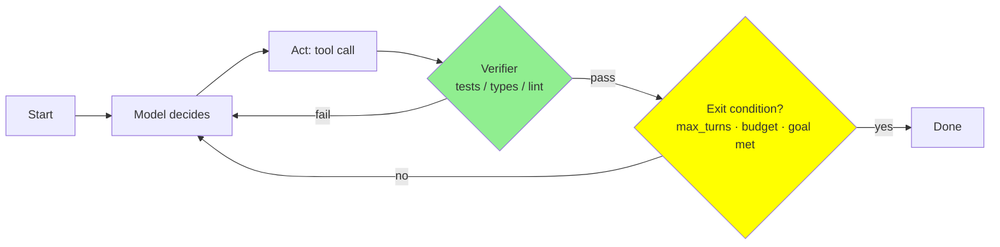
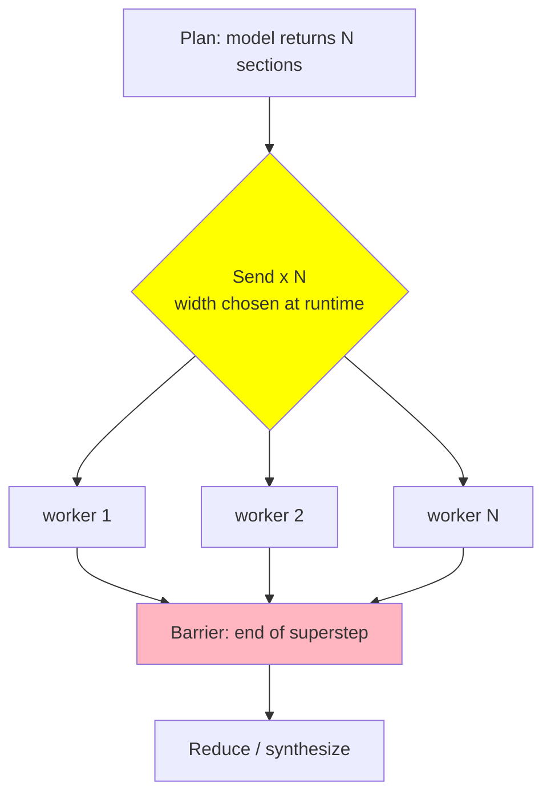

# Research Dossier — Module 13: Loop Engineering (Intermediate)

Researched 2026-08-25. Every URL cited below appears in the **Link Verification Log** (§13) with its fetch result.
Scope: the placeholder's three required topics — **Agent Teams**, **Dynamic Workflows**, **Rubric Evals** — plus the connective tissue that makes them one lesson: *the loop is the unit of engineering.*

Status: **COMPLETE.** No unfollowed critical leads. Known gaps are listed in §14.

---

## 1. Executive summary — 10 things the module author must not get wrong

1. **Anthropic's workflow/agent distinction is the module's spine, and it is a definition, not a vibe.** *Workflows* are "systems where LLMs and tools are orchestrated through **predefined code paths**"; *agents* are "systems where LLMs **dynamically direct their own processes** and tool usage, maintaining control over how they accomplish tasks" ([Building effective agents, Anthropic, 2024-12-19](https://www.anthropic.com/engineering/building-effective-agents)). Teach the five composition patterns (chaining, routing, parallelization, orchestrator–workers, evaluator–optimizer) as *workflows you write in code*, and the agent loop as the one thing you hand to the model.

2. **Start with one agent and more tools, not a team.** OpenAI's guidance is explicit: "Our general recommendation is to maximize a single agent's capabilities first. More agents can provide intuitive separation of concepts, but can introduce additional complexity and overhead, so often a single agent with tools is sufficient." Split only on *complex logic* (too many if-then-else branches) or *tool overload* — and note their nuance: "The issue isn't solely the number of tools, but their similarity or overlap. Some implementations successfully manage more than 15 well-defined, distinct tools while others struggle with fewer than 10 overlapping tools" ([A practical guide to building agents, OpenAI](https://cdn.openai.com/business-guides-and-resources/a-practical-guide-to-building-agents.pdf)).

3. **Every loop needs an explicit exit condition, and this is a design decision you own.** "Every orchestration approach needs the concept of a 'run', typically implemented as a loop that lets agents operate until an exit condition is reached. Common exit conditions include tool calls, a certain structured output, errors, or reaching a maximum number of turns" (OpenAI, ibid.). Anthropic says the same from the other side: include "stopping conditions (such as a maximum number of iterations) to maintain control" ([Anthropic, 2024-12-19](https://www.anthropic.com/engineering/building-effective-agents)). Frameworks give you the knob by name: `max_turns` → `MaxTurnsExceeded` ([OpenAI Agents SDK](https://openai.github.io/openai-agents-python/running_agents/)), `recursion_limit` → `GraphRecursionError` ([LangGraph](https://docs.langchain.com/oss/python/langgraph/graph-api)), `max_iterations` ([ADK LoopAgent](https://adk.dev/agents/workflow-agents/loop-agents/)), `maxTurns` on a Claude Code subagent ([Subagents](https://code.claude.com/docs/en/sub-agents)), and a whole algebra of them in AutoGen ([Termination](https://microsoft.github.io/autogen/stable/user-guide/agentchat-user-guide/tutorial/termination.html)).

4. **THE CENTRAL LESSON: intrinsic self-correction does not work; external verification does.** "LLMs struggle to self-correct their responses without external feedback, and at times, their performance even degrades after self-correction" ([Huang et al., LLMs Cannot Self-Correct Reasoning Yet, arXiv:2310.01798, ICLR 2024](https://arxiv.org/abs/2310.01798)). Reasoning models did not fix it: on RefineBench self-refinement, Gemini 2.5 Pro gained only **+1.8%** across iterations and DeepSeek-R1 **−0.1%**, while *guided* refinement reached near-perfect within five turns ([arXiv:2511.22173, 2025-11-27](https://arxiv.org/abs/2511.22173)). The survey conclusion: "self-correction works well in tasks that can use reliable external feedback," and "no prior work demonstrates successful self-correction with feedback from prompted LLMs" outside narrow tasks ([Kamoi et al., TACL 2024, arXiv:2406.01297](https://arxiv.org/abs/2406.01297)). **For code, your verifier already exists: tests, types, linters, CI.**

5. **Anthropic itself ranks verifiers in that order.** The Agent SDK post names three ways an agent checks its own work and puts them in order of robustness: (1) **defined rules / linters** — "The best form of feedback is providing clearly defined rules for an output, then explaining which rules failed and why"; (2) **visual feedback** (screenshots); (3) **LLM as judge** — "less robust" with "latency tradeoffs" ([Building agents with the Claude Agent SDK, 2025-09-29](https://claude.com/blog/building-agents-with-the-claude-agent-sdk)). The loop it teaches is **gather context → take action → verify work → repeat.**

6. **Multi-agent numbers, honestly.** Anthropic's research system "outperformed single-agent Claude Opus 4 by 90.2% on our internal research eval," and "token usage by itself explains 80% of the variance" in performance; "agents typically use about 4× more tokens than chat interactions" and "multi-agent systems use about 15× more tokens than chats" ([Anthropic, 2025-06-13](https://www.anthropic.com/engineering/multi-agent-research-system)). But the same post names the exclusion: "most coding tasks involve fewer truly parallelizable tasks than research, and LLM agents are not yet great at coordinating and delegating to other agents in real time."

7. **Present the counter-argument as a peer, not a footnote.** Cognition: "Share context, and share full agent traces, not just individual messages" and "Actions carry implicit decisions, and conflicting decisions carry bad results" — recommending a **single-threaded linear agent**, with a dedicated compression LLM when history gets long ([Don't Build Multi-Agents, 2025-06-12](https://cognition.com/blog/dont-build-multi-agents)). The two positions are reconcilable and the reconciliation *is* the teachable rule (§5).

8. **Dynamic workflows have a precise mechanism, and you should name it.** LangGraph's `Send` builds the fan-out at runtime: `return [Send("llm_call", {"section": s}) for s in state["sections"]]` — "dynamically create worker nodes and send them specific inputs" ([Workflows and agents](https://docs.langchain.com/oss/python/langgraph/workflows-agents)). Also teach the **barrier cost**: LangGraph runs parallel nodes in one *superstep* and "nodes that run in parallel are part of the same super-step" whose end is a synchronization point ([Graph API](https://docs.langchain.com/oss/python/langgraph/graph-api)). Anthropic paid for this in production: "Currently, our lead agents execute subagents synchronously, waiting for each set of subagents to complete before proceeding," which "creates bottlenecks in the information flow between agents" ([Anthropic, 2025-06-13](https://www.anthropic.com/engineering/multi-agent-research-system)).

9. **Rubric evals: binary beats Likert, and the judge must be calibrated against a human.** The strongest practitioner position: "If your evaluations consist of a bunch of metrics that LLMs score on a 1-5 scale (or any other scale), you're doing it wrong" — use a binary pass/fail plus a written critique, and iterate the judge prompt against a domain expert's labels until agreement converges, tracking **precision and recall separately** because "using raw agreement is generally not recommended and can be misleading when classes are imbalanced" ([Hamel Husain, 2024-10-29](https://hamel.dev/blog/posts/llm-judge/)). Anthropic's production compromise: "a single LLM call with a single prompt outputting scores from 0.0-1.0 **and a pass-fail grade** was the most consistent and aligned with human judgements" ([Anthropic, 2025-06-13](https://www.anthropic.com/engineering/multi-agent-research-system)).

10. **Judges are biased instruments and you must say so.** GPT-4-class judges reach "over 80% agreement" with human preference — the same level as human–human agreement — but the same paper names **position bias, verbosity bias, and self-enhancement bias** ([MT-Bench, arXiv:2306.05685, NeurIPS 2023](https://arxiv.org/abs/2306.05685)). Position bias is severe enough that "the quality ranking of candidate responses can be easily hacked by simply altering their order of appearance in the context"; mitigations are **multiple evidence calibration**, **balanced position calibration** (swap and average), and human-in-the-loop on high-entropy cases ([arXiv:2305.17926](https://arxiv.org/abs/2305.17926)). And on hard, objectively-checkable pairs, "many strong models (e.g., GPT-4o) perform[ed] just slightly better than random guessing" ([JudgeBench, ICLR 2025, arXiv:2410.12784](https://arxiv.org/abs/2410.12784)).

---

## 2. Canonical definitions & terminology (pin these down)

| Term | Definition to teach | Source |
|---|---|---|
| **Loop / run** | One agent execution: "a loop that lets agents operate until an exit condition is reached." Exit conditions: a final-output tool, a response with no tool calls, an error, or max turns. | [OpenAI practical guide](https://cdn.openai.com/business-guides-and-resources/a-practical-guide-to-building-agents.pdf); [Runner.run](https://openai.github.io/openai-agents-python/running_agents/) |
| **Workflow** | LLMs + tools "orchestrated through predefined code paths." *You* wrote the control flow. | [Anthropic 2024-12-19](https://www.anthropic.com/engineering/building-effective-agents) |
| **Agent** | LLM "dynamically direct[s] their own processes and tool usage, maintaining control over how they accomplish tasks." The *model* wrote the control flow. | ibid. |
| **Dynamic workflow** | A workflow whose *shape* (how many branches, which nodes) is decided at runtime by the model — e.g. `Send`-based fan-out over a model-generated plan. Distinguish from a static graph where the shape is fixed at authoring time. | [LangGraph workflows-and-agents](https://docs.langchain.com/oss/python/langgraph/workflows-agents) |
| **Orchestrator–worker** | "A central LLM dynamically breaks down tasks, delegates them to worker LLMs, and synthesizes their results." Anthropic's production research system is exactly this: "a lead agent coordinates the process while delegating to specialized subagents that operate in parallel." | [Anthropic 2024-12-19](https://www.anthropic.com/engineering/building-effective-agents); [Anthropic 2025-06-13](https://www.anthropic.com/engineering/multi-agent-research-system) |
| **Manager pattern (agents-as-tools)** | "A central 'manager' agent coordinates multiple specialized agents via tool calls." Edges = tool calls. Manager keeps control and user contact. | [OpenAI practical guide](https://cdn.openai.com/business-guides-and-resources/a-practical-guide-to-building-agents.pdf) |
| **Handoff** | "A one way transfer that allow[s] an agent to delegate to another agent… a handoff is a type of tool, or function. If an agent calls a handoff function, we immediately start execution on that new agent… while also transferring the latest conversation state." Edges = handoffs. Decentralized/peer topology. | ibid.; [Agents SDK handoffs](https://openai.github.io/openai-agents-python/handoffs/) |
| **Subagent** | A delegated agent with its **own context window** whose result returns to the caller. Cheaper because "results [are] summarized back to main context." | [Claude Code subagents](https://code.claude.com/docs/en/sub-agents); [Agent teams](https://code.claude.com/docs/en/agent-teams) |
| **Agent team / teammate** | Independent agent *sessions* with fully independent context, a **shared task list**, and a **mailbox** for direct peer messaging. Token cost "Higher: each teammate is a separate Claude instance." | [Agent teams](https://code.claude.com/docs/en/agent-teams) |
| **Superstep / barrier** | LangGraph's unit of graph progress: "Nodes that run in parallel are part of the same super-step, while nodes that run sequentially belong to separate super-steps." The end of a superstep is a barrier. | [Graph API](https://docs.langchain.com/oss/python/langgraph/graph-api) |
| **Eval dataset / example** | A dataset is "a collection of examples used for evaluating an application"; an example has inputs, optional reference outputs, optional metadata. | [LangSmith evaluation concepts](https://docs.langchain.com/langsmith/evaluation-concepts) |
| **Rubric** | The written criteria a judge applies. In tooling: promptfoo's `llm-rubric` `value:` string; DeepEval's `GEval(criteria=…, rubric=[Rubric(score_range=…, expected_outcome=…)])`. | [promptfoo llm-rubric](https://www.promptfoo.dev/docs/configuration/expected-outputs/model-graded/llm-rubric/); [DeepEval GEval](https://deepeval.com/docs/metrics-llm-evals) |
| **Judge (LLM-as-judge)** | An evaluator that scores output with a model; **reference-free** (works offline *and* online) vs **reference-based** (requires expected outputs, offline only). Also **pointwise** vs **pairwise**. | [LangSmith](https://docs.langchain.com/langsmith/evaluation-concepts) |
| **Trajectory eval** | Evaluating "whether the agent took the expected path (e.g., of tool calls)", as opposed to a **final-response** eval or a **single-step** eval. | [LangSmith evaluate-complex-agent](https://docs.langchain.com/langsmith/evaluate-complex-agent) |
| **Offline vs online eval** | Offline = datasets with reference outputs, pre-deployment, regression testing. Online = production runs/threads without references, reference-free scorers, monitoring. | [LangSmith](https://docs.langchain.com/langsmith/evaluation-concepts); [Langfuse](https://langfuse.com/docs/evaluation/overview) |

**Terminology warning for the author:** "subagent" means at least three different things in the field. Anthropic's Claude Code means *own-context delegate that returns a result*; LangChain's current docs call an agents-as-tools composition "Subagents" — "A main agent coordinates subagents as tools. All routing passes through the main agent" ([LangChain multi-agent](https://docs.langchain.com/oss/python/langchain/multi-agent)). Say which you mean.

---

## 3. Deep dive per required stub topic (+ what I would ADD)

### 3.0 ADD FIRST: the loop as the unit of engineering — the four knobs

This is the framing that turns three unrelated stub bullets into one module. Nothing in the placeholder says it, and without it the module is a listicle.

**A loop is defined by four choices:**

| Knob | The question | Concrete mechanism |
|---|---|---|
| **What ends it** | Termination / stopping criteria | `max_turns` → `MaxTurnsExceeded` ([OpenAI SDK](https://openai.github.io/openai-agents-python/running_agents/)); `recursion_limit` (default **1000** as of LangGraph 1.0.6) → `GraphRecursionError` ([LangGraph](https://docs.langchain.com/oss/python/langgraph/graph-api)); `max_iterations` + `tool_context.actions.escalate = True` ([ADK](https://adk.dev/agents/workflow-agents/loop-agents/)); `MaxMessageTermination`, `TokenUsageTermination`, `TimeoutTermination`, `FunctionCallTermination`, combinable with `|` and `&` ([AutoGen](https://microsoft.github.io/autogen/stable/user-guide/agentchat-user-guide/tutorial/termination.html)) |
| **What it can do per step** | Tool surface, permissions, parallel tool calls | Module 11 territory; here only the *loop* consequence — Anthropic got "research time [reduced] by up to 90%" from parallel tool calling ([2025-06-13](https://www.anthropic.com/engineering/multi-agent-research-system)) |
| **What it remembers** | Context carried across iterations | Module 9 territory; cross-reference rather than re-teach. The loop-specific point: subagent isolation is a *loop* design tool, and Anthropic's own compression lever is the distilled sub-agent report |
| **Who checks it** | The verifier | Linter/tests > visual > LLM judge ([Agent SDK, 2025-09-29](https://claude.com/blog/building-agents-with-the-claude-agent-sdk)) |

**Why loops fail — teach these three named failure modes:**
- **No exit condition.** The framework default saves you, badly: LangGraph's default is 1000 supersteps ([Graph API](https://docs.langchain.com/oss/python/langgraph/graph-api)) — that is a runaway bill, not a safety net.
- **No verifier (reward-less wandering).** The agent has no ground truth, so it cannot tell progress from motion. Anthropic's requirement is that agents "gain ground truth from the environment at each step (such as tool call results or code execution)" ([2024-12-19](https://www.anthropic.com/engineering/building-effective-agents)).
- **A judge instead of a verifier.** Self-critique loops without external signal *degrade* accuracy (§1.4). This is the single most valuable thing an intermediate developer can learn here.

**Budgets to teach as first-class:** step budget, token budget, wall-clock budget, dollar budget. Give students a real anchor: Claude Code's own docs report "around \$13 per developer per active day and \$150-250 per developer per month, with costs remaining below \$30 per active day for 90% of users," and agent teams "use approximately 7x more tokens than standard sessions when teammates run in plan mode" ([Manage costs](https://code.claude.com/docs/en/costs)).

**Convergence vs thrashing.** Two signals a run is thrashing rather than converging: repeated identical tool calls, and a verifier score that oscillates instead of monotonically improving. Ralph's field report names the concrete versions: "Non-deterministic ripgrep searches leading to duplicate implementations," "placeholder implementations requiring explicit prompting to enforce full builds," and quality collapse at ~147–152k tokens of context ([ghuntley.com/ralph, 2025-07-14](https://ghuntley.com/ralph/)).

### 3.1 Dynamic Workflows (stub topic)

**Static vs dynamic, stated crisply.** A static graph fixes the node set at authoring time. A dynamic workflow lets the model decide the shape. The mechanism to show is `Send`:

> "Send takes two arguments: first is the name of the node, and second is the state to pass to that node." — [LangGraph Graph API](https://docs.langchain.com/oss/python/langgraph/graph-api)

The orchestrator–worker version, verbatim from the docs, is the single best snippet in this module (§7.1).

**The framework-philosophy fight is worth one paragraph** because students will hit it. OpenAI's guide argues against declarative graphs: "Some frameworks are declarative, requiring developers to explicitly define every branch, loop, and conditional in the workflow upfront… this approach can quickly become cumbersome… often necessitating the learning of specialized domain-specific languages. In contrast, the Agents SDK adopts a more flexible, code-first approach" ([OpenAI practical guide](https://cdn.openai.com/business-guides-and-resources/a-practical-guide-to-building-agents.pdf)). CrewAI splits the difference with an event-driven decorator DSL: `@start()`, `@listen()`, `@router()`, `and_()`, `or_()` ([CrewAI Flows](https://docs.crewai.com/en/concepts/flows)). Google ADK gives you three explicit composite agents — `SequentialAgent`, `ParallelAgent`, `LoopAgent` ([ADK](https://adk.dev/agents/workflow-agents/loop-agents/)).

**Barriers vs pipelining — the wall-clock lesson.** In LangGraph, "If a node has multiple outgoing edges, **all** of those destination nodes will be executed in parallel as a part of the next superstep," and the superstep ends only when the parallel set is done. So a stage runs at the speed of its slowest branch. Anthropic hit exactly this and wrote it down as a limitation, not a feature: lead agents "execute subagents synchronously, waiting for each set of subagents to complete before proceeding," which "creates bottlenecks in the information flow between agents" and prevents mid-flight steering ([2025-06-13](https://www.anthropic.com/engineering/multi-agent-research-system)). **Teaching point:** a barrier between stages is a deliberate purchase of determinism and debuggability, paid for in wall-clock time. Buy it when you need reproducible stage boundaries; skip it when a worker's result can be consumed the moment it lands.

**Code-as-orchestration.** The end of the dynamic-workflow spectrum: the model writes the orchestration script instead of emitting a graph. The verified anchor here is Anthropic's advice to run evals as "simple agentic loops (`while`-loops wrapping alternating LLM API and tool calls)" ([Writing effective tools, 2025-09-11](https://www.anthropic.com/engineering/writing-tools-for-agents)) and Ralph's `while :; do cat PROMPT.md | claude-code ; done` ([ghuntley.com/ralph](https://ghuntley.com/ralph/)). Deeper CodeAct theory belongs to Module 16 (§10).

**Cost/latency/debuggability tradeoff table** → see §4.

### 3.2 Agent Teams (stub topic)

Teach four topologies and the state they share, because "team" hides the real variable — *how do they communicate?*

| Topology | Who decides next | Shared state | Primary source |
|---|---|---|---|
| **Manager / agents-as-tools** | Central manager, via tool calls | Manager's context only | [OpenAI guide](https://cdn.openai.com/business-guides-and-resources/a-practical-guide-to-building-agents.pdf); [LangChain "Subagents"](https://docs.langchain.com/oss/python/langchain/multi-agent) |
| **Orchestrator–workers (parallel fan-out, isolated contexts)** | Lead agent spawns 3–5 subagents in parallel | Distilled worker reports | [Anthropic 2025-06-13](https://www.anthropic.com/engineering/multi-agent-research-system) |
| **Handoff / swarm (peer)** | Whichever agent currently holds control | Conversation state transfers with the handoff | [Agents SDK handoffs](https://openai.github.io/openai-agents-python/handoffs/) |
| **Blackboard / shared task list + mailbox** | Teammates self-claim work | A shared task list plus per-agent inbox files | [Claude Code agent teams](https://code.claude.com/docs/en/agent-teams) |

**Claude Code agent teams are the most concrete, checkable example available — use it, with the caveats.** It is **experimental and off by default**: enable with `CLAUDE_CODE_EXPERIMENTAL_AGENT_TEAMS=1`. Architecture: **team lead**, **teammates**, **task list**, **mailbox** (a JSON file per agent at `~/.claude/teams/{team-name}/inboxes/{agent-name}.json`). Tasks have three states (pending / in progress / completed) and can declare dependencies; "Task claiming uses file locking to prevent race conditions." Quality gates are hooks: `TeammateIdle`, `TaskCreated`, `TaskCompleted` — "Exit with code 2 to send feedback and keep the teammate working." Practical sizing from the docs: "Start with 3-5 teammates for most workflows… If you have 15 independent tasks, 3 teammates is a good starting point. …Three focused teammates often outperform five scattered ones." And "Avoid file conflicts: Two teammates editing the same file leads to overwrites." ([Agent teams](https://code.claude.com/docs/en/agent-teams)).

Contrast with subagents in one table row: subagent context "Own context window; results return to the caller," token cost "Lower: results summarized back to main context"; teammate context "Own context window; fully independent," token cost "Higher: each teammate is a separate Claude instance" (ibid.). Concurrency limit for Agent-tool subagents: default **20** (`CLAUDE_CODE_MAX_CONCURRENT_SUBAGENTS`), nesting depth default **3** (`CLAUDE_CODE_MAX_SUBAGENT_SPAWN_DEPTH`) ([Subagents](https://code.claude.com/docs/en/sub-agents)).

**Where parallelism pays.** Anthropic: parallelism suits "heavy parallelization, information that exceeds single context windows, and interfacing with numerous complex tools," using "(1) the lead agent spins up 3-5 subagents in parallel rather than serially; (2) the subagents use 3+ tools in parallel" — worth "up to 90%" of research time ([2025-06-13](https://www.anthropic.com/engineering/multi-agent-research-system)). Claude Code's docs converge on the same four use cases for teams: research and review, new modules/features, debugging with competing hypotheses, cross-layer coordination ([Agent teams](https://code.claude.com/docs/en/agent-teams)).

**Where it does not.** Anthropic: "Some domains that require all agents to share the same context or involve many dependencies between agents are not a good fit… most coding tasks involve fewer truly parallelizable tasks than research, and LLM agents are not yet great at coordinating and delegating to other agents in real time" (ibid.). Claude Code: "For sequential tasks, same-file edits, or work with many dependencies, a single session or subagents are more effective" ([Agent teams](https://code.claude.com/docs/en/agent-teams)).

**One more Anthropic warning worth quoting** because it explains why teams are hard to debug: "Multi-agent systems have emergent behaviors, which arise without specific programming. For instance, small changes to the lead agent can unpredictably change how subagents behave" ([2025-06-13](https://www.anthropic.com/engineering/multi-agent-research-system)).

**Do not re-teach subagent context isolation from scratch.** Module 9's dossier already covers the 6,100 → 420 token exchange rate and what a subagent does *not* inherit. Module 13 should say one sentence and link: *"Module 9 taught you that a subagent is a context-isolation device; here we care about the coordination it makes possible and the wall-clock and dollar cost it buys."*

### 3.3 Verification & self-improvement loops (ADD — the module's moral centre)

Order the verifier options from strongest to weakest and justify the order with evidence:

1. **Deterministic verifier: compiler, type checker, linter, test suite, CI.** Anthropic: "The best form of feedback is providing clearly defined rules for an output, then explaining which rules failed and why" — and they note choosing TypeScript over JavaScript specifically to gain a feedback layer ([Agent SDK, 2025-09-29](https://claude.com/blog/building-agents-with-the-claude-agent-sdk)). This is also how the benchmarks that matter score agents: SWE-bench validates patches by running the repo's own unit tests ([SWE-bench, ICLR 2024, arXiv:2310.06770](https://arxiv.org/abs/2310.06770)); τ-bench compares "final database states to annotated goals" ([arXiv:2406.12045](https://arxiv.org/abs/2406.12045)).
2. **Visual/observational feedback** (screenshots, renders) for UI work (Anthropic, ibid.).
3. **Evaluator–optimizer with an LLM critic** — "particularly effective when clear evaluation criteria exist and iterative refinement provides measurable value" ([Anthropic, 2024-12-19](https://www.anthropic.com/engineering/building-effective-agents)). Note the precondition in that sentence.
4. **Intrinsic self-critique with no external signal** — **do not ship this.** (§1.4.)

**Reflexion is the honest historical reference and also a lesson in reading claims.** Reflexion reports 91% pass@1 on HumanEval, "surpass[ing] the previous state-of-the-art GPT-4 that achieves 80%" ([arXiv:2303.11366](https://arxiv.org/abs/2303.11366)) — and it works because it reflects on *task feedback signals* (test results), i.e. external feedback, not on its own opinion. Pair it with Huang et al. so students learn the distinction rather than the vibe.

**Adversarial verification is the one place a team genuinely beats a loop.** Claude Code's documented recipe: "Spawn 5 agent teammates to investigate different hypotheses. Have them talk to each other to try to disprove each other's theories, like a scientific debate," with the stated rationale that "Sequential investigation suffers from anchoring: once one theory is explored, subsequent investigation is biased toward it" ([Agent teams](https://code.claude.com/docs/en/agent-teams)).

**Loop-until-dry for discovery.** The pattern: run the same prompt repeatedly until the agent stops finding new work, with a deterministic backstop each iteration. Ralph is the canonical write-up — "One thing per loop," "Heavy reliance on back-pressure mechanisms (tests, type checkers, static analysis) to validate output" — and it names its own failure modes ([ghuntley.com/ralph, 2025-07-14](https://ghuntley.com/ralph/)). Present it as a *technique with a cost and a blast radius*, not an endorsement.

### 3.4 Rubric Evals (stub topic — treat as the least-documented and go deepest)

**(a) Why evals at all.** Because you cannot tune what you cannot measure, and because the alternative is vibes. OpenAI's model-selection procedure is literally eval-first: "Set up evals to establish a performance baseline," then "Optimize for cost and latency by replacing larger models with smaller ones where possible" ([OpenAI practical guide](https://cdn.openai.com/business-guides-and-resources/a-practical-guide-to-building-agents.pdf)).

**(b) The dataset.** Anthropic's three design principles, verbatim: **be task-specific** ("Design evals that mirror your real-world task distribution. Don't forget to factor in edge cases"), **automate when possible**, and **prioritize volume over quality** — "More questions with slightly lower signal automated grading is better than fewer questions with high-quality human hand-graded evals" ([Define success criteria and build evaluations](https://platform.claude.com/docs/en/test-and-evaluate/develop-tests)). Their named edge cases: irrelevant/nonexistent input, overly long input, harmful input, and "ambiguous test cases where even humans would find it hard to reach an assessment consensus."

Start small and real: Anthropic's research team "started with a set of about 20 queries representing real usage patterns" ([2025-06-13](https://www.anthropic.com/engineering/multi-agent-research-system)). Teach the golden-set discipline: **every production failure becomes a dataset example**.

**(c) Rubric design — binary checklist vs 1-5 Likert.** Present both and take a side.
- The practitioner case for binary: "A binary decision forces everyone to consider what truly matters"; 1-5 scales are "not actionable" and often fail to correlate with what matters ([Hamel Husain, 2024-10-29](https://hamel.dev/blog/posts/llm-judge/)).
- The vendor middle path: score **plus** grade in one call was most human-aligned in Anthropic's production system ([2025-06-13](https://www.anthropic.com/engineering/multi-agent-research-system)).
- Anchored bands, if you must use a scale: DeepEval's `Rubric(score_range=(0,2), expected_outcome="Factually incorrect.")` … `Rubric(score_range=(10,10), expected_outcome="100% correct.")`, with the constraint that ranges "must not overlap" and span 0–10 ([DeepEval GEval](https://deepeval.com/docs/metrics-llm-evals)).
- Research support for checklists as a *signal*: RLCF extracts "instruction-specific checklists" and was "the only method to improve performance on every benchmark" (+4 FollowBench hard satisfaction rate, +6 InFoBench, +3 Arena-Hard win rate) ([arXiv:2507.18624, 2025-07-24](https://arxiv.org/abs/2507.18624)); RefineBench is built on "checklist-based evaluation" of 1,000 hard problems ([arXiv:2511.22173](https://arxiv.org/abs/2511.22173)). *Note for honesty:* these support checklists as a decomposition that produces better signal; neither is a head-to-head "binary vs Likert judge reliability" study. Flag that gap (§14).
- Anthropic's own docs still ship a **Likert** example (`Rate this customer service response on a scale of 1-5…`) alongside binary and ordinal examples ([develop-tests](https://platform.claude.com/docs/en/test-and-evaluate/develop-tests)) — so "the vendor says Likert" is a fair student objection; answer it with the actionability argument, not by pretending consensus exists.

**(d) Judge mechanics.**
- **Reference-free vs reference-based**: reference-free scorers "work in both offline and online settings"; reference-based ones "only function during pre-deployment testing" ([LangSmith](https://docs.langchain.com/langsmith/evaluation-concepts)). This is *why* you can run some rubrics in production and not others.
- **Pointwise vs pairwise**: pairwise "compares two application versions" (ibid.) and is the right tool for "is the new prompt better," not for "does this PR meet the bar."
- **Critique before verdict**: G-Eval's mechanism is chain-of-thought plus form-filling, reaching "a Spearman correlation of 0.514 with human on summarization task, outperforming all previous methods by a large margin" ([arXiv:2303.16634](https://arxiv.org/abs/2303.16634)). Hamel makes the same point operationally: write the critique, then use critiques as few-shot examples for the judge ([hamel.dev](https://hamel.dev/blog/posts/llm-judge/)).
- **Judge-model choice**: "Generally best practice to use a different model to evaluate than the model used to generate the evaluated output" ([Anthropic develop-tests](https://platform.claude.com/docs/en/test-and-evaluate/develop-tests)) — which is also the mitigation for self-enhancement bias.
- **Biases and mitigations**: position, verbosity, self-enhancement ([MT-Bench](https://arxiv.org/abs/2306.05685)); mitigate position bias with balanced position calibration (score both orders and aggregate) and multiple evidence calibration ([arXiv:2305.17926](https://arxiv.org/abs/2305.17926)).
- **Calibration against humans**: iterate the judge prompt against a Principal Domain Expert's labels until agreement converges — Hamel reports ">90% agreement in the Honeycomb example within three iterations" — and report **precision and recall separately** ([hamel.dev](https://hamel.dev/blog/posts/llm-judge/)).
- **Know the ceiling**: on hard, objectively-verifiable pairs, strong judges land near chance ([JudgeBench](https://arxiv.org/abs/2410.12784)). Therefore: *never* use a judge where a deterministic check exists.

**(e) Trajectory / process evals vs final-outcome evals — the agent-specific part.** Three eval altitudes ([LangSmith evaluate-complex-agent](https://docs.langchain.com/langsmith/evaluate-complex-agent)):
1. **Final response** — did the run produce the right answer?
2. **Trajectory** — "whether the agent took the expected path (e.g., of tool calls)"; the docs' `trajectory_subsequence` scorer computes what fraction of the desired steps were taken.
3. **Single step** — did the router pick the right route? Test one decision in isolation.

Ready-made implementations exist so students don't hand-roll: `create_llm_as_judge`, `create_code_llm_as_judge`, `create_trajectory_match_evaluator` (with `trajectory_match_mode` of `"strict"` / `"unordered"` / `"subset"` / `"superset"`), `create_trajectory_llm_as_judge`, and prompt constants `CORRECTNESS_PROMPT`, `TRAJECTORY_ACCURACY_PROMPT`, `TRAJECTORY_ACCURACY_PROMPT_WITH_REFERENCE`, `CODE_CORRECTNESS_PROMPT` ([openevals README](https://raw.githubusercontent.com/langchain-ai/openevals/main/README.md)).

**Efficiency and cost are eval metrics, not afterthoughts.** Anthropic's rubric included "tool efficiency (did it use the right tools a reasonable number of times?)" alongside factual accuracy, citation accuracy, completeness and source quality ([2025-06-13](https://www.anthropic.com/engineering/multi-agent-research-system)). Their tools guide is more explicit: "As well as top-level accuracy, we recommend collecting other metrics like the total runtime of individual tool calls and tasks, the total number of tool calls, the total token consumption, and tool errors" ([Writing effective tools, 2025-09-11](https://www.anthropic.com/engineering/writing-tools-for-agents)).

**Reliability, not just accuracy.** τ-bench's `pass^k` measures consistency across independent trials, and the headline is sobering: "even state-of-the-art function calling agents (like gpt-4o) succeed on <50% of the tasks, and are quite inconsistent (pass^8 <25% in retail)" ([arXiv:2406.12045](https://arxiv.org/abs/2406.12045)). For a nondeterministic agent, **run each eval example k times and report pass^k**, not a single sample.

**(f) Online vs offline, and CI.** Offline = dataset + reference outputs, gate the merge. Online = reference-free scorers on live traces, catch drift. Langfuse states the pairing directly: evaluation runs "both **online**, on live production traces, and **offline**, before you ship a change," with "CI/CD integration to block deploys on regressions" ([Langfuse](https://langfuse.com/docs/evaluation/overview)).

**(g) Human review never goes away.** "People testing agents find edge cases that evals miss… Human testers noticed that our early agents consistently chose SEO-optimized content farms over authoritative but less highly-ranked sources" ([Anthropic, 2025-06-13](https://www.anthropic.com/engineering/multi-agent-research-system)).

### 3.5 Observability as a prerequisite (ADD, keep short)

You cannot eval a trajectory you cannot see. Teach: one trace per run, one span per step, token/cost attributed per agent.

- **Vendor-neutral schema:** OpenTelemetry GenAI conventions define `gen_ai.operation.name` with well-known values including `chat`, `create_agent`, `invoke_agent`, `execute_tool`, `invoke_workflow`, plus `gen_ai.agent.id`, `gen_ai.agent.name`, `gen_ai.tool.name`, `gen_ai.usage.input_tokens`, `gen_ai.usage.output_tokens`. **Caveat to state:** these have **moved out of** the main semantic-conventions repo into a dedicated [GenAI semantic conventions repository](https://github.com/open-telemetry/semantic-conventions-genai); the entries on the main registry page are now marked *Deprecated — moved*, and the values carry **Development** stability ([OTel gen-ai registry](https://opentelemetry.io/docs/specs/semconv/registry/attributes/gen-ai/); [OTel gen-ai index](https://opentelemetry.io/docs/specs/semconv/gen-ai/)). Do **not** present these attribute names as stable.
- **Platforms** to name once each: LangSmith (datasets/experiments/evaluators, [concepts](https://docs.langchain.com/langsmith/evaluation-concepts)), Langfuse (online+offline, annotation queues, CI gating, [overview](https://langfuse.com/docs/evaluation/overview)), Braintrust (`Eval(project, {data, task, scores})` with `autoevals` scorers, [run-in-code](https://www.braintrust.dev/docs/evaluate/run-in-code)), promptfoo (`llm-rubric` in YAML, [docs](https://www.promptfoo.dev/docs/configuration/expected-outputs/model-graded/llm-rubric/)), DeepEval (`GEval` + `Rubric`, [docs](https://deepeval.com/docs/metrics-llm-evals)), OpenAI Evals API (evals + data source config + testing criteria/graders, [guide](https://developers.openai.com/api/docs/guides/evals)).
- **Cost attribution for your own team:** `/usage` attributes recent usage "to skills, subagents, plugins, and individual MCP servers," and OTel export "is the only option that streams per-user token and cost metrics into your own observability stack in near real time" ([Manage costs](https://code.claude.com/docs/en/costs)).

---

## 4. Pattern catalog

| Pattern | Shape | When to use | When it backfires | Cost profile |
|---|---|---|---|---|
| **Single agent + more tools** | one loop, N tools | Default. Until prompts get branchy or tools overlap | >10 *overlapping* tools; instructions the model stops following | 1× baseline; ~4× a chat turn for agentic work ([Anthropic](https://www.anthropic.com/engineering/multi-agent-research-system)) |
| **Prompt chaining** | fixed A→B→C | "task can be easily decomposed into fixed subtasks, trading latency for higher accuracy" ([Anthropic](https://www.anthropic.com/engineering/building-effective-agents)) | Subtasks aren't actually fixed; each hop compounds error | Predictable; latency = sum of steps |
| **Routing** | classify → specialist | "complex tasks with distinct categories… where classification can be handled accurately" (ibid.) | Misclassification is silent and unrecoverable | Cheap (one small classifier + one path) |
| **Parallelization — sectioning** | split → N workers → join | "divided subtasks can be parallelized for speed" (ibid.) | Sections share hidden state; join step becomes the bottleneck | N× tokens, ~1× wall-clock of the slowest branch |
| **Parallelization — voting** | same task ×N → aggregate | "multiple perspectives increase confidence" (ibid.) | You pay N× for confidence you can't cash in | N× tokens; latency of one call |
| **Orchestrator–workers** | lead plans → dynamic workers → synthesize | "subtasks cannot be predicted in advance and must be determined dynamically" (ibid.); Anthropic's research system | Coding tasks with dependencies; shared-context tasks | Highest: ~15× a chat ([Anthropic](https://www.anthropic.com/engineering/multi-agent-research-system)) |
| **Evaluator–optimizer** | generate ⇄ critique | "clear evaluation criteria exist and iterative refinement provides measurable value" (ibid.) | No external signal → degradation ([arXiv:2310.01798](https://arxiv.org/abs/2310.01798)) | 2× per iteration; unbounded without a step cap |
| **Generate-and-test (deterministic verifier)** | write → run tests → fix | **Any code task.** Verifier already exists | Flaky tests teach the agent nothing | 1–3 extra loops; cheapest quality-per-dollar |
| **Handoff / swarm** | peer → peer, control transfers | "when you don't need a single agent maintaining central control or synthesis" ([OpenAI](https://cdn.openai.com/business-guides-and-resources/a-practical-guide-to-building-agents.pdf)) | Nobody owns the final synthesis; loops between peers | Moderate; state travels with the handoff |
| **Agent team (shared task list + mailbox)** | peers claim tasks, message each other | Research, review, competing hypotheses, cross-layer work ([Agent teams](https://code.claude.com/docs/en/agent-teams)) | Sequential work, same-file edits, dependency-heavy work | ~7× tokens in plan mode ([costs](https://code.claude.com/docs/en/costs)) |
| **Dynamic fan-out (`Send` / map-reduce)** | plan → runtime-sized fan-out → reduce | Work items are only known after the model plans | Unbounded fan-out = unbounded bill; hard to reproduce | Proportional to the plan the model wrote — cap it |
| **Loop-until-dry** | `while :; do agent; done` + gates | Bulk mechanical discovery with a strong verifier ([ralph](https://ghuntley.com/ralph/)) | No verifier; long-context degradation; duplicate work | Unbounded by construction — you must bound it |
| **Plain deterministic code** | no LLM in the control path | Whenever the rule is expressible. "a deterministic solution may suffice" ([OpenAI](https://cdn.openai.com/business-guides-and-resources/a-practical-guide-to-building-agents.pdf)) | Nuanced judgment, unstructured input, unmaintainable rulesets | Free and correct |

---

## 5. The multi-agent debate — pro vs con, and a decision rule

**PRO (Anthropic, 2025-06-13).** [How we built our multi-agent research system](https://www.anthropic.com/engineering/multi-agent-research-system):
- Multi-agent (Opus 4 lead + Sonnet 4 subagents) "outperformed single-agent Claude Opus 4 by **90.2%** on our internal research eval."
- Mechanism: "an orchestrator-worker pattern, where a lead agent coordinates the process while delegating to specialized subagents that operate in parallel."
- Why it works: on BrowseComp "three factors explained 95% of the performance variance" and "token usage by itself explains 80% of the variance" — more agents means more tokens spent on the problem, in parallel, without one context window filling up.
- Where it fits: "heavy parallelization, information that exceeds single context windows, and interfacing with numerous complex tools."
- The bill: "multi-agent systems use about 15× more tokens than chats." *They* say the economics only work "for tasks where the value of the task is high enough to pay for the increased performance."

**CON (Cognition, 2025-06-12).** [Don't Build Multi-Agents](https://cognition.com/blog/dont-build-multi-agents):
- Principle 1: "Share context, and share full agent traces, not just individual messages."
- Principle 2: "Actions carry implicit decisions, and conflicting decisions carry bad results."
- Consequence for parallel subagents: they can't see each other's reasoning, so "their work ends up being inconsistent with each other."
- Prescription: a **single-threaded linear agent**, and when history overflows, "an additional LLM specifically designed to compress a history of actions & conversation into key details, events, and decisions."

**They are not actually in contradiction.** Anthropic's own post concedes Cognition's domain: coding tasks "involve fewer truly parallelizable tasks than research," and shared-context / high-dependency domains "are not a good fit for multi-agent systems today." Cognition's critique lands hardest exactly where dependencies are dense — which is *implementation*. Anthropic's win lands where work is read-only, independent, and context-hungry — which is *research and review*.

**The practical decision rule to put in the module (4 questions, all must be yes):**

1. **Is the work decomposable into parts that don't need to see each other's reasoning?** (No → single agent.)
2. **Is it mostly read/analyze rather than write to shared files?** (No → single agent, or one writer with reviewer subagents.)
3. **Does the context genuinely exceed one window, or does parallelism buy real wall-clock?** (No → single agent.)
4. **Is the task worth ~7–15× the tokens?** (No → single agent.)

Corollary the module should state plainly: **for implementation, prefer one agent that writes and a fan-out of reviewers that only read.** That gets Anthropic's parallelism win on the review side and Cognition's coherence win on the write side.

---

## 6. Rubric eval cookbook — a full worked example

Task: **"Is this agent-authored PR mergeable?"** Build it in five parts.

### 6.1 The dataset (offline, golden set)

Start with ~20 real cases, not synthetic ones ([Anthropic started with "about 20 queries representing real usage patterns"](https://www.anthropic.com/engineering/multi-agent-research-system)). One JSONL row per historical agent PR:

```jsonl
{"pr": 4412, "diff_path": "fixtures/4412.diff", "issue": "flaky retry on 429", "label": "merge", "critique": "Adds a bounded backoff and a regression test that fails without the fix."}
{"pr": 4418, "diff_path": "fixtures/4418.diff", "issue": "add pagination", "label": "reject", "critique": "Touches 14 files; renames a public symbol not mentioned in the issue; no test for page boundaries."}
```

`label` is **binary** and `critique` is mandatory — the critique is both the human's reasoning and later a few-shot example for the judge ([hamel.dev](https://hamel.dev/blog/posts/llm-judge/)). Grow the set by adding **every production failure** as a new row. Include Anthropic's edge-case classes: empty diff, enormous diff, and genuinely ambiguous cases ([develop-tests](https://platform.claude.com/docs/en/test-and-evaluate/develop-tests)).

### 6.2 Deterministic gates FIRST (no judge involved)

These are not rubric items. They are preconditions, and they are free:

| Gate | Check | On failure |
|---|---|---|
| Builds | `npm run build` / `cargo build` | reject, no judge call |
| Types | `tsc --noEmit` / `mypy` | reject |
| Tests | full suite green | reject |
| New test exists | diff touches `**/*.test.*` or `tests/` | reject |
| Coverage on changed lines | ≥ project threshold | reject |
| Scope | files changed ≤ N; no unrelated dirs | reject |
| Lint/format | `eslint`, `ruff`, formatter clean | reject |

Only PRs that pass all gates reach the judge. This is the direct application of "the best form of feedback is providing clearly defined rules for an output" ([Agent SDK](https://claude.com/blog/building-agents-with-the-claude-agent-sdk)) and of JudgeBench's warning that judges are near-chance on hard objective calls ([arXiv:2410.12784](https://arxiv.org/abs/2410.12784)).

### 6.3 The rubric — a binary checklist for what tests cannot see

Seven items. Each is independently pass/fail; the PR is `merge` only if **all** are pass. (Checklist decomposition is the shape with research support: [RLCF, arXiv:2507.18624](https://arxiv.org/abs/2507.18624), [RefineBench, arXiv:2511.22173](https://arxiv.org/abs/2511.22173).)

| # | Item | Pass means |
|---|---|---|
| R1 | **Addresses the stated issue** | Every acceptance criterion in the issue is visibly satisfied by the diff |
| R2 | **No unrequested scope** | No renames, reformats, dependency bumps or refactors the issue didn't ask for |
| R3 | **Test proves the fix** | At least one new/changed test fails on the pre-change code and passes after |
| R4 | **Failure paths handled** | Errors surface with actionable messages; no silent `catch {}`; no swallowed nulls |
| R5 | **Follows local convention** | Matches surrounding patterns and CLAUDE.md/CONTRIBUTING rules, not generic style |
| R6 | **No new security surface** | No new secret handling, shell interpolation, deserialization, or permissive CORS/SQL string building |
| R7 | **Reviewable** | A human can review it in ≤15 minutes: coherent commits, comments only where non-obvious |

### 6.4 The judge prompt

Design choices, each with a cited reason: **critique before verdict** ([G-Eval](https://arxiv.org/abs/2303.16634)); **binary per item** ([hamel.dev](https://hamel.dev/blog/posts/llm-judge/)); **score + grade in one call** ([Anthropic](https://www.anthropic.com/engineering/multi-agent-research-system)); **judge model ≠ author model** ([Anthropic develop-tests](https://platform.claude.com/docs/en/test-and-evaluate/develop-tests)).

```text
You are reviewing a pull request written by an AI agent. All build, type,
lint and test gates have already PASSED — do not re-check them.

<issue>{{issue}}</issue>
<diff>{{diff}}</diff>
<conventions>{{claude_md_excerpt}}</conventions>

Evaluate exactly these seven criteria. For each: write one sentence of
evidence citing a file and line from the diff, THEN output pass or fail.
Judge only what the diff shows. Absence of evidence is a fail, not a pass.

R1 addresses_issue     — every acceptance criterion in the issue is satisfied
R2 no_unrequested_scope— no renames/reformats/dep bumps the issue didn't ask for
R3 test_proves_fix     — a new/changed test would fail without this change
R4 failure_paths       — errors are surfaced, not swallowed
R5 local_convention    — matches surrounding code and <conventions>
R6 no_new_security_surface
R7 reviewable_in_15_min

Then output JSON only:
{"items":{"R1":{"evidence":"...","verdict":"pass|fail"}, ...},
 "score": <fraction of items passed, 0.0-1.0>,
 "grade": "merge|reject",
 "blocking": ["R3", ...]}

grade is "merge" only if every item is pass.
```

Bias hygiene to teach alongside it: if you ever compare two candidate patches, **score both orderings and aggregate** (balanced position calibration, [arXiv:2305.17926](https://arxiv.org/abs/2305.17926)); expect verbosity bias, so R7 explicitly rewards small diffs; use a different model family than the author to blunt self-enhancement ([MT-Bench](https://arxiv.org/abs/2306.05685)).

### 6.5 Calibrate the judge before you trust it

1. Run the judge over the ~20 labelled rows.
2. Build the 2×2 against the human `label`. Report **precision and recall separately** — "using raw agreement is generally not recommended and can be misleading when classes are imbalanced" ([hamel.dev](https://hamel.dev/blog/posts/llm-judge/)).
3. Read every disagreement. Either the rubric wording is ambiguous (fix the rubric) or the judge missed evidence (add a human critique as a few-shot example).
4. Iterate until convergence — Hamel reports >90% agreement within three iterations.
5. **Ship the judge only when it is measurably calibrated.** An uncalibrated judge is a random number generator with a nice API.
6. Re-calibrate whenever you change the judge model. Judge upgrades are silent metric changes.

### 6.6 CI wiring

Two loops, different jobs:

**Per-PR gate** (blocking): deterministic gates → judge → post the per-item verdicts as a review comment → require `grade == "merge"` plus a human approval. Never let the judge be the only approver.

**Nightly regression eval of your own agent workflows** (this is the SDLC angle the module must land): re-run the golden set against the current prompts/tools/model, and fail the build on a **drop** rather than an absolute threshold. Track four numbers per run — pass rate, mean tool calls, mean tokens, mean wall-clock — because Anthropic recommends collecting "the total runtime of individual tool calls and tasks, the total number of tool calls, the total token consumption, and tool errors" ([Writing effective tools](https://www.anthropic.com/engineering/writing-tools-for-agents)). Run each example **k times and report pass^k**, since single-sample scores hide inconsistency ([τ-bench](https://arxiv.org/abs/2406.12045)). Langfuse documents exactly this deploy-gating shape ([overview](https://langfuse.com/docs/evaluation/overview)).

---

## 7. Concrete code snippets (short, verified against the cited docs)

> Version note: LangGraph/LangChain snippets follow **docs.langchain.com OSS Python docs as of 2026-08-25** (recursion-limit default 1000 "starting in version 1.0.6"). OpenAI Agents SDK snippets follow **openai.github.io/openai-agents-python** as of the same date. AutoGen = `autogen-agentchat` stable docs. Claude Code features cite **v2.1.x** and agent teams are **experimental**.

### 7.1 Dynamic fan-out — orchestrator–workers with `Send` (LangGraph)

Verbatim structure from [workflows-and-agents](https://docs.langchain.com/oss/python/langgraph/workflows-agents):

```python
from langgraph.types import Send
from typing import Annotated
import operator

class State(TypedDict):
    topic: str
    sections: list[Section]
    completed_sections: Annotated[list, operator.add]   # reducer = the "reduce" half
    final_report: str

class WorkerState(TypedDict):
    section: Section
    completed_sections: Annotated[list, operator.add]

def assign_workers(state: State):
    """Assign a worker to each section in the plan"""
    return [Send("llm_call", {"section": s}) for s in state["sections"]]
```

Teaching notes: the fan-out width is `len(state["sections"])`, which the *model* produced — cap it in code. The `Annotated[list, operator.add]` reducer is the join. All those `llm_call` nodes run in one superstep, so the stage finishes at the speed of the slowest section ([Graph API](https://docs.langchain.com/oss/python/langgraph/graph-api)).

### 7.2 Bounding the loop (LangGraph)

```python
from langgraph.errors import GraphRecursionError

graph.invoke(inputs, config={"recursion_limit": 5})
# Default is 1000 steps starting in version 1.0.6; exceeding it raises GraphRecursionError.
```
Source: [Graph API](https://docs.langchain.com/oss/python/langgraph/graph-api).

### 7.3 Handoffs — decentralized team (OpenAI Agents SDK)

```python
from agents import Agent, handoff
from agents.extensions.handoff_prompt import RECOMMENDED_PROMPT_PREFIX
from agents.extensions import handoff_filters

triage = Agent(
    name="Triage agent",
    instructions=f"{RECOMMENDED_PROMPT_PREFIX}\nRoute the user to the right specialist.",
    handoffs=[billing_agent, handoff(refund_agent, input_filter=handoff_filters.remove_all_tools)],
)
```
`handoff()` parameters available: `tool_name_override` (default `transfer_to_<agent_name>`), `tool_description_override`, `on_handoff`, `input_type`, `input_filter`, `is_enabled`. Source: [Handoffs](https://openai.github.io/openai-agents-python/handoffs/).

### 7.4 Bounding the loop (OpenAI Agents SDK)

```python
from agents import Agent, Runner
result = await Runner.run(agent, input="...", max_turns=12)   # raises MaxTurnsExceeded
# Exit conditions: final output of the desired type with no tool calls; a handoff swaps
# the current agent and repeats; tool calls append results and repeat.
# max_turns=None disables the limit.
```
Source: [Running agents](https://openai.github.io/openai-agents-python/running_agents/).

### 7.5 Termination algebra (AutoGen AgentChat)

```python
from autogen_agentchat.conditions import (
    MaxMessageTermination, TextMentionTermination, TokenUsageTermination, TimeoutTermination,
)

stop = MaxMessageTermination(20) | TextMentionTermination("APPROVE") | TimeoutTermination(600)
```
All eleven built-ins and the `|` / `&` composition are documented at [Termination](https://microsoft.github.io/autogen/stable/user-guide/agentchat-user-guide/tutorial/termination.html). Magentic-One's orchestrator layers a **task ledger** (outer loop, replans when progress stalls) over a **progress ledger** (inner loop, self-reflection per step) — a good named example of "who checks it" being a loop of its own ([Magentic-One](https://microsoft.github.io/autogen/stable/user-guide/agentchat-user-guide/magentic-one.html)).

### 7.6 A bounded refinement loop (Google ADK)

```python
from google.adk.agents import LoopAgent
# sub_agents run in order each iteration; max_iterations caps the loop.
# A sub-agent signals early exit from inside a tool:
tool_context.actions.escalate = True
```
Source: [LoopAgent](https://adk.dev/agents/workflow-agents/loop-agents/). Note ADK's honest framing: "The LoopAgent doesn't inherently decide when to stop looping" — you supply the exit.

### 7.7 A rubric assertion you can run in CI (promptfoo)

```yaml
defaultTest:
  assert:
    - type: llm-rubric
      value: >
        The diff addresses every acceptance criterion in the issue, adds a test that
        would fail without the change, and introduces no unrequested renames or refactors.
      threshold: 0.8
      provider:
        id: openai:gpt-5-mini
        config:
          temperature: 0
```
Grader output shape is `{"reason": "...", "score": 0.5, "pass": true}`; with `threshold` set, both `pass === true` **and** `score >= threshold` must hold. Source: [llm-rubric](https://www.promptfoo.dev/docs/configuration/expected-outputs/model-graded/llm-rubric/).

### 7.8 An anchored-band rubric (DeepEval)

```python
from deepeval.metrics.g_eval import Rubric
from deepeval.metrics import GEval
from deepeval.test_case import SingleTurnParams

correctness_metric = GEval(
    name="Correctness",
    criteria="Determine whether the actual output is factually correct based on the expected output.",
    evaluation_params=[SingleTurnParams.ACTUAL_OUTPUT, SingleTurnParams.EXPECTED_OUTPUT],
    rubric=[
        Rubric(score_range=(0,2),  expected_outcome="Factually incorrect."),
        Rubric(score_range=(3,6),  expected_outcome="Mostly correct."),
        Rubric(score_range=(7,9),  expected_outcome="Correct but missing minor details."),
        Rubric(score_range=(10,10),expected_outcome="100% correct."),
    ],
)
```
Ranges must not overlap and span 0–10 inclusive. Source: [DeepEval GEval](https://deepeval.com/docs/metrics-llm-evals).

### 7.9 A trajectory eval (openevals)

```python
from openevals.trajectory.match import create_trajectory_match_evaluator
evaluator = create_trajectory_match_evaluator(trajectory_match_mode="unordered")
# modes: "strict" | "unordered" | "subset" | "superset"
```
Also available: `create_llm_as_judge`, `create_code_llm_as_judge`, `create_trajectory_llm_as_judge`, and prompts `CORRECTNESS_PROMPT`, `TRAJECTORY_ACCURACY_PROMPT`, `CODE_CORRECTNESS_PROMPT` from `openevals.prompts`. Source: [openevals README](https://raw.githubusercontent.com/langchain-ai/openevals/main/README.md). *Verify the exact import path against the installed package before publishing — the README names the functions; sub-module paths may differ by version.* `[LINK-UNVERIFIED: exact submodule path for create_trajectory_match_evaluator not confirmed on the fetched README excerpt]`

### 7.10 An eval harness (Braintrust)

```python
from braintrust import Eval, init_dataset
from autoevals import Factuality

Eval(
  "pr_mergeability",
  data=init_dataset(project="pr_mergeability", name="golden-prs"),
  task=lambda input: judge_pr(input),
  scores=[Factuality],
  metadata={"model": "gpt-5-mini"},
)
```
Source: [Braintrust — run evals in code](https://www.braintrust.dev/docs/evaluate/run-in-code).

### 7.11 A team quality gate that is not a judge (Claude Code hooks)

```json
{ "hooks": { "TeammateIdle": [ { "hooks": [ { "type": "command",
    "command": "./scripts/gate.sh" } ] } ] } }
```
`TeammateIdle` "runs when a teammate is about to go idle. Exit with code 2 to send feedback and keep the teammate working." Companions: `TaskCreated`, `TaskCompleted` (exit 2 blocks and sends feedback). Source: [Agent teams](https://code.claude.com/docs/en/agent-teams). This is the cheapest possible "who checks it" — a shell script, not a model.

### 7.12 The parallel review fan-out, as a prompt (Claude Code agent teams)

```text
Spawn three teammates to review PR #142:
- One focused on security implications
- One checking performance impact
- One validating test coverage
Have them each review and report findings.
```
Verbatim from [Agent teams](https://code.claude.com/docs/en/agent-teams); requires `CLAUDE_CODE_EXPERIMENTAL_AGENT_TEAMS=1`. This is the module's flagship SDLC demo: read-only, independent, context-hungry — exactly where the pro-multi-agent evidence applies.

---

## 8. SDLC application table

| SDLC phase | Loop pattern | Concrete example | Verifier |
|---|---|---|---|
| Requirements | Routing + adversarial team | Three teammates: UX, architecture, devil's advocate, on a spec ([Agent teams](https://code.claude.com/docs/en/agent-teams)) | Human decides; no auto-merge |
| Design | Orchestrator–workers, read-only | Lead plans, workers survey each affected subsystem in parallel, lead synthesizes an ADR | Human review; scope checklist |
| Implement | **Single-threaded agent** + plan→implement→verify | One writer agent; plan mode approval before edits; `maxTurns` bound on any delegate | Build + types + tests |
| Test | Generate-and-test loop | Agent writes the failing test first, then the fix; loop until suite green | Test suite (the real judge) |
| Review | **Parallel fan-out, isolated contexts** | 3 reviewers: security / performance / coverage; lead synthesizes ([§7.12](#712-the-parallel-review-fan-out-as-a-prompt-claude-code-agent-teams)) | Deterministic gates first, then the §6.3 rubric |
| Merge gate | Deterministic gates → calibrated judge → human | `grade == "merge"` **and** a human approval | Never the judge alone |
| Debug / incident | Competing-hypotheses team | 5 teammates, each a theory, actively disproving each other ([Agent teams](https://code.claude.com/docs/en/agent-teams)) | Reproduction script |
| Migration / bulk work | Loop-until-dry, one item per loop | `while :; do …; done` with tests as back-pressure ([ralph](https://ghuntley.com/ralph/)) | CI per iteration + a hard step cap |
| Operate | Online reference-free evals on live traces | Score production runs with reference-free rubrics; alert on drift ([Langfuse](https://langfuse.com/docs/evaluation/overview)) | Drift alarms, not thresholds |
| Continuous | Nightly regression eval of your own agent workflows | Golden set × k runs; fail on a *drop* in pass rate, tokens, tool calls, wall-clock | Your own eval suite |
| Cost control | Budget per loop | Per-run token cap; Sonnet for teammates; shut teammates down when done ([costs](https://code.claude.com/docs/en/costs)) | `/usage` attribution, OTel export |

---

## 9. Pitfalls & anti-patterns

1. **No termination condition.** Relying on a framework default (LangGraph: 1000 supersteps) is relying on a bill, not a bound ([Graph API](https://docs.langchain.com/oss/python/langgraph/graph-api)).
2. **A self-critique loop with no external signal.** Accuracy can *degrade* ([arXiv:2310.01798](https://arxiv.org/abs/2310.01798)); reasoning models don't fix it (+1.8% / −0.1%, [arXiv:2511.22173](https://arxiv.org/abs/2511.22173)).
3. **An LLM judge where a test suite would do.** Judges hover near chance on hard objective calls ([JudgeBench](https://arxiv.org/abs/2410.12784)); linters and tests do not.
4. **An unvalidated judge.** Never ship a judge you haven't scored against human labels, with precision and recall reported separately ([hamel.dev](https://hamel.dev/blog/posts/llm-judge/)).
5. **1-5 Likert sprawl.** Ten fuzzy metrics no one acts on. Prefer binary items plus a written critique (ibid.).
6. **Position-blind pairwise judging.** Rankings "can be easily hacked by simply altering their order of appearance" ([arXiv:2305.17926](https://arxiv.org/abs/2305.17926)) — swap and aggregate.
7. **Judging with the author model.** Use a different model ([Anthropic develop-tests](https://platform.claude.com/docs/en/test-and-evaluate/develop-tests)).
8. **Barrier-heavy pipelines.** Every stage boundary costs you the slowest branch; Anthropic named its own synchronous execution a bottleneck ([2025-06-13](https://www.anthropic.com/engineering/multi-agent-research-system)).
9. **Unbounded dynamic fan-out.** `Send` over a model-generated list with no cap is a model-authored invoice.
10. **Multi-agent for its own sake.** "Often a single agent with tools is sufficient" ([OpenAI](https://cdn.openai.com/business-guides-and-resources/a-practical-guide-to-building-agents.pdf)); ~15× tokens is the price ([Anthropic](https://www.anthropic.com/engineering/multi-agent-research-system)).
11. **Parallel writers on shared files.** "Two teammates editing the same file leads to overwrites" ([Agent teams](https://code.claude.com/docs/en/agent-teams)); Cognition's conflicting-implicit-decisions argument is the general form ([Cognition](https://cognition.com/blog/dont-build-multi-agents)).
12. **Eval on vibes.** No dataset, no baseline, no regression run. Volume of automated cases beats a handful of hand-graded ones ([Anthropic develop-tests](https://platform.claude.com/docs/en/test-and-evaluate/develop-tests)).
13. **Single-sample scoring of a nondeterministic system.** Report `pass^k` ([τ-bench](https://arxiv.org/abs/2406.12045)).
14. **Tuning the lead agent's prompt casually.** "Small changes to the lead agent can unpredictably change how subagents behave" ([Anthropic](https://www.anthropic.com/engineering/multi-agent-research-system)) — regress the whole team, not the prompt.
15. **No restart story.** "When errors occur, we can't just restart from the beginning" — checkpoint and resume (ibid.).
16. **Untraced runs.** You cannot do a trajectory eval on a run you didn't record (§3.5).

---

## 10. BOUNDARY PROPOSAL — 13 vs 16 vs 19 (and 9/11/12)

Consistent with Module 11's one-liner (*11 = mechanism, 12 = adversary, 13 = orchestration, 22 = scale*), extend it:

> **11 = mechanism. 12 = adversary. 13 = orchestration + measurement. 16 = the architecture inside a step. 19 = protocols between agents. 22 = scale.**

**Stays in 13 (Loop Engineering) — the *engineering practice* of loops on real work**
- The four knobs (termination, action surface, memory, verifier) and loop budgets; convergence vs thrashing.
- Workflow vs agent, and the five composition patterns as *the spine*.
- Dynamic workflows **as a practice**: `Send`-style runtime fan-out, capping width, barriers vs pipelining, cost/latency/debuggability tradeoffs.
- Agent teams **as a practice**: topologies, the decision rule (§5), the Anthropic-vs-Cognition debate, token multipliers, file-conflict discipline, the parallel-review fan-out.
- Verification loops and the "prefer deterministic verifiers" law.
- **Rubric evals in full** (dataset, rubric, judge, calibration, trajectory vs outcome, CI, online vs offline) — this is 13's exclusive territory and its deepest section.
- Observability *as a prerequisite*, at name-and-link depth only.

**Moves to 16 (Advanced Architectures) — what happens inside one step**
- ReAct, CodeAct, THREAD, RLM as *reasoning architectures*.
- Dynamic Workflows as **architecture theory**: planner-generated DAGs, code-as-orchestration where the model emits the orchestration program, self-modifying graphs, declarative vs code-first framework design ([OpenAI's critique of declarative graphs](https://cdn.openai.com/business-guides-and-resources/a-practical-guide-to-building-agents.pdf) belongs there in depth).
- Magentic-One's nested task-ledger/progress-ledger orchestrator as an architecture study.
- **13's version is one paragraph + one `Send` snippet + the barrier lesson. 16 owns the taxonomy.** Write the cross-reference in both files.

**Moves to 19 (Advanced Multi-Agent) — protocols and cross-boundary coordination**
- **A2A** (now under a Linux Foundation TSC, v1.0 — [a2a-protocol.org](https://a2a-protocol.org/latest/)), agent cards, cross-vendor interop, MCP-vs-A2A.
- Context delegation vs subagent delegation vs messaging pool — the *taxonomy* (13 uses one concrete instance: Claude Code's shared task list + mailbox, and does not generalize).
- Consensus, voting protocols, blackboard architectures at scale, agent discovery/registry, long-lived agent-to-agent negotiation.
- **13 gives the decision rule and one working team. 19 gives the protocol layer.**

**Already covered elsewhere — cross-reference, do not re-teach**
- Subagent context isolation, compaction, the 6,100→420 exchange rate → **Module 9**.
- Hooks/permissions/sandbox mechanics, guardrail placement, autonomy ladder → **Module 11** (13 uses `TeammateIdle` as a *loop gate* and links).
- Prompt-injection risk of untrusted content flowing between agents → **Module 12** (one sentence + link; note that teammate messages are treated as untrusted: "a teammate can't approve a permission prompt or supply consent on your behalf" — [Agent teams](https://code.claude.com/docs/en/agent-teams)).
- Building your own loop/harness, fleet-scale orchestration, cost attribution at org scale → **Module 22/23**.

---

## 11. PROPOSED MODULE OUTLINE (~240 lines)

**Title:** `# Module 13: Loop Engineering — Teams, Dynamic Workflows, and Knowing If It Worked`

Opening hook (house style, second person): *Module 6 gave you one agent's loop. Module 11 gave you the harness around it. Now the questions get uncomfortable: when do you run five loops instead of one, who decides how many, and how do you know any of it worked? That last question is the one most teams skip — and it's the one that decides whether you ship.*

1. **I. The Loop Is the Unit of Engineering** — the four knobs table; step/token/cost/wall-clock budgets; the three ways loops fail. *[mermaid #1]*
2. **II. Workflow or Agent? (Anthropic's distinction)** — the two definitions verbatim; "predefined code paths" vs "dynamically direct their own processes"; when plain deterministic code wins.
3. **III. The Five Composition Patterns** — chaining, routing, parallelization (sectioning & voting), orchestrator–workers, evaluator–optimizer. One line each on *when to use* (quote Anthropic) + one on *when it backfires*. Small table.
4. **IV. Dynamic Workflows: Letting the Model Decide the Shape** — static graph vs runtime fan-out; the `Send` snippet (§7.1); **cap your fan-out**; barriers vs pipelining and Anthropic's synchronous-execution admission. *[mermaid #2]*
5. **V. Agent Teams** — four topologies table; Claude Code teams concretely (lead / teammates / task list / mailbox; `CLAUDE_CODE_EXPERIMENTAL_AGENT_TEAMS=1`; 3–5 teammates; avoid same-file edits); subagents vs teammates comparison row; the parallel-review prompt (§7.12).
6. **VI. The Argument You Should Know Both Sides Of** — Anthropic's 90.2% and 15× vs Cognition's two principles; then **the 4-question decision rule**; corollary: *one writer, many readers*.
7. **VII. Who Checks the Work?** — the verifier ladder (rules/linters → visual → LLM judge); **the self-correction result** (Huang et al., RefineBench, Kamoi et al.) as the module's punchline; evaluator–optimizer with a real signal; adversarial teams; loop-until-dry with back-pressure. *[callout box]*
8. **VIII. Rubric Evals** — *the long section.*
   - A. Why: you can't tune what you can't measure.
   - B. The golden set: ~20 real cases, every production failure becomes a row, Anthropic's three principles.
   - C. Deterministic gates first (table) — *the judge only sees what tests can't check*.
   - D. The seven-item binary checklist for "is this agent PR mergeable?"
   - E. The judge prompt (critique → per-item verdict → score + grade).
   - F. Judges are biased instruments: position / verbosity / self-enhancement, and the mitigations.
   - G. **Calibrate before you trust**: precision and recall vs human labels; iterate to convergence.
   - H. Three altitudes: final response, trajectory, single step — plus `pass^k` for consistency.
   - I. Offline gate vs online monitor; the nightly regression run; four numbers to track.
9. **IX. Seeing the Loop** — tracing as a prerequisite; OTel `gen_ai.*` (flag: Development stability, moved repo); the platform shortlist; per-run cost accounting.
10. **X. Your Playbook** — the SDLC table (§8) trimmed to 6 rows; the pitfalls list trimmed to 8.
11. **Summary** · **Quick Check** · **Tutorial Progress** (existing mermaid, unchanged) · **References & Further Reading** (§12) · prev/next links.

### Mermaid diagram ideas

**#1 — the four knobs (the module's anchor image):**


**#2 — static vs dynamic fan-out, with the barrier drawn:**


**#3 (optional, for §V) — subagents vs teammates:** lead→subagent→result-returns arrows on the left; teammates around a shared task list with peer mailbox arrows on the right.

### Three "Quick Check" questions

1. You wire an agent to critique and rewrite its own patch, looping five times, with no tests in the loop. Based on the evidence in this module, what should you expect to happen to quality — and what one change fixes it?
   *(Expected: no reliable gain and possibly a drop — intrinsic self-correction without external feedback degrades accuracy. Fix: put a deterministic verifier in the loop — run the test suite each iteration and feed the failures back.)*
2. Your team wants five agents implementing five features in the same service, in parallel, in one repo. Which of the four decision-rule questions does this fail, and what topology would you propose instead?
   *(Fails "no shared writes / no dense dependencies" — parallel writers collide on shared files and make conflicting implicit decisions. Propose one writer agent plus a read-only reviewer fan-out, or serialize the writes across separate worktrees.)*
3. You built a judge that scores agent PRs 1–5 on "code quality" and it reports 4.2 average. Name two things wrong with this eval and what you'd replace them with.
   *(1: an unvalidated judge — no measured agreement with human labels; replace with calibration against ~20 expert-labelled PRs reporting precision and recall. 2: a fuzzy 1–5 aggregate isn't actionable and ignores the deterministic checks; replace with binary per-criterion items behind build/type/test gates.)*

---

## 12. References for the module (reader-facing, 14 links, all verified)

1. **[Building effective agents](https://www.anthropic.com/engineering/building-effective-agents)** — Anthropic, 2024-12-19. The workflow-vs-agent definition and the five composition patterns, with a "when to use" for each. The module's spine; read it first.
2. **[How we built our multi-agent research system](https://www.anthropic.com/engineering/multi-agent-research-system)** — Anthropic, 2025-06-13. The pro-multi-agent case with real numbers (90.2% lift, 15× tokens), plus the honest limits: synchronous bottlenecks, emergent behaviour, and why coding parallelizes worse than research.
3. **[Don't Build Multi-Agents](https://cognition.com/blog/dont-build-multi-agents)** — Cognition, 2025-06-12. The counter-argument: share full traces, not messages; conflicting implicit decisions ruin parallel work; prefer a single-threaded linear agent.
4. **[A practical guide to building agents](https://cdn.openai.com/business-guides-and-resources/a-practical-guide-to-building-agents.pdf)** (PDF) — OpenAI. Exit conditions for a run, when to split one agent into many (complex logic, overlapping tools), and the manager vs decentralized/handoff patterns.
5. **[Building agents with the Claude Agent SDK](https://claude.com/blog/building-agents-with-the-claude-agent-sdk)** — Anthropic, 2025-09-29. The gather→act→verify→repeat loop and the verifier ladder: defined rules/linters, visual feedback, then LLM-as-judge ("less robust").
6. **[Large Language Models Cannot Self-Correct Reasoning Yet](https://arxiv.org/abs/2310.01798)** — Huang et al., ICLR 2024. Intrinsic self-correction doesn't work; performance can degrade without external feedback. The module's central lesson.
7. **[When Can LLMs Actually Correct Their Own Mistakes?](https://arxiv.org/abs/2406.01297)** — Kamoi et al., TACL 2024. The condition under which self-correction *does* work: reliable external feedback.
8. **[RefineBench](https://arxiv.org/abs/2511.22173)** — Lee et al., 2025-11-27. The 2025 reproduction on reasoning models: self-refinement gains +1.8% (Gemini 2.5 Pro) and −0.1% (DeepSeek-R1), while guided refinement nearly saturates.
9. **[Orchestrate teams of Claude Code sessions](https://code.claude.com/docs/en/agent-teams)** — Anthropic (Claude Code docs). The most concrete agent-team implementation you can run today: lead/teammates/task list/mailbox, team sizing, hook-based quality gates, and the parallel code-review recipe. Experimental; off by default.
10. **[Workflows and agents](https://docs.langchain.com/oss/python/langgraph/workflows-agents)** + **[Graph API](https://docs.langchain.com/oss/python/langgraph/graph-api)** — LangChain/LangGraph docs. Runnable code for all five patterns, the `Send` dynamic fan-out, supersteps/barriers, and `recursion_limit`.
11. **[Using LLM-as-a-Judge for evaluation](https://hamel.dev/blog/posts/llm-judge/)** — Hamel Husain, 2024-10-29. The practitioner playbook: binary pass/fail over 1-5 scales, critiques as few-shot examples, and calibrating the judge against a domain expert with precision/recall.
12. **[Judging LLM-as-a-Judge with MT-Bench and Chatbot Arena](https://arxiv.org/abs/2306.05685)** — Zheng et al., NeurIPS 2023. Judges reach >80% human agreement, and carry position, verbosity and self-enhancement bias. Pair with **[Large Language Models are not Fair Evaluators](https://arxiv.org/abs/2305.17926)** (Wang et al., 2023) for the position-bias mitigations.
13. **[Define success criteria and build evaluations](https://platform.claude.com/docs/en/test-and-evaluate/develop-tests)** — Anthropic docs. Eval design principles (task-specific, automate, volume over quality), grading methods, and worked graders including a rubric prompt.
14. **[Evaluate a complex agent](https://docs.langchain.com/langsmith/evaluate-complex-agent)** — LangSmith docs. The three agent eval altitudes — final response, trajectory, single step — with code. Companion: **[openevals](https://raw.githubusercontent.com/langchain-ai/openevals/main/README.md)** for ready-made trajectory and judge evaluators.

*Optional extras if the module wants one more:* **[τ-bench](https://arxiv.org/abs/2406.12045)** for `pass^k` consistency, **[JudgeBench](https://arxiv.org/abs/2410.12784)** for the judge ceiling, and **[Ralph](https://ghuntley.com/ralph/)** for the loop-until-dry technique with its failure modes.

---

## 13. Link Verification Log

All fetches performed 2026-08-25 with WebFetch (page converted to markdown and read). "OK" = resolved and contained the cited claim.

| URL | Result | Date checked | Claim it supports |
|---|---|---|---|
| https://www.anthropic.com/engineering/building-effective-agents | OK | 2026-08-25 | Workflow/agent definitions; 5 patterns + when-to-use; stopping conditions; ground truth from environment |
| https://www.anthropic.com/engineering/multi-agent-research-system | OK | 2026-08-25 | 90.2% lift; 4×/15× tokens; 80% variance; orchestrator-worker; 3-5 subagents; unsuitable domains; synchronous bottleneck; scaling rules; rainbow deployments; emergent behaviour; 0.0-1.0 + pass/fail judge; ~20 queries; 5-criteria rubric; human testers/SEO farms; up to 90% time cut |
| https://cognition.ai/blog/dont-build-multi-agents | 301 → cognition.com | 2026-08-25 | (redirect only) |
| https://cognition.com/blog/dont-build-multi-agents | OK | 2026-08-25 | Two principles; parallel inconsistency; single-threaded linear agent; compression LLM; 2025-06-12 |
| https://arxiv.org/abs/2310.01798 | OK | 2026-08-25 | Intrinsic self-correction fails/degrades; ICLR 2024 |
| https://arxiv.org/abs/2511.22173 | OK | 2026-08-25 | RefineBench; +1.8% Gemini 2.5 Pro, −0.1% DeepSeek-R1; checklist-based; 1,000 problems; 2025-11-27 |
| https://arxiv.org/abs/2406.01297 | OK | 2026-08-25 | Self-correction needs reliable external feedback; TACL 2024 |
| https://docs.langchain.com/oss/python/langgraph/graph-api | OK | 2026-08-25 | `Send` semantics; `Command`; `recursion_limit` default 1000 since 1.0.6; `GraphRecursionError`; superstep/parallel/barrier semantics |
| https://docs.langchain.com/oss/python/langgraph/workflows-agents | OK | 2026-08-25 | Six patterns; verbatim orchestrator-worker `Send` code |
| https://docs.langchain.com/oss/python/langgraph/multi-agent | **404** | 2026-08-25 | (not cited) |
| https://langchain-ai.github.io/langgraph/concepts/multi_agent/ | Redirect page, no destination content | 2026-08-25 | (not cited; note: Module 7 links this URL — worth revisiting) |
| https://docs.langchain.com/oss/python/langchain/multi-agent | OK | 2026-08-25 | Five patterns incl. "Subagents" as agents-as-tools; no code on that page |
| https://openai.github.io/openai-agents-python/handoffs/ | OK | 2026-08-25 | `handoff()` params; `RECOMMENDED_PROMPT_PREFIX`; `handoff_filters.remove_all_tools`; default tool name |
| https://openai.github.io/openai-agents-python/running_agents/ | OK | 2026-08-25 | Runner loop; exit conditions; `max_turns`/`MaxTurnsExceeded`; RunConfig fields |
| https://cdn.openai.com/business-guides-and-resources/a-practical-guide-to-building-agents.pdf | OK (binary; text extracted with `pdftotext`) | 2026-08-25 | Run/exit conditions; single-agent-first; complex logic & tool overload; manager vs decentralized; handoff definition; declarative-vs-code-first; "deterministic solution may suffice"; eval-first model selection |
| https://docs.langchain.com/langsmith/evaluation-concepts | OK | 2026-08-25 | Dataset/example definitions; 4 evaluator types; reference-free vs reference-based; offline vs online |
| https://docs.langchain.com/langsmith/evaluate-agent | **404** | 2026-08-25 | (not cited) |
| https://docs.langchain.com/langsmith/evaluate-complex-agent | OK | 2026-08-25 | Final response / trajectory / single step; `trajectory_subsequence` |
| https://raw.githubusercontent.com/langchain-ai/openevals/main/README.md | OK | 2026-08-25 | `create_llm_as_judge`, `create_code_llm_as_judge`, `create_trajectory_match_evaluator` + 4 modes, `create_trajectory_llm_as_judge`, prompt constants |
| https://github.com/langchain-ai/openevals | OK (repo page; README body not rendered) | 2026-08-25 | (superseded by raw README) |
| https://arxiv.org/abs/2306.05685 | OK | 2026-08-25 | >80% GPT-4/human agreement; position, verbosity, self-enhancement bias; NeurIPS 2023 |
| https://arxiv.org/abs/2305.17926 | OK | 2026-08-25 | Order-hacking of rankings; multiple evidence / balanced position / human-in-the-loop calibration |
| https://arxiv.org/abs/2303.16634 | OK | 2026-08-25 | G-Eval; CoT + form-filling; 0.514 Spearman on summarization |
| https://arxiv.org/abs/2410.12784 | OK | 2026-08-25 | JudgeBench; GPT-4o near random guessing on hard pairs; ICLR 2025 |
| https://arxiv.org/abs/2507.18624 | OK | 2026-08-25 | RLCF checklists; only method improving every benchmark; +4/+6/+3 |
| https://arxiv.org/abs/2303.11366 | OK | 2026-08-25 | Reflexion; verbal RL on task feedback; 91% HumanEval pass@1 vs 80% |
| https://arxiv.org/abs/2406.12045 | OK | 2026-08-25 | τ-bench; `pass^k`; gpt-4o <50%, pass^8 <25% retail |
| https://arxiv.org/abs/2310.06770 | OK | 2026-08-25 | SWE-bench; 2,294 instances, 12 repos; unit-test validation; ICLR 2024 |
| https://arxiv.org/abs/2311.12983 | OK | 2026-08-25 | GAIA; 466 questions; 92% human vs 15% GPT-4+plugins |
| https://arxiv.org/abs/2306.13063 | OK but OFF-TOPIC (confidence elicitation, not judge bias) | 2026-08-25 | Not cited — dropped |
| https://openai.com/index/introducing-swe-bench-verified/ | **403 Forbidden** | 2026-08-25 | SWE-bench Verified details — NOT cited; replaced by arXiv:2310.06770 |
| https://www.swebench.com/ | OK (partial: variants listed; counts not on page) | 2026-08-25 | Existence of Lite/Verified/Multimodal/Multilingual variants only |
| https://www.tbench.ai/ | OK (partial) | 2026-08-25 | Terminal-Bench exists; 1.0 = 80 tasks, 2.0 = 89 tasks, 2.1 current. Leaderboard numbers NOT on page |
| https://code.claude.com/docs/en/sub-agents | OK | 2026-08-25 | Frontmatter fields incl. `maxTurns`; concurrency default 20 + env var; depth 3 + env var; when not to delegate; subagent vs team comparison |
| https://code.claude.com/docs/en/agent-teams | OK | 2026-08-25 | `CLAUDE_CODE_EXPERIMENTAL_AGENT_TEAMS=1`; lead/teammates/task list/mailbox path; file locking; 3-5 teammates; token cost table; `TeammateIdle`/`TaskCreated`/`TaskCompleted` exit-2; parallel review + competing hypotheses prompts; avoid file conflicts; untrusted inter-agent messages; limitations list; v2.1.178 note |
| https://code.claude.com/docs/en/costs | OK | 2026-08-25 | ~7× tokens for teams in plan mode; \$13/day and \$150-250/month; agent-team cost guidance; `/usage` attribution; OTel as only real-time per-user cost stream |
| https://claude.com/blog/building-agents-with-the-claude-agent-sdk | OK (via 308 from anthropic.com/engineering/...) | 2026-08-25 | gather→act→verify→repeat; three verification approaches with rules-first ordering; 2025-09-29 |
| https://www.anthropic.com/engineering/building-agents-with-the-claude-agent-sdk | 308 → claude.com/blog/... | 2026-08-25 | (redirect only) |
| https://www.anthropic.com/engineering/writing-tools-for-agents | OK | 2026-08-25 | `while`-loop eval harness advice; metrics to collect (runtime, tool calls, tokens, errors); 25,000-token tool response cap; 2025-09-11 |
| https://platform.claude.com/docs/en/test-and-evaluate/develop-tests | OK | 2026-08-25 | Three eval design principles; edge-case list; grading methods; Likert example; different-model-for-judging best practice |
| https://hamel.dev/blog/posts/llm-judge/ | OK | 2026-08-25 | Binary over 1-5; Principal Domain Expert; critique before verdict; iterate to >90% agreement in 3 iterations; precision/recall over raw agreement; 2024-10-29 |
| https://www.promptfoo.dev/docs/configuration/expected-outputs/model-graded/llm-rubric/ | OK | 2026-08-25 | `llm-rubric` type, `value`, `threshold`, `provider`, `rubricPrompt`; output `{reason,score,pass}`; threshold semantics |
| https://deepeval.com/docs/metrics-llm-evals | OK | 2026-08-25 | `GEval` args; `Rubric(score_range, expected_outcome)`; non-overlapping 0-10 constraint |
| https://www.braintrust.dev/docs/evaluate/run-in-code | OK | 2026-08-25 | `Eval()` signature; `init_dataset`; `scores=[Factuality]`; imports |
| https://www.braintrust.dev/docs/guides/evals | Resolved but no API content | 2026-08-25 | (not cited) |
| https://www.braintrust.dev/docs/guides/evals/write | Resolved but no API content | 2026-08-25 | (not cited) |
| https://langfuse.com/docs/evaluation/overview | OK | 2026-08-25 | Online + offline; LLM-as-judge on traces; annotation queues; CI/CD blocking deploys on regressions |
| https://developers.openai.com/api/docs/guides/evals | OK (via 301 from platform.openai.com/docs/guides/evals) | 2026-08-25 | Evals API objects: eval, data source config, testing criteria/graders; `string_check` demonstrated |
| https://platform.openai.com/docs/guides/evals | 301 → developers.openai.com/api/docs/guides/evals | 2026-08-25 | (redirect only) |
| https://microsoft.github.io/autogen/stable/user-guide/agentchat-user-guide/tutorial/termination.html | OK | 2026-08-25 | 11 termination classes from `autogen_agentchat.conditions`; `|` and `&` composition |
| https://microsoft.github.io/autogen/stable/user-guide/agentchat-user-guide/magentic-one.html | OK | 2026-08-25 | Task ledger (outer) / progress ledger (inner); `MagenticOneGroupChat` in `autogen_agentchat.teams`; `MagenticOne` in `autogen_ext.teams.magentic_one` |
| https://docs.crewai.com/en/concepts/flows | OK | 2026-08-25 | `Flow`, `@start`, `@listen`, `@router`, `and_`, `or_`, structured state, `usage_metrics` |
| https://adk.dev/agents/workflow-agents/loop-agents/ | OK (via 301 from google.github.io/adk-docs/...) | 2026-08-25 | `from google.adk.agents import LoopAgent`; `sub_agents`, `max_iterations`; `tool_context.actions.escalate = True` |
| https://google.github.io/adk-docs/agents/workflow-agents/ | 301 → adk.dev/agents/workflow-agents/ (target page had no class detail) | 2026-08-25 | (superseded by loop-agents page) |
| https://a2a-protocol.org/latest/ | OK | 2026-08-25 | A2A definition; Linux Foundation TSC governance; v1.0 |
| https://ghuntley.com/ralph/ | OK | 2026-08-25 | `while :; do cat PROMPT.md \| claude-code ; done`; one thing per loop; back-pressure via tests/type checkers; failure modes incl. ~147-152k context degradation; 2025-07-14 |
| https://opentelemetry.io/docs/specs/semconv/gen-ai/ | OK — content MOVED (page is a redirect notice) | 2026-08-25 | Supports only "the GenAI conventions moved to a dedicated repo" |
| https://opentelemetry.io/docs/specs/semconv/registry/attributes/gen-ai/ | OK — entries marked Deprecated/moved | 2026-08-25 | `gen_ai.operation.name` values (chat, create_agent, invoke_agent, execute_tool, invoke_workflow, …), `gen_ai.agent.id/name`, `gen_ai.tool.name`, `gen_ai.usage.input_tokens/output_tokens`; Development stability |
| https://github.com/open-telemetry/semantic-conventions-genai | OK | 2026-08-25 | The GenAI conventions now live here; `/model`, `/docs`, `/reference` layout; still under active development |
| https://github.com/open-telemetry/semantic-conventions/blob/main/docs/gen-ai/gen-ai-agent-spans.md | Resolved to a "moved" notice, no content | 2026-08-25 | (not cited) |
| https://github.com/open-telemetry/semantic-conventions-genai/blob/main/docs/gen-ai-agent-spans.md | **404** | 2026-08-25 | (not cited) |
| https://raw.githubusercontent.com/open-telemetry/semantic-conventions-genai/main/docs/gen-ai-agent-spans.md | **404** | 2026-08-25 | (not cited) |

---

## 14. Open questions / `[UNVERIFIED]` claims

1. **`[UNVERIFIED]` No head-to-head study of binary-checklist vs Likert *judge reliability*.** RLCF and RefineBench support checklist decomposition as better *signal*, and Hamel's argument is about *actionability*, not measured inter-rater reliability. Anthropic's docs still ship a Likert example. The module should present binary-first as an **opinionated engineering recommendation with reasons**, not as a settled empirical result.
2. **`[LINK-UNVERIFIED]` openevals submodule import paths.** The README confirms the function names and modes; it did not confirm `from openevals.trajectory.match import …`. Verify against the installed version before publishing §7.9.
3. **`[LINK-UNVERIFIED]` OTel GenAI agent-span file path.** The attribute names and `gen_ai.operation.name` values are verified from the (now-deprecated) registry page; the canonical file inside `semantic-conventions-genai` was not located (two 404s). Cite the registry page + the repo root, and label stability as *Development*. Do not present these as stable.
4. **`[LINK-UNVERIFIED]` SWE-bench Verified specifics** (the 500-sample human-validated subset). openai.com returned 403; swebench.com listed the variant but not the count. **Do not state a sample count** unless a fresh primary source is fetched. SWE-bench itself (2,294 instances, 12 repos, unit-test validation) is verified.
5. **`[UNVERIFIED]` Terminal-Bench leaderboard numbers and the 2.1 task count.** The site lists 1.0 = 80 tasks and 2.0 = 89, but no current top score. If the module cites Terminal-Bench, cite only its existence and shape.
6. **OpenAI practical guide has no printed date** in the PDF text. It is widely dated 2025; the dossier deliberately cites it without a date. If the module wants one, verify separately.
7. **Cognition's "up to 15× more tokens" figure** appears in Module 9's dossier as *LangChain citing Cognition*, but the Cognition post itself contains no token multiplier (verified). Attribute the 15× to **Anthropic's** post, which states it directly.
8. **Claude Code agent teams are experimental and version-churning** (the docs reference behaviour changes across v2.1.178 → v2.1.242). Any specific keystroke/UI detail will rot. Cite the architecture (lead/teammates/task list/mailbox), the enabling env var, the cost shape, and the hooks — not the UI.
9. **Not researched, deliberately out of scope per §10:** A2A message schemas and agent cards (→ 19), CodeAct/THREAD/RLM internals (→ 16), RAGAS/W&B Weave specifics (named nowhere in the module), and multi-agent RL training.
10. **Worth a follow-up for the repo, not this module:** Module 7 links `https://langchain-ai.github.io/langgraph/concepts/multi_agent/`, which now serves a content-free redirect page. Someone should update it to `https://docs.langchain.com/oss/python/langchain/multi-agent`.
