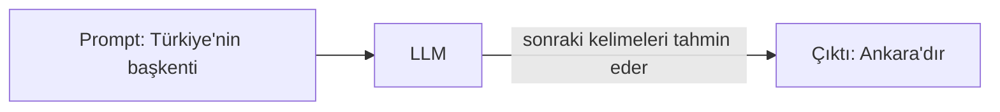
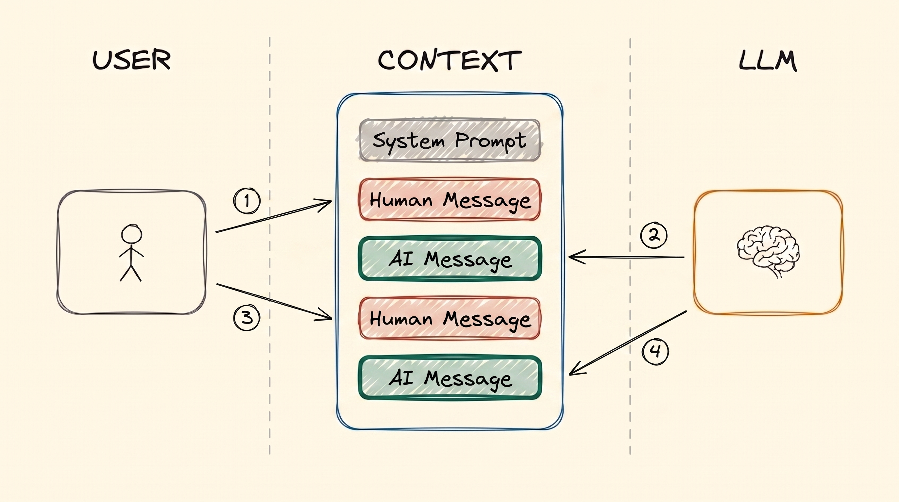
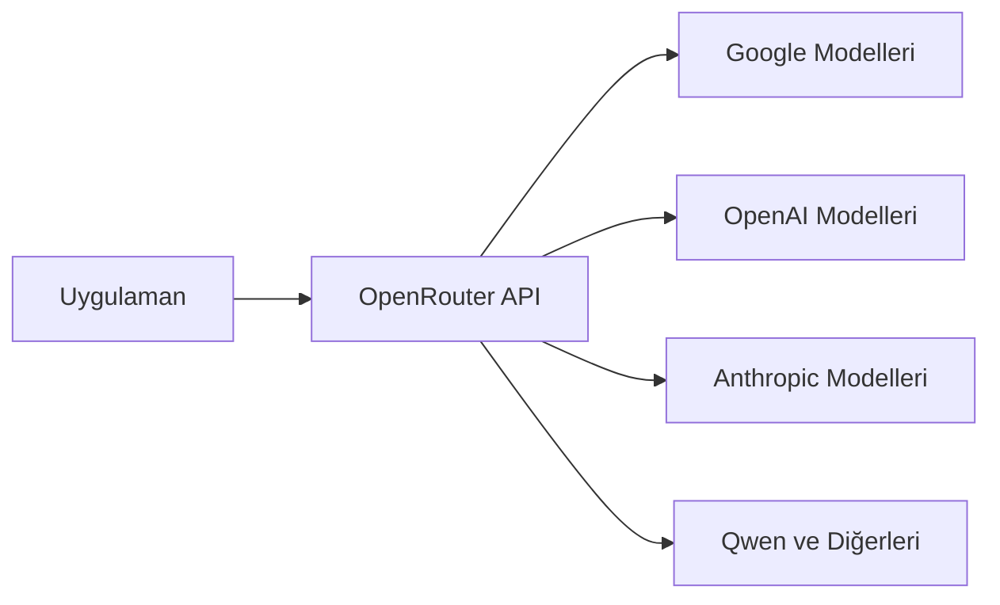
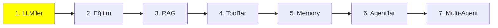

# Modül 1: LLM Temelleri

Bu serideki her şey bu modülün üstüne kuruluyor. Bir LLM'i tanımlamak kolay — metin girer,
metin çıkar — ama sonraki konuların neredeyse tamamı (RAG, tool'lar, memory, agent'lar) tek
bir sınır yüzünden var. Birazdan o sınıra geliyoruz.

Önce modelin kendisiyle başlayalım, sonra sınıra, sonra da bir modeli gerçekte nasıl
çalıştırdığına.

## LLM nedir?

Bir LLM, girdi olarak metin alıp çıktı olarak metin veren bir modeldir. Ona birkaç kelime
yollarsın (**prompt**), o da sana daha fazla kelime yollar (**generation**).

Kapağın altında, çok büyük miktarda metinle eğitilmiş derin bir sinir ağı var — kitaplar, web
siteleri, kod. Bütün o metinden öğrendiği tek bir beceri var: en olası sonraki kelimeyi tahmin
etmek.



Yaptığı gerçekten bundan fazlası değil. Bir LLM'in yaptığı etkileyici görünen her şey, bu tek
tahminin tekrar tekrar, kelime kelime yapılmasından ibaret.

## Bir LLM ne kadar büyük?

Bir LLM, çok sayıda **parametreye** sahip bir sinir ağıdır. Parametreleri biraz beyindeki
bağlantılar gibi düşün — sayısı arttıkça ağın tutabildiği de artar.

Bu senin için neden önemli? Çünkü kaba bir kural olarak, daha fazla parametre daha yetenekli ve
daha iyi akıl yürüten bir model demek — ve onu çalıştırmak için daha büyük bir makine demek.
Bir modeli çalıştırıp çalıştıramayacağını belirleyen ana şey model boyutudur.

Bu sadece kulaktan dolma bir şey değil, ölçüldü. 2020'de yayınlanan
[Scaling Laws for Neural Language Models](https://arxiv.org/abs/2001.08361) makalesi;
parametre, eğitim verisi ve hesap gücünü birlikte büyüttükçe performansın zıplamalar yapmadan,
düzgün ve öngörülebilir biçimde — bir güç yasasına (power law) uyarak — arttığını gösterdi. Bu
**scaling laws** (ölçekleme yasaları), sektörün sonraki yıllarını neden sadece daha büyük model
üretmekle geçirdiğini açıklıyor.

Kabaca üç boyut:

| Boyut | Parametre | Nerede çalışır |
| --- | --- | --- |
| Küçük | 0.6B – 8B | GPU'n varsa kendi makinende |
| Orta | 8B – 128B | Sunucu sınıfı ve kurumsal GPU'lar |
| Büyük | 128B – 2.4T (evet, trilyon) | Sadece veri merkezleri |

Büyük olanlar, Claude Code ve ChatGPT gibi araçların arkasındaki frontier modeller. Onları
yerelde asla çalıştıramayacaksın, ve bu sorun değil — onları API üzerinden çağırırsın.

Belirli modelleri ve benchmark puanlarını karşılaştırmak için
[artificialanalysis.ai](https://artificialanalysis.ai/) kullan.

## Context window

Geri kalan her şeyi şekillendiren sınır burada.

Her LLM'in bir **context window**'u vardır: girdi ve çıktı birlikte, tek seferde işleyebileceği
maksimum metin miktarı. Bunu modelin çalışma masası gibi düşün — şu anda bakmasına izin verilen
her şeyin o masaya sığması gerekir.

En kolay resmetme yolu ChatGPT ile sohbet geçmişin. Yeni bir sohbetin başında boştur. Karşılıklı
yazdıkça, senin mesajların ve modelin yanıtları oraya eklenir, ta ki dolana kadar.

Yani context aslında sadece modele oluşturulup gönderilen bir **mesaj yığınıdır**. LLM bu
yığının tamamını girdi olarak alır, işler ve sıradaki mesajı üretir.

**Sınırı aşarsan ne olur?** Hata alırsın. Bu kadar — istek basitçe başarısız olur.

Bunun etrafından dolaşmanın teknikleri var ve kendi başlığını hak edecek kadar önemli:
Intermediate bölümündeki
[Context Engineering](../2_intermediate/9_context_engineering_tr.md).

### Context'in içinde ne var

Normal bir sohbeti üç tür mesaj oluşturur:

- **SystemMessage** — modelin sağlayıcısı ya da geliştiricisi (OpenAI, Anthropic veya sen)
  tarafından yazılan varsayılan talimat seti. En tepeye bir kez konur ve modele nasıl
  davranacağını söyler: neyi ne zaman yapacağını, hangi tool'u kullanacağını. Birçok üründen
  sızmış gerçek system prompt'ları burada okuyabilirsin:
  [system_prompts_leaks](https://github.com/asgeirtj/system_prompts_leaks).
- **HumanMessage** — senin yazdığın şey. İsteğin. İnsanların "prompt" derken kastettiği bu.
- **AIMessage** — modelin yanıtı.

SystemMessage'a daha yakından bakmaya değer, çünkü tek parça düz bir metin değildir. Genelde
davranış talimatlarını *ve* **tool schema**'larını — modelin çağırmasına izin verilen tool'ların
listesini, isimleri ve argümanlarıyla — birlikte tutar:

<p align="center">
  <br>
  <em>Bir system prompt'un içi: davranış talimatları, tool schema'ları ve bazen bir blok statik
  referans metni. Hepsi context'in en tepesinde durur.</em>
</p>

API tarafında tool schema'lar sistem metninin parçası değil, ayrı bir alandır; ama model onları
en başta tek blok olarak alır, dolayısıyla birlikte düşünmek yanlış olmaz.

Bu mesajlar sistemle her etkileşiminde üst üste birikir:

<p align="center">
  <br>
  <em>Düz bir sohbetin iki turu: iki Human Message ve iki AI Message. Hiçbir şey silinmez, yani
  ikinci turda model birinci turdaki her şeyi de okuyor.</em>
</p>

Bu yığının, kimin konuştuğuna göre birkaç adı var: **context**, **working memory**,
**message history** ya da **short-term memory**. Acele etme — short-term memory'nin kendi
modülü var: [Modül 5: Memory](5_memory_tr.md).

Agent'lara geldiğimizde tanışacağın **iki mesaj türü daha** var. Agent, tool çağırabilen bir
LLM'den başka bir şey değil; tool'lar da dış dünyadan gerçek veri getiren fonksiyonlar.
Diyelim İstanbul'un hava durumunu sordun. Model bir **ToolCall** üretir, mesela
`get_weather(city="Istanbul")`. Fonksiyon çalışır ve `34°C` döner; bu da **ToolResult** olarak
geri gelir. İkisi de aynı mesaj yığınına eklenir.

Aklında tutmaya değer kısım: **ToolCall'ı LLM üretir, ama ToolResult'ı host makine üretir** —
laptop'un ya da bir sunucu — çünkü fonksiyonu asıl çalıştıran odur. Model ister; işi başka bir
şey yapar.

<p align="center">
  <br>
  <em>Bir agent'ın tek turu: sen prompt yazarsın, AI düşünür, AI tool çağırır, sonra AI
  cevaplar. Kimin ne yazdığına dikkat et — düşünmeyi, Tool Call'ı ve cevabı LLM üretir; Tool
  Result ise fonksiyonu çalıştıran host makineden gelir.</em>
</p>

Bu ayrım agent'ların nasıl çalıştığının temeli; [Modül 4: Tool'lar](4_tools_tr.md) ve
[Modül 6: Agent'lar](6_agents_tr.md) modüllerinde geri döneceğiz.

## Bilmen gereken generation ayarları

Modelin nasıl yanıt verdiğini **hyperparameter**'larla değiştirebilirsin. "Hyper" kısmına dikkat
— bunlar generation'ı etkiler; yukarıda konuştuğumuz parametreler ise modelin boyutuydu.

Sürekli kullanacağın iki tanesi:

- **Temperature** — yaratıcılık ayarı, genelde 0.0 ile 1.0 arası. Düşük (0.1) öngörülebilir ve
  tutarlı yanıtlar verir. Yüksek (0.9) daha yaratıcı ama daha az güvenilir.
- **Max output tokens** — yanıtın maksimum uzunluğu. Maliyeti kontrol etmek ve modelin
  gevezelik etmesini engellemek için ayarla. Kısa yanıtlar için 2K bol bol yeter.

## Bir LLM'i çalıştırmak: cloud mu, local mi?

Bir modeli çalıştırmaya **inference** denir. Tam da yukarıda anlattığımız şey: context'i
gönderirsin, model işler ve tamamlar.

Large Language Model adının ima ettiği gibi bunlar büyük şeyler, dolayısıyla inference GPU
gerektirir. Bu da sana iki seçenek bırakır.

**1. Cloud inference (API çağrıları).** ChatGPT ya da Google AI Studio gibi bir servisi
çağırırsın. Devasa GPU'lar onların, modeli senin için onlar çalıştırır.

- **Artıları:** en büyük ve en yetenekli modellere erişim, ve satın alınacak donanım yok.
- **Eksileri:** para tutar, internet gerekir, yavaş olabilir.

**2. Local inference.** Model kendi bilgisayarında çalışır.

- **Gereksinim:** yeterli belleğe (VRAM) sahip düzgün bir GPU.
- **Artıları:** kurulumdan sonra bedava — sadece elektrik ödersin — ve internetsiz çalışır.
- **Eksileri:** küçük modellerle sınırlı kalırsın.

Sırayla bakalım.

## Local çalıştırmak

### Quantization

**Quantization nedir?** Modeli daha az bellekle sığacak şekilde sıkıştırmak. Modeller normalde
16-bit ağırlıklarla dağıtılır; quantization her ağırlığı 4 bite düşürür ve gereken belleği
yaklaşık dörde böler.

Sayılar durumu netleştiriyor. 32B'lik bir modeli ele al:

| Hassasiyet | Gereken bellek | Tüketici GPU'suna sığar mı? |
| --- | --- | --- |
| 16-bit (dağıtıldığı hali) | ~64 GB | Hayır |
| 4-bit (quantize edilmiş) | ~16 GB, artı context için biraz | Evet — 24 GB veya 32 GB'lık bir kartta rahatça |

Aynı model, aynı ağırlıklar, belleğin dörtte biri. "Bunu hiç çalıştıramam" ile "bu benim
masaüstümde çalışır" arasındaki fark bu.

**Modelleri kendin quantize etmen gerekir mi?** Hayır, ve neredeyse hiç gerekmez.
[Ollama](https://ollama.com/) ve [Unsloth](https://unsloth.ai/) popüler modellerin — Qwen,
Llama, Mistral, Gemma ve daha fazlası — hazır quantize edilmiş sürümlerini yayınlıyor. Sadece
çek ve çalıştır.

### Modeli asıl çalıştıran engine'ler

Her şeyin altında gerçek işi yapan bir **inference engine** var:

- **llama.cpp**
- **vLLM** (NVIDIA, AMD, TPU)
- **SGLang** (sadece NVIDIA)
- **TensorRT-LLM** (NVIDIA, AMD)
- **MLX** (sadece Apple)

Bunlar yeni başlayan dostu değil ve çalışır hale getirmek epey uğraş gerektirir. Neyse ki onlara
doğrudan pek dokunmazsın — başka araçlar bunları arka planda kullanır, arayüzleri saklar ve seni
birkaç satır kodla, hatta doğrudan terminalden çalışan bir modele ulaştırır.

### Kolay araçlar

- **[LMStudio](https://lmstudio.ai/)** — model indirip sohbet etmek için basit bir arayüz.
  Başlamak için harika.
- **[Ollama](https://ollama.com/)** — modelleri hızlıca çekip servis etmek için bir komut satırı
  aracı. Terminalde rahatsan daha iyi.

**Hemen dene:** Ollama CLI ile çok küçük bir 0.6B model çek ve terminalde onunla sohbet et. İki
dakika sürer ve yukarıdaki her şeyi somutlaştırır.

## Cloud'da çalıştırmak

Daha büyük modeller için — ya da sadece kurulumdan tamamen kaçmak için — bir
**inference provider** kullanırsın. Sana bir API key verir, sen de kodundan bir client
kütüphanesiyle onların modellerini çağırırsın.

Aşağıdaki ikisinin de günlük limitli ücretsiz katmanı var; öğrenmek için yeter.

### Google AI Studio

Buradan başla: [aistudio.google.com](https://aistudio.google.com/). Kaydol ve kendi API key'ini
al. Ücretsiz katman temel modelleri günlük limitlerle kapsıyor.

### OpenRouter

[OpenRouter](https://openrouter.ai/), isteğini birçok farklı sağlayıcıya yönlendiren bir
gateway. Bir router olduğu için; Google, OpenAI, Qwen ve diğerleri için ayrı ayrı key taşımak
yerine tek bir API key neredeyse her modele ulaşır.



Ayrıca günlük limitli ücretsiz modelleri var ve model değiştirmek tek satırlık bir iş — bu da
onu kendi görevinde modelleri karşılaştırmanın en hızlı yolu yapıyor.

## Prompt engineering'e ilk bakış

**Prompt engineering**, istediğin çıktıyı alacak şekilde girdiyi yazmaktır. Bir öğrenciye
talimat vermekle aynı fikir: net talimat ödevin düzgün yapılmasını sağlar, muğlak talimat ise
herkesin canının istediğini yapmasıyla sonuçlanır.

Modelin gerçekte ne hesapladığını hatırla — context'teki her şey verildiğinde sonraki token'ın
olasılığı:

```
P(sonraki token | context)
```

Senin prompt'un o context'in kendisi. Yani iş, istediğin çıktıyı en olası hale getiren girdiyi
bulmaktır:

```
en iyi prompt = P(istediğin çıktı | prompt) değerini en büyük yapan prompt
```

Bütün disiplin tek satırda bu. İsimlendirilmiş birçok teknik var ve onları
[Modül 8: Prompt Engineering](../2_intermediate/8_prompt_engineering_tr.md) modülünde ele
alıyoruz. Ama işin çoğu deneme yapmak: bir ifade dene, çıktıya bak, değiştir, tekrar dene.

Üretim prompt'larına ne kadar emek gittiğini görmek için okumaya değer:

- [AI araçlarının system prompt'ları](https://github.com/x1xhlol/system-prompts-and-models-of-ai-tools)
- [System prompt sızıntıları](https://github.com/asgeirtj/system_prompts_leaks)
- [Sızmış system prompt'lar](https://github.com/jujumilk3/leaked-system-prompts)

## Bu serinin neresindeyiz



Artık bir LLM'in ne olduğunu, önemli olan tek sınırı (context window), o context'in içinde ne
yaşadığını, ve bir modeli yerelde ya da cloud'da nasıl çalıştıracağını biliyorsun.

İlerlerken context window'u aklında tut. RAG, memory, agent'lar ve context engineering — hepsi
bir şekilde şu sorunun cevabı: *o kısıtlı masaya ne koyacağız?*

## Kaynaklar

- [Scaling Laws for Neural Language Models](https://arxiv.org/abs/2001.08361) — Kaplan ve
  arkadaşları, 2020; "daha büyük model daha iyi" fikrinin arkasındaki ölçüm
- [Artificial Analysis](https://artificialanalysis.ai/) — model karşılaştırmaları ve benchmark'lar
- [Ollama](https://ollama.com/) — modelleri yerelde çekip servis etme
- [LMStudio](https://lmstudio.ai/) — yerelde model çalıştırmak için arayüz
- [Unsloth](https://unsloth.ai/) — hazır quantize edilmiş model sürümleri
- [Google AI Studio](https://aistudio.google.com/) — ücretsiz katman API key'leri
- [OpenRouter](https://openrouter.ai/) — birçok sağlayıcı için tek key
- [System prompt sızıntıları](https://github.com/asgeirtj/system_prompts_leaks)

**Sonraki modül:** [Modül 2: LLM Eğitimi](2_training_tr.md)
