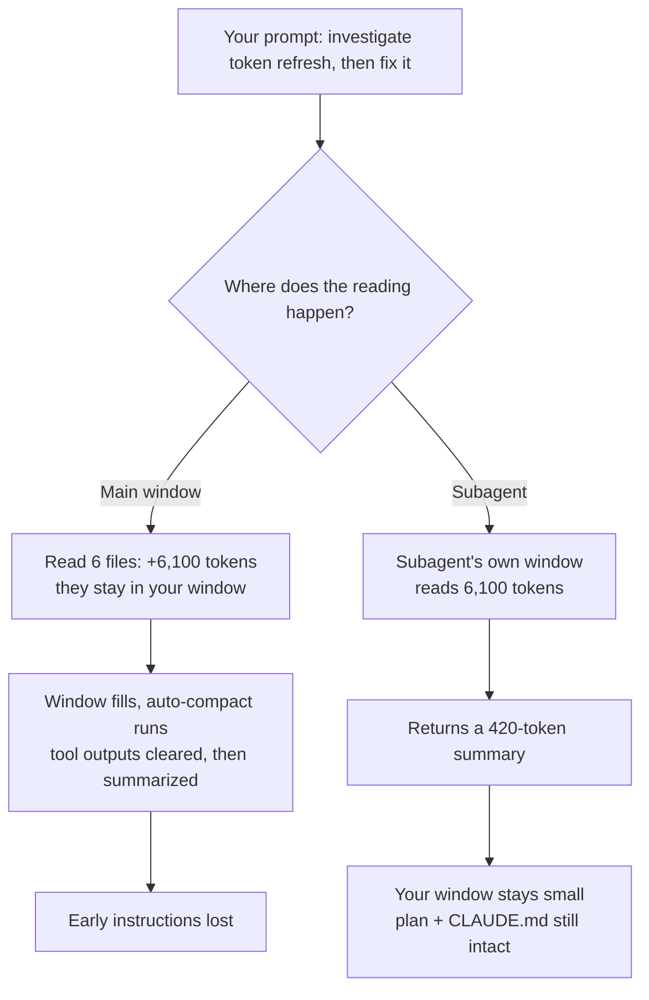

# Research Dossier — Module 9: Context Engineering (Intermediate)

Prepared 2026-08-25 for `sections/2_intermediate/9_context_engineering.md`.
**Every URL cited below was fetched on 2026-08-25 and confirmed to contain the claim** — see the [Link Verification Log](#link-verification-log) at the end. Anything not fetched is marked `[LINK-UNVERIFIED]`.
Target: ~150–280 lines, friendly second-person, tables, mermaid, short snippets, Quick Check, prev/next.

---

## 1. Executive summary — 10 things the module author must not get wrong

1. **Context engineering is not prompt engineering scaled up.** Anthropic's definition: it is "the set of strategies for curating and maintaining the optimal set of tokens (information) during LLM inference." Prompt engineering optimizes *one* string you write once; context engineering is **iterative** — a decision made every turn about system instructions, tools, MCP, external data, and message feedback ([Effective context engineering for AI agents, Anthropic, 2025-09-29](https://www.anthropic.com/engineering/effective-context-engineering-for-ai-agents)).
2. **The context window is a degrading resource, not a bucket.** "Context rot": as tokens grow, accurate recall from context falls — measured across 18 models ([Context Rot, Chroma, 2025-07-14](https://www.trychroma.com/research/context-rot)). Performance falls well before the window is full.
3. **The mechanism is attention, not storage.** Transformers form n² pairwise relationships for n tokens, so attention stretches thin; models also saw far fewer long sequences in training. Anthropic's framing: the window is a finite **attention budget** and "every new token introduced depletes this budget" ([Anthropic, 2025-09-29](https://www.anthropic.com/engineering/effective-context-engineering-for-ai-agents)).
4. **"Just use a 1M window" does not solve it.** Performance degrades **13.9%–85%** as input length grows *even with perfect retrieval*, and removing, masking, or neutralizing the irrelevant text does not rescue it ([Context Length Alone Hurts LLM Performance Despite Perfect Retrieval, arXiv:2510.05381, 2025-10-06](https://arxiv.org/abs/2510.05381)).
5. **Compaction ≠ summarization ≠ truncation ≠ tool-result clearing.** Four distinct operations with different loss profiles. Getting this vocabulary right is half the module (§2).
6. **Claude Code's auto-compact is documented and specific.** It "clears older tool outputs first, then summarizes the conversation if needed" ([How Claude Code works, Claude Code Docs](https://code.claude.com/docs/en/how-claude-code-works)). System prompt, project-root CLAUDE.md, auto memory, and the plan-mode plan are **re-injected from disk**; it re-reads **up to five** recently modified files; invoked skill bodies return capped at **5,000 tokens per skill and 25,000 total**; the skill *listing* does not return ([Explore the context window, Claude Code Docs](https://code.claude.com/docs/en/context-window)). What you lose is anything said only in conversation.
7. **Offload to the filesystem; don't compress in place.** Keep restorable *references* (paths, URLs, IDs) in context and the bulk on disk — Manus drops the web page content and keeps the URL ([Context Engineering for AI Agents: Lessons from Building Manus, Manus, 2025-07-18](https://manus.im/blog/Context-Engineering-for-AI-Agents-Lessons-from-Building-Manus)).
8. **Subagents are a context-isolation primitive with a measurable exchange rate.** Anthropic's own walkthrough: the subagent read **6,100 tokens** of files and returned a **420-token** result to the parent ([Explore the context window, Claude Code Docs](https://code.claude.com/docs/en/context-window)); distilled sub-agent reports run **1,000–2,000 tokens** ([Anthropic, 2025-09-29](https://www.anthropic.com/engineering/effective-context-engineering-for-ai-agents)).
9. **But subagents backfire when work needs shared context.** "Actions carry implicit decisions, and conflicting decisions carry bad results" — parallel agents that can't see each other's traces produce incompatible work; prefer a single-threaded linear agent plus compression ([Don't Build Multi-Agents, Cognition, 2025-06-12](https://cognition.com/blog/dont-build-multi-agents)). Claude Code's docs agree: use the main conversation when the task needs frequent back-and-forth or when phases share significant context ([Subagents, Claude Code Docs](https://code.claude.com/docs/en/sub-agents)).
10. **Prompt caching makes *where* you edit context a money question.** The cache is a prefix hash over `tools → system → messages`; a change at any level invalidates that level and everything after, and cache reads cost 0.1× while 5-minute writes cost 1.25× ([Prompt caching, Claude Platform Docs](https://platform.claude.com/docs/en/build-with-claude/prompt-caching)). Tool-result clearing explicitly invalidates the cache — which is why `clear_at_least` exists ([Context editing, Claude Platform Docs](https://platform.claude.com/docs/en/build-with-claude/context-editing)).

---

## 2. Canonical definitions & terminology

| Term | Definition | Source |
|---|---|---|
| **Context engineering** | Curating and maintaining the optimal set of tokens available during inference — iterative, across turns | [Anthropic, 2025-09-29](https://www.anthropic.com/engineering/effective-context-engineering-for-ai-agents) |
| **Prompt engineering** | Writing an effective prompt (esp. the system prompt) — a discrete authoring act | [Anthropic, 2025-09-29](https://www.anthropic.com/engineering/effective-context-engineering-for-ai-agents) |
| **Attention budget** | The window as finite attention that every token depletes | [Anthropic, 2025-09-29](https://www.anthropic.com/engineering/effective-context-engineering-for-ai-agents) |
| **Context rot** | As token count rises, accurate recall from context falls | [Chroma, 2025-07-14](https://www.trychroma.com/research/context-rot) |
| **Lost in the middle** | U-shaped position curve: best at the start and end of context, worst in the middle | [arXiv:2307.03172, 2023-07-06](https://arxiv.org/abs/2307.03172) |
| **Truncation / trimming** | Drop oldest turns wholesale (last-N). "Deterministic & simple", no summarizer variability, no extra model call; trades long-range memory | [OpenAI Cookbook — Session Memory](https://developers.openai.com/cookbook/examples/agents_sdk/session_memory) |
| **Summarization** | Compress older messages into a model-written summary; keeps long-range memory compactly, adds latency, "risks context poisoning if summaries contain errors" | [OpenAI Cookbook — Session Memory](https://developers.openai.com/cookbook/examples/agents_sdk/session_memory) |
| **Compaction** | Take a conversation nearing the limit, summarize it, and **reinitialize a new window from the summary** | [Anthropic, 2025-09-29](https://www.anthropic.com/engineering/effective-context-engineering-for-ai-agents) |
| **Tool-result clearing / context editing** | Remove only old tool results (optionally the calls too), replacing each with placeholder text | [Context editing, Claude Platform Docs](https://platform.claude.com/docs/en/build-with-claude/context-editing) |
| **Offloading (structured note-taking)** | The agent writes notes persisted outside the window and pulls them back in later | [Anthropic, 2025-09-29](https://www.anthropic.com/engineering/effective-context-engineering-for-ai-agents) |
| **Memory vs context** | Context = what's in the window now. Memory = a durable store outside it that must be *retrieved into* context to matter | [Memory tool, Claude Platform Docs](https://platform.claude.com/docs/en/agents-and-tools/tool-use/memory-tool) |
| **Just-in-time / agentic retrieval** | Hold lightweight identifiers (file paths, stored queries, web links) and load data with tools at runtime | [Anthropic, 2025-09-29](https://www.anthropic.com/engineering/effective-context-engineering-for-ai-agents) |
| **Progressive disclosure** | Incrementally discover context through exploration; each interaction informs the next decision | [Anthropic, 2025-09-29](https://www.anthropic.com/engineering/effective-context-engineering-for-ai-agents) |
| **Poisoning / distraction / confusion / clash** | The four long-context failure modes | [How Long Contexts Fail, Drew Breunig, 2025-06-22](https://www.dbreunig.com/2025/06/22/how-contexts-fail-and-how-to-fix-them.html) |
| **Write / select / compress / isolate** | The four-move framework for context engineering | [Context Engineering for Agents, LangChain, 2025-07-02](https://www.langchain.com/blog/context-engineering-for-agents) |

**Layer distinction worth spelling out for students:** Claude Code's `/compact` is a client-side, session-shaped mechanism ([Explore the context window](https://code.claude.com/docs/en/context-window)). The Anthropic API separately offers **server-side** compaction via the `compact_20260112` strategy behind beta header `compact-2026-01-12`, which returns a `compaction` content block you pass back on later requests ([Compaction, Claude Platform Docs](https://platform.claude.com/docs/en/build-with-claude/compaction)). Same idea, different layer.

---

## 3. Deep dive per required topic

### 3.1 Context summarization (stub topic 1)

**What it does.** Summarize the conversation, restart the window from the summary. Anthropic's guidance is to preserve "architectural decisions, unresolved bugs, and implementation details while discarding redundant tool outputs or messages," and to tune the summarization prompt on complex agent traces by first **maximizing recall**, then iterating toward precision ([Anthropic, 2025-09-29](https://www.anthropic.com/engineering/effective-context-engineering-for-ai-agents)).

**Claude Code specifics** (all from [Explore the context window](https://code.claude.com/docs/en/context-window) unless noted):
- The automatic pass works the same way as `/compact`.
- Order of operations when filling up: "It clears older tool outputs first, then summarizes the conversation if needed. Your requests and key code snippets are preserved; detailed instructions from early in the conversation may be lost." ([How Claude Code works](https://code.claude.com/docs/en/how-claude-code-works))
- Re-injected from disk: system prompt and output style, project-root CLAUDE.md and unscoped rules, auto memory, and the plan Claude wrote in plan mode.
- Re-read after compaction: **up to five** files Claude read or edited, most recently modified first. A file over 5,000 tokens comes back as a path reference (`Referenced file`) without content. Path-scoped rules and nested CLAUDE.md reload as Claude reads matching files.
- Invoked **skill bodies** re-inject, capped at **5,000 tokens per skill and 25,000 total**, oldest dropped first; truncation keeps the *start* of `SKILL.md`. The skill *listing* does not reload.
- Steering it: `/compact focus on the auth bug fix`; or `/rewind` → "Summarize from here" / "Summarize up to here"; or a `# Compact instructions` section in CLAUDE.md ([Manage costs effectively](https://code.claude.com/docs/en/costs)).
- Threshold control: `/autocompact 500k`, the `--autocompact` flag, or `CLAUDE_CODE_AUTO_COMPACT_WINDOW`; accepted range **100K to 1M**, capped at the model's real window. Default is to compact at the model's context limit, with exceptions — 200K-boundary models, and **Sonnet 5 auto-compacts at about 967K by default** ([Model configuration](https://code.claude.com/docs/en/model-config)).
- Thrashing guard: if a single file or tool output is so large that context refills right after each summary, Claude Code stops auto-compacting after a few attempts and errors rather than looping ([How Claude Code works](https://code.claude.com/docs/en/how-claude-code-works)).
- Compaction is itself an expensive request because it reads the conversation it summarizes; `/clear` costs nothing ([Manage costs effectively](https://code.claude.com/docs/en/costs)).

**Server-side API equivalent.** `{"type":"compact_20260112","trigger":{"type":"input_tokens","value":150000}}` — default trigger 150,000 input tokens, minimum 50,000; optional `instructions` and `pause_after_compaction`; total cost is the sum of `usage.iterations` because top-level counts exclude the compaction call ([Compaction, Claude Platform Docs](https://platform.claude.com/docs/en/build-with-claude/compaction)).

**The honest failure mode:** over-summarizing. OpenAI's cookbook names the risk directly — summarization "risks context poisoning if summaries contain errors" ([OpenAI Cookbook — Session Memory](https://developers.openai.com/cookbook/examples/agents_sdk/session_memory)) — and a wrong premise inside a summary is never challenged again ([Breunig, 2025-06-22](https://www.dbreunig.com/2025/06/22/how-contexts-fail-and-how-to-fix-them.html)).

### 3.2 Persistent memory / context offloading (stub topic 2)

Three mechanisms to teach.

**(a) Agent-written notes on disk.** Agents "regularly write notes persisted to memory outside of the context window" and pull them back later; the Claude-plays-Pokémon example maintained precise tallies across thousands of game steps and developed maps of explored regions and strategic notes ([Anthropic, 2025-09-29](https://www.anthropic.com/engineering/effective-context-engineering-for-ai-agents)).

**(b) The API memory tool.** `{"type": "memory_20250818", "name": "memory"}`, available on all Claude 4 and later models, client-side: Claude requests file operations and **your** application executes them. Six commands — `view`, `create`, `str_replace`, `insert`, `delete`, `rename` — all rooted at `/memories`. When the tool is present, the API auto-injects a system instruction ending: *"ASSUME INTERRUPTION: Your context window might be reset at any moment, so you risk losing any progress that is not recorded in your memory directory."* Security is on you: a path like `/memories/../../secrets.env` must be rejected, and the docs also recommend capping file size and expiring unused memories ([Memory tool, Claude Platform Docs](https://platform.claude.com/docs/en/agents-and-tools/tool-use/memory-tool)).

**(c) Claude Code's two-track project memory.** `CLAUDE.md` is what *you* write and is loaded every session; **auto memory** is what Claude writes to `~/.claude/projects/<project>/memory/`, indexed by `MEMORY.md`, of which only the **first 200 lines or 25KB, whichever comes first**, loads at session start — content beyond that is dropped on the next load. Topic files load on demand ([How Claude remembers your project, Claude Code Docs](https://code.claude.com/docs/en/memory)). A non-fork subagent does **not** inherit the main conversation's auto memory; subagents can have their own via `memory: user|project|local` ([Subagents](https://code.claude.com/docs/en/sub-agents)).

**Failure modes of long-term memory — say these out loud:**
- Staleness. Hence the `modified` ISO-8601 frontmatter timestamp and the docs' advice to "periodically delete memory files that haven't been accessed in a long time" ([Memory tool](https://platform.claude.com/docs/en/agents-and-tools/tool-use/memory-tool), [Claude Code memory](https://code.claude.com/docs/en/memory)).
- Index bloat: exceed the `MEMORY.md` read limit and everything past it is silently dropped next load ([Claude Code memory](https://code.claude.com/docs/en/memory)).
- Poisoning: a wrong fact written once is re-read every session ([Breunig, 2025-06-22](https://www.dbreunig.com/2025/06/22/how-contexts-fail-and-how-to-fix-them.html)).
- **Vendor memory benchmarks are contested.** Mem0's CTO filed a public re-evaluation arguing Zep's claimed **84%** LoCoMo accuracy was actually **58.44% ± 0.20**, inflated by ~25.56 points because excluded adversarial questions were included ([Revisiting Zep's 84% LoCoMo Claim, getzep/zep-papers issue #5, 2025-05-08](https://github.com/getzep/zep-papers/issues/5)). Teach students to test on their own data rather than trust a leaderboard.

### 3.3 Subagents as context isolation (stub topic 3)

**The key insight, concretely.** A subagent gets its own window, does the token-heavy work there, and returns only its final text. Anthropic's illustrated session: the subagent read **6,100 tokens** of files, and the parent received **420 tokens** plus a small metadata trailer — "That's the context savings" ([Explore the context window](https://code.claude.com/docs/en/context-window)). Anthropic's research post puts distilled sub-agent reports at **1,000–2,000 tokens**, with "clear separation of concerns — the detailed search context remains isolated within sub-agents" ([Anthropic, 2025-09-29](https://www.anthropic.com/engineering/effective-context-engineering-for-ai-agents)).

**What a Claude Code subagent actually starts with** — students assume it inherits everything, and it does not. It gets its own shorter system prompt, the delegation task message, the CLAUDE.md hierarchy, a git-status snapshot, preloaded skills, and a sibling roster. It does **not** get your conversation history, files you already read, skills you already invoked, your output style, or the main conversation's auto memory. The built-in `Explore` and `Plan` agents skip CLAUDE.md and git status to stay fast and cheap. A **fork** (`/subtask …`) inherits the whole conversation *and shares the prompt cache* with the main session ([Subagents](https://code.claude.com/docs/en/sub-agents)).

**When it backfires:**
- Docs say use the main conversation when the task needs frequent back-and-forth, when multiple phases share significant context, for quick targeted changes, or when latency matters ([Subagents](https://code.claude.com/docs/en/sub-agents)).
- Cognition's argument: parallel agents make conflicting implicit decisions and cannot see each other's decision-making, so a single-threaded linear agent plus a dedicated summarizing LLM is the safer default ([Cognition, 2025-06-12](https://cognition.com/blog/dont-build-multi-agents)).
- Cost: agent teams use "approximately 7x more tokens than standard sessions when teammates run in plan mode" ([Manage costs effectively](https://code.claude.com/docs/en/costs)); LangChain cites Cognition reporting "up to 15× more tokens" for multi-agent vs chat ([LangChain, 2025-07-02](https://www.langchain.com/blog/context-engineering-for-agents)).
- Delegation quality is gated by the description: "Claude uses each subagent's description to decide when to delegate tasks" ([Subagents](https://code.claude.com/docs/en/sub-agents)).

### 3.4 TODO lists / explicit planning (stub topic 4)

**Manus's "recitation" is the sharpest formulation.** Manus deliberately creates and rewrites a `todo.md` step by step so the objective is re-stated at the *end* of the context every turn — an intentional counter to lost-in-the-middle across tasks that average "around 50 tool calls." The section is literally titled "Manipulate Attention Through Recitation" ([Manus, 2025-07-18](https://manus.im/blog/Context-Engineering-for-AI-Agents-Lessons-from-Building-Manus)).

**In Claude Code terms:** plan mode writes a plan to disk, and that plan is **re-injected from disk after compaction** — making the plan file the one artifact that survives everything ([Explore the context window](https://code.claude.com/docs/en/context-window)). The recommended flow is **explore → plan → implement → commit**, with `Ctrl+G` to open the plan in your editor before Claude proceeds; and for larger features, have Claude interview you, write a complete `SPEC.md`, then **start a fresh session to execute it** so the new session's context is entirely implementation ([Best practices for Claude Code](https://code.claude.com/docs/en/best-practices)).

**In long-running-agent terms:** Anthropic's harness study had an *initializer* session create an `init.sh`, a `claude-progress.txt`, an initial git commit, and a JSON feature list with 200+ detailed requirements. Every later session read the progress notes and git history, ran verification, worked on **a single feature at a time**, committed, and updated the progress file before ending. Named failure modes: attempting too much simultaneously, declaring victory prematurely, leaving buggy undocumented code, and skipping verification ([Effective harnesses for long-running agents, Anthropic, 2025-11-26](https://www.anthropic.com/engineering/effective-harnesses-for-long-running-agents)). The memory-tool docs describe the same shape as a reusable "multisession software development pattern," with the key principle: mark a feature complete only after end-to-end verification, not when the code is written ([Memory tool](https://platform.claude.com/docs/en/agents-and-tools/tool-use/memory-tool)).

### 3.5 Anatomy of an agent's context

Anthropic's four components ([Anthropic, 2025-09-29](https://www.anthropic.com/engineering/effective-context-engineering-for-ai-agents)):
- **System prompt** at the right "altitude" — neither brittle hardcoded logic nor vague guidance; organize with XML tags or Markdown headers; aim for "the minimal set of information that fully outlines your expected behavior," noting that "minimal does not necessarily mean short."
- **Tools** that are "self-contained, robust to error, and extremely clear with respect to their intended use." The test: "If a human engineer can't definitively say which tool should be used in a given situation, an AI agent can't be expected to do better."
- **Examples** — "a set of diverse, canonical examples" rather than an exhaustive edge-case list; "examples are the 'pictures' worth a thousand words."
- **Message history and retrieved data.**

Claude Code's own startup budget, from the interactive walkthrough (the doc labels these counts illustrative): system prompt ~4,200; auto memory ~680; environment info ~280; MCP tool *names* ~120 with schemas deferred by default; skill descriptions ~450; user CLAUDE.md ~320; project CLAUDE.md ~1,800. Individual file reads then dominate — 2,400 / 1,100 / 1,800 / 1,600 tokens in the example, with the doc's own tip that "File reads dominate context usage" ([Explore the context window](https://code.claude.com/docs/en/context-window)).

### 3.6 Just-in-time retrieval vs pre-loading (why grep often beats an embedding index for code)

Anthropic's argument: keep lightweight identifiers and load with tools, mirroring how humans use "file systems, inboxes, and bookmarks"; metadata such as folder hierarchies, naming conventions, and timestamps is itself signal. The trade-off is stated honestly — "runtime exploration is slower than retrieving pre-computed data" and requires "opinionated and thoughtful engineering" to stop agents "chasing dead-ends." Hybrid designs are explicitly endorsed ([Anthropic, 2025-09-29](https://www.anthropic.com/engineering/effective-context-engineering-for-ai-agents)).

Evidence, strongest first:
- **[Is Grep All You Need? How Agent Harnesses Reshape Agentic Search, arXiv:2605.15184, submitted 2026-05-14](https://arxiv.org/abs/2605.15184)** — on a 116-question LongMemEval subset across custom and provider-native harnesses, "grep generally yields higher accuracy than vector retrieval," but "overall scores still depend strongly on which harness and tool-calling style is used." Cite this *with* the harness caveat.
- Practical counterpoint worth one line: grep-heavy exploration can burn tokens, and Claude Code's docs recommend **code intelligence plugins** so "a single 'go to definition' call replaces what might otherwise be a grep followed by reading multiple candidate files" ([Manage costs effectively](https://code.claude.com/docs/en/costs)).
- **[LINK-UNVERIFIED: not fetched, third-party paraphrase]** The often-repeated story that the Claude Code team tried a local vector DB and found plain glob+grep won reaches me only through secondary blog write-ups of remarks by Boris Cherny. **Do not print a quote.** Say at most: "Claude Code ships without a codebase index and relies on agentic search" — which is verifiable from the tool list in [How Claude Code works](https://code.claude.com/docs/en/how-claude-code-works) — and cite arXiv:2605.15184 for the evidence.

### 3.7 Tool-result pruning and the cost of verbose tool output

- **API `clear_tool_uses_20250919`**, beta header `context-management-2025-06-27`. Parameters: `trigger` (e.g. `{"type":"input_tokens","value":30000}`), `keep` (n most recent tool uses), `clear_at_least` (don't bother unless this many tokens are freed), `exclude_tools` (exempt specific tools), `clear_tool_inputs` (default `false` — keep the call, drop the result). Cleared results are replaced with placeholder text so Claude knows something was removed. The response reports `context_management.applied_edits` with `cleared_tool_uses` and `cleared_input_tokens`, and `count_tokens` previews savings via `original_input_tokens`. A companion strategy `clear_thinking_20251015` manages thinking blocks. Notably, the docs say that **for most cases you should prefer server-side compaction** instead ([Context editing, Claude Platform Docs](https://platform.claude.com/docs/en/build-with-claude/context-editing)).
- Anthropic's rationale in one line: "once a tool has been called deep in the message history, why would the agent need to see the raw result again?" ([Anthropic, 2025-09-29](https://www.anthropic.com/engineering/effective-context-engineering-for-ai-agents))
- The cheapest fix is upstream. Claude Code's docs give a worked `PreToolUse` hook that rewrites `npm test` to grep for failures: "Instead of Claude reading a 10,000-line log file to find errors, a hook can grep for `ERROR` and return only matching lines, reducing context from tens of thousands of tokens to hundreds." ([Manage costs effectively](https://code.claude.com/docs/en/costs))
- **MCP tool *definitions* are themselves a context cost.** Exposing MCP servers as a code API on a filesystem, so agents load only the definitions they need and filter data inside the execution environment, took one Google-Drive-to-Salesforce example from **150,000 tokens to 2,000 — a 98.7% saving**; the same post notes intermediate results round-tripping through context could otherwise add ~50,000 tokens for a two-hour transcript ([Code execution with MCP, Anthropic, 2025-11-04](https://www.anthropic.com/engineering/code-execution-with-mcp)). Claude Code now defers MCP schemas by default and loads them on demand via tool search ([Explore the context window](https://code.claude.com/docs/en/context-window)), and recommends CLI tools like `gh`, `aws`, and `gcloud` because "they don't add any per-tool listing" ([Manage costs effectively](https://code.claude.com/docs/en/costs)).
- **Tool *count* degrades behaviour**, not just budget: the Berkeley Function-Calling Leaderboard shows all models perform worse with multiple tools, and a quantized Llama 3.1 8b failed with **46** tools but succeeded with **19** despite adequate window space ([Breunig, 2025-06-22](https://www.dbreunig.com/2025/06/22/how-contexts-fail-and-how-to-fix-them.html)).

### 3.8 Prompt caching × context edits (the real cost lever)

The rule to teach: the cache is a **prefix hash** over `tools → system → messages`, and "changes at any level invalidate that level and all subsequent levels." Modifying tool names, descriptions, or parameters invalidates the entire cache. A `cache_control` breakpoint must sit on the **last block identical across requests** — put one after a per-request timestamp and you get zero hits, forever. The lookback window is **20 blocks**. Pricing: cache reads **0.1×**, 5-minute writes **1.25×**, 1-hour writes **2×**; default TTL 5 minutes, refreshed free on use ([Prompt caching, Claude Platform Docs](https://platform.claude.com/docs/en/build-with-claude/prompt-caching)).

Consequences a developer will feel:
- Tool-result clearing invalidates the cache; thinking-block clearing preserves it when blocks are kept. Hence `clear_at_least` — batch your edits so the re-cache is worth it ([Context editing](https://platform.claude.com/docs/en/build-with-claude/context-editing)).
- With server-side compaction, put a `cache_control` breakpoint at the end of the system prompt so "compaction events only require writing the summary to cache, not re-caching the system prompt" ([Compaction](https://platform.claude.com/docs/en/build-with-claude/compaction)).
- In Claude Code: the first message after a break longer than the cache lifetime reprocesses your full context; lifetime is an hour on a subscription and five minutes once you're drawing on usage credits or using an API key. `/usage` flags behaviours such as long context or cache misses when one accounts for 10% or more of recent usage ([Manage costs effectively](https://code.claude.com/docs/en/costs)).
- Manus's version: KV-cache hit rate is "the single most important metric for a production-stage AI agent"; agents run roughly **100:1 input-to-output** tokens; keep prefixes stable and contexts append-only; and **mask tool logits instead of adding or removing tool definitions**, because definition changes invalidate the cache and orphan references to now-missing tools ([Manus, 2025-07-18](https://manus.im/blog/Context-Engineering-for-AI-Agents-Lessons-from-Building-Manus)).

### 3.9 Multi-turn drift and context poisoning

Breunig's taxonomy with its evidence ([How Long Contexts Fail, 2025-06-22](https://www.dbreunig.com/2025/06/22/how-contexts-fail-and-how-to-fix-them.html)):
- **Poisoning** — the Gemini Pokémon case, where goals and summary were "poisoned with misinformation about the game state" and the agent pursued impossible objectives.
- **Distraction** — beyond ~100k tokens the agent showed "a tendency toward favoring repeating actions from its vast history rather than synthesizing novel plans"; Databricks saw correctness decline around **32k** for Llama 3.1 405b, with smaller models failing sooner.
- **Confusion** — too many tools (the 46-vs-19 result above).
- **Clash** — a Microsoft/Salesforce study found distributing prompt information across turns caused an average **39%** drop, with o3 falling from **98.1 to 64.1**: "when LLMs take a wrong turn in a conversation, they get lost and do not recover."

**A real tension to teach as a judgement call, not paper over.** Manus argues **"keep the wrong stuff in"** — leaving failed actions and their error messages in context lets the model "implicitly update internal beliefs" and stop repeating the mistake, and error recovery is "one of the clearest indicators of true agentic behavior" ([Manus, 2025-07-18](https://manus.im/blog/Context-Engineering-for-AI-Agents-Lessons-from-Building-Manus)). Claude Code's best practices say the opposite for supervised sessions: "If you've corrected Claude more than twice on the same issue in one session, the context is cluttered with failed approaches. Run `/clear` and start fresh." ([Best practices](https://code.claude.com/docs/en/best-practices)) Resolution to offer students: keep the *error signal*, drop the *thrash*.

Manus's sixth lesson is rarely mentioned and worth a sentence: **"don't get few-shotted."** Uniform action/observation pairs turn the agent into a pattern-mimic that repeats actions "simply because that's what it sees"; the fix is small amounts of structured variation ([Manus, 2025-07-18](https://manus.im/blog/Context-Engineering-for-AI-Agents-Lessons-from-Building-Manus)).

### 3.10 Measuring context health

- `/context` shows what's using space and confirms which memory files actually loaded ([How Claude Code works](https://code.claude.com/docs/en/how-claude-code-works), [Claude Code memory](https://code.claude.com/docs/en/memory)). `/usage` shows per-model token counts plus attribution to skills, subagents, plugins, and individual MCP servers, and flags behaviours at ≥10% of recent usage; a custom status line can display context usage continuously ([Manage costs effectively](https://code.claude.com/docs/en/costs)).
- API side: `count_tokens` with `context_management` returns `original_input_tokens` alongside the post-clearing `input_tokens` ([Context editing](https://platform.claude.com/docs/en/build-with-claude/context-editing)); with compaction, only summing `usage.iterations` gives total consumption ([Compaction](https://platform.claude.com/docs/en/build-with-claude/compaction)).
- OpenAI's cookbook recommends LLM-as-judge evaluation, transcript replay testing, and token-pressure monitoring rather than a single prescriptive metric ([OpenAI Cookbook — Session Memory](https://developers.openai.com/cookbook/examples/agents_sdk/session_memory)).
- Honest closing caveat: a 2026 survey argues the repeated compaction agents actually perform "is almost never measured, and no benchmark holds one budget axis across all the layers at once," and that attention-magnitude or recency retention signals "fail in the same way everywhere, by discarding information the query later needs" ([What to Keep, What to Forget: A Rate–Distortion View of Memory Compaction, arXiv:2607.08032, 2026-07-09](https://arxiv.org/abs/2607.08032)).

### 3.11 What I would ADD to the stub, and why

| Addition | Why it belongs in Intermediate |
|---|---|
| **Context rot + the evidence** | Without it every technique reads as arbitrary hygiene. This is the *why* of the module. |
| **Anatomy of the window + a token-budget table** | Students can't manage what they can't see. `/context` is the single most actionable thing here. |
| **Tool-result pruning / verbose tool output** | The largest real-world context sink in coding work; the stub omits it entirely. |
| **Prompt caching interaction** | Turns context engineering into a cost lever a professional can defend to a manager. |
| **Just-in-time vs pre-loaded retrieval** | Bridges Module 3 (RAG) and corrects a belief Fundamentals may have left behind. |
| **Poisoning / distraction / confusion / clash** | Names failures students are already hitting and can't diagnose. |
| **`/clear` vs `/compact` vs subagent decision rule** | The most-asked practical question in this whole module. |
| **Session handoff (plan file + progress file + git)** | The SDLC payoff; makes the module about shipping, not trivia. |

Nothing in the stub's four topics is obscure, renamed, or nonexistent — all four map cleanly onto documented 2025–2026 mechanisms.

---

## 4. State of the art 2025–2026 — what changed, what is now obsolete

**Changed:**
- Context engineering became a named discipline in 2025: [Anthropic, 2025-09-29](https://www.anthropic.com/engineering/effective-context-engineering-for-ai-agents); LangChain's write/select/compress/isolate, [2025-07-02](https://www.langchain.com/blog/context-engineering-for-agents); [Manus, 2025-07-18](https://manus.im/blog/Context-Engineering-for-AI-Agents-Lessons-from-Building-Manus); and a survey over "more than 1400 research papers" ([A Survey of Context Engineering for Large Language Models, arXiv:2507.13334](https://arxiv.org/abs/2507.13334)).
- Context management moved **into the platforms**: the memory tool `memory_20250818` ([docs](https://platform.claude.com/docs/en/agents-and-tools/tool-use/memory-tool)); context editing `clear_tool_uses_20250919` and `clear_thinking_20251015` ([docs](https://platform.claude.com/docs/en/build-with-claude/context-editing)); server-side compaction `compact_20260112` behind beta `compact-2026-01-12` ([docs](https://platform.claude.com/docs/en/build-with-claude/compaction)).
- **1M-token windows are routine and compaction still applies.** Fable 5, Sonnet 5, Opus 4.6+ and Sonnet 4.6 support a 1M window, and "Compaction works the same way at the larger limit"; Sonnet 5 auto-compacts around 967K ([Explore the context window](https://code.claude.com/docs/en/context-window), [Model configuration](https://code.claude.com/docs/en/model-config)).
- **Agentic search displaced index-first RAG for code** ([arXiv:2605.15184, 2026-05-14](https://arxiv.org/abs/2605.15184)).
- **Tool schemas became lazily loaded.** MCP schemas stay deferred by default in Claude Code, loaded on demand via tool search; `ENABLE_TOOL_SEARCH=auto` loads upfront when they fit within 10% of the window, `false` loads everything ([Explore the context window](https://code.claude.com/docs/en/context-window)).
- **Framework support matured.** LangChain 1.x ships `SummarizationMiddleware` with `trigger`/`keep` and a state / store / runtime-context split ([Context engineering in agents, LangChain Docs](https://docs.langchain.com/oss/python/langchain/context-engineering)). The OpenAI Agents SDK ships `TrimmingSession`, `OpenAIResponsesCompactionSession`, and `RunConfig.session_input_callback` ([Sessions, OpenAI Agents SDK](https://openai.github.io/openai-agents-python/sessions/)).
- **Memory maintenance moved off the user-facing path.** Letta's sleep-time compute has a separate agent rewrite the primary agent's in-context memory during idle time; the paper reports ~**5×** less test-time compute for the same accuracy, up to **13%** better on Stateful GSM-Symbolic and **18%** on Stateful AIME, and **2.5×** lower average cost per query when amortized across related queries ([Sleep-time Compute, Letta, 2025-04-21](https://www.letta.com/blog/sleep-time-compute); [arXiv:2504.13171, 2025-04-17](https://arxiv.org/abs/2504.13171)). This belongs to Module 18, not here.

**Now obsolete or outdated advice:**
- *"Buy a bigger window and stop worrying."* Refuted by [Chroma](https://www.trychroma.com/research/context-rot) and [arXiv:2510.05381](https://arxiv.org/abs/2510.05381).
- *"Near-perfect needle-in-a-haystack means long context is solved."* NIAH with lexical overlap is the easy case. Removing literal cues: at **32K, 11 models drop below 50% of their strong short-length baselines**, and GPT-4o falls from an almost-perfect **99.3% to 69.7%** across 13 models claiming 128K+ support ([NoLiMa, arXiv:2502.05167, ICML 2025](https://arxiv.org/abs/2502.05167)).
- *"Index your codebase with embeddings before your agent can be useful."* ([arXiv:2605.15184](https://arxiv.org/abs/2605.15184))
- *"Dynamically add and remove tools per step."* Prefer masking / stable definitions for cache reasons ([Manus](https://manus.im/blog/Context-Engineering-for-AI-Agents-Lessons-from-Building-Manus)).
- *"Load all your MCP servers."* Prefer CLI tools and deferred schemas ([Manage costs effectively](https://code.claude.com/docs/en/costs), [Code execution with MCP](https://www.anthropic.com/engineering/code-execution-with-mcp)).
- *"More subagents is more parallelism."* ([Cognition](https://cognition.com/blog/dont-build-multi-agents), [Subagents](https://code.claude.com/docs/en/sub-agents))

---

## 5. Evidence base — the actual numbers

| Study | Date | Finding |
|---|---|---|
| [Lost in the Middle, arXiv:2307.03172](https://arxiv.org/abs/2307.03172) (Liu, Lin, Hewitt, Paranjape, Bevilacqua, Petroni, Liang; TACL 2023) | v1 2023-07-06, v3 2023-11-20 | U-shaped curve: "performance is often highest when relevant information occurs at the beginning or end of the input context, and significantly degrades when models must access relevant information in the middle." Multi-document QA + key-value retrieval; even explicitly long-context models affected. |
| [NoLiMa, arXiv:2502.05167](https://arxiv.org/abs/2502.05167) (Modarressi, Deilamsalehy, Dernoncourt, Bui, Rossi, Yoon, Schütze; ICML 2025) | v1 2025-02-07, v3 2025-07-09 | 13 models claiming 128K+ support, needles with minimal lexical overlap. **At 32K, 11 models drop below 50% of their strong short-length baselines**; GPT-4o **99.3% → 69.7%**. |
| [Context Rot, Chroma](https://www.trychroma.com/research/context-rot) (Hong, Troynikov, Huber) | 2025-07-14 | **18 models** (GPT-4.1, Claude 4, Gemini 2.5, Qwen3). Low needle-question similarity degrades faster with length. **A single distractor already hurts**; four compound it. Models did **better on shuffled than logically structured haystacks**. Repeated-word replication degrades from 25 → 10,000 words. LongMemEval: a **~300-token focused prompt beat the ~113k-token full prompt**; Claude models abstain more, GPT models answer confidently and wrongly. Replication toolkit: [chroma-core/context-rot](https://github.com/chroma-core/context-rot). |
| [arXiv:2510.05381](https://arxiv.org/abs/2510.05381) (Du, Tian, Ronanki, Rongali, Bodapati, Galstyan, Wells, Schwartz, Huerta, Peng) | 2025-10-06 | **13.9%–85% degradation with perfect retrieval** across math, QA, and coding — whether irrelevant content is removed, masked, or neutralized. Mitigation: have the model summarize retrieved evidence first (~+4% over strong baselines on RULER for GPT-4o). |
| Microsoft/Salesforce sharded-prompt study, via [Breunig](https://www.dbreunig.com/2025/06/22/how-contexts-fail-and-how-to-fix-them.html) | 2025-06-22 (write-up) | Spreading a prompt across turns: **−39% average**; **o3 98.1 → 64.1**. |
| Databricks, via [Breunig](https://www.dbreunig.com/2025/06/22/how-contexts-fail-and-how-to-fix-them.html) | 2025-06-22 (write-up) | Correctness starts declining around **32k** for Llama 3.1 405b; smaller models sooner. |
| Berkeley Function-Calling Leaderboard / GeoEngine, via [Breunig](https://www.dbreunig.com/2025/06/22/how-contexts-fail-and-how-to-fix-them.html) | 2025-06-22 (write-up) | All models worse with more tools; quantized Llama 3.1 8b failed with **46** tools, succeeded with **19**. |
| [arXiv:2605.15184](https://arxiv.org/abs/2605.15184) (Sen et al.) | 2026-05-14 | grep generally beats vector retrieval on a 116-question LongMemEval subset; harness and tool-calling style dominate the score. |
| [Code execution with MCP, Anthropic](https://www.anthropic.com/engineering/code-execution-with-mcp) | 2025-11-04 | **150,000 → 2,000 tokens (98.7%)** on a Google-Drive-to-Salesforce example. |
| [Explore the context window, Claude Code Docs](https://code.claude.com/docs/en/context-window) | current | Subagent read **6,100** tokens of files → parent received **420** tokens. |
| [Sleep-time Compute, arXiv:2504.13171](https://arxiv.org/abs/2504.13171) | 2025-04-17 | ~**5×** less test-time compute for matched accuracy; up to **13%** / **18%** accuracy gains; **2.5×** lower cost per query when amortized. |

Caveat to state in the module: these are different tasks and setups. The shared conclusion is directional — longer input means less reliable — not a single curve.

---

## 6. Concrete code / config snippets

All verified against the cited docs on 2026-08-25. Version/beta headers noted.

**(a) Claude Code — the decision rule as a cheat sheet** (commands from [Explore the context window](https://code.claude.com/docs/en/context-window), [Manage costs effectively](https://code.claude.com/docs/en/costs), [Best practices](https://code.claude.com/docs/en/best-practices), [Subagents](https://code.claude.com/docs/en/sub-agents))

```text
/context          see what's in the window now (+ which memory files loaded)
/usage            token counts + attribution (skills, subagents, MCP) + behaviour flags
/clear            switching to unrelated work. Costs nothing.
/compact <focus>  same task, need the gist of history. Costs a big request.
/rewind           summarize only part of the conversation, or roll back code + chat
subagent          one self-contained, read-heavy question ("investigate X")
/subtask          same, but it needs your whole conversation (fork; shares prompt cache)
/btw              a side question whose answer must NOT enter history
```

**(b) CLAUDE.md — what belongs vs what is retrieved on demand** ([Best practices](https://code.claude.com/docs/en/best-practices), [How Claude remembers your project](https://code.claude.com/docs/en/memory), [Manage costs effectively](https://code.claude.com/docs/en/costs))

```markdown
# CLAUDE.md   target under 200 lines; a file over 4 MiB is skipped entirely
# Test per line: "Would removing this cause Claude to make mistakes?" If not, cut it.

## Commands
- Test: `pnpm test --filter <pkg>`      # never npm
- Typecheck after a series of edits: `pnpm typecheck`

## Conventions that differ from defaults
- ES modules only, no CommonJS
- API handlers live in `src/api/handlers/`

## Compact instructions
When compacting, always preserve the list of modified files and the test command.
```

Put on-demand material elsewhere: multi-step procedures become a **skill** (loads only when invoked; `disable-model-invocation: true` keeps even its description out of context), and area-specific rules go in `.claude/rules/*.md` with `paths:` frontmatter so they load only when a matching file is read:

```markdown
---
paths:
  - "src/api/**/*.ts"
---
# API rules
- Every endpoint validates input and uses the standard error shape.
```

Two caveats to teach: `@path` imports help organization but **not** context size, since imported files load at launch; and path-scoped rules are summarized away by compaction unless their trigger file is read again — if a rule must survive, drop `paths:` or move it to the project-root CLAUDE.md ([How Claude remembers your project](https://code.claude.com/docs/en/memory), [Explore the context window](https://code.claude.com/docs/en/context-window)).

`AGENTS.md` users: Claude Code reads `CLAUDE.md`, not `AGENTS.md`. Bridge it with `@AGENTS.md` as the first line of CLAUDE.md, or `ln -s AGENTS.md CLAUDE.md` ([How Claude remembers your project](https://code.claude.com/docs/en/memory)).

**(c) Anthropic API — context editing + memory together** (Python SDK; beta `context-management-2025-06-27`; the memory tool itself needs no beta header) ([Context editing](https://platform.claude.com/docs/en/build-with-claude/context-editing), [Memory tool](https://platform.claude.com/docs/en/agents-and-tools/tool-use/memory-tool))

```python
resp = client.beta.messages.create(
    betas=["context-management-2025-06-27"],
    model="claude-opus-5",
    max_tokens=4096,
    messages=messages,
    tools=[{"type": "memory_20250818", "name": "memory"}],
    context_management={"edits": [{
        "type": "clear_tool_uses_20250919",
        "trigger": {"type": "input_tokens", "value": 30000},
        "keep": {"type": "tool_uses", "value": 3},
        "clear_at_least": {"type": "input_tokens", "value": 5000},  # cache economics
        "exclude_tools": ["memory"],      # never clear memory results
        "clear_tool_inputs": False,       # keep the call, drop the result
    }]},
)
print(resp.context_management.applied_edits)  # cleared_tool_uses, cleared_input_tokens
```

**(d) Anthropic API — server-side compaction** (beta `compact-2026-01-12`; default trigger 150k, min 50k) ([Compaction](https://platform.claude.com/docs/en/build-with-claude/compaction))

```python
resp = client.beta.messages.create(
    betas=["compact-2026-01-12"],
    model="claude-opus-5", max_tokens=4096,
    system=[{"type": "text", "text": SYSTEM,
             "cache_control": {"type": "ephemeral"}}],   # keeps the summary cheap to re-cache
    messages=messages,
    context_management={"edits": [{"type": "compact_20260112",
                                   "trigger": {"type": "input_tokens", "value": 150000}}]},
)
messages.append({"role": "assistant", "content": resp.content})  # keep the compaction block
# real cost = sum(usage.iterations); top-level counts exclude the compaction call
```

**(e) LangChain 1.x summarization middleware** ([Context engineering in agents, LangChain Docs](https://docs.langchain.com/oss/python/langchain/context-engineering))

```python
from langchain.agents.middleware import SummarizationMiddleware

agent = create_agent(model=..., tools=[...], middleware=[
    SummarizationMiddleware(model=SMALL_MODEL,
                            trigger={"tokens": 4000},
                            keep=("messages", 20)),
])
```

**(f) OpenAI Agents SDK — trim or compact a session** ([Sessions, OpenAI Agents SDK](https://openai.github.io/openai-agents-python/sessions/), [OpenAI Cookbook — Session Memory](https://developers.openai.com/cookbook/examples/agents_sdk/session_memory))

```python
# deterministic, no extra model call, loses long-range memory
session = TrimmingSession(SQLiteSession("thread-1"), max_turns=10)

# or compact server-side via the Responses API
session = OpenAIResponsesCompactionSession(SQLiteSession("thread-1"))

# or shape only what the model sees, without changing storage
RunConfig(session_input_callback=lambda history, new_input: prune(history) + new_input)
```

**(g) Prune verbose tool output before it ever reaches context** — Claude Code `PreToolUse` hook, verbatim from [Manage costs effectively](https://code.claude.com/docs/en/costs)

```bash
#!/bin/bash
input=$(cat); cmd=$(echo "$input" | jq -r '.tool_input.command')
if [[ "$cmd" =~ ^(npm test|pytest|go test) ]]; then
  filtered_cmd="$cmd 2>&1 | grep -A 5 -E '(FAIL|ERROR|error:)' | head -100"
  echo "{\"hookSpecificOutput\":{\"hookEventName\":\"PreToolUse\",\"permissionDecision\":\"allow\",\"updatedInput\":{\"command\":\"$filtered_cmd\"}}}"
else
  echo "{}"
fi
```

**(h) A long refactor that never blows up context** ([Best practices](https://code.claude.com/docs/en/best-practices), [Effective harnesses for long-running agents](https://www.anthropic.com/engineering/effective-harnesses-for-long-running-agents))

```text
Session 1 (plan only):  plan mode -> "interview me, then write SPEC.md"   nothing implemented
Session 2..N (fresh):   read SPEC.md + PROGRESS.md + git log
                        work ONE item, run the check, commit, append to PROGRESS.md
                        /clear before the next item
Fan-out variant:        claude -p "Migrate $file ..." --allowedTools "Edit,Bash(git commit *)"
Review:                 a subagent reviews the diff against SPEC.md in a fresh context
```

---

## 7. SDLC application table

| SDLC phase | Context technique | Concrete example |
|---|---|---|
| Requirements | Externalize the spec; write, don't remember | "Interview me with `AskUserQuestion`, then write `SPEC.md`" — then start a **fresh session** to implement it ([Best practices](https://code.claude.com/docs/en/best-practices)) |
| Design | Plan mode; the plan file as context anchor | Plan mode writes the plan to disk and it is re-injected after compaction — the one artifact that survives; `Ctrl+G` to edit it ([Explore the context window](https://code.claude.com/docs/en/context-window), [Best practices](https://code.claude.com/docs/en/best-practices)) |
| Implement | Just-in-time retrieval + narrow prompts | "fix the token-refresh bug in `src/auth/`" beats "improve the codebase" — vague requests "trigger broad scanning" ([Manage costs effectively](https://code.claude.com/docs/en/costs)) |
| Implement (long) | Recitation + per-item `/clear` | A `PROGRESS.md`/`todo.md` rewritten each step keeps the goal at the end of context; one feature at a time ([Manus](https://manus.im/blog/Context-Engineering-for-AI-Agents-Lessons-from-Building-Manus), [Anthropic harnesses](https://www.anthropic.com/engineering/effective-harnesses-for-long-running-agents)) |
| Implement (research-heavy) | Subagent isolation | "Use a subagent to investigate how token refresh works" — 6,100 tokens read, ~420 returned ([Explore the context window](https://code.claude.com/docs/en/context-window)) |
| Test | Tool-output pruning + a check the agent can run | `PreToolUse` hook filters test output to failures; give Claude a pass/fail signal so it closes its own loop ([Manage costs effectively](https://code.claude.com/docs/en/costs), [Best practices](https://code.claude.com/docs/en/best-practices)) |
| Review | Fresh-context adversarial reviewer | A subagent reviews the diff against `SPEC.md`, seeing only the diff and the criteria, not the reasoning that produced it — and cap it: "report gaps, not style preferences" ([Best practices](https://code.claude.com/docs/en/best-practices)) |
| Deploy | CLI tools over MCP; deferred schemas | `gh`, `aws`, `gcloud` add no per-tool listing cost; `/mcp` to disable unused servers ([Manage costs effectively](https://code.claude.com/docs/en/costs)) |
| Operate / on-call | Offload logs, keep references | Grep the log in a hook or subagent and keep the path, not the payload ([Manage costs effectively](https://code.claude.com/docs/en/costs), [Manus](https://manus.im/blog/Context-Engineering-for-AI-Agents-Lessons-from-Building-Manus)) |
| Cross-session handoff | Progress file + git + memory | `claude-progress.txt`, a commit per feature, a `MEMORY.md` index; "assume interruption" ([Anthropic harnesses](https://www.anthropic.com/engineering/effective-harnesses-for-long-running-agents), [Memory tool](https://platform.claude.com/docs/en/agents-and-tools/tool-use/memory-tool)) |
| Cost control | Cache-aware editing + `/usage` | Batch context edits with `clear_at_least`; breakpoint at the end of the static prefix; watch the cache-miss flag ([Prompt caching](https://platform.claude.com/docs/en/build-with-claude/prompt-caching), [Context editing](https://platform.claude.com/docs/en/build-with-claude/context-editing), [Manage costs effectively](https://code.claude.com/docs/en/costs)) |

---

## 8. Pitfalls & anti-patterns

1. **"Just use a bigger window."** 1M tokens still rots, and Claude Code still compacts at 1M ([Chroma](https://www.trychroma.com/research/context-rot), [arXiv:2510.05381](https://arxiv.org/abs/2510.05381), [Explore the context window](https://code.claude.com/docs/en/context-window)).
2. **Over-summarizing.** Every compaction is lossy and an error inside a summary becomes an unquestioned premise. Prefer clearing tool results before summarizing — which is exactly the order Claude Code uses ([How Claude Code works](https://code.claude.com/docs/en/how-claude-code-works), [OpenAI Cookbook](https://developers.openai.com/cookbook/examples/agents_sdk/session_memory)).
3. **Subagent overuse.** Conflicting implicit decisions; ~7× tokens for agent teams in plan mode; use the main conversation when phases share context ([Cognition](https://cognition.com/blog/dont-build-multi-agents), [Manage costs effectively](https://code.claude.com/docs/en/costs), [Subagents](https://code.claude.com/docs/en/sub-agents)).
4. **The kitchen-sink session.** Unrelated tasks in one window — "Context is full of irrelevant information." Fix: `/clear` ([Best practices](https://code.claude.com/docs/en/best-practices)).
5. **Correcting over and over.** After two failed corrections, `/clear` and rewrite the prompt ([Best practices](https://code.claude.com/docs/en/best-practices)).
6. **The over-specified CLAUDE.md.** "Bloated CLAUDE.md files cause Claude to ignore your actual instructions!" Target under 200 lines; move procedures into skills; remember `@imports` don't save tokens ([Best practices](https://code.claude.com/docs/en/best-practices), [How Claude remembers your project](https://code.claude.com/docs/en/memory)).
7. **Infinite exploration.** "You ask Claude to 'investigate' something without scoping it. Claude reads hundreds of files, filling the context." Scope it or delegate it ([Best practices](https://code.claude.com/docs/en/best-practices)).
8. **Loading every MCP server.** Tool definitions and intermediate results are context tax, and more tools measurably hurts selection ([Code execution with MCP](https://www.anthropic.com/engineering/code-execution-with-mcp), [Breunig](https://www.dbreunig.com/2025/06/22/how-contexts-fail-and-how-to-fix-them.html)).
9. **Breakpoint on changing content.** A `cache_control` placed after a timestamp yields no cache hit on any request ([Prompt caching](https://platform.claude.com/docs/en/build-with-claude/prompt-caching)).
10. **Dynamically mutating tool definitions.** Invalidates the whole cache and orphans earlier references — mask instead ([Manus](https://manus.im/blog/Context-Engineering-for-AI-Agents-Lessons-from-Building-Manus), [Prompt caching](https://platform.claude.com/docs/en/build-with-claude/prompt-caching)).
11. **Assuming a subagent knows what you know.** It gets none of your history, none of your read files, none of the main auto memory ([Subagents](https://code.claude.com/docs/en/sub-agents)).
12. **Trusting a memory file forever.** Timestamp it, expire it, and keep `MEMORY.md` under the read limit or the tail is silently dropped ([Memory tool](https://platform.claude.com/docs/en/agents-and-tools/tool-use/memory-tool), [How Claude remembers your project](https://code.claude.com/docs/en/memory)).
13. **Trusting vendor memory benchmarks.** Same benchmark, 84% vs 58.44% depending on who ran it ([zep-papers issue #5, 2025-05-08](https://github.com/getzep/zep-papers/issues/5)).
14. **Sanitizing all failures out of context.** Keeping the failed action and its error is what stops the repeat; drop the thrash, keep the signal ([Manus](https://manus.im/blog/Context-Engineering-for-AI-Agents-Lessons-from-Building-Manus)).

---

## 9. PROPOSED MODULE OUTLINE

Target ~200–240 lines, tone matching Modules 5 and 6 ("Hi again!", second person, short sections, tables).

**Title:** `# Module 9: Context Engineering — Curating the Window, Turn by Turn`

Opening hook: Module 5 taught you that working memory is a growing stack of messages you re-send every call. Module 8 taught you to write one good prompt. Context engineering is the job that appears when that stack gets long — deciding, *every turn*, what deserves a seat in the window.

1. **I. From Prompt Engineering to Context Engineering** — the field's definition; prompt = discrete, context = iterative; the component table.
2. **II. The Window Is a Budget, Not a Bucket** — attention budget, n² intuition, context rot, and the evidence table (NoLiMa 99.3 → 69.7 at 32K; Chroma's 18 models; 13.9–85% with perfect retrieval). Takeaway: *find the smallest set of high-signal tokens.*
3. **III. Anatomy of Your Agent's Context** — what's loaded before you type; file reads dominate; run `/context`.
4. **IV. Four Moves: Write, Select, Compress, Isolate** — LangChain's frame as the spine, mapped to concrete tools.
5. **V. Compress: Truncation vs Summarization vs Compaction vs Tool-Result Clearing** — the comparison table below; what Claude Code's auto-compact keeps and loses.
6. **VI. Write: Offloading to the Filesystem** — notes, the memory tool's "assume interruption," CLAUDE.md vs auto memory vs skills vs path-scoped rules. Keep references, not payloads.
7. **VII. Select: Just-in-Time Retrieval (and why grep often beats an index)** — progressive disclosure, the honest trade-off, Module 3 callback.
8. **VIII. Isolate: Subagents** — the 6,100 → 420 exchange rate; what a subagent does *not* inherit; when it backfires.
9. **IX. Anchor: TODO Lists and Plan Files** — recitation; plan-mode plans survive compaction; progress files across sessions.
10. **X. The Cost Lever: Prompt Caching Meets Context Edits** — prefix hash, `clear_at_least`, the cache-miss flag.
11. **XI. When Context Goes Bad** — poisoning / distraction / confusion / clash, with the 39% multi-turn number; and the "keep the error, drop the thrash" nuance.
12. **XII. Your Playbook** — the `/clear` vs `/compact` vs subagent cheat sheet, a trimmed SDLC table, the long-refactor recipe.
13. Summary, Quick Check, Tutorial Progress mermaid, References & Further Reading, prev/next.

**Comparison table to include:**

| Technique | What it removes | What it keeps | Cost | Main risk |
|---|---|---|---|---|
| Truncation / trimming | Oldest turns wholesale | Recent N turns verbatim | Free, deterministic | Silently forgets early decisions |
| Tool-result clearing | Old tool *results* only | All reasoning + recent results | Cheap; invalidates the cache | Agent can't re-read raw output |
| Summarization / compaction | The conversation | A model-written gist + re-injected files | A whole extra model call | Lossy; errors become premises |
| Offloading to files | Nothing — it moves it | A path or reference in context | One tool call to read it back | Stale or bloated notes |
| Subagent isolation | The exploration itself | A ~1–2k-token distilled answer | Extra agent run, latency | No shared context between agents |
| `/clear` | Everything | Only what's on disk (CLAUDE.md, files) | Free | You re-explain what mattered |

**Mermaid diagram idea (primary)** — the module's one big idea made visual: the same task with and without isolation.



**Secondary diagram idea (if room):** the startup budget as a stacked bar — system prompt / auto memory / CLAUDE.md / skill index / MCP names — then per-file-read increments, then the compaction gate.

**Three Quick Check questions:**
1. Your session is at 80% of the window and you're about to start an *unrelated* task. Do you `/compact` or `/clear`? Why does the answer change if it's the *same* task?
2. A subagent read 6,100 tokens of files and returned 420 tokens. Name one thing you gained and one thing you lost by delegating.
3. "Long context degrades" — cite one piece of evidence, and explain why a 1M-token window doesn't make this module obsolete.

*(Optional fourth:)* Why does putting a `cache_control` breakpoint after a timestamp cost you money?

**Intermediate vs deferred:**

| Belongs in Module 9 (Intermediate) | Defer to Module 21 (Advanced Context Engineering) | Defer to Module 18 (Advanced Memory) |
|---|---|---|
| Definition + the prompt-vs-context shift | Spec-driven frameworks: Superpowers, SpecKit, GSD, AgentOS | Cognee, MemSearch, Hindsight, knowledge-graph memory |
| Context rot + the evidence base | Claude native Plan / Goals / Ultrathink / Playground as a system | Agent dreaming / sleep-time compute (Letta) |
| Anatomy + `/context` token accounting | Multi-agent orchestration topologies (also Module 19) | Provenance and memory versioning |
| Compaction vs summarization vs clearing vs truncation | Hand-rolled compaction prompts + eval harnesses | Memory benchmark methodology and its controversies |
| Offloading, CLAUDE.md/AGENTS.md, skills, rules | Harness-level context budget policy (also Module 11) | Long-term memory retrieval architectures at scale |
| Subagents as isolation (usage level) | Rate–distortion theory of compaction | Entity and provenance schemas |
| TODO/plan files, prompt caching basics, poisoning | | |

Cross-links to place: Module 3 (RAG → just-in-time retrieval), Module 5 (working memory), Module 7 (multi-agent → subagents), Module 8 (prompt engineering), Module 10 (coding agents), Module 11 (harness engineering, hooks), Module 12 (memory and prompt-injection risk), Module 13 (loop engineering).

---

## 10. References for the module (reader-facing, 13 links, all verified)

1. [Effective context engineering for AI agents](https://www.anthropic.com/engineering/effective-context-engineering-for-ai-agents) — Anthropic Engineering, 2025-09-29. The field's canonical definition, plus attention budget, compaction, note-taking, sub-agents, and just-in-time retrieval. Read this one first.
2. [Context Rot: How Increasing Input Tokens Impacts LLM Performance](https://www.trychroma.com/research/context-rot) — Chroma, 2025-07-14. The experiments behind "long context degrades," across 18 models. Toolkit: [chroma-core/context-rot](https://github.com/chroma-core/context-rot).
3. [Lost in the Middle: How Language Models Use Long Contexts](https://arxiv.org/abs/2307.03172) — Liu et al., arXiv:2307.03172 / TACL 2023. The original U-shaped position curve; still the mental model to carry.
4. [NoLiMa: Long-Context Evaluation Beyond Literal Matching](https://arxiv.org/abs/2502.05167) — Modarressi et al., arXiv:2502.05167, ICML 2025. Why near-perfect needle-in-a-haystack scores were misleading.
5. [Context Length Alone Hurts LLM Performance Despite Perfect Retrieval](https://arxiv.org/abs/2510.05381) — Du et al., arXiv:2510.05381, 2025-10-06. The paper to cite when someone says "just retrieve better."
6. [Explore the context window](https://code.claude.com/docs/en/context-window) — Claude Code Docs. An interactive walkthrough of what loads, what each file read costs, and exactly what survives compaction.
7. [Best practices for Claude Code](https://code.claude.com/docs/en/best-practices) — Claude Code Docs. Explore→plan→code→commit, `/clear` discipline, subagents for investigation, and the five common failure patterns.
8. [How Long Contexts Fail](https://www.dbreunig.com/2025/06/22/how-contexts-fail-and-how-to-fix-them.html) — Drew Breunig, 2025-06-22. The poisoning / distraction / confusion / clash taxonomy, with the numbers behind each.
9. [Context Engineering for AI Agents: Lessons from Building Manus](https://manus.im/blog/Context-Engineering-for-AI-Agents-Lessons-from-Building-Manus) — Manus, 2025-07-18. The most practical production write-up: KV-cache economics, filesystem as context, `todo.md` recitation, and "keep the wrong stuff in."
10. [Don't Build Multi-Agents](https://cognition.com/blog/dont-build-multi-agents) — Cognition, 2025-06-12. The essential counterweight before you reach for subagents.
11. [Context Engineering for Agents](https://www.langchain.com/blog/context-engineering-for-agents) — LangChain, 2025-07-02. The write / select / compress / isolate framework that organizes the whole field.
12. [Context editing](https://platform.claude.com/docs/en/build-with-claude/context-editing) and [Memory tool](https://platform.claude.com/docs/en/agents-and-tools/tool-use/memory-tool) — Claude Platform Docs. The two API primitives that turn this module into code.
13. [Effective harnesses for long-running agents](https://www.anthropic.com/engineering/effective-harnesses-for-long-running-agents) — Anthropic Engineering, 2025-11-26. How to hand work off between sessions with progress files, git, and one-feature-at-a-time discipline.

---

## 11. Open questions / [UNVERIFIED] claims

1. **[UNVERIFIED] "Claude Code auto-compacts at 95% of the window."** [LangChain, 2025-07-02](https://www.langchain.com/blog/context-engineering-for-agents) says 95%. The current [Model configuration](https://code.claude.com/docs/en/model-config) docs say the default is the model's context limit, with named exceptions (200K-boundary models; Sonnet 5 ≈967K), and that you set it with `/autocompact`. **Do not print 95%.** Say "near the limit, configurable via `/autocompact`."
2. **[LINK-UNVERIFIED] The grep-beats-embeddings origin story.** [arXiv:2605.15184](https://arxiv.org/abs/2605.15184) is solid published evidence; the Boris Cherny quotes circulating in blog posts are third-hand and I did not fetch a primary source. Cite the paper; don't quote a person.
3. **Corrected during verification — use these numbers, not my first draft's.** NoLiMa: **11** models below 50% at 32K out of **13** evaluated (an earlier search snippet said 10). Zep/LoCoMo: the public issue documents **84% claimed vs 58.44% ± 0.20** re-evaluated, filed 2025-05-08; **it contains no 75.14% figure** — drop that number entirely.
4. **[UNVERIFIED] Any model-specific auto-compact percentage not listed in [Model configuration](https://code.claude.com/docs/en/model-config)** (e.g. "13% remaining") should be treated as folklore.
5. **Open question — is "keep the wrong stuff in" compatible with "/clear after two failed corrections"?** My reading: Manus describes a single autonomous run where the error is training signal; Claude Code describes a supervised session where thrash has crowded out the goal. Present it as a judgement call.
6. **Open question — should Module 9 teach the API primitives (`clear_tool_uses_20250919`, `compact_20260112`, `memory_20250818`) or only the CLI ones?** Recommendation: one API snippet so students see these are real platform features; defer tuning to Modules 11/21. Note the docs' own advice to prefer server-side compaction over hand-rolled tool clearing ([Context editing](https://platform.claude.com/docs/en/build-with-claude/context-editing)).
7. **Unresolved by the literature:** nobody has a good benchmark for *repeated* compaction over long agent runs ([arXiv:2607.08032](https://arxiv.org/abs/2607.08032)). Worth saying so — it models honest engineering.
8. **Not researched (out of scope):** Cursor-, Windsurf-, and Codex-specific context mechanics beyond `AGENTS.md`. If the module promises parity across "Claude Code / Codex / Cursor," someone must verify Codex's compaction behaviour separately before publishing that claim.
9. **Turkish translation** (`9_context_engineering_tr.md`) needs consistent term choices for "context rot," "compaction," and "offloading" — decide once, use throughout.
10. **Docs drift risk.** Every `code.claude.com` and `platform.claude.com` page cited here is a living document with no publication date; version numbers appear inline (e.g. v2.1.198+ for compaction thinking inheritance). Re-verify token caps and thresholds before publishing, and prefer wording like "as of the current docs."

---

## Link Verification Log

All fetches performed 2026-08-25 via WebFetch (page converted to markdown; content confirmed to contain the cited claim).

| URL | Fetch result | Checked | Claim it supports |
|---|---|---|---|
| https://www.anthropic.com/engineering/effective-context-engineering-for-ai-agents | OK | 2026-08-25 | Definition of context engineering; attention budget; context rot; n²; compaction guidance; note-taking; sub-agent 1–2k reports; just-in-time retrieval; tool/system-prompt/examples guidance; "smallest set of high-signal tokens" |
| https://www.trychroma.com/research/context-rot | OK (301 from research.trychroma.com → this canonical URL) | 2026-08-25 | 18 models; needle-question similarity; single distractor; shuffled > structured haystacks; repeated-words 25→10,000; 300 vs 113k-token LongMemEval; authors + 2025-07-14 |
| https://github.com/chroma-core/context-rot | OK | 2026-08-25 | Official replication toolkit for the Context Rot report (NIAH extension, LongMemEval, repeated words) |
| https://arxiv.org/abs/2307.03172 | OK | 2026-08-25 | Lost in the Middle; U-shaped curve; authors; v1 2023-07-06, v3 2023-11-20; TACL 2023 |
| https://arxiv.org/abs/2502.05167 | OK | 2026-08-25 | NoLiMa; 13 models; **11** below 50% at 32K; GPT-4o 99.3% → 69.7%; v1 2025-02-07, v3 2025-07-09 |
| https://arxiv.org/abs/2510.05381 | OK | 2026-08-25 | 13.9–85% degradation with perfect retrieval; removing/masking/neutralizing doesn't help; +4% RULER mitigation; 2025-10-06 |
| https://arxiv.org/abs/2605.15184 | OK | 2026-08-25 | grep vs vector retrieval; 116-question LongMemEval subset; harness dependence; submitted 2026-05-14 |
| https://arxiv.org/abs/2607.08032 | OK | 2026-08-25 | Rate–distortion view of compaction; repeated agent compaction "almost never measured"; submitted 2026-07-09 |
| https://arxiv.org/abs/2507.13334 | OK | 2026-08-25 | Survey of context engineering; "over 1400 research papers"; taxonomy |
| https://arxiv.org/abs/2504.13171 | OK | 2026-08-25 | Sleep-time compute; ~5× compute reduction; 13% / 18% accuracy gains; 2.5× cost per query; 2025-04-17 |
| https://www.letta.com/blog/sleep-time-compute | OK | 2026-08-25 | Sleep-time agents rewriting the primary agent's in-context memory; 2025-04-21; Letta 0.7.0 |
| https://code.claude.com/docs/en/context-window | OK (large; saved to tool-results file) | 2026-08-25 | What survives compaction table; 5-file re-read; 5,000/25,000-token skill caps; startup token budget; 6,100 → 420 subagent example; deferred MCP schemas + ENABLE_TOOL_SEARCH; 1M window + compaction still applies |
| https://code.claude.com/docs/en/how-claude-code-works | OK | 2026-08-25 | "clears older tool outputs first, then summarizes"; thrashing guard; `/context`; compact instructions in CLAUDE.md; sessions start with a fresh window |
| https://code.claude.com/docs/en/model-config | OK (large; saved to tool-results file) | 2026-08-25 | `/autocompact` 100K–1M; `CLAUDE_CODE_AUTO_COMPACT_WINDOW`; default thresholds per model; Sonnet 5 ≈967K |
| https://code.claude.com/docs/en/memory | OK | 2026-08-25 | CLAUDE.md scopes and load order; <200-line target; 4 MiB skip; `@imports` load at launch; `.claude/rules/` with `paths:`; auto memory 200 lines/25KB; AGENTS.md bridging; "instructions seem lost after /compact" |
| https://code.claude.com/docs/en/sub-agents | OK | 2026-08-25 | What loads in a subagent and what it does not inherit; fork shares prompt cache; Explore/Plan skip CLAUDE.md; `memory:` scopes; when NOT to use a subagent |
| https://code.claude.com/docs/en/costs | OK | 2026-08-25 | `/usage` attribution + ≥10% behaviour flags; `/clear` costs nothing while `/compact` is a large request; agent teams ~7×; PreToolUse filtering hook; CLI tools over MCP; code intelligence plugins; cache lifetime 1h vs 5min |
| https://code.claude.com/docs/en/best-practices | OK | 2026-08-25 | "performance degrades as context fills"; explore→plan→code→commit; Ctrl+G; SPEC.md then fresh session; `/clear` after two corrections; bloated CLAUDE.md; infinite exploration; adversarial reviewer subagent |
| https://platform.claude.com/docs/en/build-with-claude/context-editing | OK | 2026-08-25 | `clear_tool_uses_20250919` params; `clear_thinking_20251015`; beta `context-management-2025-06-27`; cache invalidation; `applied_edits`; `count_tokens` preview; "prefer server-side compaction" |
| https://platform.claude.com/docs/en/build-with-claude/compaction | OK | 2026-08-25 | `compact_20260112`; beta `compact-2026-01-12`; 150k default / 50k min trigger; `pause_after_compaction`; compaction blocks; `usage.iterations`; system-prompt cache breakpoint advice |
| https://platform.claude.com/docs/en/agents-and-tools/tool-use/memory-tool | OK | 2026-08-25 | `memory_20250818` on Claude 4+; six commands; `/memories` root; "ASSUME INTERRUPTION" injected prompt; path-traversal warning; size caps and expiry; multisession software development pattern |
| https://platform.claude.com/docs/en/build-with-claude/prompt-caching | OK | 2026-08-25 | tools→system→messages invalidation hierarchy; 20-block lookback; breakpoint-on-changing-content mistake; 1.25× / 2× / 0.1× pricing; 5-min default TTL |
| https://www.anthropic.com/engineering/effective-harnesses-for-long-running-agents | OK | 2026-08-25 | Initializer + coding agent split; `init.sh`, `claude-progress.txt`, 200+-item feature list; four failure modes; 2025-11-26 |
| https://www.anthropic.com/engineering/code-execution-with-mcp | OK | 2026-08-25 | Tool-definition and intermediate-result context tax; 150,000 → 2,000 tokens (98.7%); ~50,000 extra tokens for a 2-hour transcript; 2025-11-04 |
| https://manus.im/blog/Context-Engineering-for-AI-Agents-Lessons-from-Building-Manus | OK | 2026-08-25 | KV-cache as top metric; 100:1 input:output; mask don't remove; filesystem as context; todo.md recitation + ~50 tool calls; keep the wrong stuff in; don't get few-shotted; 2025-07-18 |
| https://cognition.com/blog/dont-build-multi-agents | OK (301 from cognition.ai) | 2026-08-25 | Share context; actions carry implicit decisions; Flappy Bird failure; single-threaded linear agent + compression; 2025-06-12 |
| https://www.langchain.com/blog/context-engineering-for-agents | OK (301 from blog.langchain.com) | 2026-08-25 | Write/select/compress/isolate; LangGraph APIs; Cognition "up to 15× more tokens"; the "auto-compact at 95%" claim now contradicted by current docs; 2025-07-02 |
| https://docs.langchain.com/oss/python/langchain/context-engineering | OK | 2026-08-25 | `SummarizationMiddleware(model, trigger, keep)`; `@wrap_model_call`; state vs store vs runtime context; `ToolRuntime` |
| https://openai.github.io/openai-agents-python/sessions/ | OK | 2026-08-25 | Session implementations incl. `TrimmingSession`, `OpenAIResponsesCompactionSession`; `RunConfig.session_input_callback`; no version shown on page |
| https://developers.openai.com/cookbook/examples/agents_sdk/session_memory | OK (no publication date on page) | 2026-08-25 | OpenAI's trimming-vs-summarization trade-off; "risks context poisoning if summaries contain errors"; LLM-as-judge / transcript replay / token-pressure evaluation |
| https://www.dbreunig.com/2025/06/22/how-contexts-fail-and-how-to-fix-them.html | OK | 2026-08-25 | Poisoning/distraction/confusion/clash; Gemini Pokémon; >100k repetition tendency; Databricks ~32k; BFCL + 46-vs-19 tools; −39% and o3 98.1→64.1; 2025-06-22 |
| https://github.com/getzep/zep-papers/issues/5 | OK | 2026-08-25 | 84% claimed vs 58.44% ± 0.20 re-evaluated; ~25.56pp inflation; filed by Mem0's CTO 2025-05-08. **No 75.14% figure on the page** |
| https://arxiv.org/abs/2502.05167 → https://github.com/adobe-research/NoLiMa | NOT FETCHED — cited only as the paper's official repo, no claim rests on it | 2026-08-25 | Omit from the reader-facing list, or verify before publishing |
| https://sourcegraph.com/blog/context-engineering | **403 Forbidden** | 2026-08-25 | Nothing — not cited anywhere in this dossier |
| Third-party accounts of Boris Cherny on grep vs embeddings (e.g. vadim.blog, medium.com posts) | NOT FETCHED | 2026-08-25 | **[LINK-UNVERIFIED]** — do not cite; use arXiv:2605.15184 instead |
| https://mem0.ai/research | NOT FETCHED | 2026-08-25 | **[LINK-UNVERIFIED]** — vendor benchmark claims; the zep-papers issue above covers the caution adequately |

---

## RESUME NOTES (written 2026-08-25)

**DONE — all 11 briefed sections plus the two coordinator-added sections are complete and citation-linked:**
1 Executive summary · 2 Canonical definitions · 3 Deep dive (3.1–3.11, all four stub topics + 7 additions) · 4 State of the art 2025–2026 · 5 Evidence base with numbers · 6 Code/config snippets (8 snippets) · 7 SDLC application table (11 rows) · 8 Pitfalls (14) · 9 Proposed module outline (headings, comparison table, mermaid, 3+1 Quick Check, Intermediate-vs-21-vs-18 split) · 10 References for the module (13 verified links) · 11 Open questions/[UNVERIFIED] · Link Verification Log (34 rows).

**PARTIAL:** none. Two soft spots if anyone wants to strengthen them:
- §3.6 the "Claude Code team tried a vector DB" anecdote is deliberately left `[LINK-UNVERIFIED]`; the published module should rely on arXiv:2605.15184 instead.
- §11 item 8: Codex/Cursor/Windsurf context mechanics were declared out of scope and were NOT researched. If the module promises cross-tool parity, that needs its own pass.

**NOT STARTED:** nothing from the brief. Out-of-scope-by-design: the Turkish translation (`9_context_engineering_tr.md`), and Codex/Cursor-specific behaviour.

**SEARCHES ALREADY RUN (exact queries — do not repeat):**
1. `"context engineering" agents 2026 context rot attention budget`
2. `Claude Code auto-compact how it works what it preserves context window`
3. `Chroma "context rot" technical report how increasing input tokens impacts LLM performance`
4. `platform.claude.com docs context editing clear_tool_uses_20250919 memory tool`
5. `NoLiMa long context benchmark beyond literal matching arxiv 2025 results 32k`
6. `OpenAI Agents SDK session memory context management trimming Responses API previous_response_id state`
7. `why Claude Code uses grep instead of embedding index code search agentic retrieval 2025`
8. `Letta MemGPT sleep-time compute memory blocks context engineering 2025 2026 arxiv`
9. `LangChain 1.0 agent middleware summarization context editing 2026 docs context engineering`
10. `Mem0 Cognee LOCOMO benchmark memory accuracy token reduction claims critique 2025`

**URLS VERIFIED OK (30) — full detail of what each supports is in the Link Verification Log table above:**
anthropic.com/engineering/effective-context-engineering-for-ai-agents · anthropic.com/engineering/effective-harnesses-for-long-running-agents · anthropic.com/engineering/code-execution-with-mcp · trychroma.com/research/context-rot · github.com/chroma-core/context-rot · arxiv.org/abs/2307.03172 · arxiv.org/abs/2502.05167 · arxiv.org/abs/2510.05381 · arxiv.org/abs/2605.15184 · arxiv.org/abs/2607.08032 · arxiv.org/abs/2507.13334 · arxiv.org/abs/2504.13171 · letta.com/blog/sleep-time-compute · code.claude.com/docs/en/context-window · code.claude.com/docs/en/how-claude-code-works · code.claude.com/docs/en/model-config · code.claude.com/docs/en/memory · code.claude.com/docs/en/sub-agents · code.claude.com/docs/en/costs · code.claude.com/docs/en/best-practices · platform.claude.com/docs/en/build-with-claude/context-editing · platform.claude.com/docs/en/build-with-claude/compaction · platform.claude.com/docs/en/build-with-claude/prompt-caching · platform.claude.com/docs/en/agents-and-tools/tool-use/memory-tool · manus.im/blog/Context-Engineering-for-AI-Agents-Lessons-from-Building-Manus · cognition.com/blog/dont-build-multi-agents · langchain.com/blog/context-engineering-for-agents · docs.langchain.com/oss/python/langchain/context-engineering · openai.github.io/openai-agents-python/sessions/ · developers.openai.com/cookbook/examples/agents_sdk/session_memory · dbreunig.com/2025/06/22/how-contexts-fail-and-how-to-fix-them.html · github.com/getzep/zep-papers/issues/5

**URLS FAILED / DEAD:**
- `docs.claude.com/en/docs/agents-and-tools/tool-use/context-editing` → 302 to platform.claude.com; the platform path `/agents-and-tools/tool-use/context-editing` is **404**. Correct canonical path is `platform.claude.com/docs/en/build-with-claude/context-editing`.
- `platform.claude.com/en/docs/agents-and-tools/tool-use/context-editing` → 404 (wrong path order).
- `sourcegraph.com/blog/context-engineering` → **403 Forbidden**. Not cited.
- `research.trychroma.com/context-rot` → 301 to `www.trychroma.com/research/context-rot` (use the canonical).
- `blog.langchain.com/context-engineering-for-agents/` → 301 to `www.langchain.com/blog/...`; `cognition.ai/blog/...` → 301 to `cognition.com/blog/...`.

**LEADS NOT YET FOLLOWED (queued but not fetched):**
- `github.com/adobe-research/NoLiMa` (official NoLiMa repo — nothing in the dossier depends on it).
- `mem0.ai/research` and `mem0.ai/blog/state-of-ai-agent-memory-2026` (vendor benchmark claims; Module 18 material).
- `vadim.blog/claude-code-no-indexing/` and Medium posts paraphrasing Boris Cherny on grep-vs-embeddings — third-hand, recommend dropping rather than citing.
- Letta "Context Repositories" (git-based memory, reportedly Feb 2026) — seen in a search snippet only; Module 18 material.
- Anthropic's multi-agent research system post (`anthropic.com/engineering/built-multi-agent-research-system`) — would add primary detail on lead-agent/sub-agent context splits.
- OpenAI `developers.openai.com/cookbook/examples/agents_sdk/context_personalization` (long-term memory notes).
- Claude Code `/docs/en/checkpointing#rewind-and-summarize` and `/docs/en/skills` — referenced indirectly; fetch if the module needs exact rewind/skill semantics.
- Codex and Cursor context/compaction docs — required only if the module claims cross-tool parity.

**NEXT ACTIONS (ordered) on resume:**
1. Nothing is blocking. The dossier is sufficient to write the module — start writing `9_context_engineering.md` from §9's outline.
2. Before publishing, re-verify the four numbers most likely to drift in living docs: the 5-file re-read, the 5,000/25,000-token skill caps, Sonnet 5's ≈967K auto-compact threshold, and the `/autocompact` 100K–1M range (all on code.claude.com pages with no publication date).
3. Decide the §11 item 6 question: include one API snippet (recommended) or keep the module CLI-only.
4. If cross-tool parity is promised, do a Codex/Cursor pass; otherwise soften the module's framing to Claude Code + generic principles.
5. Delete the `[LINK-UNVERIFIED]` grep anecdote from any draft rather than trying to source it.
6. Fix the Turkish terminology decisions (context rot / compaction / offloading) once, before writing `9_context_engineering_tr.md`.
