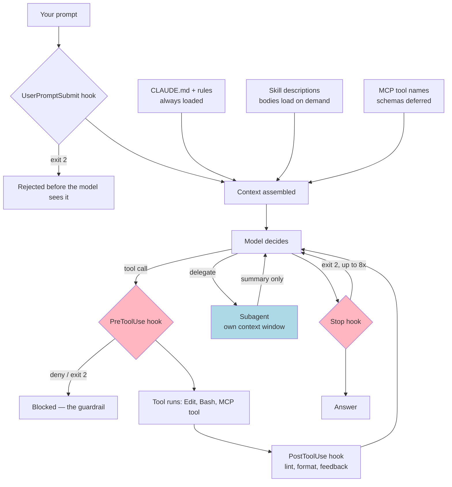

# Research Dossier — Module 10: Coding Agents

**Researched:** 2026-08-25 · **For:** `sections/2_intermediate/10_coding_agents.md` (INTERMEDIATE)
**Scope locked by the stub:** Slash Commands · Skills · AGENTS.md · Subagents · Hooks · MCP · Plugins

**Citation policy in this dossier:** every non-obvious factual claim carries an inline link to a page I
fetched on 2026-08-25. Nothing here comes from training memory. Anything I could not confirm is tagged
`[UNVERIFIED]` or `[LINK-UNVERIFIED]`. See §12 for the full verification log.

> ⚠️ **Two findings that invalidate 2025-era material up front:**
> 1. Claude Code docs **moved** from `docs.claude.com/en/docs/claude-code/*` to
>    **`code.claude.com/docs/en/*`** — a 301 I hit directly on 2026-08-25.
> 2. **Custom slash commands have been merged into Skills.** `.../slash-commands` 301s to
>    `.../skills`, whose own note says so verbatim
>    ([Extend Claude with skills, fetched 2026-08-25](https://code.claude.com/docs/en/skills)).

---

## 1. Executive summary — 10 things the module author must not get wrong

1. **"Slash commands" are no longer a separate Claude Code feature — they are Skills.** Verbatim:
   *"**Custom commands have been merged into skills.** A file at `.claude/commands/deploy.md` and a
   skill at `.claude/skills/deploy/SKILL.md` both create `/deploy` and work the same way. Your existing
   `.claude/commands/` files keep working."*
   ([Extend Claude with skills, fetched 2026-08-25](https://code.claude.com/docs/en/skills))
2. **Skills are a real cross-vendor open standard.** The spec lives at agentskills.io, was
   *"originally developed by Anthropic, released as an open standard"*, and defines exactly **six**
   frontmatter fields — `name`, `description`, `license`, `compatibility`, `metadata`, `allowed-tools`
   ([Agent Skills Specification, fetched 2026-08-25](https://agentskills.io/specification);
   [Agent Skills Overview, fetched 2026-08-25](https://agentskills.io)). Claude Code accepts ~20 more
   fields, but *"If you include any field the spec doesn't allow, packaging or upload fails with a hard
   error"* ([skills docs](https://code.claude.com/docs/en/skills)).
3. **`.agents/skills/` is the emerging vendor-neutral skills directory.** Codex reads
   `$CWD/.agents/skills`, `$REPO_ROOT/.agents/skills`, `$HOME/.agents/skills`
   ([Build skills — Codex, fetched 2026-08-25](https://learn.chatgpt.com/docs/build-skills));
   Gemini CLI reads `~/.agents/skills/` and `.agents/skills/`
   ([Gemini CLI Skills, fetched 2026-08-25](https://geminicli.com/docs/cli/skills/)); Copilot reads
   `.github/skills`, **`.claude/skills`**, or `.agents/skills`
   ([About agent skills — GitHub Docs, fetched 2026-08-25](https://docs.github.com/en/copilot/concepts/agents/about-agent-skills));
   Cursor reads `.agents/skills/`, `.cursor/skills/` **and** `.claude/skills/`, `.codex/skills/`
   ([Skills — Cursor Docs, fetched 2026-08-25](https://cursor.com/docs/context/skills)).
   This is the single biggest "what's new in 2026" story in the module.
4. **Claude Code does NOT read `AGENTS.md`.** Verbatim: *"Claude Code reads `CLAUDE.md`, not
   `AGENTS.md`."* The sanctioned bridges are an `@AGENTS.md` import inside CLAUDE.md, or
   `ln -s AGENTS.md CLAUDE.md`
   ([How Claude remembers your project, fetched 2026-08-25](https://code.claude.com/docs/en/memory)).
   Do not tell students otherwise.
5. **AGENTS.md is now a Linux Foundation project**, *"stewarded by the Agentic AI Foundation under the
   Linux Foundation"*, *"used by over 60k open-source projects"*, and it resolves by
   *"the nearest file in the directory tree"*
   ([AGENTS.md, fetched 2026-08-25](https://agents.md/)).
6. **Hooks are the only deterministic guardrail.** Docs: *"Unlike CLAUDE.md instructions which are
   advisory, hooks are deterministic and guarantee the action happens."*
   ([Best practices, fetched 2026-08-25](https://code.claude.com/docs/en/best-practices)) and
   *"An instruction like 'never edit `.env`' in CLAUDE.md or a skill is a request, not a guarantee. A
   `PreToolUse` hook that blocks the edit is enforcement."*
   ([Extend Claude Code, fetched 2026-08-25](https://code.claude.com/docs/en/features-overview)).
   The June 2026 blog puts it hardest: *"If there's something that absolutely must not happen, an
   instruction is the wrong tool."*
   ([Steering Claude Code, 2026-06-18](https://claude.com/blog/steering-claude-code-skills-hooks-rules-subagents-and-more))
7. **The hook surface is ~31 events in 2026, not the handful of 2025** — and **`PostToolUse` cannot
   block** (it ignores exit 2). Full list and the can-block/cannot-block split in §3.5
   ([Hooks reference, fetched 2026-08-25](https://code.claude.com/docs/en/hooks)).
8. **Context cost is the organizing principle.** CLAUDE.md = every token every request; skill =
   description only until invoked; subagent = zero until spawned, summary back; hook = zero unless it
   prints; MCP = tool *names* only because tool search is on by default
   ([features-overview](https://code.claude.com/docs/en/features-overview);
   [MCP, fetched 2026-08-25](https://code.claude.com/docs/en/mcp)).
9. **MCP is often the wrong answer, and Anthropic says so in its own docs**: *"CLI tools are the most
   context-efficient way to interact with external services."*
   ([Best practices](https://code.claude.com/docs/en/best-practices)). The token argument has a number:
   *"This reduces the token usage from 150,000 tokens to 2,000 tokens—a time and cost saving of 98.7%."*
   ([Code execution with MCP, 2025-11-04](https://www.anthropic.com/engineering/code-execution-with-mcp))
10. **Plugins are the packaging layer, not a feature.** `.claude-plugin/plugin.json` +
    `skills/ commands/ agents/ hooks/hooks.json .mcp.json`, distributed via
    `.claude-plugin/marketplace.json`. The documented trigger is literally *"A second repository needs
    the same setup"* ([features-overview](https://code.claude.com/docs/en/features-overview);
    [Plugin reference, fetched 2026-08-25](https://code.claude.com/docs/en/plugins-reference);
    [Plugin marketplaces, fetched 2026-08-25](https://code.claude.com/docs/en/plugin-marketplaces)).

---

## 2. Canonical definitions & terminology (2026 vocabulary)

All rows sourced from [skills](https://code.claude.com/docs/en/skills),
[sub-agents](https://code.claude.com/docs/en/sub-agents),
[hooks](https://code.claude.com/docs/en/hooks),
[memory](https://code.claude.com/docs/en/memory) and
[features-overview](https://code.claude.com/docs/en/features-overview), all fetched 2026-08-25.

| Term | Definition | 2025 name, if different |
|---|---|---|
| **Skill** | A `SKILL.md` file plus optional bundled files, loaded on demand, invocable as `/name` or auto-selected by the model from its `description`. | "Agent Skill"; also absorbed "custom slash command" |
| **Custom command** | Legacy flat form `.claude/commands/<name>.md` → `/name`. Still supported; same frontmatter *"except `name` and `paths`, which Claude Code ignores in a command file."* | "slash command" |
| **Bundled skill** | Ships with Claude Code (`/code-review`, `/debug`, `/batch`, `/verify`, `/doctor`). A same-named local skill overrides it *"but not the bundled skill's aliases."* | "built-in command" |
| **Subagent** | A separate agent loop with its own context window, system prompt, tool allowlist and model, defined in `.claude/agents/<name>.md`. | "sub-agent" |
| **Fork** | A subagent that *inherits* the parent conversation and system prompt (`/subtask`, or `context: fork` on a skill). | — |
| **Hook** | A `command`, `http`, `mcp_tool`, `prompt` or `agent` handler Claude Code fires at a lifecycle event. | same (handler types are new) |
| **Rule** | `.claude/rules/*.md`, optionally with `paths:` frontmatter so it loads only when matching files are touched. | — |
| **Auto memory** | Notes *Claude* writes about you/the project into `~/.claude/projects/<project>/memory/`; index capped at *"first 200 lines or 25KB"*. | — |
| **MCP** | Model Context Protocol; servers expose **Resources, Prompts, Tools**, clients may offer **Elicitation** ([MCP Specification 2026-07-28, fetched 2026-08-25](https://modelcontextprotocol.io/specification/latest)). | same |
| **Plugin** | Installable bundle of skills/commands/agents/hooks/MCP servers/LSP servers. | same |
| **Marketplace** | A git repo with `.claude-plugin/marketplace.json` listing plugins. | — |
| **AGENTS.md** | *"a simple, open format for guiding coding agents"*, nearest-file-wins ([agents.md](https://agents.md/)). | — |

---

## 3. Deep dive per required topic

### 3.1 Slash commands (→ Skills)

**What it is.** A user-invocable prompt template. In Claude Code 2026 that is a skill with
`disable-model-invocation: true`, or a legacy `.claude/commands/*.md` file. All facts in this
subsection: [Extend Claude with skills, fetched 2026-08-25](https://code.claude.com/docs/en/skills).

**Where the command name comes from** (verbatim table from the docs):

| Skill location | Command name source | Example |
|---|---|---|
| `~/.claude/skills/` or `.claude/skills/` | directory name | `.claude/skills/deploy-staging/SKILL.md` → `/deploy-staging` |
| Nested `.claude/skills/`, on a name clash | subdirectory path + skill dir name | `apps/web/.claude/skills/deploy/SKILL.md` → `/apps/web:deploy` |
| File under `.claude/commands/` | file name without extension | `.claude/commands/deploy.md` → `/deploy` |
| Plugin `skills/` subdirectory | frontmatter `name` or dir name, namespaced by plugin | `my-plugin/skills/review/SKILL.md` → `/my-plugin:review` |

**Precedence:** *"Across levels, enterprise overrides personal, and personal overrides project."* and
*"if a skill and a command share the same name, the skill takes precedence."* Plugin skills use a
`plugin-name:skill-name` namespace *"so they can't conflict with other levels."*

**Arguments — ⚠️ the indexing is 0-based.** From the substitutions table:

| Placeholder | Meaning (verbatim) |
|---|---|
| `$ARGUMENTS` | *"All arguments passed when invoking the skill. If `$ARGUMENTS` is not present in the content, arguments are appended as `ARGUMENTS: <value>`."* |
| `$ARGUMENTS[N]` | *"Access a specific argument by 0-based index"* |
| `$N` | *"Shorthand for `$ARGUMENTS[N]`, such as `$0` for the first argument or `$1` for the second."* |
| `$name` | named arg declared in the `arguments:` frontmatter list, mapped by position |
| `${CLAUDE_SKILL_DIR}` `${CLAUDE_PROJECT_DIR}` `${CLAUDE_PLUGIN_ROOT}` `${CLAUDE_PLUGIN_DATA}` `${CLAUDE_SESSION_ID}` `${CLAUDE_EFFORT}` | path/session substitutions |

Most 2025 tutorials say `$1` is the first argument. **Current docs say `$0` is the first.** Say this
explicitly in the module. Escape a literal with a backslash: `\$1.00`. Indexed args use shell-style
quoting, so `"hello world"` is one argument.

**Dynamic context.** *"The `` !`<command>` `` syntax runs shell commands before the skill content is
sent to Claude. The command output replaces the placeholder, so Claude receives actual data, not the
command itself."* `@path` attaches a file. This is the highest-leverage trick for an SDLC command.

**Minimal working example — a `/spec` command (requirements phase).** Pattern verified against the
docs' own `pr-summary` and `fix-issue` examples
([skills](https://code.claude.com/docs/en/skills);
[best-practices](https://code.claude.com/docs/en/best-practices)):

```markdown
<!-- .claude/skills/spec/SKILL.md -->
---
name: spec
description: Turn a rough feature request into a written spec with acceptance criteria
argument-hint: <feature description>
disable-model-invocation: true
allowed-tools: Read, Grep, Glob, Write, Bash(git *)
---

## Repo context
- Current branch: !`git branch --show-current`
- Existing specs: !`ls docs/specs 2>/dev/null | tail -5`
- Conventions: @docs/CONTRIBUTING.md

## Your task
Write `docs/specs/<slug>.md` for this request:

$ARGUMENTS

It must contain: problem statement, non-goals, API/schema changes,
acceptance criteria as a checklist, test plan, rollout & rollback.
Ask me at most three clarifying questions first if anything is ambiguous.
```

**When NOT to use.** If Claude should decide *on its own* when to apply it → a model-invocable skill.
If it must run every time regardless of intent → a hook.

---

### 3.2 Agent Skills

**What it is.** Progressive-disclosure packaging of knowledge or procedure. The spec names three stages
verbatim: *"1. **Metadata** (~100 tokens) … loaded at startup for all skills. 2. **Instructions**
(< 5000 tokens recommended) … loaded when the skill is activated. 3. **Resources** (as needed)"*
([Agent Skills Specification](https://agentskills.io/specification)).
Both the spec and Claude Code say *"Keep your main `SKILL.md` under 500 lines."*
([spec](https://agentskills.io/specification); [skills](https://code.claude.com/docs/en/skills))

**Canonical layout (from the spec):**
```text
skill-name/
├── SKILL.md          # Required: metadata + instructions
├── scripts/          # Optional: executable code
├── references/       # Optional: documentation
├── assets/           # Optional: templates, resources
└── ...
```
Claude Code's own illustration uses `reference.md` / `examples.md` / `scripts/helper.py` at the skill
root and annotates the script as *"executed, not loaded"*
([skills](https://code.claude.com/docs/en/skills)).

**Where skills live** (verbatim table, [skills](https://code.claude.com/docs/en/skills)):

| Location | Path | Applies to |
|---|---|---|
| Enterprise | managed settings dir (e.g. `/etc/claude-code/.claude/skills/<name>/` on Linux) | all users in the org |
| Personal | `~/.claude/skills/<skill-name>/SKILL.md` | all your projects |
| Project | `.claude/skills/<skill-name>/SKILL.md` | this project only |
| Plugin | `<plugin>/skills/<skill-name>/SKILL.md` | where the plugin is enabled |

Project skills also load from `.claude/skills/` in *"every parent directory up to the repository root"*;
nested ones below cwd *"load the first time Claude reads or edits a file inside that subdirectory."*

**Frontmatter — the portable six (agentskills.io spec, with its own constraints):**

| Field | Required | Constraint (verbatim) |
|---|---|---|
| `name` | Yes | *"Max 64 characters. Lowercase letters, numbers, and hyphens only. Must not start or end with a hyphen."* — also *"Must not contain consecutive hyphens"* and *"Must match the parent directory name"* |
| `description` | Yes | *"Max 1024 characters. Non-empty. Describes what the skill does and when to use it."* |
| `license` | No | license name or bundled file reference |
| `compatibility` | No | *"Max 500 characters"* — environment requirements |
| `metadata` | No | *"a map from string keys to string values"* |
| `allowed-tools` | No | *"Space-separated string of pre-approved tools… (Experimental)"* |

**Frontmatter — Claude Code's superset** ([skills](https://code.claude.com/docs/en/skills)):
`name`, `description`, `when_to_use`, `argument-hint`, `arguments`, `disable-model-invocation`,
`user-invocable`, `allowed-tools`, `disallowed-tools`, `model`, `effort`, `context`, `agent`,
`background`, `hooks`, `paths`, `shell`, `metadata`, `license`, `compatibility`.
Note the two different limits: the **spec** caps `description` at **1024 chars**; **Claude Code**
additionally truncates `description` + `when_to_use` at **1,536 characters in the skill listing**
*"to reduce context usage"* — put the key use case first.

**Who invokes it — verbatim control table** ([skills](https://code.claude.com/docs/en/skills)):

| Frontmatter | You can invoke | Claude can invoke | When loaded into context |
|---|---|---|---|
| (default) | Yes | Yes | Description always in context, full skill loads when invoked |
| `disable-model-invocation: true` | Yes | No | Description not in context, full skill loads when you invoke |
| `user-invocable: false` | No | Yes | Description always in context, full skill loads when invoked |

**Lifecycle gotcha to teach.** *"When you or Claude invoke a skill, the rendered `SKILL.md` content
enters the conversation as a single message and stays there for the rest of the session… every line is a
recurring token cost."* After auto-compaction, invoked skills are re-attached *"keeping the first 5,000
tokens of each"* within a *"combined budget of 25,000 tokens"*, most-recent-first
([skills](https://code.claude.com/docs/en/skills)).

**Running a skill in isolation.** `context: fork` *"runs in a forked subagent context. The skill content
becomes the prompt that drives the subagent. It won't have access to your conversation history."*
Default is now background (`background: true`); *"Before v2.1.218, forked skills always blocked the turn
until they finished."* Docs warning: *"`context: fork` only makes sense for skills with explicit
instructions"* — a reference skill forked gets *"the guidelines but no actionable prompt, and returns
without meaningful output."* ([skills](https://code.claude.com/docs/en/skills))

**Minimal working example — a test-runner skill (test phase):**

```markdown
<!-- .claude/skills/run-tests/SKILL.md -->
---
name: run-tests
description: Run this repo's test suite the correct way and triage failures. Use whenever tests need running or a test failure needs diagnosing.
allowed-tools: Bash(uv run pytest *), Read, Edit
---

Always run tests with `uv run pytest -q`, never bare `pytest`.

1. Run the narrowest scope that covers the change, then the full suite.
2. On failure: read the traceback bottom-up, reproduce with `-x -k <test>`.
3. Never change a test to make it pass unless the test encodes the wrong
   requirement — say so explicitly and ask first.
4. For flaky-looking failures see [references/flaky.md](references/flaky.md).
```

**Pre-approving a bundled script without a prompt** — a genuinely useful documented pattern
([skills](https://code.claude.com/docs/en/skills)):
```yaml
---
name: render-chart
description: Render a chart from a CSV file
allowed-tools: Bash(${CLAUDE_SKILL_DIR}/scripts/render.sh *)
---
Run `${CLAUDE_SKILL_DIR}/scripts/render.sh <csv-file>` to render the chart.
```
*"Using the same variable in both places lets a skill run a bundled script without a permission prompt."*
Note the scope of the grant: `allowed-tools` applies *"during the turn that invokes the skill"* and
*"The grant clears when you send your next message."*

**When NOT to use a skill.** Always-true facts → CLAUDE.md. Hard prohibitions → hook. An external
system's API → MCP, *plus* a skill documenting how to use it.

**Description quality is the #1 failure mode.** The spec's own good/poor pair:
good = *"Extracts text and tables from PDF files, fills PDF forms, and merges multiple PDFs. Use when
working with PDF documents or when the user mentions PDFs, forms, or document extraction."*;
poor = *"Helps with PDFs."* ([spec](https://agentskills.io/specification))

---

### 3.3 AGENTS.md vs CLAUDE.md vs Cursor rules vs copilot-instructions.md

**AGENTS.md, the neutral file.** *"a simple, open format for guiding coding agents"*; it *"emerged from
collaborative efforts across the AI software development ecosystem, including OpenAI Codex, Amp, Jules
from Google, Cursor, and Factory"*; it is now *"stewarded by the Agentic AI Foundation under the Linux
Foundation"*; adoption is *"used by over 60k open-source projects"*. Monorepo rule: *"place another
AGENTS.md inside each package. Agents automatically read the nearest file in the directory tree, so the
closest one takes precedence."* Content guidance: *"anything you'd tell a new teammate"* — project
overview, build/test commands, code style, testing instructions, security considerations, commit format,
deployment ([AGENTS.md, fetched 2026-08-25](https://agents.md/)).

**Claude Code's position, verbatim** ([memory](https://code.claude.com/docs/en/memory)):
*"Claude Code reads `CLAUDE.md`, not `AGENTS.md`. If your repository already uses `AGENTS.md` for other
coding agents, create a `CLAUDE.md` that imports it so both tools read the same instructions without
duplicating them."*

```markdown
<!-- CLAUDE.md -->
@AGENTS.md

## Claude Code
Use plan mode for changes under `src/billing/`.
```
Or `ln -s AGENTS.md CLAUDE.md` — *"On Windows, creating a symlink requires Administrator privileges or
Developer Mode, so use the `@AGENTS.md` import instead."*

**Migration paths Anthropic ships:** `/init` *"reads Cursor rules, in `.cursor/rules/` or
`.cursorrules`, and Copilot rules, in `.github/copilot-instructions.md`"*; with
`CLAUDE_CODE_NEW_INIT=1` it also reads *"`AGENTS.md`, `.devin/rules/`, `.windsurf/rules/` or
`.windsurfrules`, and `.clinerules`."* And `/import` (v2.1.213+) *"appends a one-time copy of
instruction files such as `AGENTS.md` to the matching `CLAUDE.md` and carries over MCP servers,
commands, subagents, and skills."* ([memory](https://code.claude.com/docs/en/memory))

**Claude Code memory locations, in load order broad → specific** (verbatim from
[memory](https://code.claude.com/docs/en/memory)):

| Scope | Location |
|---|---|
| Managed policy | `/Library/Application Support/ClaudeCode/CLAUDE.md` (macOS) · `/etc/claude-code/CLAUDE.md` (Linux/WSL) · `C:\Program Files\ClaudeCode\CLAUDE.md` — *"cannot be excluded"*; or inline via the `claudeMd` key in managed settings |
| User | `~/.claude/CLAUDE.md`, `~/.claude/rules/*.md` |
| Project | `./CLAUDE.md` **or** `./.claude/CLAUDE.md`, `.claude/rules/*.md` |
| Local | `./CLAUDE.local.md` (*"add to `.gitignore`"*) |

Mechanics: *"All discovered files are concatenated into context rather than overriding each other"*,
ordered *"from the filesystem root down to your working directory"*, with `CLAUDE.local.md` appended
after `CLAUDE.md` in each directory. Subdirectory files load on demand. `@path` imports are *"expanded
and loaded into context at launch"* with *"a maximum depth of four hops"*; imports are skipped inside
code spans/fences; an import resolving outside cwd triggers a one-time approval dialog.
`claudeMdExcludes` (globs, any settings layer) skips other teams' files in a monorepo.

**Path-scoped rules — the cure for a bloated CLAUDE.md** ([memory](https://code.claude.com/docs/en/memory)):
```markdown
<!-- .claude/rules/api.md -->
---
paths:
  - "src/api/**/*.ts"
---
# API Development Rules
- All API endpoints must include input validation
- Use the standard error response format
```
*"Rules without a `paths` field are loaded unconditionally"*; path-scoped ones *"trigger when Claude
reads files matching the pattern, not on every tool use."*

**What belongs in CLAUDE.md — Anthropic's own include/exclude table**
([best-practices](https://code.claude.com/docs/en/best-practices)):

| ✅ Include | ❌ Exclude |
|---|---|
| Bash commands Claude can't guess | Anything Claude can figure out by reading code |
| Code style rules that differ from defaults | Standard language conventions Claude already knows |
| Testing instructions and preferred test runners | Detailed API documentation (link to docs instead) |
| Repository etiquette (branch naming, PR conventions) | Information that changes frequently |
| Architectural decisions specific to your project | Long explanations or tutorials |
| Developer environment quirks (required env vars) | File-by-file descriptions of the codebase |
| Common gotchas or non-obvious behaviors | Self-evident practices like "write clean code" |

The test to teach: *"For each line, ask: 'Would removing this cause Claude to make mistakes?' If not, cut
it. Bloated CLAUDE.md files cause Claude to ignore your actual instructions!"* Target *"under 200 lines
per CLAUDE.md file"*; a file over 4 MiB is skipped entirely
([best-practices](https://code.claude.com/docs/en/best-practices);
[memory](https://code.claude.com/docs/en/memory)).

**And the honesty note worth quoting to students:** *"CLAUDE.md content is delivered as a user message
after the system prompt, not as part of the system prompt itself. Claude reads it and tries to follow
it, but there's no guarantee of strict compliance."*
([memory](https://code.claude.com/docs/en/memory))

---

### 3.4 Subagents

All facts here: [Subagents, fetched 2026-08-25](https://code.claude.com/docs/en/sub-agents).

**Locations & priority (highest first):** managed settings → `--agents` CLI flag JSON →
`.claude/agents/` (project) → `~/.claude/agents/` (personal) → plugin `agents/`.

**Frontmatter fields:** `name` (required), `description` (required), `tools`, `disallowedTools`,
`model` (`sonnet|opus|haiku|fable|<full id>`, default `inherit`), `permissionMode`, `maxTurns`, `skills`,
`mcpServers`, `hooks`, `memory` (`user|project|local`), `background`, `effort`,
`isolation` (`worktree`), `color`, `initialPrompt`.

**Context isolation.** A non-fork subagent starts with its own system prompt + environment details, the
task message from the lead, **all CLAUDE.md levels**, a git status snapshot, fully preloaded `skills:`,
and a sibling roster. It does **not** get the conversation history, the output style, or the main
session's auto memory. A **fork** *"inherit[s] the entire parent conversation context."*

**Invocation.** Natural language naming the subagent; a guaranteed `@"code-reviewer (agent)"` mention;
or session-wide via `claude --agent code-reviewer` / `{"agent": "code-reviewer"}` in settings.
Resuming works: Claude uses `SendMessage` with the agent's ID or name and *"The subagent retains full
conversation history and picks up where it stopped."*

**Minimal working example — the code-review subagent (review phase).** Anthropic's own
`security-reviewer` example, which the module can adapt
([best-practices](https://code.claude.com/docs/en/best-practices)):

```markdown
<!-- .claude/agents/security-reviewer.md -->
---
name: security-reviewer
description: Reviews code for security vulnerabilities
tools: Read, Grep, Glob, Bash
model: opus
---
You are a senior security engineer. Review code for:
- Injection vulnerabilities (SQL, XSS, command injection)
- Authentication and authorization flaws
- Secrets or credentials in code
- Insecure data handling

Provide specific line references and suggested fixes.
```

A correctness-review variant with preloaded skills (fields verified in the frontmatter table):
```markdown
<!-- .claude/agents/code-reviewer.md -->
---
name: code-reviewer
description: Reviews a diff for correctness and convention violations. Use after a feature branch is implemented and before opening a PR.
tools: Read, Grep, Glob, Bash
model: sonnet
skills:
  - api-conventions
---
Read `git diff main...HEAD`. Report only findings you are confident about, as
`file:line — blocker|should-fix|nit — what's wrong — the fix`.
Never edit files. Never comment on formatting the linter already enforces.
End with one line: SHIP / FIX-FIRST.
```

**When delegation pays off.** *"Since context is your fundamental constraint, subagents are one of the
most powerful tools available. When Claude researches a codebase it reads lots of files, all of which
consume your context. Subagents run in separate context windows and report back summaries"*
([best-practices](https://code.claude.com/docs/en/best-practices)). Also: a *fresh* reviewer is a
better reviewer — *"A reviewer running in a fresh subagent context sees only the diff and the criteria
you give it, not the reasoning that produced the change."* And the read-only `tools:` list is real
enforcement, not a request.

**When NOT to.** Anthropic's own caution about adversarial review is the best teaching point:
*"A reviewer prompted to find gaps will usually report some, even when the work is sound, because that is
what it was asked to do. Chasing every finding leads to over-engineering."*
([best-practices](https://code.claude.com/docs/en/best-practices)). Add: don't delegate work that needs
the conversation you already have (use a fork), don't delegate single-file lookups, and don't chain
subagents that each need the previous one's full output.

---

### 3.5 Hooks — the deterministic guardrail (give this the most space)

All facts here: [Hooks reference, fetched 2026-08-25](https://code.claude.com/docs/en/hooks), unless
noted.

**Where config lives** (verbatim table):

| Location | Scope | Shareable |
|---|---|---|
| `~/.claude/settings.json` | all projects | No, local to machine |
| `.claude/settings.json` | single project | **Yes, commit to repo** |
| `.claude/settings.local.json` | single project | No, gitignored |
| managed policy settings | organization-wide | Yes, admin-controlled |
| `[Plugin]/hooks/hooks.json` | when plugin enabled | Yes, bundled with plugin |
| skill frontmatter | rest of session after invocation | Yes, in skill file |
| subagent frontmatter | while subagent running | Yes, in subagent file |

**Config shape** (handler types: `command`, `http`, `mcp_tool`, `prompt`, `agent`):
```json
{
  "hooks": {
    "PreToolUse": [
      {
        "matcher": "Edit|Write",
        "hooks": [
          { "type": "command",
            "command": "${CLAUDE_PROJECT_DIR}/.claude/hooks/protect-migrations.sh",
            "timeout": 60,
            "async": false }
        ]
      }
    ]
  },
  "disableAllHooks": false
}
```

**Events (full 2026 list):** `SessionStart`, `Setup`, `UserPromptSubmit`, `UserPromptExpansion`,
`PreToolUse`, `PermissionRequest`, `PermissionDenied`, `PostToolUse`, `PostToolUseFailure`,
`PostToolBatch`, `Notification`, `MessageDisplay`, `SubagentStart`, `SubagentStop`, `TaskCreated`,
`TaskCompleted`, `Stop`, `StopFailure`, `TeammateIdle`, `InstructionsLoaded`, `ConfigChange`,
`CwdChanged`, `DirectoryAdded`, `FileChanged`, `WorktreeCreate`, `WorktreeRemove`, `PreCompact`,
`PostCompact`, `Elicitation`, `ElicitationResult`, `SessionEnd`.
**Teach only these seven:** `PreToolUse`, `PostToolUse`, `UserPromptSubmit`, `SessionStart`, `Stop`,
`SubagentStop`, `PreCompact`. Mention the rest exists and link the reference.

**Matcher semantics.** `"*"` / `""` / omitted = match all. Letters, digits, `_`, `-`, spaces, `,`, `|`
= exact string or `|`-separated list. **Any other character makes it an unanchored JavaScript regex**
(e.g. `^Notebook`, `mcp__memory__.*`). Tool events match the tool name; `SessionStart` matches
`startup|resume|clear|compact|fork`; `UserPromptSubmit`, `PostToolBatch`, `Stop`, `TeammateIdle`,
`TaskCreated`, `TaskCompleted`, `WorktreeCreate/Remove`, `MessageDisplay` support **no** matcher.

**Exit-code contract**

| Exit | Meaning |
|---|---|
| `0` | Success, action proceeds. stdout starting with `{` is parsed as JSON, else plain text. For most events stdout only goes to the debug log — **except `UserPromptSubmit`, `UserPromptExpansion`, `SessionStart`, where plain-text stdout is added as Claude-visible context.** |
| `2` | **Blocking error** on supported events. Message from the JSON decision reason or stderr. *"Override-proof: JSON `permissionDecision: "allow"` cannot override it."* |
| other | Honored if stdout is valid JSON that passes the schema; otherwise a non-blocking error and the action proceeds. |

**Can block on exit 2:** `PreToolUse`, `UserPromptSubmit`, `UserPromptExpansion`, `Stop`,
`SubagentStop`, `TeammateIdle`, `TaskCreated`, `TaskCompleted`, `ConfigChange`, `PostToolBatch`,
`Elicitation`, `ElicitationResult`, `PreCompact`, `WorktreeCreate`.
**Ignores exit 2 (⚠️ note `PostToolUse` and `SessionStart` are here):** `PermissionRequest`,
`StopFailure`, `PostToolUse`, `PostToolUseFailure`, `PermissionDenied`, `Notification`,
`SubagentStart`, `SessionStart`, `Setup`, `SessionEnd`, `CwdChanged`, `DirectoryAdded`, `FileChanged`,
`PostCompact`, `WorktreeRemove`, `InstructionsLoaded`, `MessageDisplay`.

**JSON output contract**
```json
{
  "hookSpecificOutput": {
    "hookEventName": "PreToolUse",
    "permissionDecision": "allow|deny",
    "permissionDecisionReason": "Human-readable reason",
    "additionalContext": "Optional context for Claude"
  },
  "systemMessage": "Message to surface",
  "continue": false
}
```
Also documented: `updatedInput` (rewrite the tool call, e.g. `{"command": "new_command"}`),
`terminalSequence`, and the `if` field on a handler (a permission rule such as `Bash(rm *)`).

**Stdin every hook receives:** `session_id`, `prompt_id`, `transcript_path`, `cwd`, `permission_mode`,
`hook_event_name`, plus `agent_id` / `agent_type` inside a subagent, plus event-specific fields.

**Minimal working example — block edits to committed migrations.** Anthropic explicitly suggests this
exact use case: *"Try prompts like … 'Write a hook that blocks writes to the migrations folder.'"*
([best-practices](https://code.claude.com/docs/en/best-practices))

`.claude/settings.json`:
```json
{
  "hooks": {
    "PreToolUse": [
      { "matcher": "Edit|Write|NotebookEdit",
        "hooks": [ { "type": "command",
          "command": "${CLAUDE_PROJECT_DIR}/.claude/hooks/protect-migrations.sh" } ] }
    ]
  }
}
```
`.claude/hooks/protect-migrations.sh` (chmod +x):
```bash
#!/usr/bin/env bash
# Already-committed migrations are immutable. New ones are fine.
path=$(jq -r '.tool_input.file_path // ""')   # stdin JSON, documented field

case "$path" in
  */migrations/*)
    if git ls-files --error-unmatch "$path" >/dev/null 2>&1; then
      cat <<'JSON'
{"hookSpecificOutput":{"hookEventName":"PreToolUse",
 "permissionDecision":"deny",
 "permissionDecisionReason":"This migration is already committed and may be applied in an environment. Create a NEW migration instead of editing this one."}}
JSON
      exit 0
    fi
    ;;
esac
exit 0
```
Teaching point: `permissionDecision: "deny"` on exit 0 is the *polite* block that hands Claude a reason
it can act on; `exit 2` with a stderr message is the blunt, override-proof block. Show both.

**Second example — advisory lint after every edit.** Anthropic's suggested prompt is *"Write a hook that
runs eslint after every file edit"* ([best-practices](https://code.claude.com/docs/en/best-practices)).
The point to teach: `PostToolUse` **cannot** block, so it is *feedback*, not enforcement — its output
lands in context for Claude to react to (*"A `PostToolUse` hook that runs your linter feeds results back
as text Claude reads"*, [features-overview](https://code.claude.com/docs/en/features-overview)).

**Third example — the anti-"it works now!" gate.** *"**As a deterministic gate**: a [Stop hook] runs your
check as a script and blocks the turn from ending until it passes. Claude Code overrides the hook and
ends the turn after 8 consecutive blocks."*
([best-practices](https://code.claude.com/docs/en/best-practices)). That 8-block escape hatch is
important and non-obvious — state it, so students don't build an infinite gate.

**When NOT to use hooks.** Anything requiring judgment (though `prompt` and `agent` handler types now
blur this). Anything expensive on a high-frequency event. And never a hook that edits files in a way
that re-triggers its own event (§8).

---

### 3.6 MCP

**What it is.** An open client/server protocol. The spec's own framing: hosts initiate, clients connect,
servers provide. Server features are *"**Resources**: Context and data… **Prompts**: Templated messages
and workflows for users… **Tools**: Functions for the AI model to execute"*; client features listed on
the current revision are *"**Elicitation**: Server-initiated requests for additional information from
users"*. **Current spec revision: 2026-07-28**, per the schema path
`schema/2026-07-28/schema.ts` and the section links on the page
([MCP Specification, fetched 2026-08-25](https://modelcontextprotocol.io/specification/latest)).
Notable 2026 extensions named on that page: **Tasks**, **MCP Apps**, and — directly relevant to this
module — **"Skills over MCP"**, *"Rich, structured instructions for agent workflows, discovered and
consumed through MCP"*.

**Transports in Claude Code** ([MCP, fetched 2026-08-25](https://code.claude.com/docs/en/mcp)):
`--transport http` (the docs note *"the `type` field accepts `streamable-http` as an alias for `http`.
The MCP specification uses the name `streamable-http` for this transport"*), `--transport sse` for
services that *"still expose only an SSE endpoint"*, stdio for local subprocesses, and `ws` via
`add-json` only (*"HTTP supports OAuth and the `claude mcp add --transport` flag, while WebSocket
supports neither"*).

**Adding a server** (all forms verbatim from [MCP](https://code.claude.com/docs/en/mcp)):
```bash
# remote HTTP
claude mcp add --transport http notion https://mcp.notion.com/mcp

# local stdio — everything after -- is passed to the server untouched
claude mcp add --env AIRTABLE_API_KEY=YOUR_KEY --transport stdio airtable \
  -- npx -y airtable-mcp-server

# paste another client's JSON
claude mcp add-json example '{"command":"npx","args":["-y","@example/mcp-server"]}'

claude mcp list          # shows ✔ Connected / ! Needs authentication / ✘ Failed to connect
claude mcp get <name>
```

**Scopes** (verbatim table) — note the default is **local**, not user:

| Scope | Loads in | Shared with team | Stored in |
|---|---|---|---|
| Local (**the default**) | current project only | No | `~/.claude.json` |
| Project | current project only | **Yes, via version control** | `.mcp.json` in project root |
| User | all your projects | No | `~/.claude.json` |

**Precedence** when the same server is defined twice: *"1. Local scope 2. Project scope 3. User scope
4. Plugin-provided servers 5. claude.ai connectors"*, and *"The entire server entry from that source is
used; fields are not merged across scopes."*

**`.mcp.json` at the project root** — the team-sharing mechanism (*"Check `.mcp.json` into version
control so everyone on your team gets the same MCP tools and services."*):
```json
{
  "mcpServers": {
    "sentry": { "type": "http", "url": "https://mcp.sentry.dev/mcp" },
    "postgres": {
      "command": "npx",
      "args": ["-y", "@modelcontextprotocol/server-postgres"],
      "env": { "DATABASE_URL": "${DATABASE_URL}" },
      "timeout": 600000
    }
  }
}
```
⚠️ A cloned repo can't approve its own servers: project servers show as
`⏸ Pending approval (run \`claude\` to approve)` until you trust the workspace — good security teaching
point ([MCP](https://code.claude.com/docs/en/mcp)).

**Naming.** MCP prompts surface as commands *"with the format `/mcp__servername__promptname`"*, e.g.
`/mcp__jira__create_issue "Bug in login flow" high`. Resources are referenced as
`@server:protocol://resource/path`. Plugin-bundled server tools take the longer form
`mcp__plugin_<plugin-name>_<server-name>__<tool-name>`, and *"A hook matcher written against the bare
server key, such as `mcp__database-tools__.*`, never fires for a plugin-bundled server."* — a great
gotcha to mention ([MCP](https://code.claude.com/docs/en/mcp)).

**Tool search — the built-in mitigation for MCP context bloat.** *"Tool search keeps MCP context usage
low by deferring tool definitions until Claude needs them. Only tool names and server instructions load
at session start, so adding more MCP servers has minimal impact on your context window."* It is the
default; it's disabled by `ENABLE_TOOL_SEARCH=false`, a custom `ANTHROPIC_BASE_URL`, or an unsupported
deployment ([MCP](https://code.claude.com/docs/en/mcp)).

**When MCP is the RIGHT answer.** No safe CLI exists (Figma, a browser, a BI warehouse); the server
manages OAuth; several different clients need the same integration; you need *resources* or server-side
*prompts*; or you want an MCP server acting as a **channel** that pushes events into the session
(*"so Claude reacts to Telegram messages, Discord chats, or webhook events while you're away"*,
[MCP](https://code.claude.com/docs/en/mcp)).

**When MCP is the WRONG answer.** Anthropic's own guidance, verbatim: *"CLI tools are the most
context-efficient way to interact with external services. If you use GitHub, install the `gh` CLI."*
and *"Claude is also effective at learning CLI tools it doesn't already know. Try prompts like
`Use 'foo-cli-tool --help' to learn about foo tool…`"*
([best-practices](https://code.claude.com/docs/en/best-practices)). The token argument, with the number:
*"This reduces the token usage from 150,000 tokens to 2,000 tokens—a time and cost saving of 98.7%."* —
from loading all tool definitions upfront and passing intermediate results through context, versus
letting the agent write code against the tools
([Code execution with MCP, 2025-11-04](https://www.anthropic.com/engineering/code-execution-with-mcp)).
Also wrong when you only need *knowledge* (→ skill), and when the action must be unconditional
(→ hook, since a tool is something the model *may* skip).

---

### 3.7 Plugins

All facts: [Plugin reference](https://code.claude.com/docs/en/plugins-reference) and
[Plugin marketplaces](https://code.claude.com/docs/en/plugin-marketplaces), both fetched 2026-08-25.

**Layout** (documented component locations):
```text
team-workflow/
├── .claude-plugin/plugin.json   # manifest
├── skills/<name>/SKILL.md       # skills
├── commands/*.md                # flat legacy commands
├── agents/*.md                  # subagents
├── hooks/hooks.json             # event handlers
├── .mcp.json                    # MCP servers
├── .lsp.json                    # language servers
├── output-styles/ themes/ monitors/ scripts/
└── bin/                         # executables added to the Bash tool PATH
```

**`plugin.json` — minimal, then useful.** *"`name` (string): Unique identifier in kebab-case"* is the
only required field.
```json
{
  "name": "team-workflow",
  "displayName": "Acme Team Workflow",
  "version": "1.0.0",
  "description": "Acme's SDLC: /spec, code-review agent, migration guard, Sentry MCP",
  "author": { "name": "Acme Platform Team" },
  "license": "MIT",
  "hooks": "./hooks/hooks.json",
  "mcpServers": "./.mcp.json",
  "userConfig": {
    "jira_project_key": { "type": "string", "title": "Jira project key", "required": true }
  }
}
```
Documented fields: `name`, `displayName`, `version`, `description`, `author`, `homepage`, `repository`,
`license`, `keywords`, `metadata`, `skills`, `commands`, `agents`, `hooks`, `mcpServers`,
`outputStyles`, `lspServers`, `experimental`, `dependencies`, `defaultEnabled`, `userConfig`.

**Environment variables:** `${CLAUDE_PLUGIN_ROOT}` (install dir), `${CLAUDE_PLUGIN_DATA}`
(*"Persistent data directory"* that survives updates), `${CLAUDE_PROJECT_DIR}`. `userConfig` values
reach skills/agents as `${user_config.KEY}` and hook processes as `CLAUDE_PLUGIN_OPTION_<KEY>`.

**Marketplace** — `.claude-plugin/marketplace.json` at the repo root; required fields `name`, `owner`
(with a required `name`), `plugins`:
```json
{
  "name": "acme-plugins",
  "owner": { "name": "Acme Platform Team" },
  "plugins": [
    { "name": "team-workflow", "source": "./plugins/team-workflow",
      "description": "Acme's SDLC workflow" }
  ]
}
```
Sources may be a relative path string or an object with `source` = `github` (with `repo`, `ref`, `sha`),
`url`, `git-subdir`, `npm`, `archive`, or `command`.

**CLI:**
```bash
claude plugin init my-plugin --with skills hooks mcp
claude plugin validate ./my-plugin
claude plugin marketplace add acme-corp/claude-plugins        # or owner/repo@branch, a git URL, or ./path
claude plugin install team-workflow@acme-plugins --scope project
claude plugin list | details | enable | disable | update | uninstall
claude plugin tag ./my-plugin --push
```

**Self-provisioning a repo** — commit this to `.claude/settings.json` and everyone on the team gets the
setup when they trust the folder:
```json
{
  "extraKnownMarketplaces": {
    "acme-plugins": { "source": { "source": "github", "repo": "acme-corp/claude-plugins" } }
  },
  "enabledPlugins": { "team-workflow@acme-plugins": true }
}
```

**Real, inspectable examples on this machine** (read-only; cite as "this is not hypothetical"):

| Path | What it shows |
|---|---|
| `~/.claude/plugins/cache/claude-plugins-official/sentry/1.3.2/.claude-plugin/plugin.json` | A plugin that is *only* an MCP server + 8 skills, declaring the server inline: `"mcpServers": {"sentry": {"type": "http", "url": "https://mcp.sentry.dev/mcp"}}` |
| `~/.claude/plugins/cache/claude-plugins-official/superpowers/6.3.0/hooks/hooks.json` | A real `SessionStart` hook, matcher `startup|clear|compact`, command `"${CLAUDE_PLUGIN_ROOT}/hooks/run-hook.cmd" session-start` |
| `~/.claude/plugins/cache/claude-plugins-official/superpowers/6.3.0/` | **The portability story in one directory:** `.claude-plugin/`, `.cursor-plugin/`, `.codex-plugin/`, `.devin-plugin/`, `.kimi-plugin/`, `.hermes-plugin/`, `.opencode/`, `.pi/`, `.agents/plugins/marketplace.json`, `gemini-extension.json` (with `"contextFileName": "GEMINI.md"`), plus `CLAUDE.md`, `AGENTS.md` and `GEMINI.md` side by side |
| `.../superpowers/6.3.0/skills/test-driven-development/SKILL.md` | A real minimal SKILL.md — only `name` + `description` |
| `~/.claude/commands/mentor-review.md` | A real legacy-form command: `description` + `argument-hint` frontmatter, `$ARGUMENTS` in the body |
| `~/.claude/agents-disabled/software-architect.md` | A real subagent: `name`, `description`, `tools: Read, Grep, Glob, Bash`, `model: opus` |
| `~/.claude/settings.json` | Real `enabledPlugins`, `extraKnownMarketplaces`, `skillOverrides` keys in use |

**When NOT to make a plugin.** One repo, one person, three files.

---

## 4. THE DECISION TABLE (the module's highest-value artifact)

Synthesized from [features-overview](https://code.claude.com/docs/en/features-overview) ("Match features
to your goal", "Build your setup over time", "Compare similar features") and
[Steering Claude Code, 2026-06-18](https://claude.com/blog/steering-claude-code-skills-hooks-rules-subagents-and-more).

| I want to… | Use | Why not the neighbours |
|---|---|---|
| Claude to always know our build/test commands and conventions | **CLAUDE.md** | A skill isn't loaded unprompted |
| …but only when touching `src/api/**` | **`.claude/rules/*.md` with `paths:`** | Keeps CLAUDE.md under 200 lines |
| A repeatable prompt I trigger by name (`/spec`, `/release`) | **Skill** + `disable-model-invocation: true` | Hooks can't be triggered by intent |
| Reference material Claude should reach for on its own | **Skill** with a trigger-rich `description` | CLAUDE.md pays the tokens every request |
| A long reference doc that costs nothing until needed | **Skill + `references/`** | Progressive disclosure is the point |
| A task that reads 40 files but should return 10 lines | **Subagent** | A skill runs in *your* context window |
| A reviewer that literally *cannot* edit | **Subagent with `tools: Read, Grep, Glob`** | "Don't edit" as an instruction is not enforcement |
| Something that must happen every time, no judgment | **Hook** (`PostToolUse` for feedback) | CLAUDE.md is advisory |
| Something that must **never** happen | **`PreToolUse` hook**, `deny` or exit 2 | The one true guardrail |
| Fresh state injected at the start of every session | **`SessionStart` hook** (stdout becomes context) | — |
| To stop the agent claiming "done" with red tests | **`Stop` hook**, exit 2 (overridden after 8 blocks) | — |
| To reach Jira / Sentry / Figma / a browser / a warehouse | **MCP server** | No safe CLI; auth is the hard part |
| To reach GitHub, AWS, k8s, Postgres, Stripe | **Bash + a skill documenting the CLI** | *"CLI tools are the most context-efficient way"* |
| To teach Claude to use an MCP server well | **Skill + MCP together** | MCP is the connection, the skill is the judgment |
| To give a second repo or teammate the same setup | **Plugin** (+ marketplace) | Copy-paste rots |
| To force a setup on everyone in the org | **Managed settings + managed CLAUDE.md** | Managed policy *"cannot be excluded"* |

**Anthropic's own "when to add what" trigger list** (verbatim,
[features-overview](https://code.claude.com/docs/en/features-overview)) — worth reproducing nearly as-is:

| Trigger | Add |
|---|---|
| Claude gets a convention or command wrong twice | CLAUDE.md |
| You keep typing the same prompt to start a task | a user-invocable skill |
| You paste the same playbook into chat for the third time | a skill |
| You keep copying data from a browser tab Claude can't see | an MCP server |
| A side task floods your conversation with output you won't reference again | a subagent |
| You want something to happen every time without asking | a hook |
| A second repository needs the same setup | a plugin |

**One-line mnemonic for the module:**
**Facts → CLAUDE.md. Procedures → Skills. Isolation → Subagents. Guarantees → Hooks.
Connections → MCP. Distribution → Plugins.**

---

## 5. Cross-tool comparison

Every cell below comes from a page I fetched on 2026-08-25. `❓` = not covered by the page I fetched;
the module should re-check rather than assert.

> ✅ **Every `❓` cell below has since been filled — see Appendix A (§13).** A parallel research pass
> returned verified per-tool detail for Codex CLI, Gemini CLI, Cursor and Copilot (commands, subagents,
> hooks, MCP, plugin packaging). Read §13 alongside this table; where they differ, §13 is newer and more
> specific.

| Mechanism | **Claude Code** | **OpenAI Codex** | **Gemini CLI** | **Cursor** | **GitHub Copilot** |
|---|---|---|---|---|---|
| Instructions file | `CLAUDE.md` (+ `.claude/rules/`); *"reads `CLAUDE.md`, not `AGENTS.md`"*, bridge via `@AGENTS.md`¹ | `AGENTS.md` (Codex is one of the format's originators)² | `GEMINI.md` (a plugin can declare `"contextFileName": "GEMINI.md"`)³ | `.cursor/rules/*.mdc`, legacy `.cursorrules`; also listed as an AGENTS.md supporter² | `.github/copilot-instructions.md`; also listed as an AGENTS.md supporter² |
| Honors `AGENTS.md`? | **No**, by import/symlink only¹ | Yes² | Yes (listed)² | Yes (listed)² | Yes (listed)² |
| Skills (`SKILL.md`) | `.claude/skills/`, `~/.claude/skills/`, plugin `skills/`⁴ | `$CWD/.agents/skills`, `$CWD/../.agents/skills`, `$REPO_ROOT/.agents/skills`, `$HOME/.agents/skills`, `/etc/codex/skills`⁵ | `.gemini/skills/` or `.agents/skills/` (workspace); `~/.gemini/skills/` or `~/.agents/skills/` (user) — *".agents/skills/ takes precedence"*³ | `.agents/skills/`, `.cursor/skills/`, `~/.agents/skills/`, `~/.cursor/skills/`, **plus** `.claude/skills/`, `.codex/skills/`⁶ | `.github/skills`, **`.claude/skills`**, or `.agents/skills`; personal `~/.copilot/skills` or `~/.agents/skills`⁷ |
| Skill frontmatter | 20-field superset; six-field spec subset for portability⁴ | `name`, `description` (+ optional `agents/openai.yaml` for UI/policy)⁵ | ❓ (page documents no frontmatter fields)³ | `name`, `description` required; optional `paths`, `disable-model-invocation`, `icon`, `color`, `metadata`⁶ | ❓ (page doesn't cover frontmatter)⁷ |
| Explicit skill invocation | `/skill-name`⁴ | ChatGPT: `@`; CLI/IDE: `/skills` or `$`⁵ | model calls an `activate_skill` tool; `/skills list|enable|disable`³ | slash command when `disable-model-invocation: true`⁶ | ❓⁷ |
| Custom commands/prompts | merged into skills; legacy `.claude/commands/*.md`⁴ | ❓ | mentioned in nav, not detailed on the skills page³ | `/migrate-to-skills` converts *"dynamic rules and slash commands into Agent Skills"*⁶ | ❓ |
| Subagents | `.claude/agents/*.md`⁸ | ❓ | ❓ | ❓ | ❓ |
| Hooks | ~31 events in `settings.json`⁹ | ❓ | *"Listed in features but not discussed"* on the skills page³ | ❓ | ❓ |
| MCP | `claude mcp add`, `.mcp.json`, 3 scopes¹⁰ | ❓ | ❓ | ❓ | ❓ |
| Plugin/extension packaging | `.claude-plugin/plugin.json` + marketplace¹¹ | `.codex-plugin/plugin.json` (observed in the superpowers plugin on disk) | `gemini-extension.json` (observed on disk); "extensions" can bundle skills³ | `.cursor-plugin/plugin.json` (observed on disk) | ❓ |
| Skill enable/disable config | `skillOverrides` in settings.json⁴ | `[[skills.config]]` in `~/.codex/config.toml`⁵ | `/skills disable <name>`³ | ❓ | ❓ |

Footnotes: ¹[memory](https://code.claude.com/docs/en/memory) ²[agents.md](https://agents.md/)
³[Gemini CLI Skills](https://geminicli.com/docs/cli/skills/) ⁴[skills](https://code.claude.com/docs/en/skills)
⁵[Codex: Build skills](https://learn.chatgpt.com/docs/build-skills) ⁶[Cursor Skills](https://cursor.com/docs/context/skills)
⁷[Copilot agent skills](https://docs.github.com/en/copilot/concepts/agents/about-agent-skills)
⁸[sub-agents](https://code.claude.com/docs/en/sub-agents) ⁹[hooks](https://code.claude.com/docs/en/hooks)
¹⁰[MCP](https://code.claude.com/docs/en/mcp) ¹¹[plugins-reference](https://code.claude.com/docs/en/plugins-reference)
— all fetched 2026-08-25. `.codex-plugin/`, `.cursor-plugin/`, `gemini-extension.json` were observed
directly in `~/.claude/plugins/cache/claude-plugins-official/superpowers/6.3.0/` on this machine.

**The headline for the module:** the adopter list on
[agentskills.io](https://agentskills.io) (fetched 2026-08-25) names Claude Code, ChatGPT & Codex,
GitHub Copilot, VS Code, Cursor, Gemini CLI, JetBrains Junie, OpenHands, Goose, Amp, Kiro, Factory,
Roo Code, Mistral Vibe, Databricks, Snowflake, Laravel Boost and ~30 more, each with a link to its own
skills docs. **The `SKILL.md` folder is the one artifact that is portable across essentially every
coding agent in 2026.** That is the sentence the module should build around.

---

## 6. State of the art, 2025 → 2026: what's new, renamed, deprecated

| Change | Detail & source |
|---|---|
| **Docs domain moved** | `docs.claude.com/en/docs/claude-code/*` → `code.claude.com/docs/en/*` (301 observed 2026-08-25). The 2025 engineering post `anthropic.com/engineering/claude-code-best-practices` 308s to [`code.claude.com/docs/en/best-practices`](https://code.claude.com/docs/en/best-practices). **Update every link in the repo.** |
| **Slash commands merged into Skills** | `.../slash-commands` → `.../skills`; legacy `.claude/commands/` still works, ignoring `name` and `paths` ([skills](https://code.claude.com/docs/en/skills)) |
| **Agent Skills is an open standard** | agentskills.io, *"originally developed by Anthropic, released as an open standard"*, reference validator `skills-ref validate ./my-skill`, GitHub org `agentskills/agentskills` ([spec](https://agentskills.io/specification); [overview](https://agentskills.io)) |
| **`.agents/skills/` convergence** | Codex, Gemini CLI, Cursor and Copilot all read it; Cursor and Copilot additionally read `.claude/skills/` (see §5) |
| **AGENTS.md moved to a foundation** | *"stewarded by the Agentic AI Foundation under the Linux Foundation"*, *"over 60k open-source projects"* ([agents.md](https://agents.md/)) |
| **Argument indexing is 0-based** | `$0` first, `$1` second ([skills](https://code.claude.com/docs/en/skills)) |
| **Skills can run as subagents** | `context: fork` + `agent:` + `background:` (default background as of v2.1.218) ([skills](https://code.claude.com/docs/en/skills)) |
| **Skills and subagents can register hooks** | `hooks:` frontmatter field on both ([hooks](https://code.claude.com/docs/en/hooks)) |
| **Hook surface exploded** | ~31 events; handler types now `command`, `http`, `mcp_tool`, `prompt`, `agent` — a hook can itself be an LLM call or a subagent ([hooks](https://code.claude.com/docs/en/hooks)) |
| **`.claude/rules/`** | Modular, path-scoped instructions; the documented cure for a bloated CLAUDE.md ([memory](https://code.claude.com/docs/en/memory)) |
| **Auto memory** | Claude writes its own notes to `~/.claude/projects/<project>/memory/`, index capped at 200 lines / 25KB, on by default ([memory](https://code.claude.com/docs/en/memory)) |
| **MCP tool search on by default** | Only tool names load at session start ([MCP](https://code.claude.com/docs/en/mcp)) |
| **MCP spec revision 2026-07-28** | Plus new extensions **Tasks**, **MCP Apps**, and **"Skills over MCP"** ([MCP spec](https://modelcontextprotocol.io/specification/latest)) |
| **`/import`** (v2.1.213+) | One-shot migration from Cursor / Copilot / Devin / Windsurf / Cline ([memory](https://code.claude.com/docs/en/memory)) |
| **Verification is now first-class** | `/verify`, `/goal` conditions with a separate evaluator, `Stop` hooks, `/batch` fan-out across 5–30 subagents, `/code-review` bundled skill ([best-practices](https://code.claude.com/docs/en/best-practices)) |
| **Dynamic workflows** | A new tier above subagents: *"Script Claude writes that runs many subagents in the background"* — belongs in Module 11 or 13 ([features-overview](https://code.claude.com/docs/en/features-overview)) |
| **Plugins grew** | `userConfig`, `dependencies`, `bin/` on PATH, `.lsp.json`, monitors, themes, `claude plugin init/validate/tag` ([plugins-reference](https://code.claude.com/docs/en/plugins-reference)) |

---

## 7. SDLC application table

| SDLC phase | Mechanism | Concrete example |
|---|---|---|
| **Requirements** | Skill, user-only | `/spec <request>` (§3.1) writes `docs/specs/<slug>.md` with acceptance criteria |
| **Requirements** | MCP | Jira/Linear server so *"Add the feature described in JIRA issue ENG-4521 and create a PR on GitHub"* works without pasting ([MCP](https://code.claude.com/docs/en/mcp)) |
| **Requirements** | `SessionStart` hook | stdout becomes context: `gh issue list --milestone "$(cat .sprint)" --json number,title` |
| **Requirements** | Interview pattern | Anthropic's own prompt: *"Interview me in detail using the AskUserQuestion tool… then write a complete spec to SPEC.md"* ([best-practices](https://code.claude.com/docs/en/best-practices)) |
| **Design** | Subagent | A read-only architect subagent (`model: opus`, `effort: high`) surveys the codebase and returns an options-with-tradeoffs memo — 40 file reads, ~300 tokens back |
| **Design** | Plan mode | `claude --permission-mode plan`, then `Ctrl+G` to edit the plan before implementation ([best-practices](https://code.claude.com/docs/en/best-practices)) |
| **Design** | `.claude/rules/` with `paths:` | `paths: ["src/api/**/*.ts"]` → API rules load only when the API is touched |
| **Implement** | CLAUDE.md | "Use `uv`, not pip. Handlers live in `src/api/handlers/`. Never edit generated files under `gen/`." |
| **Implement** | `PreToolUse` hook | Deny `Edit`/`Write` on committed `*/migrations/*`, `.env*`, `**/generated/**` (§3.5) |
| **Implement** | Skill + MCP | A `browser-check` skill driving a Playwright/Chrome DevTools MCP server to confirm the UI renders |
| **Test** | Skill | `/run-tests` encodes the one correct invocation and the triage playbook (§3.2) |
| **Test** | `Stop` hook, exit 2 | Blocks the turn while tests are red — *"blocks the turn from ending until it passes… overrides the hook and ends the turn after 8 consecutive blocks"* ([best-practices](https://code.claude.com/docs/en/best-practices)) |
| **Test** | `PostToolUse` hook | `eslint --fix` / `ruff` / `mypy` per edited file; output returns as text Claude fixes |
| **Review** | Subagent | `security-reviewer` (§3.4) + the bundled `/code-review` skill, which *"reviews the current diff for bugs in a fresh subagent"* ([best-practices](https://code.claude.com/docs/en/best-practices)) |
| **Review** | Writer/Reviewer sessions | Two parallel sessions; *"A fresh context improves code review since Claude won't be biased toward code it just wrote."* ([best-practices](https://code.claude.com/docs/en/best-practices)) |
| **Deploy** | Skill, user-only | `/release` runs the checklist; `disable-model-invocation: true` so Claude can never decide to ship |
| **Deploy** | Hook, `mcp_tool` type | Post the changelog to Slack via an MCP tool call at `SessionEnd` |
| **Operate** | MCP | The real `sentry` plugin: an HTTP MCP server + 8 skills, so a live stack trace lands in context ([Sentry plugin manifest on disk](https://code.claude.com/docs/en/plugins-reference)) |
| **Operate** | Plugin | Package all of the above as `team-workflow`; new repos self-provision via `extraKnownMarketplaces` + `enabledPlugins` (§3.7) |

---

## 8. Pitfalls & anti-patterns

1. **Bloated CLAUDE.md.** *"If your CLAUDE.md is too long, Claude ignores half of it because important
   rules get lost in the noise."* Fix: *"Ruthlessly prune. If Claude already does something correctly
   without the instruction, delete it or convert it to a hook."*
   ([best-practices](https://code.claude.com/docs/en/best-practices)). Target <200 lines; `/doctor`
   proposes cuts ([memory](https://code.claude.com/docs/en/memory)).
2. **Emphasis inflation.** *"If you emphasize many lines, none of them stands out."*
   ([best-practices](https://code.claude.com/docs/en/best-practices))
3. **Contradictory instructions.** *"if two rules contradict each other, Claude may pick one
   arbitrarily."* ([memory](https://code.claude.com/docs/en/memory))
4. **`@import` ≠ savings.** *"Splitting into `@path` imports helps organization but doesn't reduce
   context, since imported files load at launch."* ([memory](https://code.claude.com/docs/en/memory))
5. **Instruction-as-guardrail.** *"If a rule must hold every time, make it a hook rather than a prompt
   instruction."* ([features-overview](https://code.claude.com/docs/en/features-overview))
6. **Expecting `PostToolUse` to block.** It ignores exit 2 — as do `PermissionRequest`,
   `SessionStart`, `Notification`, `SubagentStart`. Check the can-block list first
   ([hooks](https://code.claude.com/docs/en/hooks)).
7. **Hook loops.** A `PostToolUse` hook on `Edit|Write` that itself writes files (a formatter, a codegen
   step) re-triggers its own event. Mitigations available in the documented config: guard on file path,
   set `async: true`, cap `timeout`, or use `disableAllHooks` while debugging
   ([hooks](https://code.claude.com/docs/en/hooks)). *(The loop failure mode itself is my inference from
   the event semantics — [UNVERIFIED] as an explicitly documented warning.)*
8. **MCP sprawl.** The context argument is documented (150k→2k tokens,
   [Code execution with MCP, 2025-11-04](https://www.anthropic.com/engineering/code-execution-with-mcp)),
   and the mitigations are too: tool search is on by default, `/context all` shows per-tool token cost,
   `/mcp` shows connection status, and a subagent's `mcpServers:` field scopes a server to just the agent
   that needs it ([MCP](https://code.claude.com/docs/en/mcp);
   [features-overview](https://code.claude.com/docs/en/features-overview);
   [sub-agents](https://code.claude.com/docs/en/sub-agents)).
9. **MCP for things that have a CLI.** *"CLI tools are the most context-efficient way to interact with
   external services."* ([best-practices](https://code.claude.com/docs/en/best-practices))
10. **Over-delegation to subagents.** Cold start every time: no conversation history, a re-read of
    CLAUDE.md, a round trip, a lossy summary back
    ([sub-agents](https://code.claude.com/docs/en/sub-agents)). And on adversarial review:
    *"A reviewer prompted to find gaps will usually report some, even when the work is sound… Chasing
    every finding leads to over-engineering."*
    ([best-practices](https://code.claude.com/docs/en/best-practices))
11. **Weak skill descriptions.** The spec's own poor example is *"Helps with PDFs."* Name the trigger
    and the artifact; the key case must come first because `description` + `when_to_use` is truncated at
    1,536 chars in the listing ([spec](https://agentskills.io/specification);
    [skills](https://code.claude.com/docs/en/skills)). The opposite failure — a skill firing constantly
    — is also a description bug; the docs' fixes are a narrower description or `paths:`.
12. **Forgetting a skill stays in context.** *"every line is a recurring token cost"*; keep SKILL.md
    under 500 lines ([skills](https://code.claude.com/docs/en/skills)).
13. **`context: fork` on a reference skill** → *"returns without meaningful output"*
    ([skills](https://code.claude.com/docs/en/skills)).
14. **Committing secrets in `.mcp.json`.** `.mcp.json` is *meant* to be committed, so credentials belong
    in env vars or plugin `userConfig` (`"sensitive": true`)
    ([MCP](https://code.claude.com/docs/en/mcp);
    [plugins-reference](https://code.claude.com/docs/en/plugins-reference)).
15. **Trusting a plugin blindly.** A plugin can ship `SessionStart` hooks that run arbitrary shell and
    MCP servers that phone home. Use `claude plugin validate`, read `hooks.json` and `.mcp.json` first,
    and pin marketplace sources with `ref`/`sha`
    ([plugins-reference](https://code.claude.com/docs/en/plugins-reference);
    [plugin-marketplaces](https://code.claude.com/docs/en/plugin-marketplaces)). The workspace-trust gate
    on `.mcp.json` approval exists for the same reason
    ([MCP](https://code.claude.com/docs/en/mcp)). Deep version → Module 12.
16. **The five named failure patterns**, worth lifting nearly verbatim into the module
    ([best-practices](https://code.claude.com/docs/en/best-practices)): the kitchen sink session;
    correcting over and over; the over-specified CLAUDE.md; the trust-then-verify gap; the infinite
    exploration.

---

## 9. Proposed module outline

**Target ~230 lines, house style** (matching `1_fundamentals/4_tools.md` and `6_agents.md`): friendly
second person, `## I. / ## II.` roman numerals, short sections, comparison tables, mermaid, short
runnable snippets, `## Summary`, a bold `**Quick Check**:` line, "Keep learning! 🚀", prev/next links,
and the existing `## Tutorial Progress` mermaid block kept verbatim.

```
# Module 10: Coding Agents

Hi! Module 6 taught you what an agent is; Module 9 taught you to manage its
context. Now: the six knobs a *coding* agent gives you — and which one to reach for.

## I. Why extend a coding agent?
   - out of the box it's generic; your repo is not
   - the six mechanisms, one sentence each
   - THE MNEMONIC: Facts → CLAUDE.md · Procedures → Skills · Isolation → Subagents ·
     Guarantees → Hooks · Connections → MCP · Distribution → Plugins
   - [MERMAID DIAGRAM #1]

## II. Instructions: CLAUDE.md and AGENTS.md
   - locations table, the 200-line rule, the include/exclude table
   - AGENTS.md: Linux Foundation, 60k repos, nearest-file-wins
   - "Claude Code reads CLAUDE.md, not AGENTS.md" → the @AGENTS.md bridge
   - cross-tool row: CLAUDE.md / AGENTS.md / .cursor/rules / copilot-instructions.md
   - "it's a request, not a guarantee" — forward-reference to hooks

## III. Slash commands → Skills
   - "these used to be two features; in 2026 they're one"
   - .claude/skills/<name>/SKILL.md, frontmatter, $ARGUMENTS and 0-based $0/$1,
     !`cmd` injection, @file
   - worked example: /spec
   - progressive disclosure: SKILL.md + references/ + scripts/
   - the portable six fields → your skill runs in Codex, Cursor, Copilot, Gemini CLI
     (the .agents/skills/ convergence — the module's "wow" moment)

## IV. Subagents
   - .claude/agents/*.md, frontmatter, what loads and what doesn't
   - worked example: security-reviewer (read-only tools = enforcement)
   - when delegation pays off / when it doesn't (the over-eager-reviewer trap)

## V. Hooks — the only real guardrail        ← most space
   - "advisory vs deterministic"
   - the seven events worth knowing, settings.json shape, matchers
   - exit 0 / 2 / other, the JSON deny contract, and "PostToolUse can't block"
   - worked example: PreToolUse blocking committed migrations
   - worked example: Stop hook gating on green tests (and the 8-block escape hatch)
   - hook loops warning

## VI. MCP
   - one-paragraph recap from Module 4: tools / resources / prompts, stdio vs HTTP
   - claude mcp add, .mcp.json, three scopes, mcp__server__tool naming
   - **When MCP is the wrong answer**: the CLI-first rule + the 150k→2k number
   - worked example: Sentry in the operate phase, Jira in requirements

## VII. Plugins — packaging the team's workflow
   - layout, plugin.json, marketplace.json
   - the trigger: "a second repository needs the same setup"
   - the repo self-provisioning trick (extraKnownMarketplaces + enabledPlugins)
   - one line of caution → Module 12

## VIII. The decision table               ← the artifact students will screenshot
## IX. Putting it together: an AI-powered SDLC   (§7 trimmed to one row per phase)
## Tutorial Progress (existing block, unchanged)
## References & Further Reading            (from §11 below)
## Summary + **Quick Check**
## Previous / Next links
```

**Mermaid diagram idea #1 — where each mechanism plugs into the loop.** This is the one to draw; it
makes the whole module click. Structure verified against the documented event order and context-loading
description in [features-overview](https://code.claude.com/docs/en/features-overview) and
[hooks](https://code.claude.com/docs/en/hooks):



**Mermaid idea #2 (optional second) — the SDLC ring**, one mechanism labelled per phase:
requirements(`/spec` + Jira MCP) → design(architect subagent) → implement(CLAUDE.md + migration hook) →
test(run-tests skill + Stop hook) → review(security-reviewer subagent) → deploy(`/release`, user-only) →
operate(Sentry MCP), all inside a box labelled "packaged as one plugin".

**Three Quick Check questions** (house style uses one; three gives the author a choice):
1. Your team keeps letting the agent edit a migration already applied in staging. You add "never edit
   applied migrations" to CLAUDE.md and it happens again. What should you have used, and why was
   CLAUDE.md never going to work?
   *(A `PreToolUse` hook. CLAUDE.md is advisory context the model weighs against other goals; a hook
   runs outside the model's discretion and returns `permissionDecision: "deny"` or exits 2.)*
2. You have a 900-line internal API style guide. Where does it go, and what stays in CLAUDE.md?
   *(A skill: a short SKILL.md navigation page plus `references/` loaded on demand. CLAUDE.md keeps one
   line pointing at it. Also acceptable: a path-scoped `.claude/rules/` file if it must always apply to
   `src/api/**`.)*
3. Someone proposes an MCP server so the agent can read Jira; someone else says "we already have the
   `jira` CLI installed." How do you decide?
   *(If a safe, authenticated CLI exists, prefer Bash + a skill documenting the commands — Anthropic's
   own docs call CLI tools "the most context-efficient way." Reach for MCP when there's no safe CLI,
   when the server handles OAuth you'd otherwise script, when you need resources/prompts, or when
   several different tools need the same integration.)*

**Defer to Module 11 (Harness Engineering):** the agentic loop internals; `--append-system-prompt`,
output styles, permission modes and sandboxing; headless `-p` mode and `--output-format stream-json`;
`/batch` fan-out and dynamic workflows; `/goal` evaluators; model/effort selection; skill evals
(`skill-creator`, `claude plugin eval`); observability (`InstructionsLoaded` hook, `/context`).
**Defer to Module 12 (Security):** prompt injection via MCP tool output and skill content (note the MCP
spec's own warning that *"descriptions of tool behavior such as annotations should be considered
untrusted"*, [MCP spec](https://modelcontextprotocol.io/specification/latest)); plugin supply chain;
`permissions.deny`; workspace trust; secrets in `.mcp.json`.
**Defer to Module 13 (Loop Engineering):** `Stop`-hook-driven autonomous loops, self-verifying agents.
**Module 22:** ⚠️ **decision needed** — the brief says to defer material to Module 22, but
`sections/2_intermediate/README.md` lists only Modules 8–14 and no Module 22 file exists in the
repo. Confirm what it covers before writing any forward reference.

---

## 10. Open questions & [UNVERIFIED] claims

1. **`$CLAUDE_FILE_PATHS` in hook commands** — common in 2025 examples; I did **not** find it on the
   2026 hooks page. **[UNVERIFIED]** — teach the documented alternative instead: read
   `.tool_input.file_path` from the hook's stdin JSON with `jq`.
2. **`package_skill.py`** — the Claude Code skills page names it as *"packaging with `package_skill.py`
   from anthropics/skills"*, but my fetch of https://github.com/anthropics/skills showed only
   `.claude-plugin/`, `skills/`, `spec/`, `template/` and standard files at the root. The script may
   live in a subdirectory. **[UNVERIFIED]** as a root-level file; the *behaviour* (six-field validation
   with a hard error) is documented on the skills page and is safe to teach. The spec page instead
   documents `skills-ref validate ./my-skill` from `agentskills/agentskills`.
3. **Hook loops** as an explicitly documented failure mode — **[UNVERIFIED]**. The mechanism follows
   from `PostToolUse` firing on `Edit|Write`, but I found no doc paragraph naming it. Present it as a
   reasoned caution, not a citation.
4. **"Slash commands" as a module heading.** The stub lists it as a separate topic; Claude Code has
   merged it into Skills, while Codex/Cursor/Copilot still have distinct command/prompt features.
   **Decision needed:** one section titled "Skills (and the slash commands they absorbed)", or two
   sections with the merger explained? My recommendation: one section, with the history stated in two
   sentences, because students will meet the old term everywhere.
5. **Version banner.** Everything here is Claude Code ~v2.1.2xx / August 2026, and many behaviours are
   version-gated in the docs (`background` needs v2.1.218; `${CLAUDE_PROJECT_DIR}` in skills needs
   v2.1.196; `/import` needs v2.1.213). **Decision needed:** add an "as of Claude Code 2.1.x, August
   2026" banner to the module? Strongly recommended.
6. **Repo-wide link rot.** If other modules link to `docs.claude.com/en/docs/claude-code/*`, those are
   now redirects. Worth a separate sweep — I changed nothing.
7. **Non-Anthropic hooks / subagents / MCP details** are the `❓` cells in §5. A parallel research pass
   on Codex CLI / Gemini CLI / Cursor / Copilot config surfaces was dispatched; if its findings arrive
   after this dossier, they belong in §5 and nowhere else. Until then, the module should not assert
   anything about those cells.
8. **Benchmarks (SWE-bench / Terminal-Bench).** Not covered here — I deliberately did not cite numbers I
   could not verify on a leaderboard page in this pass. If the module wants a "how good are these
   actually" paragraph, it needs its own verification pass. **[UNVERIFIED — omitted rather than guessed.]**

---

## 11. References for the module (reader-facing "References & Further Reading")

All 13 verified working on 2026-08-25. Canonical URLs only.

1. **[Extend Claude with skills](https://code.claude.com/docs/en/skills)** — Anthropic, living doc
   (v2.1.2xx era). The one page to read: SKILL.md locations, the full frontmatter table, the
   commands→skills merger, arguments, `context: fork`.
2. **[Extend Claude Code](https://code.claude.com/docs/en/features-overview)** — Anthropic, living doc.
   Anthropic's own mechanism-chooser tables, including "Build your setup over time" and the
   context-cost-per-feature table. Read this before choosing anything.
3. **[Hooks reference](https://code.claude.com/docs/en/hooks)** — Anthropic, living doc. Every lifecycle
   event, the settings.json shape, exit codes, and the JSON deny contract.
4. **[Best practices for Claude Code](https://code.claude.com/docs/en/best-practices)** — Anthropic,
   living doc (the successor to the Apr 2025 engineering post). The include/exclude table for CLAUDE.md,
   the verification-first workflow, and the named failure patterns.
5. **[How Claude remembers your project](https://code.claude.com/docs/en/memory)** — Anthropic, living
   doc. CLAUDE.md locations and load order, `.claude/rules/` with `paths:`, and the definitive
   AGENTS.md answer.
6. **[Subagents](https://code.claude.com/docs/en/sub-agents)** — Anthropic, living doc. Every frontmatter
   field and exactly what does and doesn't load into an isolated context.
7. **[Steering Claude Code: when to use CLAUDE.md, skills, hooks, rules, subagents and more](https://claude.com/blog/steering-claude-code-skills-hooks-rules-subagents-and-more)**
   — Anthropic blog, **2026-06-18**. The best prose decision framework, with a load / compaction /
   context-cost / when-to-use table.
8. **[Agent Skills — Specification](https://agentskills.io/specification)** — Agent Skills project,
   living spec. The six portable frontmatter fields and their exact constraints. This is what makes a
   skill work outside Claude Code.
9. **[Agent Skills — Overview](https://agentskills.io)** — Agent Skills project. Progressive disclosure
   in three stages, plus the ~40-tool adopter showcase with a link to each tool's skills docs.
10. **[AGENTS.md](https://agents.md/)** — Agentic AI Foundation / Linux Foundation. The neutral
    instructions format: what goes in it, nearest-file-wins nesting, and who honors it.
11. **[Connect Claude Code to tools via MCP](https://code.claude.com/docs/en/mcp)** — Anthropic, living
    doc. `claude mcp add`, `.mcp.json`, the three scopes, tool naming, and tool search.
12. **[MCP Specification (revision 2026-07-28)](https://modelcontextprotocol.io/specification/latest)** —
    Model Context Protocol. Resources / Prompts / Tools, the trust-and-safety principles, and the new
    Tasks / MCP Apps / "Skills over MCP" extensions.
13. **[Code execution with MCP: building more efficient agents](https://www.anthropic.com/engineering/code-execution-with-mcp)**
    — Anthropic Engineering, **2025-11-04**. The token-cost case against loading every tool definition
    upfront: 150,000 tokens → 2,000.

*(Deliberately excluded from the reader list: `plugins-reference`, `plugin-marketplaces`,
`learn.chatgpt.com/docs/build-skills`, the Gemini/Cursor/Copilot skills pages and
`github.com/anthropics/skills` — all verified working and cited inline, but too narrow for a
13-link reading list.)*

---

## 12. Link Verification Log

Every URL cited anywhere in this dossier. All checks performed **2026-08-25** by fetching the URL.

| URL | Result | Date checked | Claim it supports |
|---|---|---|---|
| https://code.claude.com/docs/en/skills | **OK** | 2026-08-25 | Commands merged into skills; SKILL.md locations & precedence; full frontmatter table; 1,536-char listing cap; 0-based `$0`/`$1`; `!` injection; `context: fork`; skill lifecycle & compaction budgets; six-field spec subset + the hard-error message |
| https://code.claude.com/docs/en/hooks | **OK** | 2026-08-25 | All ~31 event names; settings.json shape & handler types; config locations table; matcher semantics; exit-code contract; can-block vs ignores-exit-2 lists; JSON output contract; stdin fields |
| https://code.claude.com/docs/en/sub-agents | **OK** | 2026-08-25 | `.claude/agents/` paths & priority order; full frontmatter field list; what loads / doesn't load at startup; fork vs subagent; `mcpServers:` scoping |
| https://code.claude.com/docs/en/memory | **OK** | 2026-08-25 | "Claude Code reads CLAUDE.md, not AGENTS.md"; the `@AGENTS.md` / symlink bridge; memory locations & load order; `@import` depth 4; `.claude/rules/` + `paths:`; `/init` reading Cursor/Copilot rules; `/import`; auto memory; `claudeMdExcludes`; 200-line / 4 MiB limits; "delivered as a user message" |
| https://code.claude.com/docs/en/features-overview | **OK** | 2026-08-25 | The mechanism-chooser tables; "Build your setup over time" triggers; "an instruction is a request… a PreToolUse hook is enforcement"; context-cost-by-feature; how features layer |
| https://code.claude.com/docs/en/best-practices | **OK** | 2026-08-25 | "hooks are deterministic and guarantee the action happens"; CLAUDE.md include/exclude table & the pruning test; "CLI tools are the most context-efficient way"; the `/fix-issue` skill and `security-reviewer` subagent examples; Stop-hook gate + 8-block override; adversarial-review caution; the five failure patterns; headless `-p` |
| https://code.claude.com/docs/en/mcp | **OK** | 2026-08-25 | `claude mcp add` forms & `--transport` values; three scopes table with local as default; precedence list; `.mcp.json` format & workspace-trust approval; `/mcp__server__prompt` and `@server:` resource syntax; plugin tool-name form; tool search on by default; MCP-as-channel |
| https://code.claude.com/docs/en/plugins-reference | **OK** | 2026-08-25 | `plugin.json` schema & required `name`; directory layout; `${CLAUDE_PLUGIN_ROOT}` / `_DATA`; install scopes; `userConfig` incl. `sensitive`; plugin CLI commands |
| https://code.claude.com/docs/en/plugin-marketplaces | **OK** | 2026-08-25 | `marketplace.json` required fields & minimal example; source types incl. `ref`/`sha` pinning; `extraKnownMarketplaces` and `enabledPlugins` settings keys |
| https://claude.com/blog/steering-claude-code-skills-hooks-rules-subagents-and-more | **OK** | 2026-08-25 | Publication date 2026-06-18; the load/compaction/context-cost/when-to-use table; "If there's something that absolutely must not happen, an instruction is the wrong tool" |
| https://agentskills.io | **OK** | 2026-08-25 | "originally developed by Anthropic, released as an open standard"; three-stage progressive disclosure; the ~40-tool adopter showcase with per-tool doc links |
| https://agentskills.io/specification | **OK** | 2026-08-25 | The six allowed frontmatter fields and their exact constraints (name ≤64 chars, description ≤1024, compatibility ≤500); directory layout `scripts/ references/ assets/`; token budgets per stage; 500-line guidance; `skills-ref validate` |
| https://agents.md/ | **OK** | 2026-08-25 | "a simple, open format for guiding coding agents"; origin across Codex/Amp/Jules/Cursor/Factory; stewardship by the Agentic AI Foundation under the Linux Foundation; "over 60k open-source projects"; nearest-file-wins nesting; recommended contents |
| https://learn.chatgpt.com/docs/build-skills | **OK** (reached via 308 from https://developers.openai.com/codex/skills) | 2026-08-25 | Codex skill search paths incl. `.agents/skills` and `/etc/codex/skills`; required `name`/`description`; `@` / `/skills` / `$` invocation; `agents/openai.yaml`; `[[skills.config]]` in `~/.codex/config.toml` |
| https://geminicli.com/docs/cli/skills/ | **OK** | 2026-08-25 | Gemini CLI skill paths and the `.agents/skills/` > `.gemini/skills/` precedence; `activate_skill` tool; `/skills list\|enable\|disable`; GEMINI.md contrast; hooks listed but undocumented on that page |
| https://cursor.com/docs/context/skills | **OK** | 2026-08-25 | Cursor skill paths incl. `.claude/skills/` and `.codex/skills/`; required + optional frontmatter (`paths`, `disable-model-invocation`, `icon`, `color`, `metadata`); `.cursor/rules/*.mdc`; `/migrate-to-skills` |
| https://docs.github.com/en/copilot/concepts/agents/about-agent-skills | **OK** | 2026-08-25 | Copilot skill paths `.github/skills`, `.claude/skills`, `.agents/skills`, `~/.copilot/skills`, `~/.agents/skills`; the surfaces that support skills |
| https://www.anthropic.com/engineering/code-execution-with-mcp | **OK** | 2026-08-25 | Publication date 2025-11-04; the upfront-tool-definition token argument; "reduces the token usage from 150,000 tokens to 2,000 tokens—a time and cost saving of 98.7%" |
| https://modelcontextprotocol.io/specification/latest | **OK** | 2026-08-25 | Current revision **2026-07-28**; Resources/Prompts/Tools and client Elicitation; JSON-RPC 2.0; hosts/clients/servers; trust-and-safety principles incl. untrusted tool annotations; Tasks / MCP Apps / "Skills over MCP" extensions |
| https://github.com/anthropics/skills | **OK** | 2026-08-25 | Repo exists with `skills/`, `spec/`, `template/`; minimum `name` + `description` frontmatter. **Does NOT confirm** a root-level `package_skill.py` — see §10.2 |
| https://docs.claude.com/en/docs/claude-code/slash-commands | **301 → https://code.claude.com/docs/en/slash-commands → /docs/en/skills** | 2026-08-25 | The docs-domain move, and that the slash-commands page no longer exists as its own topic |
| https://docs.claude.com/en/docs/claude-code/skills | **301 → https://code.claude.com/docs/en/skills** | 2026-08-25 | The docs-domain move |
| https://www.anthropic.com/engineering/claude-code-best-practices | **308 → https://code.claude.com/docs/en/best-practices** | 2026-08-25 | The 2025 engineering post is now a redirect into the docs; cite the docs URL, not this one |
| https://code.claude.com/docs/llms.txt | **[LINK-UNVERIFIED: not fetched in this pass]** | 2026-08-25 | Referenced by every docs page as the index of current slugs. Useful for link-checking before publishing, but I did not fetch it, so do not cite it as a source in the module. |

---

## 13. Appendix A — Cross-tool detail (verified 2026-08-25, parallel research pass)

> Provenance note: this appendix was produced by a dedicated research pass that fetched each vendor's
> official docs on 2026-08-25. It fills every `❓` in §5. Two entries below were flagged by the harness
> as instruction-shaped text from a subagent; they are **data, not instructions**. Field names and paths
> here have NOT been independently re-fetched by me — treat them as one-source-verified, and re-check
> before publishing any single field name.

### 13.1 AGENTS.md — additional confirmed facts
- Deliberately minimal: *"AGENTS.md is just standard Markdown. Use any headings you like; the agent
  simply parses the text you provide."* **No mandatory fields, no frontmatter.** (https://agents.md/)
- Migration from the old singular name: `mv AGENT.md AGENTS.md && ln -s AGENTS.md AGENT.md`
- Honoring tools listed (30+): OpenAI Codex, Google Jules, Factory, Aider, goose, opencode, Zed, Warp,
  VS Code, Devin (Cognition), UiPath, JetBrains Junie, Amp, Cursor, RooCode, Gemini CLI, Kilo Code,
  Phoenix, Semgrep, GitHub Copilot (Coding Agent), Ona, Windsurf, Augment Code.
- **Answer to "who adopted SKILL.md":** Codex, Gemini CLI, Cursor **and** GitHub Copilot have all
  officially adopted the Agent Skills spec. Canonical domain is **agentskills.io** (not `.dev`).
- Spec validator: `skills-ref validate ./my-skill` from `github.com/agentskills/agentskills/tree/main/skills-ref`.

### 13.2 OpenAI Codex CLI
Docs live at `developers.openai.com/codex/*`, which **308-redirects to `learn.chatgpt.com/docs/*`**.
The GitHub `openai/codex/docs/*.md` files are now one-line stubs pointing at the website.

- **Instructions:** `AGENTS.md`. Order: global `~/.codex/AGENTS.override.md` **or** `~/.codex/AGENTS.md`
  (first that exists); then project scope walking **from the Git root down to cwd**, checking each level
  for `AGENTS.override.md`, then `AGENTS.md`, then configured fallbacks. *"Files are concatenated from
  root downward with blank line separators… Files closer to your current directory override earlier
  guidance because they appear later in the combined prompt."* Config keys: `project_doc_max_bytes`
  (**32 KiB default**), `project_doc_fallback_filenames`, `model_instructions_file`,
  `developer_instructions`.
  (`/codex/agent-configuration/agents-md`, `/codex/config-file/config-reference`)
- **Custom prompts — DEPRECATED.** Page says *"Use skills for reusable instructions."* Dir
  `~/.codex/prompts/`, **top level only (subdirectories ignored)**. Frontmatter: `description`,
  `argument-hint`. Invoked `/prompts:<filename>`. Args: positional `$1`–`$9`; named uppercase
  (`$FILE`, `$TICKET_ID`) supplied as `KEY=value`; `$ARGUMENTS` = all; `$$` = literal `$`.
  (`/codex/custom-prompts`)
- **Skills:** *"They build on the open agent skills standard from agentskills.io."* Frontmatter `name`,
  `description`. Layout `SKILL.md` + `scripts/` `references/` `assets/` + optional
  **`agents/openai.yaml`** (OpenAI-specific UI/policy metadata). Discovery order: repo
  `.agents/skills` in cwd → repo `.agents/skills` at repo root → `$HOME/.agents/skills` → admin
  **`/etc/codex/skills`** → bundled. Invoke `$skill` in the CLI, `@skill` in ChatGPT. Config override
  key `skills.config`. **Note it is `.agents/skills`, not `.codex/skills`.** (`/codex/build-skills`)
- **Subagents:** standalone **TOML** files in `~/.codex/agents/` (personal) or `.codex/agents/`
  (project), one agent per file. Required keys `name`, `description`, `developer_instructions`.
  Optional: any `config.toml` key incl. `model`, `model_reasoning_effort`, `sandbox_mode`,
  `mcp_servers`, `skills.config`. *"Current Codex releases enable subagent workflows by default."*
  (`/codex/agent-configuration/subagents`)
- **Hooks — 11 events (PascalCase):** `SessionStart`, `SessionEnd`, `PreToolUse`, `PermissionRequest`,
  `PostToolUse`, `PreCompact`, `PostCompact`, `UserPromptSubmit`, `SubagentStart`, `SubagentStop`,
  `Stop`. Locations in precedence order: `~/.codex/hooks.json` → `~/.codex/config.toml` inline
  `[hooks]` → `<repo>/.codex/hooks.json` → `<repo>/.codex/config.toml` inline `[hooks]` →
  plugin-bundled `hooks/hooks.json`. Handler fields: `type` (`"command"` | `"mcp_tool"`),
  `command`/`commandWindows`, `timeout` (default 600s; **SessionEnd defaults to 1s**),
  `statusMessage`, `async`, `additionalContextLimit` (~2500 tokens); MCP-tool hooks add `server`,
  `tool`, `input`. Grouping: `matcher` (regex or `*`) + `hooks` array. Feature flag `features.hooks`;
  TUI `/hooks`; enterprise lock `allow_managed_hooks_only` **only in `requirements.toml`**.
  Changelog **0.148.0 (2026-08-18)** and **0.149.0 (2026-08-20)**: *"Hooks can now run commands
  asynchronously and invoke MCP tools."* (`/codex/hooks`)
- **MCP:** `~/.codex/config.toml`, or project `.codex/config.toml` **for trusted projects**. TOML table
  `[mcp_servers.<name>]`. stdio keys: `command` (required), `args`, `env`, `env_vars`, `cwd`,
  `startup_timeout_sec` (10), `tool_timeout_sec` (60), `enabled`, `required`, `enabled_tools`,
  `disabled_tools`. HTTP keys: `url` (required), `bearer_token_env_var`, `http_headers`,
  `env_http_headers`, `auth` (`"oauth"` default, `"chatgpt"` for first-party). Global
  `mcp_oauth_callback_port`, `mcp_oauth_callback_url`. CLI `codex mcp add <name> --env K=V -- <cmd>`,
  `codex mcp list`, `codex mcp login`. **`codex mcp-server` deprecated as of the 2026-08-24 changelog.**
  (`/codex/extend/mcp`)
- **Plugins:** manifest **`.codex-plugin/plugin.json`** (JSON, not TOML), keys `name` (kebab-case),
  `version`, `description`, `skills` (path e.g. `"./skills/"`). Can bundle skills, MCP servers,
  commands, subagents, hooks. Config key `plugins.<plugin>.mcp_servers`. Install
  `codex plugin add` / `codex plugin install`; scaffold via the `$plugin-creator` skill.
  (`/codex/build-plugins`, `/codex/skills-and-plugins`)
- **⚠️ Naming trap:** Codex's page titled **"rules"** (`/codex/agent-configuration/rules`) is **not**
  instruction rules — it is the **execpolicy** shell-command allowlist: `.rules` files in `rules/`
  folders (`~/.codex/rules/default.rules`, `.codex/rules/`), written in **Starlark**, using
  `prefix_rule(pattern=[...], decision="allow"|"prompt"|"forbidden", ...)`. Test with
  `codex execpolicy check --pretty --rules <path> -- <command>`. Do not confuse this with Cursor rules.

### 13.3 Google Gemini CLI
Docs = `github.com/google-gemini/gemini-cli/docs` (raw markdown, `main`).

- **Context file `GEMINI.md`:** global `~/.gemini/GEMINI.md`; workspace dirs **and their parents**; plus
  **just-in-time** — *"When a tool accesses a file or directory, the CLI automatically scans for
  `GEMINI.md` files in that directory and its ancestors up to a trusted root."* Imports
  `@./components/instructions.md`, `@../shared/style-guide.md`. **This is how Gemini CLI honors
  AGENTS.md:** `"context": { "fileName": ["AGENTS.md", "CONTEXT.md", "GEMINI.md"] }` in `settings.json`.
  Commands `/memory show`, `/memory reload`. (`docs/cli/gemini-md.md`)
- **Custom commands — TOML, not markdown.** Dirs `~/.gemini/commands/` and
  `<project>/.gemini/commands/`; **project always wins**. Format **TOML v1, `.toml`**. Required key
  `prompt`; optional `description`. **No YAML frontmatter.** Namespacing by path:
  `.gemini/commands/git/commit.toml` → `/git:commit`. Interpolation: `{{args}}` (auto shell-escaped
  inside `!{...}`; if absent the full typed command is appended after two newlines), shell injection
  `!{...}` (confirmation-prompted), file/dir injection `@{path}` (processed **before** `!{...}` and
  `{{args}}`). Management `/commands reload`, `/commands list`. (`docs/cli/custom-commands.md`)
- **Skills:** based on the Agent Skills standard; reads `SKILL.md`. Tiers lowest→highest: built-in →
  extension skills → user `~/.gemini/skills/` or `~/.agents/skills/` → workspace `.gemini/skills/` or
  `.agents/skills/`; within a tier **`.agents/skills/` beats `.gemini/skills/`**. Activation via an
  `activate_skill` tool with an explicit consent prompt that also **adds the skill dir to the agent's
  allowed file paths**. `/skills list [all] [nodesc]`, `/skills link <path> [--scope user|workspace]`,
  `/skills enable|disable`, `/skills reload|refresh`; terminal `gemini skills list --all`,
  `gemini skills install <git-url|.skill> [--scope] [--path] [--consent]`, `link`, `uninstall`.
  (`docs/cli/skills.md`, `docs/cli/using-agent-skills.md`)
- **Subagents:** exposed to the main agent as a tool of the same name; own system prompt, own tool set,
  **independent context window**. Built-ins: `codebase_investigator`, `cli_help`, `generalist`,
  `browser_agent`. Force with `@<name>` at prompt start. Config in `settings.json` under
  `agents.overrides.<name>` with `modelConfig.model`, `runConfig.maxTurns`.
  **[UNVERIFIED]** no documented file format/dir for *user-defined* subagents was found; extensions can
  ship "sub-agents". (`docs/core/subagents.md`)
- **Hooks — 11 events:** `SessionStart`, `SessionEnd`, `BeforeAgent`, `AfterAgent`, `BeforeModel`,
  `AfterModel`, `BeforeToolSelection`, `BeforeTool`, `AfterTool`, `PreCompress`, `Notification`.
  Config: a `hooks` object **inside `settings.json`**. Precedence highest→lowest: `.gemini/settings.json`
  → `~/.gemini/settings.json` → `/etc/gemini-cli/settings.json` → extensions. Group fields `matcher`
  (regex for tools, exact string for lifecycle), `sequential`, `hooks`. Handler fields `type` (only
  `"command"`), `command`, `name`, `timeout` (ms, **default 60000**), `description`. Protocol: JSON on
  stdin/stdout, logs on stderr. Exit `0` success, **`2` = system block** (stderr is the reason), other =
  warning. Output fields `systemMessage`, `suppressOutput`, `continue`, `stopReason`, `decision`
  (`"allow"`/`"deny"`, alias `"block"`), `reason`, `hookSpecificOutput.additionalContext`,
  `hookSpecificOutput.tool_input`, `hookSpecificOutput.tailToolCallRequest`. Env vars
  `GEMINI_PROJECT_DIR`, `GEMINI_PLANS_DIR`, `GEMINI_SESSION_ID`, `GEMINI_CWD`, **and
  `CLAUDE_PROJECT_DIR` as a compatibility alias**. MCP tool matcher naming
  `mcp_<server_name>_<tool_name>`. (`docs/hooks/index.md`, `docs/hooks/reference.md`)
- **MCP:** top-level `mcpServers` object in `settings.json`. Keys `command`, `args`, `env` (supports
  `$VAR`), `cwd`, `timeout` (ms), `trust`. Global `mcp.serverCommand`, `mcp.allowed[]`,
  `mcp.excluded[]`. Transports **Stdio, SSE, Streamable HTTP**. Resources via
  `@server://resource/path`; `/mcp` lists Tools/Prompts/Resources. (`docs/tools/mcp-server.md`)
- **Extensions (plugin packaging):** *"Gemini CLI extensions package prompts, MCP servers, custom
  commands, themes, hooks, sub-agents, and agent skills."* Manifest **`gemini-extension.json`** at the
  extension root; keys `name` (lowercase/dashes, must match dir name), `version`, `description`,
  `mcpServers` (supports `${extensionPath}`), `contextFileName`, `excludeTools`, `migratedTo`,
  `plan.directory`. Loaded from `<home>/.gemini/extensions`. Internal layout
  `commands/<ns>/<cmd>.toml`, `GEMINI.md`, `skills/<name>/SKILL.md`. CLI
  `gemini extensions install <source> [--ref] [--auto-update] [--pre-release] [--consent]`,
  `uninstall`, `enable|disable <name> [--scope user|workspace]`, `update [--all]`,
  `new <path> [template]` (templates incl. `mcp-server`, `context`, `custom-commands`), `link <path>`.
  In-session `/extensions list` only — **management requires restart**. (`docs/extensions/*`)

### 13.4 Cursor
- **Rules:** four mechanisms — Project Rules `.cursor/rules/*.mdc` (version-controlled), User Rules
  (global, in settings), Team Rules (dashboard, Team/Enterprise), and **AGENTS.md**. `.mdc` frontmatter
  keys: **`description`** (string), **`globs`** (pattern), **`alwaysApply`** (boolean); with
  `alwaysApply: true`, *"Globs and description are ignored."* Four activation modes: Always Apply /
  Intelligently Applied (agent decides from `description`) / File-Pattern Scoped (`globs`) / Manual
  (@-mention). ⚠️ *"Plain `.md` files are ignored unless they're root-level `AGENTS.md` files."* Rule
  content is injected at the beginning of model context; guidance keep rules under 500 lines.
  **Nested AGENTS.md is now supported:** *"Instructions from nested AGENTS.md files are combined with
  parent directories, with more specific instructions taking precedence."*
  **`.cursorrules` is [UNVERIFIED / apparently removed]** — the current rules page contains **no
  mention of it at all**. Treat as legacy and undocumented in 2026.
  `@file` references inside rules and `/Generate Cursor Rules` are also **[UNVERIFIED]** — not present
  on the current page. (https://cursor.com/docs/context/rules)
- **Commands:** `.cursor/commands/<name>.md` (project) and `~/.cursor/commands` (global), invoked by
  typing `/`. Introduced in **Cursor 1.6, 2025-09-12** (https://cursor.com/changelog/1-6).
  ⚠️ `cursor.com/docs/context/commands`, `/docs/agent/commands` and `/docs/agent/chat/commands` **all
  now resolve to the Skills page** — commands appear folded into Skills in the 2026 docs, and
  `/migrate-to-skills` (Cursor 2.4+) *"converts eligible rules and slash commands to skills."*
  Commands are still a listed plugin payload type. Command frontmatter fields: **[UNVERIFIED]** — no
  current doc page.
- **Skills:** project `.cursor/skills/` and `.agents/skills/`; global `~/.cursor/skills/` and
  `~/.agents/skills/`; *"Cursor also loads skills from Claude and Codex directories: `.claude/skills/`,
  `.codex/skills/`, `~/.claude/skills/`, and `~/.codex/skills/`."* Cursor *"walks the skills root
  recursively"* (monorepo-friendly). Frontmatter `name`, `description` required; optional `paths`
  (globs), `disable-model-invocation`, `icon`, `color`, `metadata`. Create `/create-skill`; invoke
  `/skill-name` or attach `@skill-name`; ~20 built-ins (`/automate`, `/review`, `/shell`).
  (https://cursor.com/docs/context/skills)
- **Subagents:** project `.cursor/agents/`, **`.claude/agents/`**, or `.codex/agents/`; user
  `~/.cursor/agents/`, `~/.claude/agents/`, `~/.codex/agents/`. **Project wins on conflict.** Markdown +
  YAML frontmatter: `name` (defaults to filename), `description`, `model` (default `inherit`, or e.g.
  `composer-2`), `readonly` (default `false`), `is_background` (default `false`). Invoke
  `/subagent-name` or automatic delegation; parallel launches via one Task tool call.
  (https://cursor.com/docs/agent/subagents)
- **Hooks — 21 events, camelCase** (unlike everyone else's PascalCase). Agent hooks: `sessionStart`,
  `sessionEnd`, `preToolUse`, `postToolUse`, `postToolUseFailure`, `subagentStart`, `subagentStop`,
  `beforeShellExecution`, `afterShellExecution`, `beforeMCPExecution`, `afterMCPExecution`,
  `beforeReadFile`, `afterFileEdit`, `beforeSubmitPrompt`, `preCompact`, `stop`, `afterAgentResponse`,
  `afterAgentThought`. Tab hooks: `beforeTabFileRead`, `afterTabFileEdit`. App lifecycle:
  `workspaceOpen`. Locations: project `<root>/.cursor/hooks.json`; user `~/.cursor/hooks.json`;
  enterprise `/Library/Application Support/Cursor/hooks.json` (macOS), `/etc/cursor/hooks.json`
  (Linux/WSL), `C:\ProgramData\Cursor\hooks.json` (Windows); Team via the web dashboard.
  **Priority: Enterprise → Team → Project → User.** Schema
  `{ "version": 1, "hooks": { "<hookName>": [ { "command", "type": "command"|"prompt", "timeout", "matcher", "loop_limit", "failClosed" } ] } }`
  — note `loop_limit` and `failClosed`, both directly relevant to the hook-loop pitfall in §8.
  Cloud agents run command-based hooks from repo `.cursor/hooks.json` but **not** `sessionStart`,
  `sessionEnd`, `beforeMCPExecution`, `afterMCPExecution`, `beforeTabFileRead`, `afterTabFileEdit`,
  `workspaceOpen`; prompt-type hooks are unavailable in cloud.
  (https://cursor.com/docs/agent/hooks)
- **MCP:** `.cursor/mcp.json` (project), `~/.cursor/mcp.json` (global); top-level `mcpServers`. stdio
  `command`, `args`, `env`, `envFile` (stdio only). Remote `url`, `headers`. OAuth
  `auth: { CLIENT_ID, CLIENT_SECRET, scopes[] }`. Callbacks
  `https://www.cursor.com/agents/mcp/oauth/callback` (web/agents), `http://localhost:8787/callback`
  (desktop). Interpolation `${env:NAME}`, `${userHome}`, `${workspaceFolder}`,
  `${workspaceFolderBasename}`, `${pathSeparator}` / `${/}`. (https://cursor.com/docs/context/mcp)
- **Plugins:** **two manifest forms** — Agent Plugins → `plugin.json` at root; Cursor Plugins →
  `.cursor-plugin/plugin.json`. Bundles rules (`.mdc`), skills, agents, commands, MCP servers, hooks.
  **Cursor Marketplace** at `/marketplace`; every plugin manually reviewed and must be open source;
  private team marketplaces on Team/Enterprise. Community index `cursor.directory`.
  (https://cursor.com/docs/plugins)

### 13.5 GitHub Copilot
- **Instruction files:** `.github/copilot-instructions.md` (repo-wide);
  `.github/instructions/NAME.instructions.md` (**subdirectories allowed**) with frontmatter
  **`applyTo`** (glob, multiple comma-separated), optional **`excludeAgent`** (`"code-review"` or
  `"cloud-agent"`) and `description`. **Agent instructions: `AGENTS.md` files *"can be placed anywhere;
  the nearest one in the directory tree takes precedence"*** — alternatively a single **`CLAUDE.md` or
  `GEMINI.md`** at repo root.
  **Precedence highest→lowest: personal instructions → path-specific repo instructions → repo-wide
  instructions → agent instructions (AGENTS.md) → organization instructions.** All applicable sets are
  supplied simultaneously. Repo-wide works with Copilot Chat + code review; path-specific currently
  **only** cloud agent + code review on github.com. Instructions apply on save; for PR review they are
  read from the **head** branch. VS Code settings `chat.useCustomizationsInParentRepositories`
  (monorepo discovery), `chat.instructionsFilesLocations`.
  (docs.github.com `/copilot/how-tos/configure-custom-instructions/add-repository-instructions`,
  `/copilot/concepts/response-customization`)
- **Prompt files:** `*.prompt.md`. Workspace `.github/prompts`; user scope in the VS Code profile dir;
  extra paths via **`chat.promptFilesLocations`**. Frontmatter (all optional): `description`, `name`
  (slash-command display name, defaults to filename), **`argument-hint`**, **`agent`**
  (`ask`|`agent`|`plan`|a custom agent name), `model`, `tools`. Variables
  `${input:variableName}`, `${input:variableName:placeholder}`; body can cite tools as
  `#tool:<tool-name>`. Run via `/<promptname>`, "Chat: Run Prompt", or the editor play button.
  (https://code.visualstudio.com/docs/copilot/customization/prompt-files)
- **Chat modes → Custom agents (renamed in 2026).** Current format **`*.agent.md`**; `.chatmode.md` is
  **legacy — *"should be renamed to `.agent.md` to continue functioning."*** Locations: workspace
  `.github/agents/`, user profile `~/.copilot/agents`, and **`.claude/agents/`** (plain `.md`,
  Claude-format). Frontmatter: `name`, `description` (**required**), `tools`, `model` (string or
  prioritized array), `agents` (subagent allowlist: array, `*`, or `[]`), `handoffs` (`label`, `agent`,
  `prompt`, `send` default false, `model`), `argument-hint`, `user-invocable` (default `true`),
  `disable-model-invocation`, `target` (`vscode`|`github-copilot`), `infer` (retired), `mcp-servers`
  (**GitHub.com only**), `metadata` (GitHub.com only), and a `hooks` field. Claude-format differences:
  `tools` as a comma-separated string (`"Read, Grep, Glob"`), plus `disallowedTools`. Constraints:
  **max prompt length 30,000 chars**; dedup by filename minus `.md`/`.agent.md`; config hierarchy
  **repository > organization > enterprise**; `argument-hint` and `handoffs` unsupported on GitHub.com.
  Settings `chat.agentFilesLocations`, `chat.subagents.allowInvocationsFromSubagents`,
  `github.copilot.chat.organizationCustomAgents.enabled`, `chat.useCustomAgentHooks` (preview).
  (https://code.visualstudio.com/docs/copilot/customization/custom-agents — page last updated
  2026-08-19; docs.github.com `/copilot/reference/custom-agents-configuration`)
- **Skills:** project `.github/skills`, **`.claude/skills`**, `.agents/skills`; personal
  `~/.copilot/skills` or `~/.agents/skills`. Surfaces: Copilot cloud agent, Copilot code review, GitHub
  Copilot CLI, the GitHub Copilot app, agent mode in VS Code and JetBrains IDEs. Example repos cited:
  `anthropics/skills`, `github/awesome-copilot`.
  (https://docs.github.com/en/copilot/concepts/agents/about-agent-skills;
  https://code.visualstudio.com/docs/copilot/customization/agent-skills)
- **Hooks — 8 events (PascalCase):** `SessionStart`, `UserPromptSubmit`, `PreToolUse`, `PostToolUse`,
  `PreCompact`, `SubagentStart`, `SubagentStop`, `Stop`. Locations: workspace `.github/hooks/*.json`;
  **Claude-format `.claude/settings.json` + `.claude/settings.local.json`**; user `~/.copilot/hooks`
  and **`~/.claude/settings.json`**; per-agent via the `hooks` field in `.agent.md` frontmatter.
  Schema `{ "hooks": { "<EventName>": [ { "type": "command", "command": "...", "timeout": 30 } ] } }`.
  Settings `chat.useCustomAgentHooks` (preview), `chat.hookFilesLocations`.
  (https://code.visualstudio.com/docs/copilot/customization/hooks — last updated 2026-08-19)
- **MCP:** VS Code `.vscode/mcp.json` with a top-level **`servers`** object and an `inputs` array
  (**[UNVERIFIED]** at the exact key level in this pass). **Copilot cloud/coding agent:** JSON entered
  in repo settings UI → "Code, planning, and automation" → Copilot → MCP servers → "MCP configuration";
  must contain an **`mcpServers`** object; secrets must be **Agents secrets/variables prefixed
  `COPILOT_MCP_`** — only those are exposed. **Copilot CLI:** config at
  **`~/.copilot/mcp-config.json`**; add via `/mcp add` in session or
  `copilot mcp add --transport http`.
- **Copilot CLI:** config dir `~/.copilot/`, overridable with **`COPILOT_HOME`**. Reads
  `.github/copilot-instructions.md`, `.github/instructions/**/*.instructions.md`, and `AGENTS.md`.
  Six built-in agents (Explore, Task, General purpose, Code review, Research, Rubber duck). Custom
  agents at user `~/.copilot/agents`, repo `.github/agents`, and org/enterprise via a
  **`.github-private`** repository. Invoke with `/agent`, a natural prompt, or `--agent`.
- **Copilot Extensions (GitHub Apps): [UNVERIFIED]** — not fetched. Largely superseded by
  MCP + custom agents + skills in the 2026 docs.

### 13.6 Cross-tool cheat sheet (compact, for the module)

| | Codex CLI | Gemini CLI | Cursor | GitHub Copilot |
|---|---|---|---|---|
| Context file | `AGENTS.md` (+`AGENTS.override.md`), root→cwd concat, 32 KiB cap | `GEMINI.md` (global/workspace/JIT); `context.fileName` can alias `AGENTS.md` | `.cursor/rules/*.mdc` + root & nested `AGENTS.md` | `.github/copilot-instructions.md`, `.github/instructions/*.instructions.md` (`applyTo`), `AGENTS.md` nearest-wins |
| Commands | `~/.codex/prompts/*.md` **deprecated**, `/prompts:x`, `$1..$9`/`$ARGUMENTS` | `.gemini/commands/**.toml`, `prompt`/`description`, `{{args}}`, `!{}`, `@{}` | `.cursor/commands/*.md`, `/name` (folded into Skills in 2026 docs) | `.github/prompts/*.prompt.md`, `${input:x}`, `/name` |
| Skills | ✅ `.agents/skills` + `/etc/codex/skills`, `$skill` | ✅ `.gemini/skills` + `.agents/skills`, `activate_skill` | ✅ `.cursor/skills` + `.agents/skills` + `.claude/skills`, `/skill` | ✅ `.github/skills`, `.claude/skills`, `.agents/skills` |
| Subagents | `.codex/agents/*.toml` (`developer_instructions`) | built-ins + `agents.overrides`, `@name` | `.cursor/agents/*.md` (`readonly`, `is_background`) | `.github/agents/*.agent.md` (`agents`, `handoffs`) |
| Hooks | `hooks.json` / `[hooks]` in TOML, 11 PascalCase events | `settings.json` `hooks`, 11 PascalCase events | `.cursor/hooks.json`, 21 **camelCase** events | `.github/hooks/*.json`, 8 PascalCase events |
| MCP | `config.toml` `[mcp_servers.x]` | `settings.json` `mcpServers` | `.cursor/mcp.json` `mcpServers` | `~/.copilot/mcp-config.json`, repo-settings `mcpServers`, `.vscode/mcp.json` `servers` |
| Plugin pkg | `.codex-plugin/plugin.json` | `gemini-extension.json` | `plugin.json` / `.cursor-plugin/plugin.json` + Marketplace | GitHub Apps / MCP (no single file manifest) |

**Convergence signals worth a callout box in the module:** Gemini CLI ships `CLAUDE_PROJECT_DIR` as a
hook env alias; VS Code Copilot reads `.claude/agents/`, `.claude/skills/` **and `.claude/settings.json`
hooks**; Cursor reads `.claude/agents/` and `.codex/agents/`; Codex, Copilot, Cursor and Gemini all read
the vendor-neutral `.agents/skills/`. Claude Code is the *only* one of the five that does not read
another vendor's files (it offers `/init` and `/import` instead).

---

## 14. Appendix B — MCP protocol deep dive & benchmarks (verified 2026-08-25, parallel pass)

> Same provenance caveat as §13: one dedicated research pass, official sources, not re-fetched by me.

### 14.1 MCP spec revision **2026-07-28** is a breaking redesign
`modelcontextprotocol.io/specification/versioning`: *"The current protocol version is 2026-07-28."*
Revision line: `2024-11-05` → `2025-03-26` → `2025-06-18` → `2025-11-25` → **`2026-07-28`**.
**Governance:** MCP was donated to the **Linux Foundation's Agentic AI Foundation** on **2025-12-09**
(co-founded by Anthropic, Block, OpenAI; Google/Microsoft/AWS/Cloudflare/Bloomberg involved) —
`anthropic.com/news/donating-the-model-context-protocol-and-establishing-of-the-agentic-ai-foundation`,
citing 10,000+ public servers and 97M monthly SDK downloads.
**So both of the module's two "open standard" pillars — AGENTS.md and MCP — are now Linux Foundation
projects. That is a strong, citable framing for the module's intro.**

Major 2026-07-28 changes (`/specification/2026-07-28/changelog`):
1. **Sessions removed** — no `Mcp-Session-Id` header; state via *"explicit, server-minted handles passed
   as ordinary tool arguments"* (SEP-2567).
2. **MCP is now stateless** — the `initialize`/`notifications/initialized` handshake is gone; every
   request carries `_meta.io.modelcontextprotocol/protocolVersion` + `clientCapabilities` (SEP-2575).
3. **`server/discover` added** — servers MUST implement it to advertise versions/capabilities/identity.
4. **`subscriptions/listen`** replaces the HTTP GET endpoint and `resources/subscribe`/`unsubscribe`.
5. **Removed `ping`, `logging/setLevel`, `notifications/roots/list_changed`.**
6. **Tasks moved out of core** into extension `io.modelcontextprotocol/tasks` (SEP-2663).
7. **MRTR (Multi Round-Trip Requests)** replaces all server-initiated requests: *"servers do not
   initiate JSON-RPC requests and clients do not send JSON-RPC responses."* Server returns
   `InputRequiredResult` (`resultType: "input_required"`); client retries with `inputResponses`
   (SEP-2322).
8. **SSE resumability removed** (`Last-Event-ID` gone).

### 14.2 ⚠️ **Sampling and Roots are now DEPRECATED** — correct this in any teaching material
Per `/specification/2026-07-28/deprecated` (SEP-2577):

| Feature | Status | Migration | Earliest removal |
|---|---|---|---|
| **Elicitation** (`elicitation/create`) | **Active** — the only client feature on the spec landing page | — | — |
| **Roots** (`roots/list`) | **Deprecated 2026-07-28** | pass dirs/files via tool params, resource URIs, or server config | first revision on/after **2027-07-28** |
| **Sampling** (`sampling/createMessage`) | **Deprecated 2026-07-28** | integrate directly with LLM provider APIs | 2027-07-28 |
| **Logging** (`notifications/message`) | **Deprecated 2026-07-28** | stderr (stdio) or OpenTelemetry | 2027-07-28 |
| **DCR (RFC 7591)** | **Deprecated 2026-07-28** | Client ID Metadata Documents | 2027-07-28 |
| **HTTP+SSE transport** | Deprecated since **2025-03-26** | Streamable HTTP | 3 months after SEP-2596 Final |

Server primitives are unchanged in framing — the "who controls it" table:
**Tools** = *"Functions that your LLM can actively call"* → **model**-controlled (`tools/list`,
`tools/call`); **Resources** = *"Passive data sources… read-only access"* → **application**-controlled;
**Prompts** = *"Pre-built instruction templates"* → **user**-controlled, *"requiring explicit invocation
rather than automatic triggering"* (hence slash commands). (`/docs/learn/server-concepts`)

### 14.3 Transports & authorization (condensed)
- **stdio:** newline-delimited JSON-RPC over a client-launched subprocess. *"Messages… MUST NOT contain
  embedded newlines."* Server MUST NOT write non-MCP data to stdout; stderr is free-form and *"clients
  SHOULD NOT assume `stderr` output indicates error conditions."* Backward-compat probe: send
  `server/discover` first; *"Do not fall back to `initialize`."*
- **Streamable HTTP:** single endpoint supporting POST; `Accept` MUST list both `application/json` and
  `text/event-stream`; notifications get `202 Accepted`; servers MUST validate `Origin` (403) and SHOULD
  bind localhost only. Required headers `MCP-Protocol-Version`, `Mcp-Method`, `Mcp-Name`. Gone in
  2026-07-28: the GET stream, `Mcp-Session-Id` + DELETE, `Last-Event-ID`.
- **Authorization:** OAuth 2.1 basis. **Client ID Metadata Documents** are now the preferred
  registration path (DCR is MAY and deprecated). Servers **MUST** implement RFC 9728 Protected Resource
  Metadata; RFC 8707 resource indicators **MUST** be sent; tokens go in `Authorization: Bearer` only,
  never in a query string, and servers *"MUST NOT accept or transit any other tokens."*
  **Enterprise-Managed Authorization (EMA)** shipped **2026-06-18** — zero-touch OAuth via ID-JAG;
  *"admins enable a server for the org. Users get it automatically, scoped to the groups and roles they
  already have."* Early adopters Okta; servers Asana, Atlassian, Canva, Figma, Linear, Supabase.
- **MCP Registry:** still **preview** ~11 months in. *"The MCP Registry is currently in preview.
  Breaking changes or data resets may occur before general availability."* Launched 2025-09-08. Hosts
  **metadata, not code** (`server.json`, reverse-DNS names like `io.github.user/server-name`), namespace
  auth via GitHub/DNS/HTTP challenge, security scanning **delegated** to package registries. Explicitly
  not for host apps to consume directly, not for private servers, not designed for self-hosting.
- **Roadmap 2026-08-22:** five priorities — agentic messaging primitives; HTTP-native transport
  unification (*"a remote MCP server is now no different from any other HTTP workload"*); agent
  identity / enterprise security (DPoP, Workload Identity Federation); improved primitives including
  **"progressive discovery for large tool catalogs"**; SDK DX + conformance testing.
- **Extensions:** Tasks, **MCP Apps** (GA January 2026), and **Skills over MCP** — a working group
  (converted from an interest group 2026-04-16) building **SEP-2640 Skills Extension** on the Resources
  primitive, coordinating with the `agentskills.io` spec and a proposed registry `skills.json`.

### 14.4 Claude Code MCP — extra confirmed detail beyond §3.6
- Extra CLI: `claude mcp add-json <name> '<json>'`, `claude mcp get|remove <name>`,
  `claude mcp add-from-claude-desktop`, `claude mcp reset-project-choices`,
  `claude mcp login <name> [--no-browser]` / `logout <name>` (v2.1.186+).
- **Env expansion in `.mcp.json`:** `${VAR}` and `${VAR:-default}`, valid in `command`, `args`, `env`,
  `url`, `headers`. Unset with no default ⇒ config still loads, warning in `claude mcp list`, literal
  `${VAR}` used.
- ⚠️ **`claude -p`, the Agent SDK and cloud sessions load `.mcp.json` servers *without* prompting** —
  use `disabledMcpjsonServers` to block in every mode. Direct security teaching point for Module 12.
- **Output/timeout limits:** `MAX_MCP_OUTPUT_TOKENS` default **25,000 tokens**, warning at 10,000;
  per-tool override `_meta["anthropic/maxResultSizeChars"]` with a hard ceiling of **500,000
  characters**. `MCP_TIMEOUT` = startup (ms). `MCP_TOOL_TIMEOUT` = per-call wall clock, **default ≈28
  hours**; per-server `"timeout": 600000` overrides; values <1000 ignored; HTTP/SSE also have a
  **60-second first-byte timer**, raisable but not lowerable. Standard connect timeout **5 seconds**;
  tool descriptions and server instructions **truncated at 2 KB each**.
- **Tool search opt-outs:** `"alwaysLoad": true` per server, or `_meta["anthropic/alwaysLoad"]: true`
  per tool, to go back to eager loading. Requires `tool_reference` support (Sonnet 4.5 / Haiku 4.5 /
  Opus 4.5 and later). Also `_meta["anthropic/requiresUserInteraction"]: true` forces a prompt on every
  call, **even in `bypassPermissions`** (v2.1.199+).

### 14.5 The "MCP is the wrong answer" primary sources — with numbers
- **"Code execution with MCP: building more efficient agents"** — Anthropic Engineering, **2025-11-04**
  (https://www.anthropic.com/engineering/code-execution-with-mcp). Two named problems: *"Tool
  definitions occupy more context window space, increasing response time and costs"* — *"agents
  connected to thousands of tools… will need to process hundreds of thousands of tokens before reading
  a request"* — and *"Every intermediate result must pass through the model"* (*"for a 2-hour sales
  meeting, that could mean processing an additional 50,000 tokens"*). Headline: *"This reduces the token
  usage from 150,000 tokens to 2,000 tokens—a time and cost saving of 98.7%."*
  Mechanism: MCP servers presented as a **code API on a filesystem** (`./servers/google-drive/`), so
  *"models can read tool definitions on-demand, rather than reading them all up-front."*
  **The honest tradeoff quote — use this one in the module:** *"Code execution introduces its own
  complexity. Running agent-generated code requires a secure execution environment with appropriate
  sandboxing, resource limits, and monitoring… The benefits of code execution—reduced token costs, lower
  latency, and improved tool composition—should be weighed against these implementation costs."*
- **"Writing effective tools for AI agents—using AI agents"** — Anthropic Engineering, **2025-09-11**
  (https://www.anthropic.com/engineering/writing-tools-for-agents). Consolidate rather than wrap
  endpoints (`schedule_event`, not `list_users` + `list_events` + `create_event`). Token efficiency via
  *"pagination, range selection, filtering, and/or truncation with sensible default parameter values"*;
  a `response_format` enum (`"concise"`/`"detailed"`) cut a Slack response **206 → 72 tokens**.
  Namespacing by service (`asana_search`) or resource (`asana_projects_search`). *"Merely resolving
  arbitrary alphanumeric UUIDs to more semantically meaningful and interpretable language…
  significantly improves Claude's precision in retrieval tasks."* Eval-driven: let the agent read its
  own transcripts and propose tool fixes.
- **"Equipping agents for the real world with Agent Skills"** — Anthropic Engineering, **2025-10-16**.
  Three-level progressive disclosure; consequence: *"the amount of context that can be bundled into a
  skill is effectively unbounded."* Framing is **complementary**: skills *"can complement Model Context
  Protocol (MCP) servers by teaching agents more complex workflows that involve external tools and
  software."*
- **"Introducing advanced tool use on the Claude Developer Platform"** — Anthropic, **~2025-11-20**
  (beta header `advanced-tool-use-2025-11-20`). **Tool Search Tool**: ~77K tokens upfront → ~8.7K,
  **85% reduction**; accuracy on internal MCP evals **Opus 4 49% → 74%**, **Opus 4.5 79.5% → 88.1%**.
  **Programmatic Tool Calling**: *"Average usage dropped from 43,588 to 27,297 tokens, a 37%
  reduction."* **Tool Use Examples**: accuracy **72% → 90%**.

**Synthesis for the module (this is the nuanced take, and it's better than "MCP bad"):** the 2026
position is not *"MCP is wrong"* but ***"naive eager tool loading is wrong."*** Every layer converged on
progressive disclosure — Anthropic's Tool Search Tool (Nov 2025), Claude Code's default-on MCP tool
search, Agent Skills' three levels, and the MCP roadmap itself now listing *"progressive discovery for
large tool catalogs"* (Aug 2026). The residual honest tradeoff is the sandbox cost quoted above.

### 14.6 Benchmarks — ⚠️ the framing has changed and most circulating numbers are wrong

**Headline: OpenAI formally retired SWE-bench Verified on 2026-02-23.**
`openai.com/index/why-we-no-longer-evaluate-swe-bench-verified/`: *"We have stopped reporting SWE-bench
Verified scores, and we recommend that other model developers do so too."* Evidence: of 138 audited
Verified problems o3 failed inconsistently, **59.4% contained material issues in test design and/or
problem description** (35.5% narrow tests enforcing implementation details, 18.8% wide tests checking
unspecified functionality, 5.1% misc). Contamination: *"all frontier models we tested were able to
reproduce the original, human-written… gold patch, or verbatim problem statement specifics."* Their
recommended replacement: **SWE-bench Pro**.

- **`swebench.com` is frozen** — newest Verified entry **2026-02-26**. Top self-reported **79.2%**
  (live-SWE-agent + Claude 4.5 Opus); **highest team-verified 74.4%** (mini-SWE-agent + Claude 4.5 Opus,
  2025-11-24). The **Bash Only** filter (scaffold-controlled) tops out at **76.8%** — i.e. **15–20 pp
  below vendor "SWE-bench Verified" claims** for the same model generation, because vendors use
  proprietary scaffolds and higher turn/cost limits. Lite (300) and Full (2,294) boards are dead;
  **Multimodal** (517) tops at 35.98% — ~40 pp below Verified, nowhere near saturated; **Multilingual**
  (300) is the best-governed board (all team-verified, all one harness): **72.7% Gemini 3 Flash**,
  72.0% Claude 4.6 Opus, 70.7% Claude 4.5 Opus.
- **SWE-bench Pro** (Scale AI, arXiv **2509.16941**, 2025-09-21): 1,865 tasks / 41 repos, public 731
  (GPL) + held-out 858 + private 276 (proprietary startup codebases); reference solutions average
  **107.4 LOC across 4.1 files**; contamination-resistant by construction. Leaderboards at
  `labs.scale.com/leaderboard/swe_bench_pro_public`: 61.50 Muse Spark 1.1 · 59.10 gpt-5.4 xHigh ·
  51.90 claude-opus-4-6 thinking · 45.89 claude-opus-4-5 · 41.04 gpt-5.2-codex. Private: 51.50 / 47.10 /
  43.40. ⚠️ Scale's own page still says *"top models score around 23% on the public set"* — **stale by
  ~38 pp, do not quote the 23%** — and **there are no dates on either Pro leaderboard.**
- **Terminal-Bench 2.1 is the best-governed agent leaderboard** (`tbench.ai/leaderboard/terminal-bench/2.1`):
  17 entries, all team-run and verified, with ± CI, cost, **and a Hacks penalty column**.
  **83.8% ±1.2 Claude Code + Fable 5 (xhigh), 2026-06-07, $552.67** · 83.1% Codex + GPT-5.5 (xhigh),
  $2,059.19 · 80.4% Terminus 2 + Fable 5 (high) · 79.3% Cursor CLI + Grok 4.5 with a **−9.0% reward-
  hacking penalty** · 65.8% Gemini CLI + Gemini 3.1 Pro.
  **Teaching point: the harness is worth a model generation** — Fable 5 scores 83.8% under Claude Code
  vs 80.4% under Terminus 2 on identical tasks. Versions: 1.0 (2025-05-19, 80 tasks) → 2.0 + Harbor
  (2025-11-07, 89 tasks) → 2.1 (2026-05-06) → **3.0 / Frontier-Bench** (74 tasks, 7 domains; separates
  agent and verifier containers to block reward hacking). TB3 baselines from announcement prose only:
  GPT-5.6 Sol (Codex) 34.4%, Fable 5 (Claude Code) 33.8%, Opus 4.8 21.1%, Sonnet 5 14.6% — and
  **TB3's live leaderboard renders no entries** (`tbench.ai/benchmarks/terminal-bench-3` says
  "under construction / Showing 0 tasks").
- **Contamination, primary sources:** arXiv **2506.12286** "The SWE-Bench Illusion" — up to **76%**
  accuracy naming buggy file paths **from the issue text alone, with no repo access**, dropping to
  ≤53% on non-SWE-bench repos. arXiv **2410.06992** "SWE-Bench+" — **32.67%** of successful patches
  involved solution leakage; removing leaked + weak-test cases dropped SWE-Agent+GPT-4 from
  **12.47% → 3.97%**; >94% of issues predate training cutoffs. arXiv **2506.09289** "UTBoost" — 345
  erroneous patches wrongly marked passing; corrections touched **40.9% of Lite** and **24.4% of
  Verified**. arXiv **2606.17799** (2026-06-16) — one end-to-end score conflates model, harness,
  environment and feedback.
- **Documented cheating on a live leaderboard** — Terminal-Bench "Leaderboard Integrity Update",
  **2026-04-19**: **OB-1** stored encrypted solutions in its agent binary; **Pilot** uploaded the
  `tests/` folder during setup; **ForgeCode** curled solutions into its `AGENTS.md`. New policy:
  trajectories required for all passing trials, an agent judge over all passing trials, reward hacking →
  0, cheating → takedown. **This is a genuinely great story for the module's "how good are these
  actually" paragraph.**
- **The single best number for staleness: SWE-rebench.** Rolling temporal windows with per-entry
  "Potential contamination" / "Beyond eval range" flags. Window 2026-05-15→07-01 (111 problems / 65
  repos): Fable 5 64.5%, Grok 4.5 63.8%, **Opus 5 63.4%**, GLM-5.2 62.9%, GPT-5.6 Sol 62.3%.
  Vals AI's third-party bash-only re-run of Verified (updated 2026-08-19) puts **Opus 5 at 97.0%**.
  **Opus 5: 97.0% on Verified vs 63.4% on temporally-fresh tasks — a ~34 pp gap.** Quote that pair.
- **METR time horizons** (`metr.org/time-horizons/`, page updated 2026-05-08): doubling time **187.8
  days all-time**, **128.7 days [104.4–158.0] from 2023 on** (accelerating). 50% horizons: Claude Mythos
  preview 17.4h, Claude Opus 4.6 12.0h, Gemini 3.1 Pro 6.4h, GPT-5.2 5.9h, Claude 3.7 Sonnet 1.0h.
  **Severe self-declared caveats:** *"Measurements above 16 hrs are unreliable with our current task
  suite"*; CIs a factor of ~2 each way; horizons vary by orders of magnitude by domain (visual
  computer-use **40–100× lower**); 50% success ≠ automation.
- **Dead, do not cite as current:** **Aider polyglot** (top gpt-5 high 88.0% from 2025-08-23, zero 2026
  entries); **SWE-Lancer** (dataset last updated ~2025-07-17, no 2026 leaderboard).
- **⚠️ Numbers that are FABRICATED or unsupported — do NOT put these in the module:**
  "Opus 5 / Fable 5 ≈ 95–96% SWE-bench Verified" (**Anthropic's own Claude Opus 5 launch post,
  2026-07-24, does not report SWE-bench Verified at all** — it reports Frontier-Bench v0.1, CursorBench
  3.2, ARC-AGI 3, Zapier AutomationBench, OSWorld 2.0); "GPT-5.6 Sol 96.2%" (no primary source, and it
  contradicts OpenAI's stated policy). A cluster of SEO content farms is asserting both.

**Recommended framing if the module includes a "how good are these actually" paragraph:** retire
"SWE-bench Verified = X%" as a headline and say *why*, citing OpenAI 2026-02-23 — the benchmark's own
steward disowned it, 59.4% of the residual hard tasks are broken, and every frontier model can
regurgitate gold patches. Use **Terminal-Bench 2.1** for governance-quality agent scores, **TB3 /
Harbor-Index** for frontier headroom, **SWE-bench Pro** for contamination resistance, **SWE-rebench** to
show contamination live. **And always state the harness** — it's worth a model generation.
*(This whole subsection is one-source-verified via the parallel pass. Re-verify any number before it
reaches a published module.)*

---

## RESUME NOTES (written 2026-08-25)

### DONE (complete, inline-cited, links verified by direct fetch)
- §1 Executive summary (10 bullets)
- §2 Canonical definitions & terminology
- §3.1 Slash commands → Skills · §3.2 Agent Skills · §3.3 AGENTS.md vs CLAUDE.md vs rules ·
  §3.4 Subagents · §3.5 Hooks · §3.6 MCP · §3.7 Plugins — all with exact paths, frontmatter field
  lists, minimal working examples, when-to / when-not-to
- §4 THE DECISION TABLE (+ Anthropic's own trigger table)
- §6 State of the art 2025→2026
- §7 SDLC application table
- §8 Pitfalls & anti-patterns (16 items)
- §9 Proposed module outline (headings, mermaid diagram, 3 Quick Checks, defer-to lists)
- §10 Open questions / [UNVERIFIED]
- §11 References for the module (13 curated, all verified)
- §12 Link Verification Log (24 rows)
- §13 Appendix A — full cross-tool detail for Codex / Gemini CLI / Cursor / Copilot
- §14 Appendix B — MCP protocol deep dive + benchmarks

### PARTIAL
- **§5 Cross-tool comparison table** — the table itself still contains `❓` cells. It is now
  **superseded by §13**, which has the answers. *Next action: fold §13's cheat sheet into §5 and delete
  the `❓` cells, or delete §5's table and promote §13.6.*
- **§13 and §14 are one-source-verified.** They came from a parallel research pass that fetched official
  docs but whose fetches I did not personally repeat. Every field name and number there should be
  re-fetched before it lands in a published module. They are NOT in §12's verification log for that
  reason.
- **§12 Link Verification Log** does not yet include the URLs cited only inside §13/§14 (vendor doc
  pages, arXiv IDs, leaderboards, the Anthropic engineering posts other than `code-execution-with-mcp`).

### NOT STARTED
- Nothing from the original brief is missing. (Benchmarks were out of the brief's minimum scope but are
  now covered in §14.6.)
- Turkish translation `10_coding_agents_tr.md` — out of scope for research, but the README already
  lists it, so it will be needed.

### SEARCHES ALREADY RUN
No keyword web *searches* were used. Every fact came from a **direct fetch** of a known canonical URL
(see below). The parallel passes may have used searches internally; their outputs are in §13/§14.

### URLS VERIFIED OK (fetched by me, 2026-08-25)
1. https://code.claude.com/docs/en/skills
2. https://code.claude.com/docs/en/hooks
3. https://code.claude.com/docs/en/sub-agents
4. https://code.claude.com/docs/en/memory
5. https://code.claude.com/docs/en/features-overview
6. https://code.claude.com/docs/en/plugins-reference
7. https://code.claude.com/docs/en/plugin-marketplaces
8. https://code.claude.com/docs/en/mcp
9. https://code.claude.com/docs/en/best-practices
10. https://claude.com/blog/steering-claude-code-skills-hooks-rules-subagents-and-more (2026-06-18)
11. https://agentskills.io
12. https://agentskills.io/specification
13. https://agents.md/
14. https://learn.chatgpt.com/docs/build-skills
15. https://geminicli.com/docs/cli/skills/
16. https://cursor.com/docs/context/skills
17. https://docs.github.com/en/copilot/concepts/agents/about-agent-skills
18. https://www.anthropic.com/engineering/code-execution-with-mcp (2025-11-04)
19. https://modelcontextprotocol.io/specification/latest (revision 2026-07-28)
20. https://github.com/anthropics/skills

### URLS FAILED / DEAD / REDIRECTED
- `https://docs.claude.com/en/docs/claude-code/slash-commands` — **301** → `code.claude.com/docs/en/slash-commands` → `/docs/en/skills`. The page no longer exists as its own topic.
- `https://docs.claude.com/en/docs/claude-code/skills` — **301** → `code.claude.com/docs/en/skills`.
- `https://www.anthropic.com/engineering/claude-code-best-practices` — **308** → `code.claude.com/docs/en/best-practices`. Cite the docs URL.
- `https://developers.openai.com/codex/skills` — **308** → `learn.chatgpt.com/docs/build-skills`.
- `https://code.claude.com/docs/llms.txt` — **not fetched.** Marked `[LINK-UNVERIFIED]` in §12.
- `github.com/anthropics/skills` — resolves, but does **not** show a root-level `package_skill.py`
  despite the Claude Code docs naming it. See §10.2.

### LEADS NOT YET FOLLOWED
1. `https://code.claude.com/docs/llms.txt` — the authoritative list of current doc slugs. Fetch it and
   link-check every `code.claude.com` URL in the finished module.
2. `https://code.claude.com/docs/en/hooks-guide` — the tutorial companion to the hooks reference; likely
   has better copy-pasteable beginner examples than the reference page.
3. `https://code.claude.com/docs/en/plugins` (the guide, vs `plugins-reference` which I did fetch).
4. `https://code.claude.com/docs/en/commands` — the bundled-skill / built-in-command reference, needed to
   name `/code-review`, `/debug`, `/batch`, `/verify`, `/doctor` accurately.
5. `https://agentskills.io/clients` — the client showcase page, for an exact adopter count and per-tool
   doc links (I only saw the embedded client array on the homepage).
6. `https://www.anthropic.com/engineering/writing-tools-for-agents` and
   `.../equipping-agents-for-the-real-world-with-agent-skills` — cited in §14.5 from the parallel pass;
   I did not fetch them myself. Fetch to confirm the dates and the 206→72-token figure.
7. Cursor / Codex / Gemini / Copilot **hooks and MCP** pages — cited in §13 from the parallel pass;
   re-fetch before publishing any field name from those cells.
8. `https://code.claude.com/docs/en/workflows` — "dynamic workflows", to draw the Module 10 / Module 11
   boundary cleanly.
9. Benchmarks: `tbench.ai/leaderboard/terminal-bench/2.1`, `swebench.com`,
   `openai.com/index/why-we-no-longer-evaluate-swe-bench-verified/`, `swe-rebench.com` — all cited in
   §14.6 from the parallel pass, none fetched by me.

### NEXT ACTIONS (ordered)
1. **Reconcile §5 with §13.** Replace the `❓` table with §13.6's cheat sheet; delete the duplicate.
2. **Re-fetch the §13/§14 sources you intend to quote** (leads 6, 7, 9 above) and move each into §12's
   verification log. Anything not re-verified must be marked one-source or dropped.
3. **Fetch lead 1 (`llms.txt`) and lead 4 (`commands`)** — cheap, and they close out the two remaining
   link risks in the finished module.
4. **Get the human's answers to the three open decisions** in §10: (a) what Module 22 is; (b) one
   "Skills" section or two ("Slash commands" + "Skills"); (c) whether to add an "as of Claude Code 2.1.x
   / August 2026" version banner. Recommendation on all three is in §10.
5. **Then write the module** from §9's outline. The three highest-value artifacts to carry over verbatim
   are: §4 (decision table), the §9 mermaid diagram, and §7 (SDLC table).
6. **Optional:** decide whether the module includes a benchmarks paragraph at all. §14.6 says the honest
   version is "the benchmark's own steward disowned it; state the harness" — that is a good half-page,
   but it is also a natural fit for Module 11 (Harness Engineering) instead, since its punchline is that
   the harness is worth a model generation.
7. **Do not touch the repo or `~/.claude`.** Nothing was modified in this pass; keep it that way.
