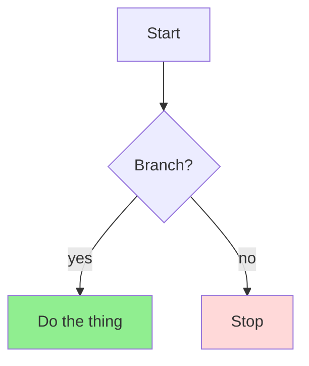

# Module 1: Kitchen Sink

*Category: Fundamentals — Module 1 (1 of 7 in this category)*

This opening paragraph is the lead, and the renderer marks it as one.

## I. A numbered section

Ordinary prose, with an [external link](https://example.com/paper) and a
[cross-reference](training.md) to another sheet.

### A. A subsection

A three-column table, whose first body cell becomes a row header:

| Layer | What it is | Cost |
| --- | --- | --- |
| One | The first thing | Low |
| Two | The second thing | High |

## II. Pictures and diagrams

  
*The caption line, which the renderer puts below the label.*



## III. Code, quotes and lists

```python
def add(a: int, b: int) -> int:
    return a + b
```

```
Program output, in an untagged fence.
```

> **Note:** a blockquote whose bold lead-in ends in a colon becomes a label.

> A blockquote with no lead-in stays a plain pull-rule.

A checklist, which the record reads by index:

- [ ] The first item, unticked.
- [x] The second item, ticked.

## Summary

One paragraph of summary, with a [second cross-reference](rag.md).

**Quick Check**: does every structure in this file survive the renderer?
